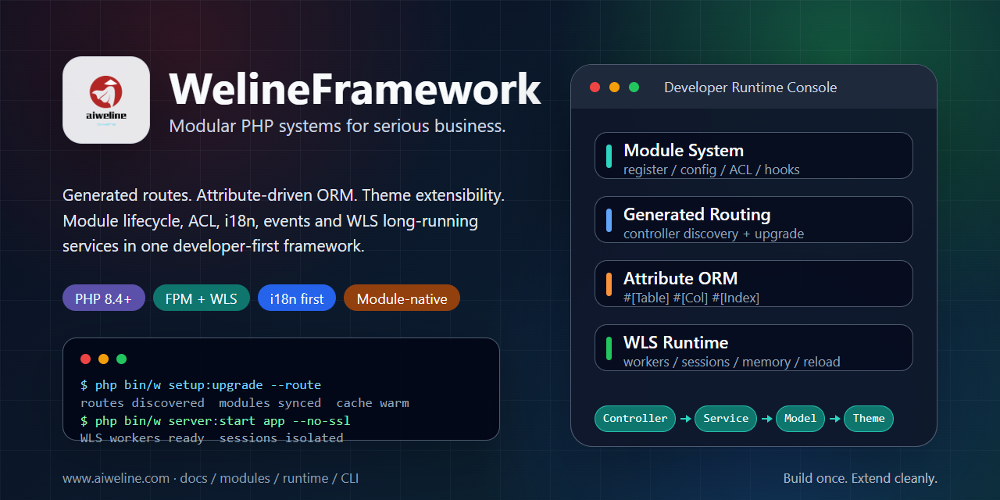

# WelineFramework



**Build modular PHP business systems with clear module boundaries, generated routes, attribute-driven ORM, theme extensibility, and WLS long-running services.**

[Official Website](https://www.aiweline.com) ·
[Framework Docs](./docs/weline/README.md) ·
[Docs](./docs/README.md) ·
[Architecture](./docs/weline/README.md) ·
[WLS](./app/code/Weline/Server/doc/README.md) ·
[Languages](./docs/readme/README.md) ·
[AI Engineering Entry](./AI-ENTRY.md)


[English](./README.md) |
[Simplified Chinese](./README.zh-CN.md) |
[Japanese](./docs/readme/README.ja.md) |
[Korean](./docs/readme/README.ko.md) |
[German](./docs/readme/README.de.md) |
[French](./docs/readme/README.fr.md) |
[More languages](./docs/readme/README.md)

---

WelineFramework is a PHP 8.4+ framework for complex business systems. It brings module lifecycle, generated routing, ORM schema declarations, events/hooks, backend ACL, themes, internationalization, CLI operations, and WLS long-running services into one engineering model, so business capabilities can be packaged as installable, upgradeable, extensible, and verifiable modules.

> WLS boundary: `php bin/w server:start` starts Weline's built-in long-running server. WLS orchestrates HTTP Workers, Session Server, Memory Server, Maintenance Worker, Dispatcher/Gateway, hot reload, and runtime governance. It is a framework runtime, not a generic HTTP debugging server. Traditional FPM deployment remains a first-class deployment path.

## Quick Start

Linux / macOS / Git Bash:

```bash
curl -fsSL https://gitee.com/aiweline/WelineFramework/raw/master/bin/bootstrap.sh | bash -s --
```

Windows PowerShell:

```powershell
$f="$env:TEMP\weline-bootstrap.ps1"; irm 'https://gitee.com/aiweline/WelineFramework/raw/master/bin/bootstrap.ps1' -OutFile $f; & $f
```

Clean source install:

```bash
git clone https://gitee.com/aiweline/WelineFramework.git weline
cd weline
composer install
php bin/w command:upgrade
```

## Why Weline

- **Module-native**: modules own registration, configuration, permissions, menus, events, hooks, template assets, and install/upgrade flows.
- **Convention-driven**: controllers are discovered and routed by the framework; models declare tables, columns, and indexes through PHP attributes.
- **Runtime-aware**: traditional FPM and WLS long-running services coexist, covering workers, sessions, memory, maintenance tasks, and hot reload.
- **Developer-operated**: `bin/w` covers install, upgrade, cache, modules, migrations, routing, WLS, queue, mail, SMTP, and diagnostics.

## Read Next

- [Simplified Chinese README](./README.zh-CN.md): Chinese entry for local developers.
- [Framework docs](./docs/weline/README.md): developer guide and architecture documentation.
- [Project docs index](./docs/README.md): repository-level documentation entry.
- [Architecture overview](./docs/weline/README.md): framework layers, runtime, routing, ORM, events, and extension model.
- [WLS documentation](./app/code/Weline/Server/doc/README.md): WLS runtime and service orchestration.
- [Multilingual README index](./docs/readme/README.md): onboarding entries for global developers.

For more product capabilities, industry scenarios, and business solutions, visit [www.aiweline.com](https://www.aiweline.com).

## License

This repository's license is defined by the `license` field in [composer.json](./composer.json).
