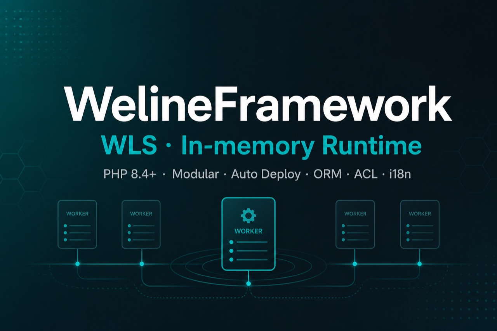

# WelineFramework



**WelineFramework** is a PHP 8.4+ modular business framework. Its signature runtime **WLS** keeps the app **in memory** — HTTP Workers, Session Server, Memory Server, and hot reload — while traditional FPM remains a first-class deploy path.

[Official Website](https://www.aiweline.com) ·
[Framework Docs](./docs/weline/README.md) ·
[Docs](./docs/README.md) ·
[Architecture](./docs/weline/README.md) ·
[WLS](./app/code/Weline/Server/doc/README.md) ·
[Deploy](./app/code/Weline/Deploy/doc/README.md) ·
[Languages](./docs/readme/README.md) ·
[AI Engineering Entry](./AGENTS.md)


[English](./README.md) |
[Simplified Chinese](./README.zh-CN.md) |
[Japanese](./docs/readme/README.ja.md) |
[Korean](./docs/readme/README.ko.md) |
[German](./docs/readme/README.de.md) |
[French](./docs/readme/README.fr.md) |
[More languages](./docs/readme/README.md)

---

WelineFramework packages module lifecycle, generated routing, attribute-driven ORM, events/hooks, backend ACL, themes, i18n, and CLI into one engineering model — so business capabilities ship as installable, upgradeable modules.

### WLS vs FPM

| | **WLS** (signature) | **FPM** (also first-class) |
|---|---|---|
| Model | Long-running **in-memory** framework runtime | Classic request / process model |
| Start | `php bin/w server:start` | Nginx/Apache + php-fpm |
| Includes | HTTP Workers, Session/Memory servers, maintenance worker, hot reload, runtime governance | Familiar traditional PHP deploy |

> WLS is a **framework runtime**, not a generic HTTP debugging server. Use it when you want resident workers and in-process services; use FPM when you want the classic stack.

## Quick Start

Linux / macOS / Git Bash:

```bash
curl -fsSL https://gitee.com/aiweline/WelineFramework/raw/master/bin/bootstrap.sh | bash -s --
```

Windows PowerShell:

```powershell
$f="$env:TEMP\weline-bootstrap.ps1"; irm 'https://gitee.com/aiweline/WelineFramework/raw/master/bin/bootstrap.ps1' -OutFile $f; & $f
```

Clean source install:

```bash
git clone https://gitee.com/aiweline/WelineFramework.git weline
cd weline
composer install
php bin/w command:upgrade
```

## Highlights

| Capability | What you get |
| --- | --- |
| **WLS in-memory runtime** | Long-running Workers, Session/Memory servers, maintenance worker, hot reload, Dispatcher/Gateway edge modes — app stays resident instead of cold-booting every request |
| **Dual runtime** | Same business code on **WLS** or classic **FPM** — pick per environment |
| **Module-native** | Each module owns registration, config, ACL, menus, events, hooks, templates, assets, and install/upgrade |
| **Auto routing** | Controllers are discovered; **no hand-written `routes.xml`**. Refresh with `php bin/w setup:upgrade --route` |
| **Attribute ORM** | Tables, columns, and indexes declared next to the model via `#[Table]` / `#[Col]` / `#[Index]` |
| **Auto ops / Deploy** | GitHub & Gitee **webhooks**, WLS Panel build → release → rollback, tag/branch policies, `deploy:plan` for AI-safe read-only plans |
| **One-click bootstrap** | `bin/bootstrap.sh` / PowerShell installer clones, deps, and initializes a runnable workspace |
| **Backend ACL** | Roles, resources, menus, and admin area access control as first-class modules |
| **Theme & UI extensibility** | Area themes, Block / Taglib / Widget / Hook; visual theme editing for product surfaces |
| **i18n-first** | `__()` / `<lang>` translation paths; multilingual README onboarding |
| **Ops CLI (`bin/w`)** | Install, upgrade, cache, modules, migrations, routing, WLS, queue, cron, mail/SMTP, diagnostics |
| **Async work** | Queue consumers and Cron schedulers for background jobs |
| **Extension points** | Event / Hook / Query Provider / Interface — collaborate without coupling module internals |
| **AI project intelligence** | Built-in MCP (`prepare_project` / readiness / task context) so agents work against indexed docs and source evidence |
| **Multi-database** | MySQL / MariaDB / PostgreSQL |

### Why teams pick it

- Grow by **modules**, not by a monolith of scattered routes and SQL.
- Ship faster with **convention routing** and **schema-near-model** attributes.
- Run hot paths on **WLS in-memory**; keep FPM where ops already know it.
- Close the loop with **webhook auto-deploy** and a single `bin/w` ops surface.

## Read Next

- [Simplified Chinese README](./README.zh-CN.md): Chinese entry for local developers.
- [Framework docs](./docs/weline/README.md): developer guide and architecture documentation.
- [Project docs index](./docs/README.md): repository-level documentation entry.
- [Architecture overview](./docs/weline/README.md): framework layers, runtime, routing, ORM, events, and extension model.
- [WLS documentation](./app/code/Weline/Server/doc/README.md): WLS runtime and service orchestration.
- [Multilingual README index](./docs/readme/README.md): onboarding entries for global developers.

For more product capabilities, industry scenarios, and business solutions, visit [www.aiweline.com](https://www.aiweline.com).

## License

This repository's license is defined by the `license` field in [composer.json](./composer.json).
