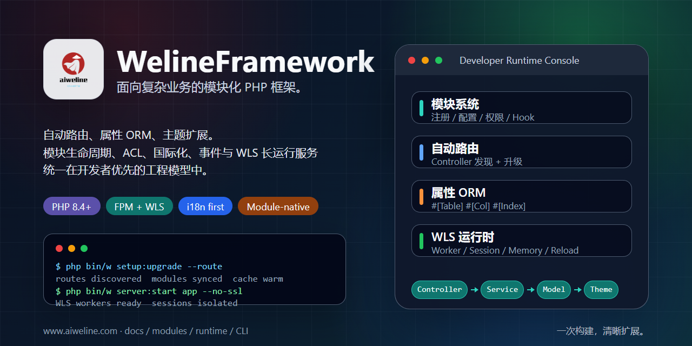

# WelineFramework



**使用清晰模块边界、自动生成路由、属性驱动 ORM、主题扩展和 WLS 长运行服务构建模块化 PHP 业务系统。**

[官网](https://www.aiweline.com) ·
[开发者入口](./docs/weline/开发者入口.md) ·
[文档](./docs/README.md) ·
[架构](./docs/weline/README.md) ·
[WLS](./app/code/Weline/Server/doc/README.md) ·
[多语言 README](./docs/readme/README.md) ·
[AI 工程入口](./AI-ENTRY.md)


[English](./README.md) |
[简体中文](./README.zh-CN.md) |
[日本語](./docs/readme/README.ja.md) |
[한국어](./docs/readme/README.ko.md) |
[Deutsch](./docs/readme/README.de.md) |
[Français](./docs/readme/README.fr.md) |
[更多语言](./docs/readme/README.md)

---

WelineFramework 是面向复杂业务系统的 PHP 8.4+ 框架。它把模块生命周期、自动路由、ORM Schema、事件/Hook、后台 ACL、主题模板、国际化、CLI 运维和 WLS 长运行服务放进同一套工程模型，让团队可以把业务能力做成可安装、可升级、可扩展、可验证的模块。

> WLS 边界：`php bin/w server:start` 启动的是 Weline 框架内置长运行服务器 WLS。它用于 HTTP Worker、Session Server、Memory Server、Maintenance Worker、Dispatcher/Gateway、热重载和运行时治理；它是框架运行时，不是通用 HTTP 调试入口。传统 FPM 部署仍然是一等部署路径。

## 快速开始

Linux / macOS / Git Bash:

```bash
curl -fsSL https://gitee.com/aiweline/WelineFramework/raw/master/bin/bootstrap.sh | bash -s --
```

Windows PowerShell:

```powershell
$f="$env:TEMP\weline-bootstrap.ps1"; irm 'https://gitee.com/aiweline/WelineFramework/raw/master/bin/bootstrap.ps1' -OutFile $f; & $f
```

源码纯净安装：

```bash
git clone https://gitee.com/aiweline/WelineFramework.git weline
cd weline
composer install
php bin/w command:upgrade
```

## 为什么选择 Weline

- **模块原生**：模块独立维护注册、配置、权限、菜单、事件、Hook、模板资源和安装升级。
- **约定驱动**：Controller 由框架发现并生成路由，Model 通过 PHP 属性声明表、字段和索引。
- **运行时友好**：传统 FPM 部署与 WLS 长运行服务并存，覆盖 Worker、Session、Memory、Maintenance 和热重载。
- **开发者可运维**：`bin/w` 覆盖安装、升级、缓存、模块、迁移、路由、WLS、队列、邮局、SMTP 和诊断。

## 继续阅读

- [开发者入口](./docs/weline/开发者入口.md)：完整能力介绍、安装说明、开发路径和命令速查。
- [项目文档索引](./docs/README.md)：项目级文档总入口。
- [架构总览](./docs/weline/README.md)：框架分层、运行时、路由、ORM、事件与扩展。
- [WLS 文档导航](./app/code/Weline/Server/doc/README.md)：WLS 运行时与服务编排文档。
- [多语言 README](./docs/readme/README.md)：全球开发者入口索引。

更多产品能力、行业方案和业务场景，请访问 [www.aiweline.com](https://www.aiweline.com)。

## 许可证

本仓库许可证以 [composer.json](./composer.json) 中的 `license` 字段为准。
