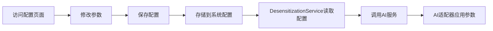

# 适配器配置功能完成说明

## 功能概述

新增了适配器参数配置功能，允许管理员在后端管理界面修改和保存适配器的参数。如果修改过配置，则使用修改后的配置；如果没有修改，则使用适配器的默认配置。

## 实现的功能

### 1. 配置管理页面 ✅

**位置**: `/guolairen_desensitization/backend/config/index`

**功能**:
- 显示脱敏适配器和重写适配器的当前配置
- 允许修改适配器参数
- 支持重置为默认配置
- 支持保存配置

**配置项**:
- **脱敏适配器**:
  - 工作模式: detect/desensitize/mark
  - 脱敏级别: standard/high/low
  - 启用严格检查: true/false

- **重写适配器**:
  - 润色风格: natural/formal/casual/professional/concise
  - 保持原有格式: true/false
  - 增强可读性: true/false

### 2. 配置存储 ✅

**使用 SystemConfig 模型存储配置**:

- **配置键**: 
  - `desensitization_adapter_params` - 脱敏适配器参数
  - `rewrite_adapter_params` - 重写适配器参数
  
- **存储位置**: `system_config` 数据库表
- **作用域**: 模块范围 (`GuoLaiRen_Desensitization`)
- **区域**: 后台 (`SystemConfig::area_BACKEND`)

### 3. 配置读取和应用 ✅

**DesensitizationService 自动读取配置**:

当调用AI服务时，会自动获取保存的配置参数：

```php
// 获取适配器参数配置
$adapterParams = $this->getAdapterParams($adapterCode, 'desensitization');

// 调用AI服务时传递参数
$result = $aiService->generate(
    prompt: $prompt,
    modelCode: $modelCode,
    scenarioCode: $adapterCode,
    params: $adapterParams  // 传递配置参数
);
```

**配置优先级**:
1. 系统配置中保存的参数（如果有）
2. 适配器的默认参数（如果没有保存的配置）

## 创建的文件

1. **控制器**: `app/code/GuoLaiRen/Desensitization/Controller/Backend/Config.php`
   - `index()` - 显示配置页面
   - `save()` - 保存配置
   - `reset()` - 重置配置

2. **模板**: `app/code/GuoLaiRen/Desensitization/view/templates/Backend/Config/index.phtml`
   - 配置表单界面
   - JavaScript 交互逻辑

3. **菜单**: 更新了 `app/code/GuoLaiRen/Desensitization/etc/backend/menu.xml`
   - 添加"模块配置"菜单项

## 修改的文件

1. **DesensitizationService**: `app/code/GuoLaiRen/Desensitization/Service/DesensitizationService.php`
   - 添加 `getAdapterParams()` 方法
   - 更新 `desensitizeWithAI()` 方法
   - 更新 `desensitizeAndRewrite()` 方法
   - 引入 `SystemConfig` 模型

## 使用说明

### 访问配置页面

1. 登录后台管理系统
2. 点击左侧菜单"数据脱敏" → "模块配置"
3. 或直接访问: `/guolairen_desensitization/backend/config/index`

### 配置适配器参数

1. **脱敏适配器**:
   - 选择工作模式（检测/脱敏/标记）
   - 选择脱敏级别（标准/高/低）
   - 设置是否启用严格检查

2. **重写适配器**:
   - 选择润色风格
   - 设置是否保持原有格式
   - 设置是否增强可读性

3. 点击"保存配置"按钮

4. 如需恢复默认配置，点击"重置为默认"按钮

### 配置生效

保存后的配置会立即生效，下次调用AI服务时会自动使用新配置。

## 配置流程



## 技术细节

### 配置数据结构

**脱敏适配器配置**:
```json
{
  "mode": "detect",
  "level": "standard",
  "enable_strict_check": true
}
```

**重写适配器配置**:
```json
{
  "style": "natural",
  "preserve_format": true,
  "enhance_readability": true
}
```

### 配置读取逻辑

```php
private function getAdapterParams(string $adapterCode, string $adapterType): array
{
    // 1. 获取系统配置
    $paramsJson = $systemConfig->getConfig($configKey, 'GuoLaiRen_Desensitization', SystemConfig::area_BACKEND);
    
    // 2. 解析JSON
    if ($paramsJson) {
        $params = json_decode($paramsJson, true);
        if (is_array($params)) {
            return $params;  // 返回保存的配置
        }
    }
    
    // 3. 返回空数组，使用适配器默认参数
    return [];
}
```

## 优势

1. **可配置性**: 管理员可以根据实际需求调整适配器参数
2. **灵活性**: 支持不同的工作模式和级别
3. **可回退**: 支持重置为默认配置
4. **持久化**: 配置保存在数据库中，重启后仍然有效
5. **兼容性**: 如果没有配置，自动使用适配器默认参数

## 注意事项

1. **权限控制**: 配置页面需要管理员权限访问
2. **配置影响**: 修改配置会影响所有使用该适配器的操作
3. **测试建议**: 修改配置后建议在"脱敏测试"页面测试效果
4. **备份**: 重要配置修改前建议记录原配置

## 后续扩展

可以进一步扩展的功能：
1. 添加更多配置项
2. 支持不同用户组使用不同配置
3. 配置历史记录和回滚
4. 配置导入/导出
5. 配置验证和预览功能
