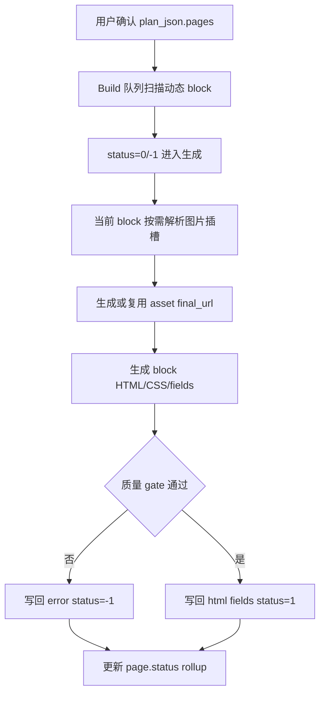

# PageBuilder AI 建站块级并发与图片插槽架构

块级并发的最小执行单元是：

```text
plan_json.pages.{page_type}.{block_key}
```

图片插槽、HTML、字段配置和错误信息都必须回写到同一个 block 节点，避免形成第二份执行状态。

## 架构图



## 关键约束

- 队列状态只认数字 block status：`0`、`2`、`1`、`-1`。
- 图片生成是当前 block 的内部步骤，不能通过 历史plan_json block node 工作表 或 移除派生计划 形成长期状态源。
- 已成功的 block 保留 `html`、`fields` 和资产引用；失败 block 保留 `error` 并允许单 block 重试。
