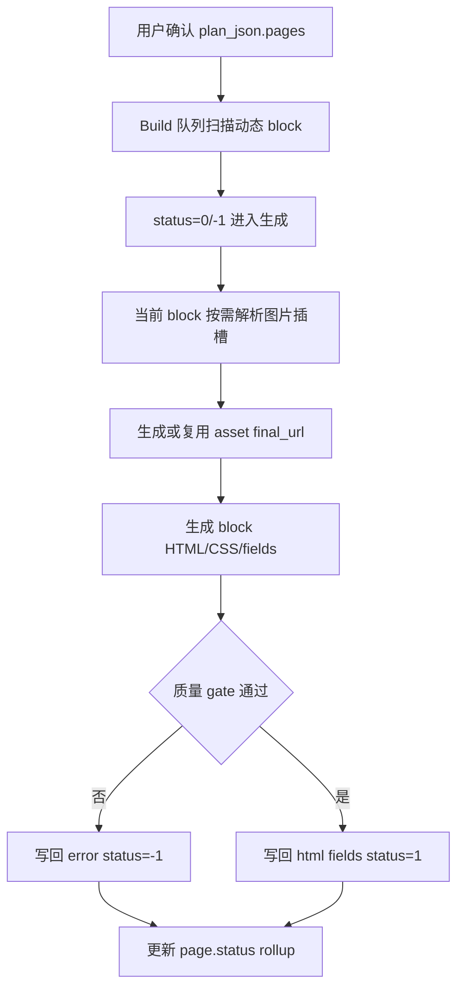

# PageBuilder AI 建站块级并发与图片插槽架构

块级并发的最小执行单元是：

```text
plan_json.pages.{page_type}.{block_key}
```

图片插槽、HTML、字段配置和错误信息都必须回写到同一个 block 节点，避免形成第二份执行状态。

## 架构图



## 关键约束

- 队列状态只认数字 block status：`0`、`2`、`1`、`-1`。
- 图片生成是当前 block 的内部步骤，不能通过 历史plan_json block 工作表 或 移除派生计划 形成长期状态源。
- 构建任务进入 block 队列前，必须把 `block_contract`、`image_intent`、`asset_requirements` 和页面级 `asset_distribution_policy` 写回 `plan_json.pages.{page_type}.{block_key}` / `plan_json.pages.{page_type}`，后续 prompt 只读取这份冻结上下文。
- `image_intent.needs_image=true` 的 block 必须在 block 生成前尝试生成并确认图片 `final_url`；确认成功后写入 `verified_assets`、`_required_image_assets`、`media.image_url` 和 block `assets`。不可用时只能保留 `image_unavailable` / `contract_required` / retry 标记，不能把原始必需图片契约解释为 CSS-only 设计选择。
- 已成功的 block 保留 `html`、`fields` 和资产引用；失败 block 保留 `error` 并允许单 block 重试。
