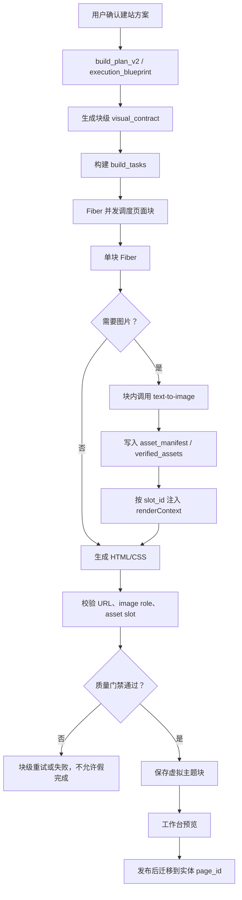

# PageBuilder AI 建站块级并发与图片插槽架构

## 目标

重构后的建站流程不再把图片作为独立异步队列先生成、再回填 HTML。方案确认后，每个页面块都携带明确的 `visual_contract`；块生成 Fiber 在生成 HTML 前按插槽拿到图片 URL，再把同一个 URL 写入块 HTML/CSS、资源清单和可视化编辑属性。

通用底座提示词是默认规则，不是强制覆盖用户意图。用户没有提到时按底座生成；用户明确提出与底座不同的块级要求时，以用户要求为准，但仍必须满足真实图片、结构可编辑、内容可读和质量门禁。

## 架构图

## 关键约束

- `visual_contract.slot_id` 是图片和块的唯一绑定标记，标准格式为 `page:{page_type}:{section_code}`。
- 必须图片的块要在块内拿到真实 `final_url` 后再生成 HTML/CSS，不能先生成占位结构等待后补。
- 正式构建不接受 `placeholder`、`local_composed`、`local-premium-composition-v1` 这类本地兜底图作为通过资产。
- 使用图片的元素必须同时包含 `data-pb-ai-image-role="generated-asset"` 和 `data-pb-ai-asset-slot="{slot_id}"`。
- 队列只有在 `build_tasks` 全部 terminal 且无 `pending`、`running`、`failed`、`cancelled` 时才允许标记构建完成。
- 虚拟主题是编辑期的唯一落点；发布前不要写入实体 `page_id` 的最终块数据。

## 并发边界

并发单位是页面块 Fiber。图片生成是块 Fiber 内部的前置步骤，谁先完成不影响其他块；块完成时，它自己的图片 URL 已经固化到 HTML/CSS 和 manifest。手动图片重生仍可作为编辑器独立操作，但不参与初次构建的跨队列回填。
