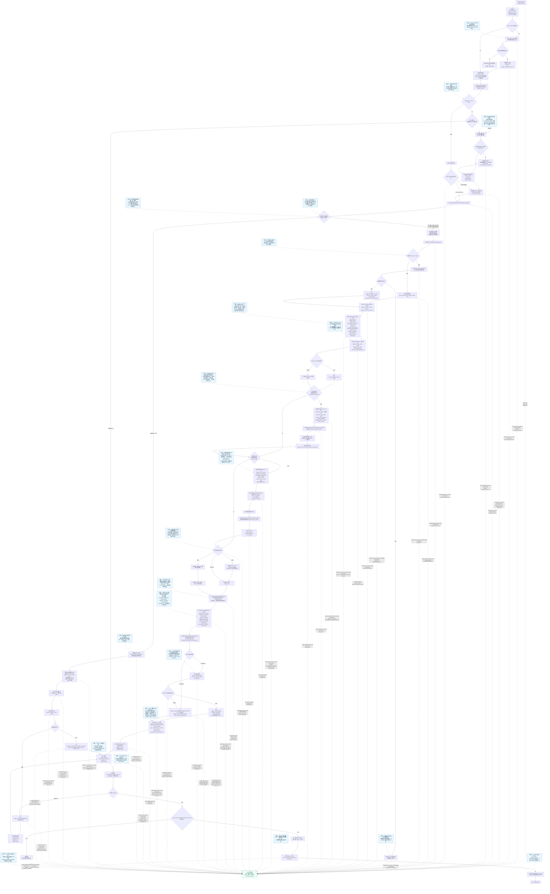

# PageBuilder 第一阶段强契约流程图

本文只保留新版目标单合同流程。后续所有第一阶段调整都在这张图上修改。

## 第一阶段单合同全流程

```mermaid
flowchart TD
    SSE_PROBE["SSE 探针输出<br/>每个事件统一携带<br/>stage / status / progress / message / payload"]

    START["用户启动 Stage1<br/>handleStartPlan()"] --> INPUT["读取输入<br/>brief / instruction<br/>page_types / locale<br/>selected_skill_codes<br/>reference_images"]
    INPUT --> TARGET{"target_domain 是否存在？"}
    TARGET -- "否" --> DOMAIN_RECOMMEND["提示 target_domain 缺失<br/>展示推荐重新生成入口"]
    DOMAIN_RECOMMEND --> DOMAIN_CLICK{"用户点击推荐重新生成？"}
    DOMAIN_CLICK -- "是" --> DOMAIN_REGEN["重新推荐 / 生成 target_domain<br/>写入 stage1_contract.input_context"]
    DOMAIN_CLICK -- "否" --> DOMAIN_WAIT["等待用户补全域名或修改需求<br/>不进入 Stage1 生成"]
    DOMAIN_REGEN --> INIT_CONTRACT["初始化或读取 stage1_contract<br/>contract_meta.status=draft<br/>input_context 写入用户输入与技能选择"]
    TARGET -- "是" --> INIT_CONTRACT

    INIT_CONTRACT --> START_DECISION["resolvePlanStartDecision()<br/>只判断是否存在可操作的 stage1_contract"]
    START_DECISION --> HAS_CONTRACT{"已有 stage1_contract draft？"}
    HAS_CONTRACT -- "有" --> CONTRACT_ACTION{"用户选择？<br/>调整现有合同 / 重建合同"}
    CONTRACT_ACTION -- "调整现有合同" --> CONTRACT_READY["返回 stage1_contract<br/>进入展示与调整"]
    CONTRACT_ACTION -- "重建合同" --> REBUILD_CONFIRM["用户确认重建合同<br/>进入强制重建流程"]
    REBUILD_CONFIRM --> STOP_QUEUE{"是否有正在运行 / 排队的 Stage1 队列？"}
    STOP_QUEUE -- "有" --> FORCE_STOP["强制停止旧队列<br/>调用队列停止 w_query 操作<br/>标记 queue / active_operation cancelled"]
    STOP_QUEUE -- "无" --> CLEAR_CONTRACT
    FORCE_STOP --> CLEAR_CONTRACT["清空当前计划所有状态<br/>stage1_contract<br/>checkpoint<br/>retryable ledger<br/>derived caches"]
    CLEAR_CONTRACT --> QUEUE["创建新的 Stage1 生成队列<br/>startOperation(plan)<br/>写 _plan_sse_request"]
    HAS_CONTRACT -- "没有" --> GENERATE_CLICK["用户点击生成方案"]
    GENERATE_CLICK --> ACTIVE_QUEUE{"已有 Stage1 生成队列任务？"}
    ACTIVE_QUEUE -- "有 queued/running" --> SSE["复用已有队列<br/>继续使用 execution_token / stream_url<br/>查看生成进度"]
    ACTIVE_QUEUE -- "没有可复用队列" --> QUEUE
    QUEUE --> SSE["runQueuedPlanOperationFromWorkspaceStream()"]

    SSE --> CHANGE_TYPE{"这次是用户消息变化<br/>还是 Block 微调？"}
    CHANGE_TYPE -- "用户消息 / 需求 / 页面 / 语言 / 技能 / 参考图有任何变化" --> FORCE_REGEN["进入重建 SSE 链路<br/>重新生成完整合同<br/>控制面板显示重建进度"]
    FORCE_REGEN --> REF_LIST["buildReferenceImagePromptList(scope)"]
    CHANGE_TYPE -- "只微调某个 Block" --> PATCH_QUEUE["创建微调 SSE 链路<br/>operation=stage1_block_patch<br/>控制面板显示微调进度"]
    PATCH_QUEUE --> PATCH_PROMPT_CTX["组装 Block 微调 prompt<br/>当前 stage1_contract<br/>当前 page_context / target block<br/>用户微调 instruction<br/>只允许修改当前 Block mutable 字段"]
    PATCH_PROMPT_CTX --> PATCH_AI["执行 Block 微调<br/>AI 或用户 patch 更新当前 Block"]
    PATCH_AI --> PATCH_VALIDATE["验证当前 Block<br/>schema / design contract / quality"]
    PATCH_VALIDATE --> PATCH_RESULT{"微调是否通过？"}
    PATCH_RESULT -- "通过" --> PATCH_CONTRACT["patch stage1_contract.pages[].blocks[]<br/>只改当前 Block"]
    PATCH_RESULT -- "失败" --> PATCH_FAIL["写 stage1_contract.validation.retryable_ai_failures<br/>reason=patch_failed / schema_invalid / quality_invalid"]

    REF_LIST --> HAS_REF{"是否有 reference_images？"}
    HAS_REF -- "无图" --> REF_SKIP["跳过参考图理解<br/>input_context.reference_image_insights = null"]
    HAS_REF -- "有图" --> REF_AI["analyzeReferenceImagesByAi()<br/>必须先得到视觉理解结果"]
    REF_AI --> REF_RESULT{"视觉理解是否成功？"}
    REF_RESULT -- "失败" --> REF_BLOCK["阻断 Stage1 或提示重试<br/>不能静默当作无图"]
    REF_RESULT -- "成功" --> REF_INSIGHTS["写入 stage1_contract.input_context<br/>reference_image_insights<br/>visual_contract<br/>reference_image_insights_key"]
    REF_SKIP --> SOURCE
    REF_INSIGHTS --> SOURCE

    SOURCE["SourceTruthContractBuilder->build()<br/>生成 source_truth_contract<br/>写入 stage1_contract.source_truth"] --> STAGE1_PROMPT_CONTEXT["组装 Stage1 prompt 公共上下文<br/>input_context / website_profile / target_domain<br/>page_types / plan_locale / content_locale<br/>instruction / source_truth_contract<br/>reference_image_insights / visual_contract<br/>selected_skill_codes / skill_snapshots<br/>design_policy_id / policy_slice"]
    STAGE1_PROMPT_CONTEXT --> CHECKPOINT_KEY["生成 checkpoint_key / 输入指纹<br/>包含 brief / page_types / locale<br/>selected_skill_codes / skill_snapshot_hash<br/>reference_image_insights_key"]
    CHECKPOINT_KEY --> CKPT{"checkpoint_key 是否匹配？"}
    CKPT -- "匹配" --> RESUME_CKPT["复用 checkpoint.stage1_contract 片段"]
    CKPT -- "不匹配" --> EMPTY_CONTRACT["从当前 input_context 生成新合同"]

    RESUME_CKPT --> HAS_REQ{"是否已经生成<br/>需求拓展结果？<br/>(requirement_expansion)"}
    EMPTY_CONTRACT --> HAS_REQ
    HAS_REQ -- "没有" --> REQ_PROMPT_CTX["组装需求拓展 prompt 上下文<br/>公共上下文 + 用户一句话需求<br/>Instruction / page_types / locale<br/>reference_image_insights + visual_contract<br/>禁止生成 theme / Header / Footer / Block"]
    REQ_PROMPT_CTX --> REQ_PROMPT["buildAiStageOneRequirementExpansionPrompt()<br/>输出 requirement_expansion schema"]
    HAS_REQ -- "有" --> HAS_THEME
    REQ_PROMPT --> REQ_AI["AI 输出需求拓展 JSON<br/>业务目标 / 页面职责 / SEO / 转化路径"]
    REQ_AI --> REQ_WRITE["校验并写入合同<br/>stage1_contract.site_plan.requirement_expansion"]
    REQ_WRITE --> HAS_THEME{"是否已经生成<br/>主题风格方案？<br/>(theme_design)"}

    HAS_THEME -- "没有" --> THEME_PROMPT_CTX["组装主题风格 prompt 上下文<br/>公共上下文 + confirmed requirement_expansion<br/>plan_locale / content_locale<br/>reference image + visual_contract<br/>premium_web_v1 policy slice<br/>禁止生成页面 Block"]
    THEME_PROMPT_CTX --> THEME_PROMPT["buildAiStageOneThemePrompt()<br/>输出 theme_design<br/>shared_components / seo_strategy<br/>page_type_overviews"]
    HAS_THEME -- "有" --> PAGE_RUN_TYPE
    THEME_PROMPT --> THEME_AI["AI 输出主题风格 JSON"]
    THEME_AI --> THEME_REF["applyReferenceImageInsightsToThemeDesign()<br/>有参考图则强制合并 reference_style_context"]
    THEME_REF --> THEME_WRITE["validate + write<br/>theme_design / shared_components / seo_strategy"]
    THEME_WRITE --> PAGE_RUN_TYPE{"本次页面生成类型？"}

    PAGE_RUN_TYPE -- "重建" --> PAGE_REBUILD_CLEAR["清空旧 pages / blocks / page retry ledger<br/>所有 page_types 重新生成"]
    PAGE_REBUILD_CLEAR --> PAGE_SCOPE_ALL["本次任务 = 所有 page_types"]
    PAGE_RUN_TYPE -- "重试" --> CHECK_BLOCK_STATE["读取已有 page/block 状态<br/>成功页面保留"]
    CHECK_BLOCK_STATE --> PAGE_SCOPE_RETRY["本次任务 = 失败 / 缺失 / blocks 为空的页面"]
    PAGE_RUN_TYPE -- "首次生成" --> PAGE_SCOPE_ALL

    PAGE_SCOPE_ALL --> PAGE_FANOUT["generateStageOnePagePlansByAi()<br/>按本次任务列表并发生成 pages[].blocks[]<br/>并发执行，但结果按任务顺序回填"]
    PAGE_SCOPE_RETRY --> PAGE_FANOUT
    PAGE_FANOUT --> PAGE_PROMPT_CTX["每个 page_type 组装 PAGE prompt<br/>公共上下文 + confirmed requirement_expansion<br/>theme_design / shared_components<br/>page_type_overview / baseline page shape<br/>source_truth_contract / block_budget<br/>page architecture guide / target_scope"]
    PAGE_PROMPT_CTX --> PAGE_PROMPT["buildAiStageOnePagePrompt(page_type)<br/>只生成当前页面 JSON<br/>先 page_design_plan<br/>再 blocks / field_plan / execution_script"]
    PAGE_PROMPT --> PAGE_RESULT{"每个页面生成结果"}
    PAGE_RESULT -- "AI 调用失败" --> PAGE_FAIL
    PAGE_RESULT -- "AI 成功返回" --> BLOCK_VALIDATE["逐页逐块验证<br/>schema / required fields<br/>block why / design contract<br/>quality rules"]
    BLOCK_VALIDATE --> BLOCK_VALID{"每个 Block 是否通过验证？"}
    BLOCK_VALID -- "通过" --> PAGE_WRITE["write stage1_contract.pages[]<br/>按 page_order / block sort_order 回填<br/>记录该页面成功 blocks"]
    BLOCK_VALID -- "不通过" --> PAGE_FAIL["写 stage1_contract.validation.retryable_ai_failures<br/>同一个失败字段<br/>reason=ai_failed / empty_blocks / schema_invalid / quality_invalid"]
    PAGE_WRITE --> CONTEXT_PACKAGE["组装 Stage2 上下文包<br/>stage1_contract.stage2_context<br/>site_context / theme_context / shared_context<br/>page_contexts / block_contexts<br/>skill_context / reference_context<br/>policy_context / asset_context"]
    PAGE_FAIL --> CONTEXT_PACKAGE
    CONTEXT_PACKAGE --> CONTRACT_ASSEMBLE["assemble stage1_contract<br/>合并成功页面 + stage2_context<br/>更新 updated_at / change_reason"]

    CONTRACT_ASSEMBLE --> CONTRACT_READY["唯一输出<br/>stage1_contract<br/>contract_meta.status=draft<br/>updated_at / change_reason"]
    PATCH_CONTRACT --> CONTRACT_DIRTY["标记合同已变更<br/>status=draft<br/>confirmed_at=null<br/>updated_at / change_reason"]
    PATCH_FAIL --> CONTRACT_READY
    CONTRACT_DIRTY --> CONTRACT_READY

    CONTRACT_READY --> UI_VIEW["前端展示<br/>derivePlanView(stage1_contract)<br/>只读派生，不长期持久化"]
    UI_VIEW --> HUMAN{"人工确认 Stage1？"}
    HUMAN -- "调整 Block" --> PATCH_CONTRACT
    HUMAN -- "确认" --> HAS_FAILURE{"stage1_contract.validation.retryable_ai_failures 是否为空？"}
    HAS_FAILURE -- "非空" --> CONFIRM_BLOCK["阻断确认<br/>提示失败项和重试入口"]
    HAS_FAILURE -- "为空" --> CONFIRM["handleConfirmPlan()<br/>确认当前 stage1_contract"]
    CONFIRM --> FREEZE["冻结 stage1_contract<br/>contract_meta.status=confirmed<br/>confirmed_at"]
    FREEZE --> DERIVE_BUILD["deriveBuildPlan(stage1_contract)<br/>Stage2 入口临时派生 BuildPlan"]
    DERIVE_BUILD --> STAGE2["进入 Stage2 Build"]

    START -. "stage=start<br/>status=start<br/>progress=1" .-> SSE_PROBE
    DOMAIN_RECOMMEND -. "stage=domain_required<br/>status=blocked<br/>payload: recommend_action" .-> SSE_PROBE
    DOMAIN_REGEN -. "stage=domain_recommend<br/>status=done<br/>payload: target_domain" .-> SSE_PROBE
    QUEUE -. "stage=queue_created<br/>status=queued<br/>payload: queue_id, execution_token, stream_url" .-> SSE_PROBE
    SSE -. "stage=queue_running<br/>status=running<br/>payload: queue_id" .-> SSE_PROBE
    FORCE_STOP -. "stage=rebuild_stop_queue<br/>status=done<br/>payload: stopped_queue_ids" .-> SSE_PROBE
    CLEAR_CONTRACT -. "stage=rebuild_clear_contract<br/>status=done<br/>payload: cleared_keys" .-> SSE_PROBE
    REF_LIST -. "stage=reference_image_check<br/>status=start<br/>payload: image_total" .-> SSE_PROBE
    REF_SKIP -. "stage=reference_image_check<br/>status=skipped<br/>payload: image_total=0" .-> SSE_PROBE
    REF_AI -. "stage=reference_image_understanding<br/>status=start<br/>progress=8" .-> SSE_PROBE
    REF_BLOCK -. "stage=reference_image_understanding<br/>status=failed<br/>payload: error, retryable" .-> SSE_PROBE
    REF_INSIGHTS -. "stage=reference_image_understanding<br/>status=done<br/>progress=10<br/>payload: insights_key" .-> SSE_PROBE
    SOURCE -. "stage=source_truth_contract<br/>status=start<br/>payload: page_types" .-> SSE_PROBE
    CHECKPOINT_KEY -. "stage=checkpoint<br/>status=checked<br/>payload: checkpoint_key, hit" .-> SSE_PROBE
    STAGE1_PROMPT_CONTEXT -. "stage=stage1_prompt_context_ready<br/>status=done<br/>payload: context_keys, skill_count, policy_id" .-> SSE_PROBE
    REQ_PROMPT_CTX -. "stage=requirement_prompt_context<br/>status=done<br/>payload: page_types, has_reference, has_visual_contract" .-> SSE_PROBE
    REQ_PROMPT -. "stage=requirement_expand<br/>status=start<br/>progress=18" .-> SSE_PROBE
    REQ_WRITE -. "stage=requirement_expand<br/>status=done<br/>progress=28" .-> SSE_PROBE
    THEME_PROMPT_CTX -. "stage=theme_prompt_context<br/>status=done<br/>payload: has_requirement_expansion, has_policy_slice, content_locale" .-> SSE_PROBE
    THEME_PROMPT -. "stage=theme_design<br/>status=start<br/>progress=35" .-> SSE_PROBE
    THEME_WRITE -. "stage=theme_design<br/>status=done<br/>progress=50" .-> SSE_PROBE
    PAGE_RUN_TYPE -. "stage=page_fanout_scope<br/>status=prepared<br/>payload: run_type, task_page_types" .-> SSE_PROBE
    PAGE_FANOUT -. "stage=page_fanout<br/>status=running<br/>progress=60<br/>payload: page_total" .-> SSE_PROBE
    PAGE_PROMPT_CTX -. "stage=page_prompt_context<br/>status=done<br/>payload: page_type, block_budget, has_theme, has_source_truth" .-> SSE_PROBE
    PAGE_WRITE -. "stage=page_fanout<br/>status=page_done<br/>payload: page_type, page_order, block_count, block_order" .-> SSE_PROBE
    PAGE_FAIL -. "stage=page_fanout<br/>status=page_failed<br/>payload: page_type, reason, retryable" .-> SSE_PROBE
    BLOCK_VALIDATE -. "stage=block_validate<br/>status=running<br/>payload: page_type, block_key" .-> SSE_PROBE
    BLOCK_VALID -. "stage=block_validate<br/>status=checked<br/>payload: page_type, block_key, valid, reason" .-> SSE_PROBE
    CONTEXT_PACKAGE -. "stage=stage2_context_ready<br/>status=done<br/>payload: context_keys, page_count, block_count, skill_count" .-> SSE_PROBE
    CONTRACT_ASSEMBLE -. "stage=contract_assemble<br/>status=start<br/>progress=90" .-> SSE_PROBE
    CONTRACT_READY -. "stage=contract_ready<br/>status=done<br/>progress=100<br/>payload: status, validation_summary, updated_at" .-> SSE_PROBE
    PATCH_QUEUE -. "stage=block_patch<br/>status=start<br/>payload: page_type, block_key, operation_id" .-> SSE_PROBE
    PATCH_PROMPT_CTX -. "stage=block_patch_prompt_context<br/>status=done<br/>payload: page_type, block_key, mutable_fields" .-> SSE_PROBE
    PATCH_AI -. "stage=block_patch<br/>status=running<br/>progress=40<br/>payload: page_type, block_key" .-> SSE_PROBE
    PATCH_VALIDATE -. "stage=block_patch_validate<br/>status=running<br/>payload: page_type, block_key" .-> SSE_PROBE
    PATCH_CONTRACT -. "stage=block_patch<br/>status=done<br/>progress=100<br/>payload: page_type, block_key, status=draft" .-> SSE_PROBE
    PATCH_FAIL -. "stage=block_patch<br/>status=failed<br/>payload: page_type, block_key, reason, retryable" .-> SSE_PROBE
    CONFIRM_BLOCK -. "stage=confirm_blocked<br/>status=blocked<br/>payload: retryable_ai_failures" .-> SSE_PROBE
    FREEZE -. "stage=contract_confirmed<br/>status=done<br/>payload: confirmed_at" .-> SSE_PROBE

    NOTE1["注释 A：只有一个长期真相源。<br/>前端视图、执行蓝图、BuildPlan 都从当前 stage1_contract 派生，不再依赖额外校验码。"] -.-> CONTRACT_READY
    NOTE2["注释 B：参考图有上传就必须有明确结果。<br/>理解失败不能静默继续，否则用户会误判参考图已生效。"] -.-> REF_BLOCK
    NOTE3["注释 C：checkpoint_key 只用于判断能否复用中间生成结果。<br/>它必须覆盖需求、页面、语言、技能快照和参考图洞察 key。"] -.-> CHECKPOINT_KEY
    NOTE4["注释 D：微调也必须走新的 SSE 链路。<br/>控制面板要能看到微调开始、AI 处理、验证、写回、完成或失败。"] -.-> PATCH_QUEUE
    NOTE5["注释 E：Stage2 只接受 confirmed stage1_contract。<br/>BuildPlan 是派生结果，不作为 Stage1 长期状态。"] -.-> DERIVE_BUILD
    NOTE6["注释 F：target_domain 缺失不是硬停止。<br/>展示推荐重新生成入口；生成后写入 input_context 再继续。"] -.-> DOMAIN_RECOMMEND
    NOTE7["注释 G：已有合同时不自动重建。<br/>用户要么调整现有合同，要么显式选择重建；没有合同时才点击生成。"] -.-> HAS_CONTRACT
    NOTE8["注释 H：参考图是可选输入，但不是可忽略输入。<br/>无图才跳过；有图失败必须提示或阻断。"] -.-> HAS_REF
    NOTE9["注释 I：这里是在检查合同里是否已有“需求拓展”。<br/>需求拓展是把用户一句话变成业务目标、页面职责、SEO 和转化路径，不是生成页面 Block。"] -.-> HAS_REQ
    NOTE10["注释 J：页面生成必须先区分重建和重试。<br/>重建先清空旧页面再全量并发；重试保留成功页面，只并发失败、缺失或 blocks 未成功的页面。"] -.-> PAGE_RUN_TYPE
    NOTE11["注释 K：derivePlanView 只用于展示。<br/>前端不保存独立结构，避免 UI 看到的方案和 Build 执行合同不一致。"] -.-> UI_VIEW
    NOTE12["注释 L：确认后如果再调整 Block，只需要把合同状态改回 draft。<br/>不再做额外重算来控制流程。"] -.-> FREEZE
    NOTE13["注释 M：确认重建不能复用旧队列。<br/>必须先停掉当前 running/queued 队列，再清空 stage1_contract 和派生缓存，最后重新创建队列规划。"] -.-> REBUILD_CONFIRM
    NOTE14["注释 N：操作类型简化。<br/>用户消息或任何全局输入变化都重新生成完整合同；只有明确 Block 微调才走 patch 线路。"] -.-> CHANGE_TYPE
    NOTE15["注释 O：SSE 探针不是业务分支。<br/>它是每个阶段的进度事件，前端用 stage/status/progress/payload 精确定位当前步骤。"] -.-> SSE_PROBE
    NOTE16["注释 P：验证不放在最终装配阶段才发现问题。<br/>每个页面并发结果返回后立即逐块验证；失败统一写 retryable_ai_failures，只区分 reason。"] -.-> BLOCK_VALIDATE
    NOTE17["注释 Q：并发不等于无序。<br/>任务可以并发执行，但写回合同和前端展示必须保留 page_order、block sort_order/order，支持前端顺序调整。"] -.-> PAGE_FANOUT
    NOTE18["注释 R：重建和微调都要有实时 SSE 链路。<br/>区别是重建清空后全量生成；微调只处理目标 Block，但也必须给控制面板输出进度。"] -.-> CHANGE_TYPE
    NOTE19["注释 S：Stage2 需要的不只是 Block 树。<br/>第一阶段必须把全站目标、主题风格、参考图理解、技能快照、页面职责、Block 执行约束、图片与质量策略一起写入 stage2_context。"] -.-> CONTEXT_PACKAGE
    NOTE20["注释 T：Stage1 prompt 不是一次性大 prompt。<br/>先组装公共上下文，再按需求拓展、主题风格、页面并发、Block 微调分别切片，避免不同任务互相污染。"] -.-> STAGE1_PROMPT_CONTEXT
    NOTE21["注释 U：底座策略在第一阶段用于生成设计决策。<br/>可以读取 premium_web_v1 的策略切片，但合同里应保存 policy_ref / policy_projection / design_manifest，不保存完整底座 prompt 原文。"] -.-> THEME_PROMPT_CTX
    NOTE22["注释 V：页面 prompt 的职责是产生可执行页面和 Block 合同。<br/>它必须继承 requirement_expansion、theme_design、shared_components、source_truth 和 block_budget，不能重新定义全站主题。"] -.-> PAGE_PROMPT_CTX

    classDef probe fill:#ecfdf5,stroke:#0f766e,color:#064e3b;
    classDef note fill:#e8f7ff,stroke:#1479a8,color:#0f172a;
    class SSE_PROBE probe;
    class NOTE1,NOTE2,NOTE3,NOTE4,NOTE5,NOTE6,NOTE7,NOTE8,NOTE9,NOTE10,NOTE11,NOTE12,NOTE13,NOTE14,NOTE15,NOTE16,NOTE17,NOTE18,NOTE19,NOTE20,NOTE21,NOTE22 note;
```
