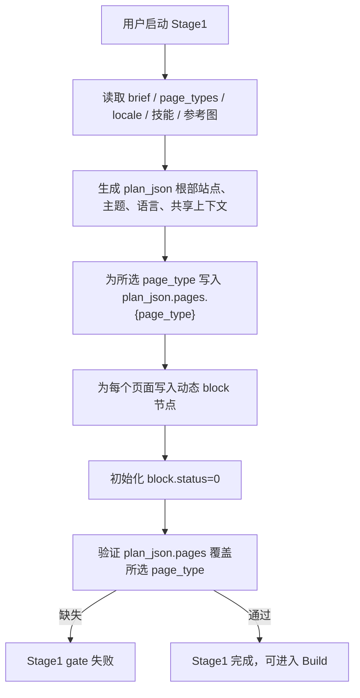

# PageBuilder 第一阶段生成流程图

第一阶段的持久化输出是当前 `plan_json`，其中页面与 block 状态必须落在：

```text
plan_json.pages.{page_type}.{block_key}
```

既有 移除旁路结构 不得保留为独立结构；阶段一完成 gate 只能读取 plan_json.pages。

## 流程图



## 输出示例

```json
{
  "pages": {
    "home_page": {
      "status": 0,
      "hero": {
        "status": 0,
        "fields": {},
        "html": "",
        "error": ""
      }
    }
  }
}
```

## Gate 规则

- 只判断 `plan_json.pages.{page_type}` 是否覆盖所选页面类型。
- 移除旁路结构 存在但 `plan_json.pages` 缺失时仍然失败。
- 既有 `pages.{page_type}.{block_key}` 不转换、不迁移、不作为有效输入。
