# PageBuilder 第三阶段强契约发布流程图

本文只保留一张第三阶段总图。第三阶段不是再次生成内容，而是把第二阶段已确认的资产、页面结构、组件和 Block 产物，物化成真实 PageBuilder 网站页面、页面布局和可渲染 Block 组件，并完成发布后渲染校验。

```mermaid
graph TD
    START["启动 Stage3 Publish"] --> LOAD_SCOPE["读取 Stage2 scope"]
    LOAD_SCOPE --> CHECK_STAGE2["P1 发布入口门禁：workspace_status can_publish 且 publish_status 不是 published"]
    CHECK_STAGE2 --> BACK_STAGE2["P1 fail：回到第二阶段修复或重试"]
    CHECK_STAGE2 --> LOAD_INPUTS["P1 pass：读取发布输入"]

    LOAD_INPUTS --> INPUTS["输入：stage1_contract stage2_context build_tasks build_summary asset_manifest verified_assets virtual_pages_by_type page_type_layouts shared_components virtual_theme_id draft_website_id"]
    INPUTS --> BLOCK_COUNT_GATE["P2 任务和产物数量门禁"]
    BLOCK_COUNT_GATE --> COUNT_EXPECT["计算 expected：build_tasks total page_section_count shared_component_count page_types_count"]
    COUNT_EXPECT --> COUNT_ACTUAL["计算 actual：done_count generated_page_blocks generated_shared_components generated_pages"]
    COUNT_ACTUAL --> COUNT_RULE["必须满足：done 等于 total，failed pending running cancelled 全为 0"]
    COUNT_RULE --> BLOCK_RULE["必须满足：page_section_count 等于 generated_page_blocks，shared_component_count 等于 generated_shared_components"]
    BLOCK_RULE --> PAGE_RULE["必须满足：page_types_count 等于 generated_pages，且每个页面有可发布 layout 或 AI HTML blocks"]
    PAGE_RULE --> COUNT_FAIL["P2 fail：阻断发布，写 publish_blocked_reason 和 gate_ledger"]
    COUNT_FAIL --> BACK_STAGE2
    PAGE_RULE --> REFRESH_QA["P2 pass：刷新发布前 QA 合同"]

    REFRESH_QA --> RENDER_DATA_CONTRACT["attachBuildRenderDataContract：汇总 page_type_layouts shared_components materialized_pages_by_type virtual_pages_by_type"]
    RENDER_DATA_CONTRACT --> QUALITY_GATE["P3 发布质量门禁 inspectScope"]
    QUALITY_GATE --> QUALITY_ITEMS["检查项：任务完成 覆盖率 页面可渲染 Header Footer 源事实 渲染数据 内容质量 主题 图片 语言 响应式"]
    QUALITY_ITEMS --> QUALITY_FAIL["P3 fail：阻断发布，不落库"]
    QUALITY_FAIL --> BACK_STAGE2
    QUALITY_ITEMS --> RESOLVE_PROFILE["P3 pass：生成 website_profile"]

    RESOLVE_PROFILE --> RESOLVE_IDS["解析 website_id virtual_theme_id page_types page_type_layouts"]
    RESOLVE_IDS --> IDS_GATE["P4 基础资源门禁：website_id virtual_theme_id page_types 必须有效"]
    IDS_GATE --> IDS_FAIL["P4 fail：发布前请先完成主题构建"]
    IDS_FAIL --> BACK_STAGE2
    IDS_GATE --> PUBLISH_SERVICE["调用 AiSitePublishService.publish"]

    PUBLISH_SERVICE --> RESOLVE_LAYOUT["读取虚拟主题发布布局：virtual_page_layouts 优先覆盖 scope.page_type_layouts"]
    RESOLVE_LAYOUT --> MATERIALIZE["AiSiteMaterializationService.materialize"]
    MATERIALIZE --> PAGE_LOOP["按 page_type 循环物化页面"]

    PAGE_LOOP --> LOAD_OR_CREATE_PAGE["加载已有 Page 或创建新 Page"]
    LOAD_OR_CREATE_PAGE --> RESOLVE_PAGE_META["解析页面元数据：title name handle locale seo logo icon"]
    RESOLVE_PAGE_META --> ASSET_MAPPING["资产映射：website_profile logo icon 写入 Page 字段，Block 内图片 final_url 保留在组件 HTML 或 config"]
    ASSET_MAPPING --> LAYOUT_BRANCH["判断是否有生成 layout 组件"]

    LAYOUT_BRANCH --> THEME_TRACK["有 layout：走 VirtualTheme 组件轨"]
    THEME_TRACK --> THEME_PAGE_DATA["Page 写入 render_mode theme，ai_layout 为空，style 和 style_settings 来自 virtual page"]
    THEME_PAGE_DATA --> THEME_LAYOUT["PageLayout.importConfig 写入 header content footer 组件和 config"]

    LAYOUT_BRANCH --> AI_HTML_TRACK["无 layout：走 AI HTML blocks 轨"]
    AI_HTML_TRACK --> FILTER_BLOCKS["过滤 shared layout block，只保留页面内容 blocks"]
    FILTER_BLOCKS --> AI_BLOCK_GATE["P5 AI HTML Block 门禁：blocks 不为空且数量等于该页 page_section 任务数"]
    AI_BLOCK_GATE --> AI_BLOCK_FAIL["P5 fail：页面没有真实生成 block"]
    AI_BLOCK_FAIL --> BACK_STAGE2
    AI_BLOCK_GATE --> AI_PAGE_DATA["Page 写入 render_mode ai_html，ai_layout.blocks 为真实生成 Block 集合"]

    THEME_LAYOUT --> SAVE_PAGE["保存 Page：status published，website_id type parent handle seo locale logo icon"]
    AI_PAGE_DATA --> SAVE_PAGE
    SAVE_PAGE --> PAGE_ID_GATE["P6 Page 落库门禁：page_id 必须生成"]
    PAGE_ID_GATE --> PAGE_SAVE_FAIL["P6 fail：物化 Page 失败"]
    PAGE_SAVE_FAIL --> PUBLISH_FAILED["发布失败：publish_status failed，scope 保留失败原因"]
    PAGE_ID_GATE --> URL_REWRITE["创建或更新 UrlRewrite：handle 到 pagebuilder frontend page view"]
    URL_REWRITE --> SYNC_LAYOUT["同步 PageLayout 到 Page.layout_config，强制持久化 render_mode 和 ai_layout"]
    SYNC_LAYOUT --> PAGE_RESULT["记录 pagebuilder_pages_by_type：page_id website_id type title handle"]
    PAGE_RESULT --> MORE_PAGES["是否还有页面"]
    MORE_PAGES --> PAGE_LOOP
    MORE_PAGES --> MATERIALIZE_DONE["所有页面物化完成"]

    MATERIALIZE_DONE --> SNAPSHOT["applyPublishSnapshotsForMaterializedPages"]
    SNAPSHOT --> SNAPSHOT_DETAIL["AI HTML 页面 sanitize ai_layout，写 ai_publish_snapshots，避免发布后草稿漂移"]
    SNAPSHOT_DETAIL --> DOMAIN_BIND["绑定网站域名 ensureWebsiteDomainBinding"]
    DOMAIN_BIND --> DOMAIN_DETAIL["target_domain 写 WebsiteDomain，状态 active，存在则更新状态"]
    DOMAIN_DETAIL --> ACTIVATE_THEME["激活当前 VirtualTheme，停用同站点其他 active AI 虚拟主题"]
    ACTIVATE_THEME --> THEME_CONFIG["VirtualTheme config 写 published_at publish_workspace_track materialized_pages_by_type"]

    THEME_CONFIG --> PUBLISH_VERIFY["发布后渲染校验 AiSitePublishVerificationService"]
    PUBLISH_VERIFY --> VERIFY_RENDER["按 pagebuilder_pages_by_type 逐页 live render"]
    VERIFY_RENDER --> VERIFY_ITEMS["检查：HTML 非空 非默认模板 无内部规划文案 AI 主题标记存在 品牌可见"]
    VERIFY_ITEMS --> VERIFY_FAIL["P7 fail：抛错并阻断成功返回"]
    VERIFY_FAIL --> PUBLISH_FAILED
    VERIFY_ITEMS --> VERIFY_PASS["P7 pass：生成 publish_verification"]

    VERIFY_PASS --> UPDATE_SCOPE["写回 scope：pagebuilder_pages_by_type materialized_pages_by_type publish_verification preview_page_id preview_page_type"]
    UPDATE_SCOPE --> UPDATE_SUMMARY["更新 build_task_summary 展示快照；workspace_status published；完成门禁仍以 build_blueprint.tasks + build_tasks 为准"]
    UPDATE_SUMMARY --> SAVE_SESSION["replaceScope，setPublishStatus published，setStage publish"]
    SAVE_SESSION --> DONE["发布完成：真实网站页面可通过路由访问"]

    PUBLISH_SSE["SSE 发布运行时反馈总线"]
    PUBLISH_SSE_DATA["检查数据：publish_gate task_summary expected_counts actual_counts pagebuilder_pages_by_type materialized_pages_by_type publish_verification publish_status"]
    PUBLISH_SSE_SCHEMA["公共字段：stage operation status progress message queue_id execution_token gate_key page_type page_id reason"]
    PUBLISH_SSE_EVENTS["事件：publish_start publish_gate_pass publish_gate_fail materialize_page page_saved url_rewrite_saved theme_activated publish_verify publish_done publish_failed"]
    PUBLISH_SSE_PANEL["前端显示：发布阶段 当前页面 已落库页面数 Block 对账结果 失败原因 预览地址"]

    START -.-> PUBLISH_SSE
    CHECK_STAGE2 -.-> PUBLISH_SSE
    BLOCK_COUNT_GATE -.-> PUBLISH_SSE
    QUALITY_GATE -.-> PUBLISH_SSE
    IDS_GATE -.-> PUBLISH_SSE
    MATERIALIZE -.-> PUBLISH_SSE
    PAGE_LOOP -.-> PUBLISH_SSE
    AI_BLOCK_GATE -.-> PUBLISH_SSE
    PAGE_ID_GATE -.-> PUBLISH_SSE
    URL_REWRITE -.-> PUBLISH_SSE
    DOMAIN_BIND -.-> PUBLISH_SSE
    ACTIVATE_THEME -.-> PUBLISH_SSE
    PUBLISH_VERIFY -.-> PUBLISH_SSE
    UPDATE_SCOPE -.-> PUBLISH_SSE
    DONE -.-> PUBLISH_SSE
    PUBLISH_FAILED -.-> PUBLISH_SSE
    PUBLISH_SSE --> PUBLISH_SSE_DATA
    PUBLISH_SSE_DATA --> PUBLISH_SSE_SCHEMA
    PUBLISH_SSE_SCHEMA --> PUBLISH_SSE_EVENTS
    PUBLISH_SSE_EVENTS --> PUBLISH_SSE_PANEL

    NOTE1["注释 A：第三阶段不再调用 AI 生成内容，只做发布物化和校验"]
    NOTE2["注释 B：资产不会重新生成，verified_assets 中的 final_url 已在第二阶段写入 Block HTML 或 config"]
    NOTE3["注释 C：任务总数必须和真实生成产物对账，不能只看 can_publish 字段"]
    NOTE4["注释 D：page_section 任务对应页面内容 Block，shared_component 任务对应 Header Footer 等共享组件"]
    NOTE5["注释 E：VirtualTheme 轨落库 PageLayout 组件配置，AI HTML 轨落库 Page.ai_layout.blocks"]
    NOTE6["注释 F：发布成功必须有 publish_verification，不能只保存 Page 就算成功"]
    NOTE7["注释 G：任何 failed pending running cancelled 任务都必须阻断发布"]

    START --> NOTE1
    ASSET_MAPPING --> NOTE2
    BLOCK_COUNT_GATE --> NOTE3
    BLOCK_RULE --> NOTE4
    LAYOUT_BRANCH --> NOTE5
    PUBLISH_VERIFY --> NOTE6
    COUNT_RULE --> NOTE7
```

## 关键门禁说明

第三阶段最重要的新增门禁是 `P2 任务和产物数量门禁`。发布前不能只相信 `can_publish`，必须重新从 `build_tasks` 和真实产物里计算一次：`done == total`，`failed == 0`，`pending == 0`，`running == 0`，`cancelled == 0`。同时，`page_section` 任务数必须等于真实页面内容 Block 数，`shared_component` 任务数必须等于真实共享组件数，页面类型数量必须等于可物化页面数。

发布阶段只是把第二阶段产物物化成真实 PageBuilder 数据。页面会落到 `Page`，布局会落到 `PageLayout` 和 `Page.layout_config`，AI HTML 轨会落到 `Page.ai_layout.blocks`，虚拟主题轨会使用 `VirtualTheme` 的组件布局。图片资产不再重新生成，`final_url` 应已经存在于 Block HTML 或组件 config 中。
