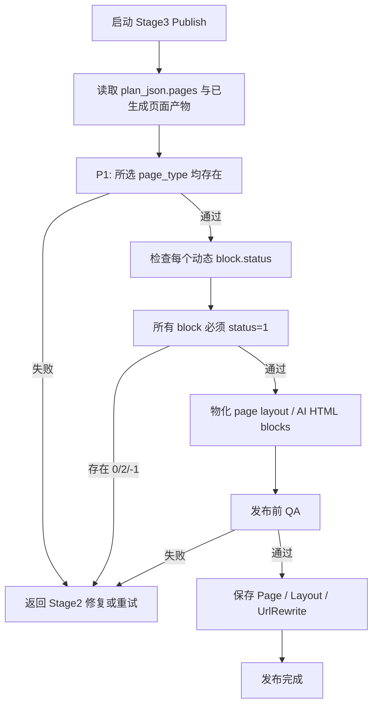

# PageBuilder 第三阶段发布流程图

第三阶段不再生成内容，只发布第二阶段已经写回到 `plan_json.pages.{page_type}.{block_key}` 的页面 block 产物。

## 流程图

## 发布输入

- `plan_json.pages.{page_type}.{block_key}.html`
- `plan_json.pages.{page_type}.{block_key}.fields`
- `asset_manifest` / `verified_assets`
- `plan_json.pages.{page_type}.{block_key}` / `shared_components`

发布 gate 不读取 移除旁路结构 或 移除派生计划 来判断页面是否已经生成完成。
