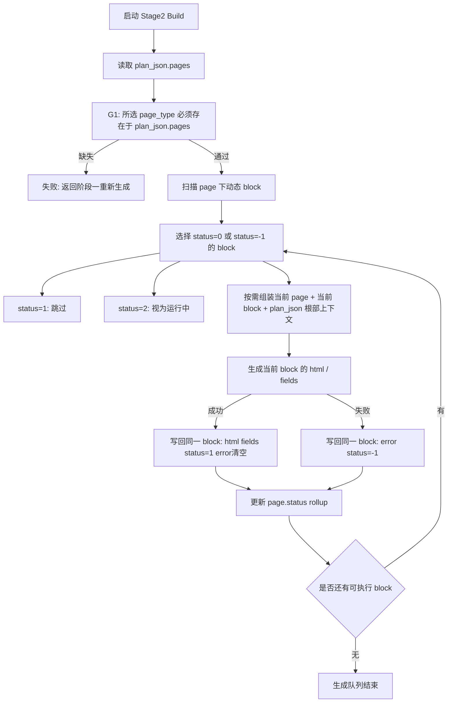

# PageBuilder 第二阶段生成流程图

第二阶段只把 `plan_json.pages.{page_type}.{block_key}` 当作生成状态真相源。
移除派生计划、移除工作台缓存、移除阶段契约、移除页面表 等既有结构不得参与是否生成、是否成功、是否缺失的判断。

## 状态模型

```text
plan_json.pages.{page_type}.{block_key}.status
plan_json.pages.{page_type}.{block_key}.html
plan_json.pages.{page_type}.{block_key}.fields
plan_json.pages.{page_type}.{block_key}.error
```

Block 状态：

- `0`：未生成，可被队列选择
- `2`：生成中，队列视为运行中
- `1`：成功，队列跳过
- `-1`：失败，可被队列重试

Page 状态是该页面下所有动态 block 的 rollup，block 仍是最小执行单元。

## 流程图



## 关键约束

- Build 队列不得 hydrate 或持久化完整 移除派生计划 作为第二份执行计划。
- Prompt/context 运行时按当前 block 组装，不落库为第二份 plan_json。
- 既有数据不迁移；仅有既有 历史 blocks 数组、移除页面表、移除工作台缓存 或 移除阶段契约 时，阶段 gate 必须失败。
