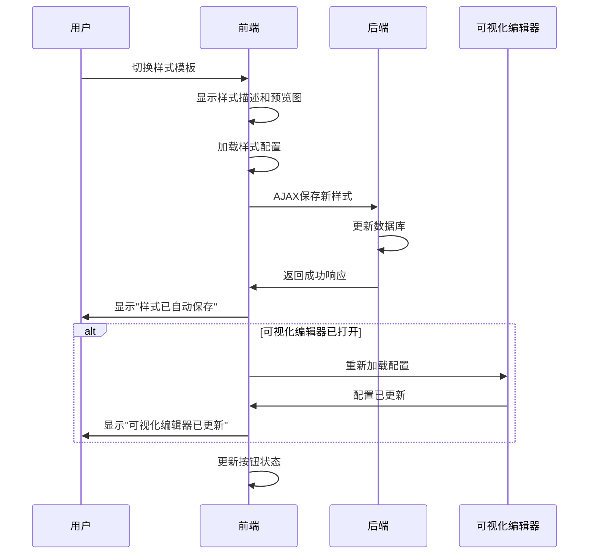
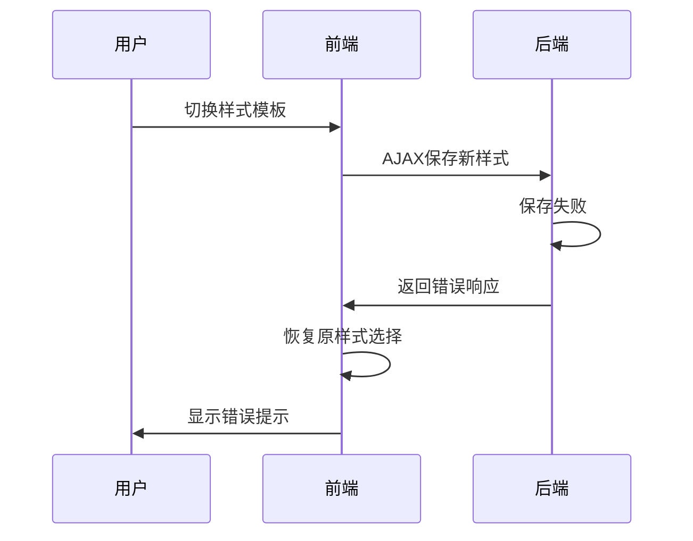

# 功能说明：样式切换自动保存

## 📝 功能概述

在页面编辑模式下，当用户切换样式模板时，系统会自动保存样式选择，并实时更新可视化编辑器，确保用户体验的流畅性和一致性。

## 🎯 解决的问题

### 问题描述
之前在编辑页面时：
1. 切换样式模板后需要手动点击"保存"按钮
2. 如果没有保存就点击"可视化编辑"，会出现样式不匹配的情况
3. 用户体验不流畅，容易出错

### 解决方案
- ✅ 切换样式时自动保存
- ✅ 实时更新可视化编辑器
- ✅ 无缝的用户体验

## 🔧 功能特性

### 1. 自动保存机制

当用户在编辑页面时切换样式：
```
用户操作：选择新样式 → 系统自动保存 → 更新界面
```

### 2. 智能检测

- **仅在编辑模式启用**：新建页面时不会自动保存（因为还没有page_id）
- **AJAX异步保存**：不刷新页面，保持编辑状态
- **错误处理**：如果保存失败，恢复原来的样式选择

### 3. 可视化编辑器同步

- **自动检测状态**：如果可视化编辑器已打开，自动重新加载
- **实时更新**：配置字段立即切换为新样式的配置
- **提示信息**：显示友好的提示消息

## 💻 技术实现

### 前端实现

#### 1. 样式选择事件监听（form.phtml）

```javascript
// 监听样式选择变化
if (styleSelect) {
    styleSelect.addEventListener('change', async function() {
        const selectedStyle = this.value;
        
        // 显示样式描述和预览图
        // ...
        
        // 加载样式配置
        loadStyleConfig(selectedStyle);
        
        // 🔄 编辑模式下：自动保存样式切换
        <?php if ($isEdit && $page && $page->getId()): ?>
        if (selectedStyle) {
            await autoSaveStyleChange(selectedStyle);
        }
        <?php endif; ?>
    });
}
```

#### 2. 自动保存函数

```javascript
async function autoSaveStyleChange(newStyle) {
    console.log('💾 自动保存样式切换:', newStyle);
    
    // 显示加载状态
    showLoading();
    
    try {
        // 准备表单数据
        const form = document.getElementById('page-form');
        const formData = new FormData(form);
        formData.set('style', newStyle);
        
        // 发送AJAX请求
        const response = await fetch(form.action, {
            method: 'POST',
            headers: {
                'X-Requested-With': 'XMLHttpRequest'
            },
            body: formData,
            credentials: 'same-origin'
        });
        
        const result = await response.json();
        
        if (result.success) {
            // 保存成功，显示提示
            showMessage('success', '样式已自动保存');
            
            // 如果可视化编辑器已打开，重新加载
            const visualWrapper = document.getElementById('visualConfigWrapper');
            if (visualWrapper && visualWrapper.classList.contains('active')) {
                loadVisualStyleConfig();
                showMessage('info', '可视化编辑器已更新为新样式');
            }
            
            // 更新按钮状态
            const visualBtn = document.getElementById('openVisualConfigBtn');
            if (visualBtn) {
                visualBtn.disabled = false;
            }
        } else {
            // 保存失败，恢复原样式
            showMessage('error', '样式保存失败');
        }
    } catch (error) {
        showMessage('error', '网络错误，样式保存失败');
    } finally {
        hideLoading();
    }
}
```

### 后端实现

#### 修改 Page 控制器（Controller/Backend/Page.php）

```php
public function postEdit()
{
    try {
        // ... 保存逻辑 ...
        
        $this->getMessageManager()->addSuccess(__('页面更新成功！'));
        
        // 检查是否为AJAX请求
        if ($this->request->isAjax() || 
            $this->request->getHeader('X-Requested-With') === 'XMLHttpRequest') {
            return $this->fetchJson([
                'success' => true,
                'message' => __('页面更新成功！'),
                'page_id' => $pageId,
                'style' => $data['style'] ?? ''
            ]);
        }
        
        $this->redirect('*/backend/page/edit', ['id' => $pageId]);
    } catch (\Exception $exception) {
        // 错误处理
        if ($this->request->isAjax() || 
            $this->request->getHeader('X-Requested-With') === 'XMLHttpRequest') {
            return $this->fetchJson([
                'success' => false,
                'message' => __('页面更新失败：') . $exception->getMessage()
            ]);
        }
        
        $this->redirect('*/backend/page/edit', ['id' => $this->request->getGet('id')]);
    }
}
```

## 📊 工作流程

### 正常流程



### 错误处理流程



## 🎨 用户体验

### 1. 流畅的操作

- **无需手动保存**：切换样式后自动保存
- **即时反馈**：显示保存状态和结果
- **不中断编辑**：保持在当前页面，不刷新

### 2. 智能提示

| 提示类型 | 提示内容 | 时机 |
|---------|---------|------|
| 成功提示 | "样式已自动保存" | 保存成功时 |
| 信息提示 | "可视化编辑器已更新为新样式" | 可视化编辑器打开时 |
| 错误提示 | "样式保存失败：错误原因" | 保存失败时 |
| 网络错误 | "网络错误，样式保存失败" | 网络异常时 |

### 3. 加载状态

- **showLoading()**: 保存开始时显示
- **hideLoading()**: 保存完成时隐藏
- 用户清楚知道系统正在处理

## ⚙️ 配置说明

### 启用条件

自动保存功能仅在以下条件下启用：

```php
<?php if ($isEdit && $page && $page->getId()): ?>
// 自动保存代码
<?php endif; ?>
```

- **$isEdit**: 必须是编辑模式（不是新建模式）
- **$page**: 页面对象必须存在
- **$page->getId()**: 页面必须有有效的ID

### 新建页面

- 新建页面时**不会**自动保存样式
- 用户需要手动点击"保存"按钮创建页面
- 创建成功后，再次切换样式才会启用自动保存

## 🔍 调试信息

### 控制台日志

开发模式下，控制台会输出详细的调试信息：

```javascript
// 样式切换
🎨 样式切换: marketing-landing

// 自动保存开始
💾 自动保存样式切换: marketing-landing

// 保存成功
✅ 样式保存成功

// 可视化编辑器更新
🔄 检测到可视化编辑器已打开，重新加载...

// 按钮状态更新
✅ 可视化编辑按钮已更新
```

### 网络请求

在浏览器开发者工具的Network标签中可以看到：

- **Request URL**: 表单提交地址
- **Request Method**: POST
- **Request Headers**: 包含 `X-Requested-With: XMLHttpRequest`
- **Form Data**: 包含所有表单字段
- **Response**: JSON格式，包含 success、message等字段

## 📌 注意事项

### 1. 浏览器兼容性

- 使用 `async/await` 语法，需要现代浏览器
- 使用 `fetch` API，需要浏览器支持
- 推荐使用 Chrome、Firefox、Edge 最新版本

### 2. 网络要求

- 需要稳定的网络连接
- 如果网络中断，会显示错误提示
- 用户可以重新切换样式触发保存

### 3. 数据一致性

- 自动保存会覆盖当前页面的样式设置
- 保存失败时会恢复原样式选择
- 可视化编辑器会自动同步最新样式

### 4. 性能考虑

- 使用AJAX异步保存，不阻塞用户操作
- 每次切换样式只保存一次
- 不会频繁请求服务器

## 🐛 故障排查

### 问题1：切换样式后没有自动保存

**可能原因：**
1. 不在编辑模式（新建页面时不会自动保存）
2. 页面ID无效
3. JavaScript错误

**解决方法：**
```bash
# 1. 确认是编辑模式
# 2. 检查浏览器控制台是否有错误
# 3. 清理缓存
php bin/w cache:clear -f
```

### 问题2：保存成功但可视化编辑器没更新

**可能原因：**
1. 可视化编辑器未打开
2. `loadVisualStyleConfig` 函数执行失败

**解决方法：**
1. 关闭可视化编辑器，重新打开
2. 查看控制台日志
3. 刷新页面

### 问题3：保存失败

**可能原因：**
1. 网络连接问题
2. 后端验证失败
3. 数据库错误

**解决方法：**
1. 检查网络连接
2. 查看后端日志：`var/log/`
3. 检查数据库连接

## 📚 相关文档

- [页面构建器开发文档](./README.md)
- [样式模板开发指南](../view/templates/style/README.md)
- [可视化编辑器使用指南](./功能-可视化编辑器.md)
- [预览图使用说明](../view/templates/style/README-预览图使用说明.md)

## 📝 更新日志

### v1.0.0 (2025-10-19)

**新增功能：**
- ✅ 样式切换自动保存
- ✅ 可视化编辑器自动更新
- ✅ AJAX异步请求支持
- ✅ 友好的提示信息
- ✅ 完善的错误处理

**技术改进：**
- 前端使用 async/await 异步处理
- 后端支持AJAX请求返回JSON
- 智能检测编辑模式
- 自动同步可视化编辑器

---

**版本：** v1.0.0  
**更新时间：** 2025-10-19  
**作者：** WelineFramework Team

