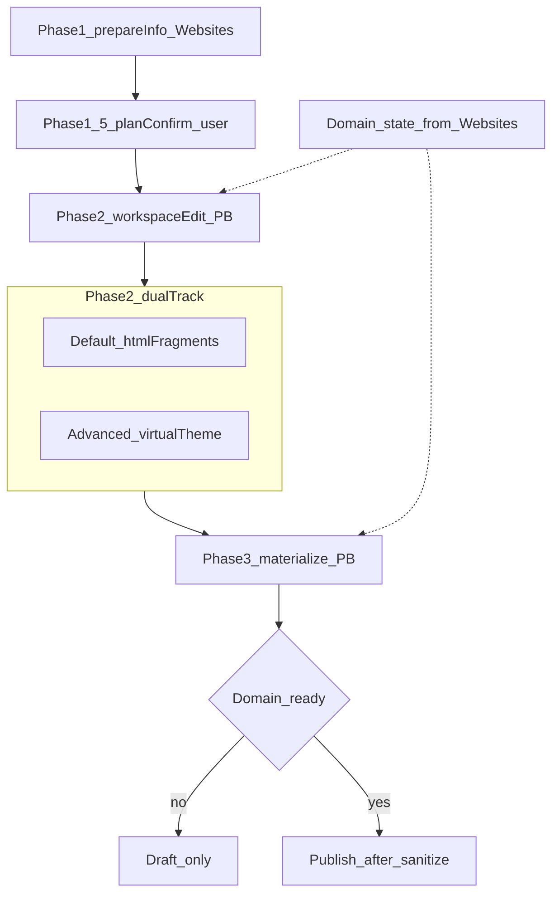

# 新 AI 建站工作台 — PageBuilder 侧（页面区块、`ai_html`、物化）

> 模块：`GuoLaiRen_PageBuilder`  
> **文档拆分（避免混读）**：  
> - **WLS / 本机 hosts / `w_query` / 跨 OS / CI hosts / 与 Worker SSL 的通配衔接** → [`Weline/Server/doc/计划-AI建站-w_query与本机hosts.md`](../../../Weline/Server/doc/计划-AI建站-w_query与本机hosts.md)  
> - **工作台壳层、Agent Tools、本地供应商、域名订单与生命周期、`site_ready` 语义** → [`Weline/Websites/doc/计划-AI建站工作台-Websites侧.md`](../../../Weline/Websites/doc/计划-AI建站工作台-Websites侧.md)  
> 本文**只写 PageBuilder 范围内**的模型、接口、渲染与测试；跨模块约定以上述两份为准。

> 交叉参考：`../../../../../dev/ai/codex/plans/ai-site-agent.plan.md`、`../../../../../dev/ai/codex/AI工作台/Websites-AI建站工作台-总规划.plan.md`

## 目标与原则（PageBuilder）

- **职责**：`Controller/Backend`（含 `AiSiteAgent` 等）完成 **阶段 2→3** 的预置工作区、**整站/按类型生成**、**按块再生成**、**物化到 Page**、**发布**、SSE；与 Websites **handoff**；**默认产物为页面级 HTML 区块**（`blocks[]`），不以 `view/templates/style/*` 主题为第一路径。
- **动机**：虚拟主题 + Theme 链路过重；新默认路径直接生成内容；**有序 `blocks[]`** + 弱校验 `type`，**不对块内 HTML 做组件 schema 强约束**。
- **Websites / WLS**：不在此展开；见上方拆分链接。

## 已确认决策（仅 PageBuilder）

1. **旧路径共存**：新会话默认「页面区块 + `ai_html`」；旧会话与「高级/主题」仍走 VirtualTheme + style。
2. **区块模型**：`blocks[]` 有序；`block_id`、`type`（自由标签）、`html`；弱校验。
3. **HTML 安全**：编辑/预览宽；发布前**自动严格消毒**（`sanitize_auto`）。
4. **多语言**：**每 locale 一条 Page**，各页 `ai_layout`。
5. **Pixel**：块内类名/属性；**脚本在 `ai_html` 渲染管线统一注入**。
6. **双版本与发布历史**：编辑态 + 发布快照；**最近 N 份**（如 5）发布快照与回滚；N 与表结构实现时定。
7. **表单**：首版 **link_only**。
8. **三阶段中的 PageBuilder 段**：阶段 2 预置区（默认 HTML 片段轨 / 高级虚拟主题轨）→ 阶段 3 **页面生成器物化**；见下文。
9. **域名门禁（消费侧）**：`can_publish` 须组合 **内容已就绪 + 消毒 + 域名就绪（`site_ready` 等，定义见 Websites 计划）**；未就绪时仅草稿、禁止发布；**文案与 API 错误码**在 PB 控制器/模板实现。
10. **测试**：本模块 **PHPUnit 全绿**；**Playwright** 端到端含 PB 步骤时，**本机解析/CI hosts** 按 **Server** 计划实现，**域名数据** 按 **Websites** 计划实现。
11. **首版站点级二选一**：禁止同站混用部分 `ai_html` 与部分虚拟主题；**全站默认轨** 或 **全站高级轨** 二选一。
12. **模板管理与 AI 工作区对齐**：后台**样式模板 / 模板管理**下的可视化编辑，在交互与能力上**参考 PageBuilder 既有可视化编辑**（配置面板、预览、组件级生成与微调）；差异在于前者服务**人工维护的 style 资产**，后者服务 **AI 建站会话**；不重复造两套「可视化」产品语言。
13. **轻量 HTML 走部件生成**：若方案确定为 **页面级 HTML 区块轨**（`html_blocks` / 轻量部件），则后续生成与编辑一律走 **部件生成**（`blocks[]`、`ai_html`、按块再生成），与虚拟主题/style -heavy 路径区分。
14. **方案先确认、再生成**：**信息收集完成后**，须先汇总并**弹出「建站方案」供用户确认**（可微调页面集合、风格要点、轨向 `workspace_track`、文案等）；**用户确认后**才进入按方案执行的 **主题/页面生成**（build / 物化）。未确认前不触发长耗时生成。

## 三阶段用户旅程（PageBuilder 视角）

整体流水线由 Websites 主持 **阶段 1（信息收集）**；在进入 PageBuilder 重操作前，增加 **阶段 1.5「方案确认」**（展示 AI/规则汇总的建站方案、支持微调、用户显式确认）；PageBuilder 聚焦 **阶段 2 预置编辑** 与 **阶段 3 物化**（域名状态由 Websites 写入 scope，PB 只读展示与门禁）。

### 阶段 1.5 — 建站方案确认（门禁）

| 内容 | 说明 |
|------|------|
| **输入** | 阶段 1 已收集的站点画像、域名与账户意图、`page_types` 初稿、推荐轨向等。 |
| **输出** | 结构化「方案」写入 `scope`/artifact（含确认版页面列表、风格摘要、**已选 `workspace_track`**）。 |
| **交互** | 弹窗或独立步骤展示方案；用户可编辑后再次保存；**确认按钮**作为唯一准入下一阶段生成的标志。 |
| **约束** | 未确认则不允许 `post-start-build` / 等价长任务；与域名购买等高风险动作同属显式确认类门槛。 |

### 阶段 2 — 预置工作区（PB 产品重点）

| 模式 | 预置内容 | 编辑要点 |
|------|----------|----------|
| **默认** | 按页面类型的 **HTML 片段**、`blocks[]` | 对齐现有可视化交互；数据在 scope/工作区 |
| **高级** | **虚拟主题** | 显式切换；沿用 Virtual + Visual |

### 阶段 3 — 物化

- **虚拟主题轨**：物化后走 **theme 渲染**（`render_mode` 或等价）。
- **默认轨**：**Page 扩展字段** + **`ai_html` 拼接渲染**。
- **首版**：全站二选一轨（决策 11）。

### 域名门禁（展示与发布 API）

- 未就绪：提示草稿 only；就绪：`can_publish` 组合条件见上。

## 核心架构变化（PageBuilder）

| 维度 | 现状 | 新默认 |
|------|------|--------|
| 内容载体 | 虚拟主题 + style | **Page + 扩展字段** |
| 首次生成 | 主题驱动 | **整站编排**；区块非 Theme |
| 可视化 | 组件 catalog | **blocks[]** 数据源 |
| 渲染 | theme 管线 | **双轨**：theme / `render_mode=ai_html` |

## 数据与生成策略

1. **整站首次生成**：各 locale 各页 `ai_layout.blocks[]`。
2. **持久化**：编辑态 + 最近 N 份发布快照。
3. **单块再生成**：按 `block_id` 替换；携带全站风格摘要。

## PageBuilder 实现要点

- `AiSiteAgent` 等：预置提交、生成、物化、发布、SSE。
- **物化**：VirtualTheme 轨 **或** Page 扩展 + `render_mode`。
- **Visual**：HTML 区块轨 vs 虚拟主题轨；避免无 schema HTML 强套 `ThemeComponent`。
- **`can_publish`**：与 Websites **域名字段**契约一致（见 Websites 计划）。

## 非功能（PB）

消毒、CSP、SEO 元字段：见本模块实现与已确认决策。

## 建议实施顺序（PageBuilder）

1. 依赖：**Server / Websites** 文档中的本地基建与 handoff 契约就绪（可并行）。
2. `Page` 扩展 schema（`render_mode`、`ai_layout`、发布快照 N）。
3. `ai_html` 渲染 + Pixel 注入。
4. 整站生成 + 单块再生成 + SSE。
5. workspace / Visual 接区块模型。
6. `can_publish` 与域名状态联调（对照 Websites）。
7. PHPUnit + 本文冒烟 + Playwright（跨模块环境见 Server/Websites）。

## 冒烟测试用例（PageBuilder 相关）

实现映射 PHPUnit、`http:request`、[`tests/e2e/`](../../../../../tests/e2e/)。**hosts/证书/供应商** 验收前提见 **Server / Websites** 计划。

### A. 三阶段与双轨（PB）

1. 阶段 2→3 准入与错误处理。  
2. 默认轨：`blocks[]`、单块再生成。  
3. 高级轨：虚拟主题关联。  
4. 物化默认轨：`render_mode`、编辑态与消毒后快照。  
5. 物化虚拟主题轨：与默认轨不串。

### B. 域名门禁（PB API/UI）

6. `site_ready=0`：发布失败、草稿成功、文案（**fixture 由 Websites 域提供**）。  
7. `site_ready=1`：发布成功。

### C. 渲染与安全

8. `ai_html` 顺序 + Pixel 注入。  
9. 发布快照消毒。

### D. 多语言与 handoff

10. 两 locale 两 Page。  
11. handoff 后 scope/域名状态一致（**契约见 Websites 计划**）。

### E. 回归

12. 现有 VirtualTheme 冒烟一条。

### F. Playwright（含 PB 步骤）

13. 真实浏览器完成含 **PageBuilder 工作区** 的建站链路；**hosts/解析** 见 Server 文档。  
14. **`*.weline.local`** 子域与证书链：**业务约定** Websites，**解析** Server。  
15. **CI**：PHPUnit + Playwright 绿；**流水线基建** Server/Websites 文档。

## 开放问题

- 虚拟主题 → 区块 HTML 导出（后置）。  
- 二期是否放开单站混用 render 模式。

## 进展备注（非勾选替代，2026-04-10）

下列为**部分落地**说明，**不替代**下方「实施任务勾选」；未逐项勾选表示仍缺完整验收口径（默认轨、`Page` 扩展与快照 N、全量冒烟等）。

- **原生工作区与嵌入预览**：`AiSiteAgent` + `view/templates/Backend/AiSiteAgent/workspace.phtml` 已具备 iframe 桥接、区块操作条（含 AI 微调 / 编辑器 / **AI Rebuild**）、与工作区状态同步等能力；单块流式入口与虚拟页状态更新在持续迭代。
- **双轨与构建分发**：后端 `runBuildOperation()` 已可按 `workspace_track` 分支至 `runHtmlBlocksBuildOperation()` 或虚拟主题路径；**默认轨仍为 `virtual_theme`** 的口径问题见 [`计划-AI建站中台-PageBuilder拓展流程与进展.md`](./计划-AI建站中台-PageBuilder拓展流程与进展.md)。
- **已知工程债**：工作区 `stream-sse` / `operation-sse` 稳定性与阶段推进仍以该收敛文档 P0～P2 为准；与工作区 UI 是否展示「准备中」遮罩无等价关系。

### 进展备注（2026-04-11）

- **虚拟主题轨 vs 模板管理**：PageBuilder 既有**样式模板/模板管理**（`view/templates/style/`、`template.json`、规范见 `doc/规范/TEMPLATE_SPEC.md`）与 **AI 虚拟主题生成**不是同一交付状态；**AI 生成虚拟主题仍未跑通可验收闭环**，不得与人工模板资产混称为「已通」。细节与 PHPUnit 跑法见 [`计划-AI建站中台-PageBuilder拓展流程与进展.md`](./计划-AI建站中台-PageBuilder拓展流程与进展.md) §2.2.1、§3.1。
- **模板管理可视化 ↔ PB 可视化**：后台模板管理的可视化编辑**参考** AI 建站侧 PageBuilder 可视化（交互与组件生成心智模型对齐）；轻量 HTML 站点走 **部件生成**（`html_blocks`）。**信息收集后须先经「建站方案」展示与确认（可微调），确认后**才进入按方案生成主题/页面——见上文决策 12～14、阶段 1.5 与 [`计划-AI建站中台-PageBuilder拓展流程与进展.md`](./计划-AI建站中台-PageBuilder拓展流程与进展.md) §2.2.2～§2.2.3。

## 实施任务勾选（仅 PB）

- [ ] 阶段 1.5 建站方案展示、微调与确认（scope/阶段门禁；未确认不触发 build）  
- [ ] 阶段 2 IA/线框与双轨切换  
- [ ] `can_publish` + 域名状态联调（契约对齐 Websites）  
- [ ] `Page` schema + 最近 N 份发布快照  
- [ ] `ai_html` + 消毒 + Pixel  
- [ ] 整站/单块生成 API/SSE  
- [ ] Visual/workspace 区块模型  
- [ ] 冒烟与 Playwright 中 PB 段断言  
- [ ] 本文与代码同步  

**不在此勾选**：`w_query`/hosts、默认供应商种子、通配证书实现细节 — 见 **Server / Websites** 文档任务列表。
