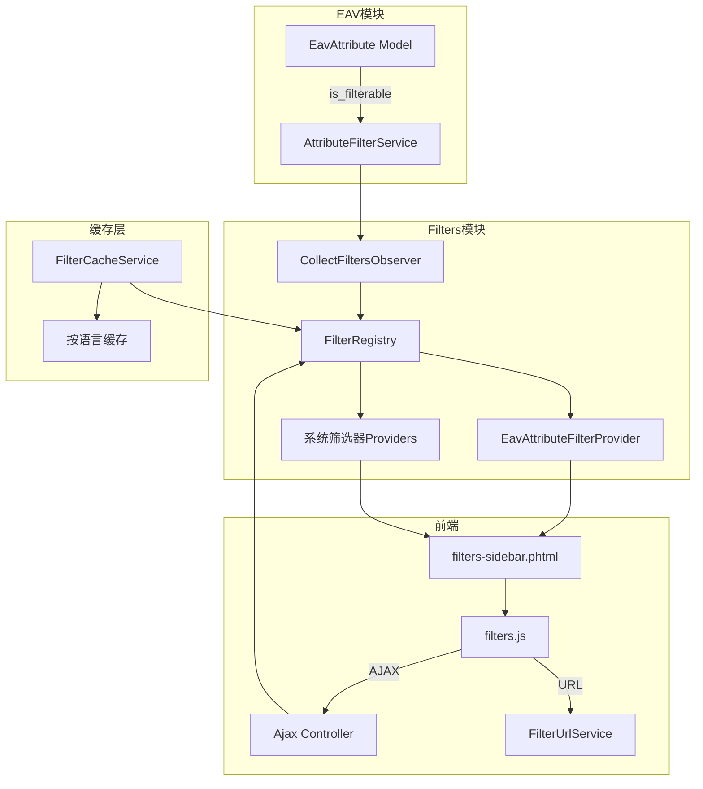

# WeShop_Filters 模块需求文档

## 模块概述

WeShop_Filters 模块为 WeShop 电商系统提供完整的商品筛选功能，支持：
- 基于 EAV 属性的动态筛选
- 预定义的系统筛选器（价格、品牌、库存、配送、评分、新品、促销）
- 前端 AJAX 和 URL 两种交互模式
- 多语言国际化支持

---

## 一、架构设计

### 1.1 系统架构图



### 1.2 核心组件

| 组件 | 职责 |
|------|------|
| `FilterRegistry` | 筛选器注册表，管理所有已注册的筛选器 |
| `FilterService` | 核心服务，收集筛选器、应用筛选、构建结果 |
| `FilterCacheService` | 缓存服务，按语言隔离缓存 |
| `FilterUrlService` | URL 参数解析和构建 |
| `FilterProviderInterface` | 筛选器提供者接口 |
| `FilterCollectionInterface` | 筛选器集合接口 |

---

## 二、EAV 属性升级

### 2.1 新增字段

在 `Weline\Eav\Model\EavAttribute` 模型中添加：

| 字段名 | 类型 | 默认值 | 说明 |
|--------|------|--------|------|
| `is_filterable` | SMALLINT | 0 | 是否可用于筛选 |
| `is_visible_on_front` | SMALLINT | 0 | 是否在前端显示 |

### 2.2 字段常量

```php
public const fields_is_filterable = 'is_filterable';
public const fields_is_visible_on_front = 'is_visible_on_front';
```

### 2.3 AttributeFilterService 更新

在 `getEntityAttributes()` 方法中添加 `is_filterable = 1` 过滤条件，确保只返回可筛选的属性。

---

## 三、筛选器提供者

### 3.1 系统筛选器

| 筛选器 | 代码 | 说明 |
|--------|------|------|
| `PriceFilterProvider` | `price` | 价格区间筛选 |
| `BrandFilterProvider` | `brand` | 品牌筛选 |
| `StockFilterProvider` | `stock` | 库存状态筛选 |
| `ShippingFilterProvider` | `shipping` | 配送方式筛选 |
| `RatingFilterProvider` | `rating` | 用户评分筛选 |
| `NewFilterProvider` | `new` | 新品筛选 |
| `SaleFilterProvider` | `sale` | 促销筛选 |
| `EavAttributeFilterProvider` | 动态 | EAV 属性筛选 |

### 3.2 筛选器接口

```php
interface FilterProviderInterface
{
    public function getCode(): string;
    public function getName(): string;
    public function getOptions(int $categoryId, array $productIds, array $appliedFilters = []): array;
    public function apply(ModelAbstract $collection, array $values): ModelAbstract;
    public function getValueLabel(string $value): string;  // 多语言标签
    public function getSortOrder(): int;
    public function getDisplayType(): string;
}
```

---

## 四、前端交互

### 4.1 JavaScript 加载

**Hook 文件**: `view/hooks/Weline_Theme/frontend/layouts/base/body-end.phtml`

使用 `$this->getStaticUrl()` 加载 `filters.js`。

### 4.2 交互模式

| 模式 | 说明 | 实现 |
|------|------|------|
| AJAX | 无刷新筛选 | `filters.js` 发送 AJAX 请求到 `/weshop/filters/frontend/ajax/filter` |
| URL | 刷新页面筛选 | 直接修改 URL 参数，支持渐进增强 |

### 4.3 筛选模板

**主模板**: `view/hooks/Weline_Theme/frontend/layouts/category/filters-sidebar.phtml`

功能：
- 显示已应用的筛选条件（filter-chip）
- 显示可用的筛选组和选项
- 支持多种显示类型：list、checkbox、slider

---

## 五、多语言国际化

### 5.1 翻译机制

由于框架翻译缓存基于请求模块链，使用 `State::getLangLocal()` 直接检测语言：

```php
$lang = State::getLangLocal();
$isEnglish = str_starts_with($lang, 'en');
```

### 5.2 缓存键包含语言

**文件**: `Service/FilterCacheService.php`

```php
public function generateCacheKey(int $categoryId, array $filterParams): string
{
    $lang = State::getLangLocal();
    $paramString = json_encode($filterParams);
    return self::CACHE_PREFIX . $categoryId . '_' . $lang . '_' . md5($paramString);
}
```

### 5.3 筛选器标签翻译

| 筛选器 | 中文 | 英文 |
|--------|------|------|
| 配送-当日达 | 当日达 | Same Day Delivery |
| 配送-次日达 | 次日达 | Next Day Delivery |
| 配送-免运费 | 免运费 | Free Shipping |
| 库存-有货 | 有货 | In Stock |
| 库存-缺货 | 缺货 | Out of Stock |
| 库存-库存紧张 | 库存紧张 | Low Stock |
| 新品 | 新品上市 | New Arrivals |
| 促销 | 促销商品 | On Sale |
| 评分 | X星及以上 | X stars and above |

### 5.4 i18n 翻译文件

- `i18n/zh_CN.csv` - 中文翻译
- `i18n/en_US.csv` - 英文翻译

---

## 六、AJAX 控制器

### 6.1 控制器路径

`/weshop/filters/frontend/ajax/filter`

### 6.2 SQL 修复

使用 `groupBy()` 替代 `DISTINCT`：

```php
// 正确写法
->fields('main_table.' . ProductCategory::fields_product_id)
->groupBy('main_table.' . ProductCategory::fields_product_id)
```

---

## 七、事件系统

### 7.1 监听事件

| 事件名 | 观察者 | 说明 |
|--------|--------|------|
| `WeShop_Catalog::category_load_after` | `CollectFiltersObserver` | 收集分类页面的筛选器 |
| `WeShop_Product::product_save_after` | `ClearFilterCacheObserver` | 产品保存后清除筛选缓存 |
| `WeShop_Catalog::category_save_after` | `ClearFilterCacheObserver` | 分类保存后清除筛选缓存 |

### 7.2 触发事件

| 事件名 | 触发时机 |
|--------|----------|
| `WeShop_Filters::filters_apply_before` | 应用筛选前 |
| `WeShop_Filters::filters_apply_after` | 应用筛选后 |

---

## 八、关键文件清单

| 文件 | 说明 |
|------|------|
| `Api/FilterProviderInterface.php` | 筛选器提供者接口 |
| `Model/FilterRegistry.php` | 筛选器注册表 |
| `Service/FilterService.php` | 核心筛选服务 |
| `Service/FilterCacheService.php` | 缓存服务（含语言隔离） |
| `Service/FilterUrlService.php` | URL 参数服务 |
| `Provider/*.php` | 各筛选器提供者实现 |
| `Observer/CollectFiltersObserver.php` | 筛选器收集观察者 |
| `Controller/Frontend/Ajax.php` | AJAX 控制器 |
| `view/hooks/.../filters-sidebar.phtml` | 筛选侧边栏模板 |
| `view/statics/js/filters.js` | 前端交互脚本 |
| `i18n/*.csv` | 多语言翻译文件 |

---

## 九、执行步骤

1. **EAV 属性升级** - 添加 `is_filterable` 和 `is_visible_on_front` 字段
2. **更新 AttributeFilterService** - 添加 `is_filterable=1` 过滤条件
3. **创建 body-end Hook** - 加载 `filters.js`
4. **修复 AJAX 控制器** - SQL 语法问题
5. **实现多语言翻译** - 更新筛选器提供者的 `getValueLabel()` 方法
6. **修复缓存键** - 添加语言标识到缓存键
7. **运行数据库升级** - `php bin/w setup:upgrade`
8. **收集翻译词** - `php bin/w i18n:collect`
9. **测试验证** - 确保筛选器可点击、AJAX/URL 模式正常、多语言翻译正确

---

## 十、版本历史

| 版本 | 日期 | 变更说明 |
|------|------|----------|
| 1.0.0 | 2026-01-28 | 初始版本：EAV 属性升级、前端交互、AJAX 控制器 |
| 1.1.0 | 2026-01-28 | 多语言国际化支持、缓存语言隔离 |
