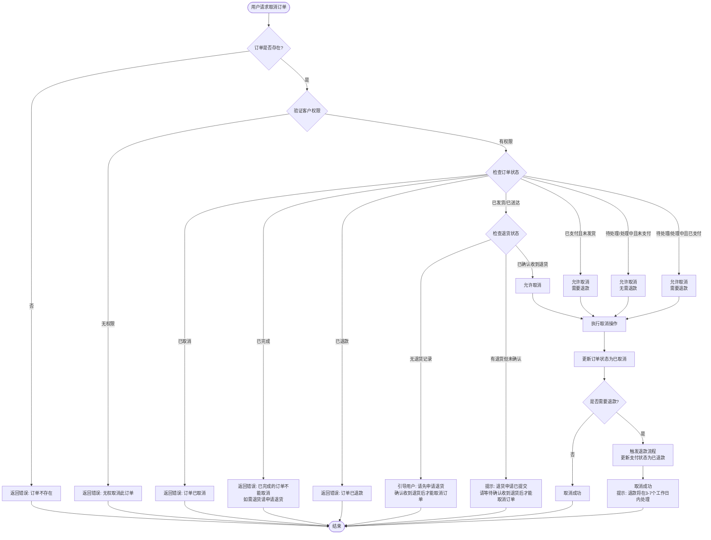
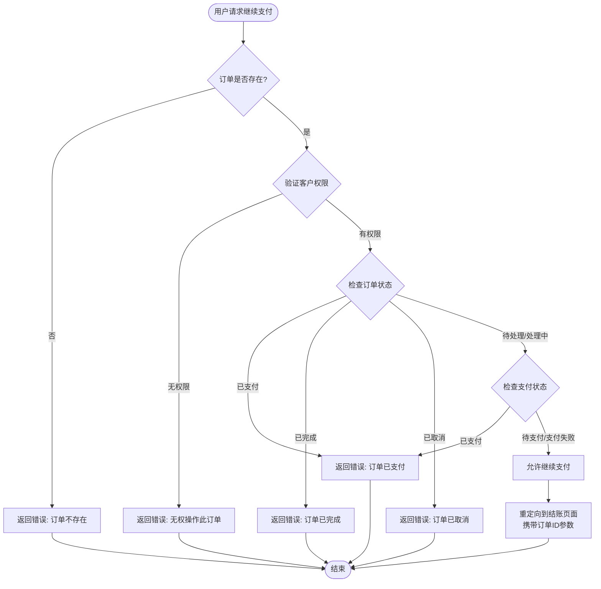
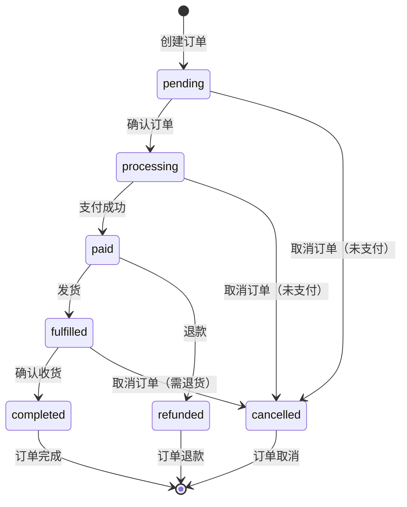

# WeShop 订单业务逻辑说明

## 目录

- [订单状态定义](#订单状态定义)
- [订单取消业务逻辑](#订单取消业务逻辑)
- [订单支付业务逻辑](#订单支付业务逻辑)
- [订单状态流转图](#订单状态流转图)

---

## 订单状态定义

### 订单状态（Order Status）

| 状态 | 常量 | 说明 |
|------|------|------|
| 待处理 | `STATUS_PENDING` | 订单刚创建，等待处理 |
| 处理中 | `STATUS_PROCESSING` | 订单已确认，正在处理中 |
| 已支付 | `STATUS_PAID` | 订单已支付 |
| 已发货 | `STATUS_FULFILLED` | 订单已发货 |
| 已完成 | `STATUS_COMPLETED` | 订单已完成（已收货） |
| 已取消 | `STATUS_CANCELLED` | 订单已取消 |
| 已退款 | `STATUS_REFUNDED` | 订单已退款 |

### 支付状态（Payment Status）

| 状态 | 常量 | 说明 |
|------|------|------|
| 待支付 | `PAYMENT_STATUS_PENDING` | 订单待支付 |
| 已支付 | `PAYMENT_STATUS_PAID` | 订单已支付 |
| 支付失败 | `PAYMENT_STATUS_FAILED` | 支付失败 |
| 部分支付 | `PAYMENT_STATUS_PARTIAL` | 部分支付 |
| 已退款 | `PAYMENT_STATUS_REFUNDED` | 已退款 |

### 发货状态（Fulfillment Status）

| 状态 | 常量 | 说明 |
|------|------|------|
| 待发货 | `FULFILLMENT_STATUS_PENDING` | 待发货 |
| 部分发货 | `FULFILLMENT_STATUS_PARTIAL` | 部分发货 |
| 已发货 | `FULFILLMENT_STATUS_SHIPPED` | 已发货 |
| 已送达 | `FULFILLMENT_STATUS_DELIVERED` | 已送达 |

---

## 订单取消业务逻辑

### 业务规则

订单取消遵循以下业务规则：

1. **不允许取消的状态**
   - 已取消（`cancelled`）：订单已经是取消状态
   - 已完成（`completed`）：订单已完成，如需退货请申请退货
   - 已退款（`refunded`）：订单已退款

2. **需要先退货才能取消的状态**
   - 已发货（`fulfilled`）：订单已发货，需要先申请退货
   - 发货状态为已发货（`shipped`）：需要先申请退货
   - 发货状态为已送达（`delivered`）：需要先申请退货

3. **允许取消但需要退款的状态**
   - 已支付（`paid`）且未发货：可以取消，但需要退款
   - 处理中（`processing`）且已支付：可以取消，但需要退款

4. **可以直接取消的状态**
   - 待处理（`pending`）且未支付：可以直接取消
   - 处理中（`processing`）且未支付：可以直接取消

### 订单取消流程图



### 订单取消判断逻辑表

| 订单状态 | 支付状态 | 发货状态 | 是否可以取消 | 是否需要退货 | 是否需要退款 | 说明 |
|---------|---------|---------|------------|------------|------------|------|
| pending | pending | pending | ✅ 是 | ❌ 否 | ❌ 否 | 待处理且未支付，可直接取消 |
| pending | paid | pending | ✅ 是 | ❌ 否 | ✅ 是 | 待处理但已支付，需退款 |
| processing | pending | pending | ✅ 是 | ❌ 否 | ❌ 否 | 处理中且未支付，可直接取消 |
| processing | paid | pending | ✅ 是 | ❌ 否 | ✅ 是 | 处理中且已支付，需退款 |
| paid | paid | pending | ✅ 是 | ❌ 否 | ✅ 是 | 已支付但未发货，需退款 |
| fulfilled | paid | shipped | ❌ 否 | ✅ 是 | - | 已发货，需先退货 |
| fulfilled | paid | delivered | ❌ 否 | ✅ 是 | - | 已送达，需先退货 |
| completed | paid | delivered | ❌ 否 | ❌ 否 | - | 已完成，不能取消 |
| cancelled | - | - | ❌ 否 | ❌ 否 | - | 已取消，不能重复取消 |
| refunded | refunded | - | ❌ 否 | ❌ 否 | - | 已退款，不能取消 |

### 代码实现

#### 检查订单是否可以取消

```php
/**
 * 检查订单是否可以取消
 * 
 * @param int $orderId 订单ID
 * @param int $customerId 客户ID（用于验证）
 * @return array [
 *     'can_cancel' => bool,        // 是否可以取消
 *     'reason' => string|null,     // 不能取消的原因
 *     'require_return' => bool,   // 是否需要先退货
 *     'require_refund' => bool     // 是否需要退款
 * ]
 */
public function canCancelOrder(int $orderId, int $customerId): array
```

#### 取消订单

```php
/**
 * 取消订单
 * 
 * @param int $orderId 订单ID
 * @param int $customerId 客户ID（用于验证）
 * @return bool
 * @throws \Exception
 */
public function cancelOrder(int $orderId, int $customerId): bool
```

---

## 订单支付业务逻辑

### 支付失败处理

当订单支付失败时，系统支持以下功能：

1. **继续支付**
   - 用户可以在订单列表或个人中心继续支付失败的订单
   - 系统会验证订单状态，只有未支付的订单可以继续支付
   - 继续支付会重定向到结账页面，携带订单ID参数

2. **支付状态检查**
   - 系统会检查订单状态是否为 `pending` 或 `processing`
   - 系统会检查支付状态是否为 `pending` 或 `failed`
   - 只有满足条件的订单才能继续支付

### 继续支付流程图



---

## 订单状态流转图

### 完整状态流转



### 状态转换规则

| 当前状态 | 可转换到 | 条件 | 说明 |
|---------|---------|------|------|
| pending | processing | 订单确认 | 订单已确认，进入处理流程 |
| pending | cancelled | 未支付 | 未支付的订单可以直接取消 |
| processing | paid | 支付成功 | 订单支付成功 |
| processing | cancelled | 未支付 | 未支付的订单可以取消 |
| paid | fulfilled | 发货 | 订单已发货 |
| paid | refunded | 退款 | 订单退款 |
| fulfilled | completed | 确认收货 | 用户确认收货 |
| fulfilled | cancelled | 退货确认 | 确认收到退货后可以取消 |
| - | - | - | 其他状态转换不允许 |

---

## 相关API接口

### 订单取消

- **URL**: `/weshop/order/cancel`
- **方法**: `POST`
- **参数**: 
  - `order_id` (int): 订单ID
- **返回**: 重定向到订单列表页面

### 继续支付

- **URL**: `/weshop/order/retryPayment`
- **方法**: `GET`
- **参数**: 
  - `order_id` (int): 订单ID
- **返回**: 重定向到结账页面

### 获取未支付订单数量

- **URL**: `/api/rest/v1/weshop_order/order/unpaid-count`
- **方法**: `GET`
- **返回**: JSON格式
  ```json
  {
    "code": 200,
    "msg": "获取成功",
    "data": {
      "count": 2,
      "has_unpaid": true
    }
  }
  ```

### 获取未支付订单列表

- **URL**: `/api/rest/v1/weshop_order/order/unpaid-list`
- **方法**: `GET`
- **返回**: JSON格式
  ```json
  {
    "code": 200,
    "msg": "获取成功",
    "data": {
      "orders": [
        {
          "order_id": 1,
          "increment_id": "2024010112345678",
          "total": 299.00,
          "created_at": "2024-01-01 12:34:56"
        }
      ],
      "count": 1
    }
  }
  ```

---

## 注意事项

1. **退货流程**
   - 已发货的订单需要先申请退货
   - 系统会检查退货状态，只有确认收到退货后才能取消订单
   - 退货功能需要与RMA（退货授权）模块集成

2. **退款流程**
   - 已支付的订单取消时需要退款
   - 退款流程需要与支付模块集成
   - 退款处理时间通常为3-7个工作日

3. **权限验证**
   - 所有订单操作都需要验证客户权限
   - 只有订单所属客户才能操作该订单

4. **状态一致性**
   - 订单状态、支付状态、发货状态需要保持一致
   - 状态转换需要遵循状态机规则

---

## 更新记录

- **2024-01-XX**: 初始文档创建
- **2024-01-XX**: 添加订单取消业务逻辑流程图
- **2024-01-XX**: 添加订单支付业务逻辑说明
- **2024-01-XX**: 完善状态流转图和API接口说明
