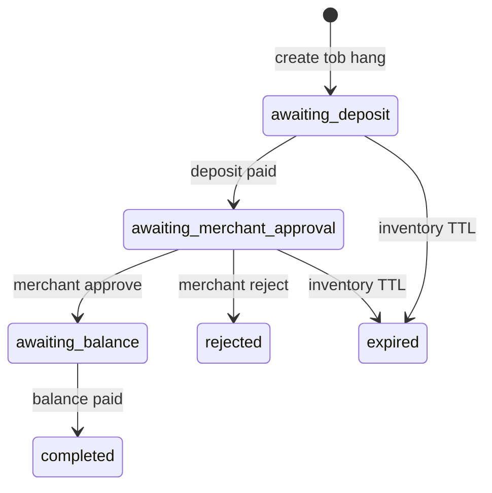

# ToB hang_status 状态图（一期）

```mermaid
stateDiagram-v2
    [*] --> awaiting_deposit: create tob hang
    awaiting_deposit --> awaiting_merchant_approval: deposit paid
    awaiting_merchant_approval --> awaiting_balance: merchant approve
    awaiting_merchant_approval --> rejected: merchant reject
    awaiting_balance --> completed: balance paid
    awaiting_deposit --> expired: inventory TTL
    awaiting_merchant_approval --> expired: inventory TTL
```

账户订单 UI：`awaiting_deposit` 显示「支付定金」CTA（`purpose=deposit`）；`awaiting_balance` 显示「支付尾款」CTA（`purpose=balance`）。
