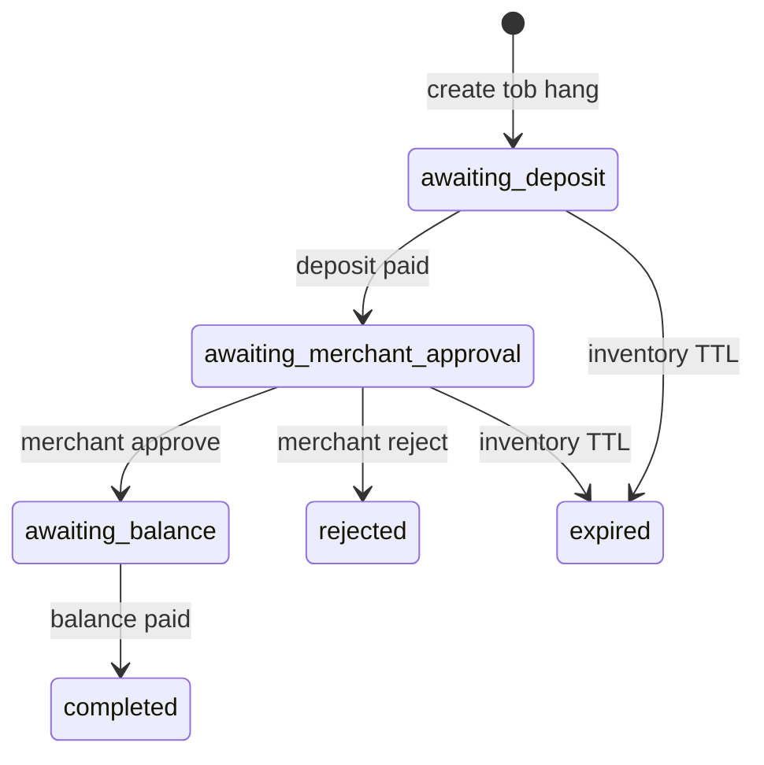

# ToB hang_status 状态图（一期）

账户订单 UI：`awaiting_deposit` 显示「支付定金」CTA（`purpose=deposit`）；`awaiting_balance` 显示「支付尾款」CTA（`purpose=balance`）。列表与订单详情均挂 hang partial。

支付闭环要点：

- Hang 结账页独立渲染 `payment_methods`（来自 `hang.paymentContext`），禁止无选择时静默 `fake_card`。
- 浏览器回跳 / resume 成功：按 transaction `metadata.purpose` 调 `B2BHangOrderService::reconcilePaymentSuccess`；`deposit` 不标全额 paid；`balance` 推进 hang 后再 `notifyOrderPaid`。
- Checkout `already_paid`：若 hang 仍待定金/尾款则 reconcile，避免卡死。
- 尾款路径禁止 `reserveB2bCreditForDeposit`（信用只抵定金）。
- 稳定幂等键：`hang_{purpose}_{order_uuid}`（改价后建议 `hang_balance_{uuid}_r{revision}`）。
- 支付入口收敛：`B2BHangPaymentBridgeInterface`（Payment/Checkout/Payable soft 依赖 Interface）。
- Hang 状态旁路：`Weline_B2B::hang_status_changed`（见 `doc/event/hang_status_changed.md`）。
- 定金成功：`InventoryCapabilityInterface::reserve`，幂等 `hang_{orderUuid}_{line}`。
- 尾款协商：`proposeBalanceRevision` / `confirmBalanceRevision`；`hang_revision_pending` 时禁止 startPayment / onBalancePaid；确认后 `reviseTobHangPayable`。
