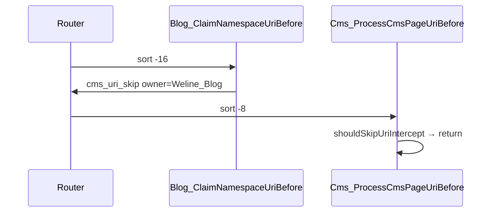

# Weline_Blog 架构

## 1. 统一模型：BlogArticle

全链路只认 `BlogArticle`（`Api/Data/BlogArticle.php`）：

| 字段 | 说明 |
|------|------|
| `content_kind` | `blog_post` \| `cms_page` |
| `identifier` | 固定 `blog/{slug}` |
| `canonical_url` / `public_url` | 对外 `/blog/{slug}` |
| `source_ref` | `{ kind, post_id?, cms_page_id? }` |

## 2. CMS 路由共存

- CMS 扩展点：`CmsUriInterceptSkipInterface`（`Weline_Cms/extends.php`）
- Blog 实现：`BlogUriInterceptSkip` + Observer 写入 `cms_uri_skip`

**注意**：Blog 对 `cms_page` 的 `renderPagePayload` 内部转发不受豁免影响。

## 3. BlogContentResolver

1. 查 `blog_post`（published）
2. 未命中 → `w_query('cms', 'getPage', { identifier: blog/{slug}, path_group: blog })`
3. 都未命中 → 404

## 4. SEO / Sitemap / Search 主权

| 层 | Owner | 说明 |
|----|-------|------|
| SEO Profile | `BlogSeoProfileProvider` | `blog_post` / `blog_list` + `article` 事实 |
| Sitemap | `BlogSitemapUrlProvider` | 唯一提交 `/blog` 与 `/blog/{slug}` |
| CMS Sitemap | `CmsPageProvider` | `Weline_Blog` 启用时 skip `path_group=blog` |
| Search | `BlogSearchProvider` | `type=blog`，自渲染 hit 模板 |

## 5. Slug 冲突

`BlogSlugConflictGuard` 在 Blog 保存时检查 CMS `path_group=blog` 页面；CMS 反向 guard 预留 S2。

## 6. 模块依赖

- requires: Framework, Websites, Theme
- optional: Cms, Search, Seo, Catalog, I18n

`Weline_Search` 对 `Weline_Product` 已改为 optional，Search 枢纽不绑架 Product。

## 7. 汉服内容与图片资产治理（R2）

汉服内容整改以 `data/remediate-hanfu-content-r2.php` 为唯一批处理入口。脚本保留既有 85 个分类及文章分布，以中英 base slug 为一个主题单元：160 个主题对应 320 篇发布文章；48 个核心主题读取 `data/hanfu-r2-core-profiles.php`，112 个民族主题读取 `data/china-ethnic-groups.php`。

内容写入只走 `BlogPostAdminService`，不直接拼接 SQL。每篇文章从主题 profile 重新构建，至少包含定义、识别依据、边界/风险、实践建议等 6 个章节；全局段落去重和旧填充词检查在写入前后各执行一次。正文不内嵌图片，封面使用 `blog/hanfu/r2/covers/**` 下的 160 个唯一主题资产；中英文同主题有意共享封面。

图片存储边界由 `FileAssetLibraryInterface` 持有。每个封面先注册 FileAsset，再写入 `zh_Hans_CN` / `en_US` 的 reviewed/manual 名称、alt、description、caption，并保存 source、license、purpose、relations、review 元数据。旧资源只有在数据库、源码和 FileManager 引用守卫共同给出零引用证明后才可逐文件删除。完整规则见 `data/BLOG_IMAGE_NO_DUPLICATE.md`。
