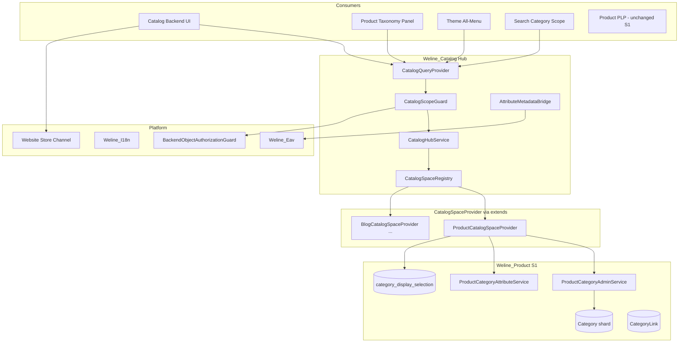
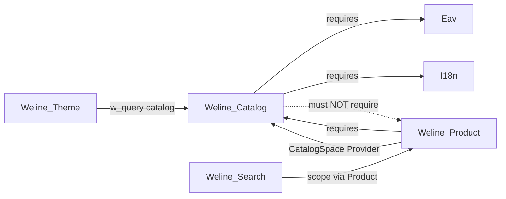
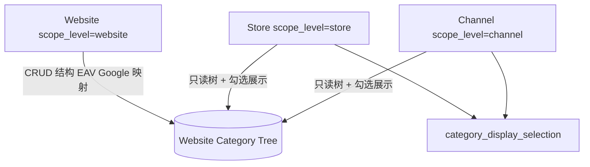

# Weline_Catalog 架构文档

> **状态**：规划定稿（S1 分章交付）；实现后同步至 `app/code/Weline/Catalog/doc/ARCHITECTURE.md`。  
> **分章索引**：[`catalog_00_主索引_分章交付.plan.md`](catalog_00_主索引_分章交付.plan.md)  
> **验收模板**：[`catalog_验收模板_分章门禁.plan.md`](catalog_验收模板_分章门禁.plan.md)

---

## 1. 定位与目标

### 1.1 是什么

`Weline_Catalog` 是 Weline 的 **万能分类枢纽**：在后台与 Query 层统一编排多种 **分类空间（space）**——如 **产品分类**、**博客分类**——而不把树结构、搜索、EAV、外部 taxonomy 绑死在单一业务模块里。

设计对标 [`Weline_Search`](../../app/code/Weline/Search/) 的多 Provider 枢纽：

| Search | Catalog |
|---|---|
| `SearchProviderInterface` | `CatalogSpaceProviderInterface` |
| `type=product\|cms` | `space=product\|blog\|…` |
| `SearchHubService` 编排 | `CatalogHubService` 编排（**更薄**） |
| `w_query('search', …)` | `w_query('catalog', …)` |

### 1.2 不是什么

- **不是** Product 里的 `Backend\Catalog` 控制器（那是商品运营工作区，保留原名）。
- **不是** 把 Google 标准类目树当作商户主导航树。
- **不是** 在 Store/Channel 再建一棵物理分类树。

### 1.3 设计目标

1. **空间明明白白**：`product` / `blog` 等由 extends 动态注册，Hub 不硬编码业务类型。
2. **Provider 一次收口**：树 CRUD、搜索、EAV、外部 taxonomy、展示选择均在 **Space Provider 全抽象接口** 内实现；Hub **禁止** `if ($space==='product')` 业务 SQL。
3. **范围清晰**：分类 **结构** 只在 **Website** 创建；Store/Channel 只做 **展示选择**。
4. **可验收**：分章交付，每章 UT → RT → WB → DL 四段门禁（见 MCP `chapter_delivery.v1`）；**WB = WB-OP（操作员路径）+ WB-VIS（截图 + 原型对照）**。

---

## 2. 总体架构



**依赖方向（硬规则）**



---

## 3. 核心概念

### 3.1 分类空间（space）

| 项 | 说明 |
|---|---|
| **API 参数** | `space=product`（`domain=` 仅兼容别名，一版后废弃） |
| **注册** | `extends.php` → `CatalogSpace` → `{Module}/extends/module/Weline_Catalog/Space/*CatalogSpaceProvider.php` |
| **发现** | `CatalogSpaceRegistry::all()` → 后台空间切换器动态列表 |
| **S1** | 仅 `product`；`blog` 等为后续空间 |

每个 space 有 **独立分类树**（不同 Provider 背后不同存储）；**不是**同一棵树上的标签。

### 3.2 三层管理范围（scope_level）

**一棵树 / website_id / space** 为唯一结构真相；Store/Channel 不复制节点。



| scope_level | 参数 | 允许 | 禁止 |
|---|---|---|---|
| **website** | `store_id=0`, `channel_id=0` | 增删改排序节点；EAV；Google 映射 | — |
| **store** | `store_id>0` | `readDisplaySelection` / `saveDisplaySelection` | save/delete/reorder 结构 |
| **channel** | `channel_id>0` | 同 store | 同 store |

**Hub 硬门禁**（`CatalogHubService` + `CatalogScopeGuard`）在调用 Provider 前拦截非法 op。

**Store/Channel 存储（Product S1）**

表：`category_display_selection`（Product website 分片）

| 字段 | 说明 |
|---|---|
| `website_id`, `store_id`, `channel_id`, `category_id` | 联合定位 |
| `enabled`, `position` | 是否展示、排序 |

### 3.3 两层数据模型（结构 vs 可扩展属性）

| 层 | 存储 | 示例 | Eav |
|---|---|---|---|
| **节点结构** | Product shard `Category` | `parent_id`, `path`, `position`, `status`, `code`（slug） | 否 |
| **可扩展属性** | Eav 元数据 + 值（S1：shard AttributeValue） | `name`, `description`, `google_taxonomy_id` | 是 |

- **product 空间**：`eavEntityCode() = category`，`entity_id = category_id`。
- **其他空间**：各自 `eavEntityCode()`（如 `blog_category`），由归属模块在 `Model/` 声明 `EntityDefinitionInterface`。
- **Hub 不注册 Eav 实体**；只桥接 `AttributeMetadataCatalogInterface` 与 Provider。

### 3.4 Google 产品分类（外部 taxonomy）

- **只做映射**：Website 创建/编辑分类时绑定 `google_taxonomy_id`。
- **只读参照库**：`catalog_google_taxonomy`（官方 taxonomy 导入）；后台 **不可删改结构**，仅 **I18n 译名** + **AI 批量翻译**。
- **不是** 商户导航主树。

---

## 4. 模块组件

### 4.1 Weline_Catalog（Hub）

| 组件 | 职责 |
|---|---|
| `CatalogSpaceRegistry` | 扫描 extends，按 `code()` 注册 Provider |
| `CatalogHubService` | `provider($space)` + 按 op 转发；**无业务 SQL** |
| `CatalogScopeGuard` | 解析 `website_id/store_id/channel_id/scope_level`；对接 `BackendObjectAuthorizationGuard`；结构写仅 website |
| `CatalogQueryProvider` | `w_query('catalog', $op, $params)` 唯一对外读写在门面 |
| `Controller/Backend/Category` | 万能分类后台壳（space + scope 切换器） |
| `Controller/Backend/GoogleTaxonomy` | Google 参照 + 译名 + AI 入队（S1.5 章 7） |

**Query operations（S1）**

| operation | scope | 说明 |
|---|---|---|
| `spaces` | — | 已注册空间列表 |
| `tree`, `view`, `search` | 全部 | 转发 Provider |
| `save`, `delete`, `reorder`, `writeAttributes` | **website only** | Hub 403 拦截 |
| `readDisplaySelection`, `saveDisplaySelection` | store/channel | 转发 Provider |
| `readAttributes`, `attributeCatalog` | 读 universal；写 website | |
| `googleTaxonomy*` | 章 7 | 映射与翻译 |

### 4.2 CatalogSpaceProviderInterface（全抽象 SPI）

路径：`app/code/Weline/Catalog/Api/CatalogSpaceProviderInterface.php`

接入方 **必须实现全部方法**（无 Hub 侧默认分支）。推荐 `AbstractCatalogSpaceProvider` 无默认实现，编译期强制补全。

**方法分组**

1. **身份**：`code()`, `label()`, `sortOrder()`, `icon()`
2. **范围**：`normalizeScope()`
3. **结构 CRUD**（仅 Provider 内部按 website 执行）：`tree`, `view`, `save`, `delete`, `reorder`
4. **展示选择**：`readDisplaySelection`, `saveDisplaySelection`
5. **搜索**：`searchNodes` — **后台树过滤/选择器在 Provider 内实现，Hub 不拼 SQL**
6. **导航**：`resolveNodeUrl`, `listNavCandidates`
7. **EAV**：`eavEntityCode`, `attributeEditorCatalog`, `readAttributes`, `writeAttributes`
8. **外部 taxonomy**：`externalTaxonomyRequired`, `validateExternalTaxonomyId`, `listExternalTaxonomyPicker`
9. **缓存**：`invalidateAfterMutation`

**extends 注册**

```php
// app/code/Weline/Catalog/extends.php
'CatalogSpace' => [
    'path' => 'extends/module/Weline_Catalog/Space',
    'interface' => CatalogSpaceProviderInterface::class,
    'multiple' => true,
],
```

### 4.3 Weline_Product（首个 space：`product`）

| 保留在 Product | 说明 |
|---|---|
| `Category`, `CategoryLink` 表与 Repository | S1 不迁表 |
| `ProductCategoryAdminService` | 结构 CRUD 实现；**仅**被 `ProductCatalogSpaceProvider` 调用 |
| `ProductCategoryAttributeService` | EAV 值读写单路径 |
| `CategoryDisplaySelectionRepository` | 章 6：店/渠展示 |
| 商品 taxonomy 面板、PLP、Copy、Search scope 业务 | 消费者改 `w_query('catalog', …)` |

| 迁出/删除 | 说明 |
|---|---|
| `categories.phtml`、分类 JS/CSS、分类 Controller actions | → Catalog 后台 |
| `ProductCategoryAdminQueryProvider` | → `CatalogQueryProvider` |

实现类：`app/code/Weline/Product/extends/module/Weline_Catalog/Space/ProductCatalogSpaceProvider.php`

---

## 5. 后台 UI 设计

### 5.1 顶栏控件（Taglib，禁止手搓 select）

| 控件 | 作用 |
|---|---|
| `<w:websites:website:select>` | 网站（ACL 过滤选项） |
| **空间切换器** | Registry 动态：`product` … |
| **模式 Tab** | 网站管理 \| 店铺展示 \| 渠道展示 |
| `<w:websites:store:select>` | 店铺展示模式 |
| `<w:websites:channel:select>` | 渠道展示模式 |

### 5.2 URL 形状

```
/catalog/backend/category/index
  ?space=product
  &scope_level=website|store|channel
  &website_id={id}
  &store_id={id}      # store/channel 模式
  &channel_id={id}    # channel 模式
```

### 5.3 模式与 UI 能力

| 模式 | 树 | 添加子分类 | 拖拽改结构 | EAV | Google |
|---|---|---|---|---|---|
| 网站管理 | 可编辑 | 是 | 是 | 是 | 是（章 7） |
| 店铺/渠道展示 | 只读 + 勾选列 | **否** | **否** | 只读 | 否 |

---

## 6. 安全与 ACL

### 6.1 两层 ACL

1. **Route/菜单 ACL**：`Weline_Catalog::commerce:universal-catalog:*`
2. **对象 ACL**：`CatalogScopeGuard` + `BackendObjectAuthorizationGuard`
   - website → `ScopeIdentity::website`
   - store → + `ScopeIdentity::store`
   - channel → + `ScopeIdentity::channel`

**fail-closed**：伪造 `website_id` / 跨站 POST → `403 object_scope_access_denied`。

### 6.2 子站商户

- 网站/店铺/渠道选择器 **仅展示已授权对象**。
- 默认进入：`WebsiteAclGrantService::currentWebsiteId()`（须在可访问集合内）。

---

## 7. 消费者集成

| 消费方 | S1 改法 | 禁止 |
|---|---|---|
| Product 编辑 taxonomy | `w_query('catalog','tree',{space:product,…})` | 直连 `CategoryRepository` |
| Theme all-menu | Query / `listNavCandidates` | 直连 Product 树服务 |
| Search 分类 scope | `ProductSearchCategoryScopeService` → catalog tree | — |
| 前台 PLP `/category/*` | S1 **暂保留** Product `StorefrontCategory*` | — |

---

## 8. 缓存

- S1：失效由 Provider `invalidateAfterMutation()` 委托 Product `StorefrontCatalogCacheCoordinator` 等。
- Hub 可选键：`catalog.tree.{space}.{website_id}`（S1 可透传 Provider）。

---

## 9. 分阶段演进

| 阶段 | 章 | 内容 |
|---|---|---|
| **S1** | 0～8 | Hub + product space + website UI + 店/渠展示 + Google + 文档 |
| **S2（可选）** | — | 分类物理表迁 `catalog.website` shard |
| **S3+** | — | `blog` 等第二 space；新 Provider 即可 |

---

## 10. 分章交付与架构对应

| 章 | 架构落点 |
|---|---|
| 0 | MCP `chapter_delivery.v1`；术语 `space` |
| 1 | EAV `category`；AttributeService |
| 2 | 本章档 + Hub 骨架 |
| 3 | `ProductCatalogSpaceProvider` |
| 4 | 后台 UI + ScopeGuard 门禁 |
| 5 | 消费者 Query 化 |
| 6 | `category_display_selection` |
| 7 | Google + I18n AI |
| 8 | 本文档入库 + 全量回归 |

---

## 11. 相关文档（交付后）

```
app/code/Weline/Catalog/doc/
├── README.md
├── ARCHITECTURE.md          ← 本文
├── 需求.md                  ← REQ + WEBUI-001～015
├── space-provider-guide.md  ← 第三方接入
├── eav-integration.md
├── google-taxonomy-integration.md
├── 开发日志.md              ← 章 0～8 四段验收证据
└── …
```

---

## 12. 架构决策记录（ADR 摘要）

| 决策 | 选择 | 理由 |
|---|---|---|
| 模块名 | `Weline_Catalog` | 与中文「目录/分类」一致；Hub 消歧 |
| 空间参数 | `space` 非 `domain` | 明明白白：产品分类、博客分类 |
| Provider 粒度 | 全抽象接口 | 搜索/EAV/展示一次收口；Hub 零业务分支 |
| 结构创建 | 仅 Website | 用户确认；店/渠只做展示 |
| 店/渠存储 | 新表 `category_display_selection` | CategoryLink 是挂品非展示配置 |
| Google | 只读参照 + 映射 | 不替代商户树 |
| EAV entity | 每 space 独立 code；product=`category` | 扩展性 + 与现网 shard 对齐 |
| 验收 | 分章 UT/RT/WB/DL | MCP 引导 + 真机 Browser；**WB-VIS 截图**不可省略 |

---

## 13. 验收与视觉门禁

### 13.1 四段 + WB 双门禁

| 段 | 代号 | Catalog S1 要求 |
|---|---|---|
| 单元/契约 | UT | 每章 Test / MCP 脚本 exit 0 |
| 运行时 | RT | `setup:upgrade`、`-b` 探活、Query 无 5xx |
| WebUI 真机 | WB | **WB-OP**：WEBUI 操作步骤；**WB-VIS**：断点截图 + 视觉清单 |
| 开发日志 | DL | `doc/开发日志.md` + `doc/evidence/ch{N}/` |

### 13.2 固化 UI 原型

权威正文：[`Catalog/doc/原型设计.md`](app/code/Weline/Catalog/doc/原型设计.md)

| 原型 | 屏幕 | WEBUI |
|---|---|---|
| P-CAT-1 | Website 结构页 | 001～004, 008, 009, 014, 015 |
| P-CAT-2 | Store/Channel 展示选择 | 005～007 |
| P-CAT-3 | Google 管理 + AI 翻译 | 010～012 |

视觉可沿用 Backend 皮肤，但**不得删掉标注区块或改成另一套信息架构**（对齐 Search S1 原型验收写法）。

### 13.3 证据产物

```
app/code/Weline/Catalog/doc/evidence/ch{N}/
  WEBUI-{id}_{breakpoint}.png
```

弹窗类用例（如 WEBUI-012）：弹窗打开态 + 关闭后各 1 张。WEBUI-015 须在 375/768/1024 各 1 张。

### 13.4 禁止替代

- curl / `http:request`：**仅探活**，不算 WB-OP 通过
- 契约/单元测试：**不替代** WB-OP 或 WB-VIS
- 纯文字「看起来正常」：**不替代** WB-VIS 截图

---

*文档版本：规划定稿，与 [`万能分类_taxonomy_枢纽_1dcdd045.plan.md`](万能分类_taxonomy_枢纽_1dcdd045.plan.md) 同步。*
