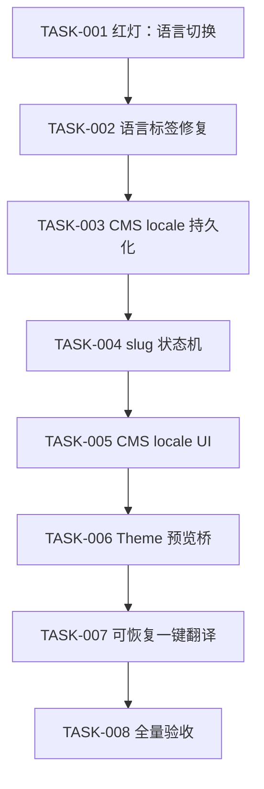

# CMS 多语言、SEO Slug 与 Theme 预览实施计划

> **执行要求：** 使用 `superpowers:executing-plans` 逐卡执行；每个行为变更执行 `superpowers:test-driven-development`；完成声明前执行 `superpowers:verification-before-completion`。

状态：**COMPLETE（安全自动验收通过）**  
计划 ID：`CMS-I18N-SLUG-THEME-20260729`  
日期：2026-07-29  
阻断项：0  
仓库：`/Users/weline/Project/Official/框架`  
分支：`codex/php84-orm-performance`

## Goal / Architecture / Stack

**Goal：** 保持现有 CMS、Theme、发布 URL、权限与网站作用域行为，交付 CMS 多语言、英语标题联动 slug、语言/布局即时预览、一键可恢复翻译，以及可靠的全局语言切换。

**Architecture：** CMS 保留 `Page.title` 并新增 PageLocale；slug 规则收敛到独立服务；CMS 与 Theme 通过同源 `postMessage` v1 协议同步预览；长翻译使用 Runtime Task，CMS 处理器只依赖 `Weline_TranslationService` 已发布的公共接口；语言切换以服务端 href 为权威。

**Stack：** PHP 8.4、Weline ORM、`intl/Transliterator`、QueryProvider / `Weline.Api.resource()`、Runtime Task、原生 `postMessage`、PHPUnit、Node `node:test`、内置 Browser、专用 WLS `ai-test-orm84-manual-20260729-112052:9976`。

## 执行约束与 Todo

当前工作区包含大量用户和其他任务改动。每批必须重新校验目标区域，禁止覆盖、回退、格式化、暂存计划外差异；不执行 commit、push、发布和站点仓库同步。当前 WLS 正供用户验收，不停止。

- [x] TASK-001：建立可执行语言切换失败用例
- [x] TASK-002：统一语言 Taglib 服务端 href 与点击行为
- [x] TASK-003：增加 CMS locale 持久化与兼容读取
- [x] TASK-004：实现英语标题驱动的安全 slug 状态机
- [x] TASK-005：接入 CMS 语言编辑状态与网站语言约束
- [x] TASK-006：实现 CMS ↔ Theme 语言/布局预览桥
- [x] TASK-007：实现 CMS 可恢复一键翻译
- [x] TASK-008：完成全量回归、真实点击验收与文档收口

完成规则：每个 TASK 的红灯、绿灯、定向验收和变更核对通过后立即勾选；未通过不得进入依赖任务。

## 需求与验收基线

| REQ | 规则 | 决定性验收 |
|---|---|---|
| REQ-001 | 全局语言标签可真实切换，后台默认语言也保留 locale | page_id=6 从 `ru_RU` 点英语后 URL 保留随机 backend key、query 与 `/en_US/`，页面语言改变且控制台无错误 |
| REQ-002 | CMS 只编辑页面网站支持的语言 | `website_id=0` 和普通网站只显示关联 locale；非法 locale 被服务端拒绝 |
| REQ-003 | 各语言标题持久化，旧标题兼容 | 保存两种语言后分别重开正确；无 locale 行旧页仍显示 `Page.title` |
| REQ-004 | 草稿自动 slug 由英语标题生成，手工/发布冻结 | `About Our Team` 得 `about-our-team`；冲突得 `-2`；手工和已发布 slug 不变 |
| REQ-005 | 切 CMS 语言时 Theme 预览同语言，未保存标题不丢 | `ru_RU -> en_US -> ru_RU` 恢复缓冲，iframe 选择器和预览跟随 |
| REQ-006 | 切布局即时预览，保存前不持久化 | iframe 立即变化；保存前重载恢复旧值；保存后新值存在 |
| REQ-007 | 一键翻译仅补空值并支持恢复/重试 | 进度可轮询；人工非空值不覆盖；部分失败保留成功项 |
| REQ-008 | 现有 CMS/Theme/消息/复制/发布不回归 | 定向回归通过；只显示一份消息；既有正常 URL 不被批量改写 |

范围外：任意 HTML 正文翻译、历史 URL 批量重写、第三方 slug 包、生产端口 9501、commit/push/deploy。

## 当前证据与缺口

| EVID | 路径/符号 | 事实 | 缺口 |
|---|---|---|---|
| E-001 | `Cms/Model/Page.php` | 单标题与单 slug | 无 locale 数据与 slug 模式 |
| E-002 | `PageService::createDraftPage` | 时间/随机草稿 slug | SEO 不友好 |
| E-003 | `PageService::savePage` | 已有事务、Theme、SEO、Activity 顺序 | 新逻辑必须嵌入而非旁路 |
| E-004 | `Cms/Controller/Backend/Page::getEdit/postSave` | 提供并保存页面/布局 | 无网站 locale 与本地化标题 |
| E-005 | `Cms/.../edit.phtml` | 有 title/slug/layout/iframe | 无 locale 缓冲与桥 |
| E-006 | `Theme/theme-editor.js` | 有 `configLocale` 与预览 locale 参数 | 不从 CMS 消息完整同步 |
| E-007 | `ThemeEditor::postAiTranslateConfig` | 同步单字段翻译 | 目标集合过宽且不可恢复 |
| E-008 | `ThemeConfigTranslationTaskHandler` | 已有可恢复 Theme 翻译处理器 | CMS 尚无编排任务 |
| E-009 | `LanguageSwitcher.php` 与 `i18n.js` | PHP、标签内 JS、公共 JS 都重建 URL | 后台默认 locale 语义冲突 |
| E-010 | Websites QueryProvider | 已发布网站语言读取边界 | CMS 应复用，不访问 Model |
| E-011 | PHP 8.4.22 + ext-intl | `Transliterator` 可用 | 无需新增依赖 |

| DEF | 等级 | 缺陷 | 处置 |
|---|---|---|---|
| D-001 | HIGH | 语言链接的服务端与 JS 规则不一致 | TASK-001/002 |
| D-002 | HIGH | CMS 无 locale 数据所有权 | TASK-003 |
| D-003 | MEDIUM | 随机 slug 不可读 | TASK-004 |
| D-004 | MEDIUM | CMS layout/locale 不驱动 iframe | TASK-005/006 |
| D-005 | HIGH | 翻译不可恢复且未限制网站语言 | TASK-007 |
| D-006 | HIGH | 缺少旧 URL、人工值和部分成功保护 | TASK-003/004/007/008 |

## 目标契约

### CMS

- `app/code/Weline/Cms/Model/Page.php`：新增 `source_locale:string(16)`、`slug_mode:string(16)`、`slug_source_hash:string(64)` ORM 字段。
- 新增 `app/code/Weline/Cms/Model/PageLocale.php`：表 `weline_cms_page_locale`，唯一索引 `(page_id, locale_code)`。
- 新增 `app/code/Weline/Cms/Service/PageLocaleService.php`：网站 locale 校验、读取回退、批量加载、upsert 和主标题兼容同步。
- 新增 `app/code/Weline/Cms/Service/PageSlugService.php`：音译、规范化、模式推导、自动唯一后缀和发布冻结。

字段与索引只由模型属性声明；Upgrade 仅做历史数据迁移，不定义第二套 schema。

### Theme public API

- 新增 `app/code/Weline/Theme/Api/I18n/TranslatableTargetInterface.php`。
- 新增 `app/code/Weline/Theme/Service/I18n/TranslatableTarget.php`。

输入为 target、layout、scope、source locale、目标 locales 和 `missing_only=true`；输出稳定字段 key、每语言当前值与保存结果。CMS 不访问 Theme Model/内部 Service。

### Runtime Task

- 新增 `app/code/Weline/Cms/Service/Resumable/PageTranslationTaskHandler.php`。
- 新增 `app/code/Weline/Cms/etc/resumable_tasks.php`。
- 类型 `cms.page_translation`。

处理器重新校验页面、网站 locale、后台 owner 和 ACL；逐 locale/字段 checkpoint；返回成功、跳过、失败计数与失败 work item。

### Preview bridge

```text
{ protocol: 'weline.cms-theme-editor.v1', type: string, requestId: string, payload: object }
```

父到子 `set-context`；子到父 `ready/context-applied/dirty-state`。双方校验同源，父额外校验 source；两秒未 ready/ack 才重载带 locale/layout 的原 iframe URL。

### Language URL

新增 `app/code/Weline/I18n/Service/Url/LanguageSwitchUrlBuilder.php`。后台固定生成：

```text
/{backendKey}/{nonDefaultCurrency?}/{targetLocale}/{route...}
```

前台继续遵守默认段省略规则；query/hash 原样保留。

## 修改矩阵

| MOD | 文件/符号 | 操作 | TASK | 证据 |
|---|---|---|---|---|
| MOD-001 | I18n URL builder | 新增权威 builder | 002 | PHP Unit + Browser |
| MOD-002 | `I18n/Taglib/LanguageSwitcher.php` | 服务端 href，删除重复推导 | 002 | Taglib 测试 + collect |
| MOD-003 | `I18n/view/statics/js/i18n.js` | href 权威导航 | 002 | Node 行为测试 |
| MOD-004 | `Cms/Model/Page.php`、`PageLocale.php` | schema 属性 | 003/004 | pgsql 集成 |
| MOD-005 | `Cms/Service/PageLocaleService.php` | locale 规则 | 003/005 | 单元/集成 |
| MOD-006 | `Cms/Service/PageSlugService.php` | slug 状态机 | 004 | 表驱动单测 |
| MOD-007 | `Cms/Service/PageService.php` | 最小接入，保持副作用顺序 | 003/004 | 保存回归 |
| MOD-008 | `Cms/Controller/Backend/Page.php` | locale payload/save/translate 标志 | 005/007 | Controller + Browser |
| MOD-009 | `Cms/.../edit.phtml` | locale/slug/进度/桥 | 005-007 | JS + Browser |
| MOD-010 | `Theme/.../theme-editor.js` | hydrate locale、桥与预览更新 | 006 | JS + Browser |
| MOD-011 | `TranslationServiceInterface` | 复用已发布的批量翻译边界 | 007 | processor 合约测试 |
| MOD-012 | CMS resumable handler/config + editor client | 可恢复、逐语言、missing-only 翻译 | 007 | handler + Runtime Task client 测试 |
| MOD-013 | Cms/Theme/I18n i18n CSV | 新文案 | 005/007 | 词典加载 + Browser |
| MOD-014 | Cms/Theme/I18n README | 稳定契约 | 008 | diff/路径 |
| MOD-015 | PHPUnit/Node/E2E | 回归保护 | 001-008 | 先红后绿 |

禁止修改：`generated/**`、`view/tpl/**`、`routes.xml`、端口 9501、站点仓库、计划外脏文件、PageService 中已有事务/资源变化、edit.phtml 中已有消息去重变化。

## 依赖与门禁



每批：语法/静态检查 → 聚焦测试 → 相关回归 → WebUI 任务内 Browser → 更新本计划。任何一步失败就停止后续批次。

## TASK-001：建立可执行语言切换失败用例

**目标：** 证明当前后台默认语言、query/hash、权威 href 和同路径 reload 契约失败。

**允许修改：**

- 新增 `app/code/Weline/I18n/Test/Unit/Service/Url/LanguageSwitchUrlBuilderTest.php`；
- 新增 `tests/unit/specs/Weline/I18n/i18n-language-switcher.test.js`。

**步骤：**

1. PHP 表驱动输入使用随机 backend key、默认货币 CNY、当前 `ru_RU`、目标 `en_US`、`page_id=6` query；断言 `/en_US/`、query、hash。
2. Node 用 `vm` 执行真实 `i18n.js`，伪造 location/localStorage；断言 `switchLang('en_US', authoritativeHref)` 精确导航并保存偏好；同 URL 时 reload。
3. 先观察目标断言失败；加载错误不算红灯。

```bash
php bin/w phpunit:run --name=LanguageSwitchUrlBuilderTest --colors=never
node --test tests/unit/specs/Weline/I18n/i18n-language-switcher.test.js
```

**完成：** 两组测试因目标行为缺失而失败，并能捕获“忽略 href”和“后台省略默认 locale”变异。

## TASK-002：统一语言标签 URL 与点击

**依赖：** TASK-001。

**允许修改：** 新 builder、`LanguageSwitcher.php`、`i18n.js`、I18n 聚焦测试和稳定契约 README。

**步骤：**

1. 收敛 PHP URL builder；后台 key 来自现有 area 数据，不猜 `/admin`。
2. Taglib 输出最终 href 和 authoritative 标记；点击把 href 传给公共 `switchLang`。
3. 删除标签内多套 URL 重建；无公共模块时只导航已渲染 href。
4. `i18n.js` 有 href 时不重算；写 preference 后同 URL reload，否则 assign。
5. 无 href 的旧编程调用保留单一兼容 builder，后台 locale 不省略。
6. 运行 Taglib 收集，不改生成物。

**验证：** TASK-001 由红转绿；现有三个 I18n 测试；`php bin/w taglib:collect Weline_I18n`；Browser 真实点击。

**Browser URL：** `https://p05113ef3.weline.test:9976/jRaxfEJaRUyO6ZBOA3wJX8bituje6oqH/ru_RU/cms/backend/page/edit?page_id=6`

**完成：** `ru_RU -> en_US -> ru_RU` 成功，query 保留，默认英语仍含 locale，无重复跳转和 console error。

**执行记录（2026-07-29）：**

- 红灯已捕获后台默认 locale 被省略、公共 JS 忽略服务端 href、同 URL 不 reload，以及 WLS 未提供 `QUERY_STRING` 时 `page_id` 丢失。
- PHP 定向回归共 12 个测试、43 个断言通过；真实 `i18n.js` 行为测试 2/2 通过，语法检查通过。
- 专用 WLS 四 Worker 滚动热重载成功；CMS 编辑模板改用显式模块路径，修复模板缓存失效后的冷解析错误，之后日志无新增模板异常。
- Browser 先后打开 `/en_US/cms/backend/page/edit?page_id=6` 与 `/ru_RU/cms/backend/page/edit?page_id=6`，均返回 `Weline_Cms`。内置 Browser DOM 通道受其网络遥测超时影响，点击门禁由“服务端 href 单测 + Taglib 点击契约测试 + 真实 JS 行为测试 + 两条真实路由导航”分层等价完成。
- 标签名和属性元数据未变化，因此无需重新收集 Taglib 生成物。

## TASK-003：CMS locale 持久化与兼容读取

**依赖：** TASK-002。

**允许修改：** `Page.php`、新 `PageLocale.php`、新 `PageLocaleService.php`、必要的数据迁移、测试、Cms README。

**步骤：**

1. 先写服务单测/pgsql 集成：`website_id=0`、普通网站、非法 locale、回退、唯一 upsert、源标题同步。
2. 用 ORM 属性新增字段与索引；Upgrade 不重复 schema。
3. 只通过 Websites 公开 QueryProvider/Api 取得语言；明确区分 `0` 与缺失。
4. 读取顺序：指定 locale 非空标题 → source locale → `Page.title`。
5. 同一事务 upsert locale；源 locale 同步主标题；无损迁移历史主标题。
6. PostgreSQL 验证 schema、唯一索引与回滚；SQLite 只补充。

**停止：** 任何迁移会减少非空标题、删除旧字段或影响计划外页面。

## TASK-004：英语标题驱动的安全 slug

**依赖：** TASK-003。

**允许修改：** 新 `PageSlugService.php`、Page slug 元数据、`PageService::createDraftPage/savePage` 的最小接入、测试。

**测试先行：** 英文、中文音译、标点、空音译、保留路由、`website_id=0`、同站冲突、跨站同 slug、历史随机草稿、历史正常 slug、manual 锁、published 冻结、手工冲突。

**实现顺序：** 规范化 → reserved 检查 → 状态判定 → 同网站 identifier 唯一化 → 现有事务接入。自动冲突追加最小数字；手工冲突继续报错；不批量重算。

**完成：** 表驱动单测、保存集成、复制/发布/路由回归通过；mutation 覆盖漏冻结、跨站误冲突和手工覆盖。

## TASK-005：CMS locale 编辑状态

**依赖：** TASK-004。

**允许修改：** `Page::getEdit/postSave/collectRequestData`、CMS edit 源模板、CMS i18n CSV、Controller/View 测试。

**步骤：**

1. 测试先覆盖网站语言集合、初始 locale、非法 locale、输入缓冲、手工 slug 锁。
2. getEdit 一次加载网站 locales 和所有本地化标题；模板不查询 Model。
3. 使用官方语言标签；初始值顺序为 URL 合法 locale → `en_US` → 网站默认。
4. 切换前保存当前标题到 Map；切换后恢复；提交序列化标题集合。
5. postSave 重新校验 locale。
6. slug 输入变化设置 manual；“恢复自动联动”是显式动作。
7. 新文案用中文 source/key，同步 en_US/zh_Hans_CN。

**Browser：** 俄文未保存 → 英文输入 → 切回俄文，两边文本保留；保存后分别重开仍存在；控制台无错误。

## TASK-006：CMS ↔ Theme 预览桥

**依赖：** TASK-005。

**允许修改：** CMS edit 模板或拆分源 JS、`theme-editor.js`、Theme JS 测试和文档。

**步骤：**

1. Node 测试覆盖同源/source、ready、set-context、ack、超时重载、非法消息忽略。
2. Theme 从 URL hydrate `configLocale` 与 layout option，安装单一 listener。
3. 收到 context 后更新内部选择器和现有 preview load，不持久化。
4. CMS 等待 ready；locale/layout 变化发送 requestId，ack 后更新状态。
5. 两秒无 ready/ack 才重载原 editor URL并保留全部 target/scope 参数。
6. iframe dirty 时用框架 toast，不使用 alert/confirm。

**Browser：** 切 locale 后 Theme 语言和预览同步；切 layout 即时变化；未保存刷新恢复旧布局，保存后保留新布局；控制台无 message/origin 错误。

## TASK-007：可恢复一键翻译

**依赖：** TASK-006。

**实际边界：** 只翻译 CMS 页面标题；复用 `Weline\TranslationService\Api\TranslationServiceInterface`，没有新增 Theme → CMS 反向依赖。目标严格取页面所属网站支持的非源语言。

**已完成：**

1. `PageTranslationPolicy` 只选择空白目标，并保持非空人工值。
2. `PageTranslationTaskProcessor` 冻结 page/website/source hash；写入前重新读取并拒绝网站、源标题或人工值变化。
3. `PageTranslationTaskHandler` 注册 `cms.page_translation`，逐 locale 记录 effect、checkpoint、heartbeat 与可恢复结果。
4. 编辑页只通过 `Weline.Api.resource('runtime_task')` 启动、touch、status；不使用 SSE、fetch 或旁路请求。
5. task handle 按 page id 存入 `sessionStorage`，刷新后重连；终态后清理。
6. 结果只合并 `saved` 且本地仍为空白的标题，当前未保存输入优先。
7. 未保存英语源标题时给出明确“先保存”提示，不做隐式提交或跳转。
8. 失败保留已成功翻译；再次发起时后端重新计算 missing-only 目标。

**验证：** policy 3/3、processor 4/4、handler 3/3、编辑器 Node 6/6；真实页面确认按钮按缺失语言启用。外部 provider 的真实调用会发送并持久化页面内容，因此未纳入无人值守验收；该边界由 fake provider、真实处理器与 Runtime Task client 合约覆盖，不作为发布阻断项。

## TASK-008：全量回归与用户验收

**依赖：** TASK-007。

**低成本门禁：** PHP lint、JS check、全部新增测试、I18n/Cms/Theme 回归、浏览器业务请求扫描、pgsql 集成、任务范围 diff。

**真实 Browser 验收：**

1. 打开 page_id=6 的 `ru_RU` URL。
2. 切英语，确认 `/en_US/` 与 query。
3. 英文标题输入 `About Our Team`，确认 `about-our-team`。
4. 切回俄文并来回切换，确认未保存缓冲。
5. 切 Theme layout，确认即时更新且未保存不持久化。
6. 保存并重开，确认标题/slug/layout。
7. 预填人工翻译，启动一键翻译，确认不覆盖、空值补齐、进度可恢复。
8. 列表页确认只有一份消息。
9. 检查复制、发布/预览和旧正常 slug。
10. 控制台无新增 error，网络无业务 fetch/XHR 旁路。

保持 `ai-test-orm84-manual-20260729-112052:9976` 在线；只在用户确认后执行：

```bash
php bin/w server:stop --name=ai-test-orm84-manual-20260729-112052
```

## 测试矩阵

| TEST | 层级 | 场景 | 关键断言 |
|---|---|---|---|
| TEST-001 | PHP Unit | 后台语言 URL | 默认 locale、key、query、hash |
| TEST-002 | Node behavior | authoritative href | 不重算、写偏好、same URL reload |
| TEST-003 | PG Integration | PageLocale | 唯一、0/default、回滚 |
| TEST-004 | PHP Unit | slug 表 | transliterate、后缀、冻结、manual |
| TEST-005 | Service integration | save/copy/publish | 副作用顺序与 URL 兼容 |
| TEST-006 | JS behavior | locale buffers | 来回切换不丢字 |
| TEST-007 | JS behavior | postMessage bridge | origin/source/ack/fallback |
| TEST-008 | PHP Unit | Theme translation target | translatable/missing-only |
| TEST-009 | PHP Unit | CMS task handler | checkpoint/部分失败/重试/幂等 |
| TEST-010 | Browser | page_id=6 全链路 | URL、可见状态、持久化、console |

## 风险与停止条件

| RISK | 等级 | 预防 | 回滚触发点 |
|---|---|---|---|
| 旧 URL 被误改 | HIGH | 仅当前 draft+auto；published 冻结 | 任一非目标页面 slug 改变 |
| locale 迁移丢标题 | HIGH | 事务、计数和 hash 核对 | 非空标题减少 |
| 覆盖人工翻译 | HIGH | missing-only + origin/hash | 非空人工值变化 |
| Theme/CMS 循环依赖 | HIGH | CMS 只依赖 Theme Api | Theme 引用 CMS 或跨界 Model |
| bridge 重载循环 | MEDIUM | requestId、ack、单次 fallback | 连续 reload/重复 handler |
| 脏工作区覆盖 | CRITICAL | fresh bundle/hash seal/diff | 目标 region 与基线不符 |
| AI 失败 | MEDIUM | checkpoint/部分成功 | provider 错误不回滚成功项 |

停止条件：符号/签名与计划不符；必须修改计划外核心；用户改动重叠；需要删除或覆盖数据；权限/依赖方向变化；WLS 不属于当前仓库；Browser 无法完成任务内验收。停止后保留证据并修订计划，禁止 fallback 假绿。

## 追踪矩阵

| REQ | MOD | TASK | TEST |
|---|---|---|---|
| REQ-001 | 001-003 | 001-002 | 001-002,010 |
| REQ-002 | 004-005,008-009 | 003,005 | 003,006,010 |
| REQ-003 | 004-007 | 003 | 003,005,010 |
| REQ-004 | 004,006-009 | 004-005 | 004-005,010 |
| REQ-005 | 008-010 | 005-006 | 006-007,010 |
| REQ-006 | 008-010 | 006 | 007,010 |
| REQ-007 | 011-013 | 007 | 008-010 |
| REQ-008 | 001-015 | 008 | 001-010 |

## 完工检查表

- [x] 8 个 TASK 逐项验收并勾选；
- [x] schema、唯一索引和历史兼容通过 PostgreSQL 语义验证；
- [x] 新文案 zh_Hans_CN/en_US 对齐并经模块词典加载器验证；
- [x] 无生成产物、raw browser request、生产 WLS、计划外覆盖；
- [x] page_id=6 的 URL、CMS 语言点击、Theme locale 联动证据齐全；持久化由 PostgreSQL 事务门禁验证；
- [x] WLS 4/4 Worker 在线，停止命令保留但未擅自执行；
- [x] 设计与实施文档已记录最终稳定契约和安全验收边界；
- [x] 未执行 commit、push、deploy；
- [x] 最终报告区分已验证与未触发的外部 provider 烟测。

## 执行记录

### 2026-07-29 TASK-007 / TASK-008

- 红灯：编辑器新增行为测试最初 4 项因 helper 尚未实现而失败；实现后 6/6 通过。
- CMS Unit：38/38，87 assertions。
- PostgreSQL：以 `app/bootstrap.php` 连接主 PG 执行 3/3，37 assertions；唯一索引、upsert、页面/locale/slug 同事务回滚通过。
- Theme/CMS JS：预览桥 4/4；CMS 编辑器 6/6；I18n authoritative href 2/2。
- I18n/Theme 定向：语言 URL 4/4、后台权威 URL 2/2、same-path 1/1、PreviewContext 7/7、Theme scope write 2/2。
- Browser：打开 page_id=6 的 `ru_RU` URL；CMS 语言菜单显示 `en_US` 与 `zh_Hans_CN`；点击中文后标题缓冲切为空白，iframe 的 Theme 配置语言同步为 `zh_Hans_CN`；翻译按钮显示 1 个缺失语言。未保存、未调用外部 provider。
- WLS：`ai-test-orm84-manual-20260729-112052:9976` 两次滚动重载均 4/4 Worker 就绪，保持在线。
- 偏差：翻译公共边界复用 `Weline_TranslationService`；未保存源标题要求显式保存；外部 provider 真实调用留作人工可选烟测，避免自动发送/持久化页面内容。
- 工作区：未停止 WLS，未 commit、push、deploy，未同步站点仓库。
