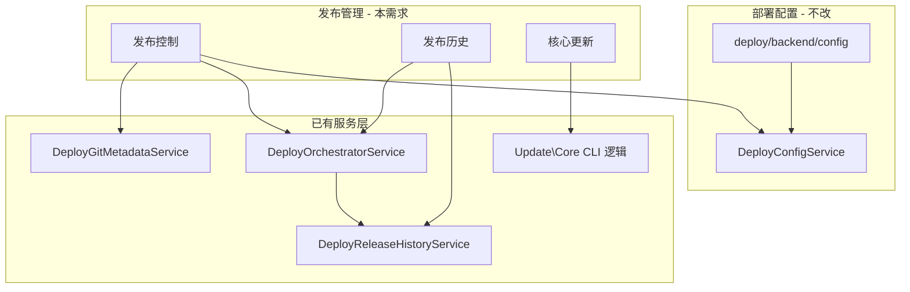

# 发布管理 — 需求说明

> 模块：`Weline_Deploy`
> 状态：需求已确认（可进入开发）
> 关联入口：后台 `系统管理 > 系统维护`
> 背景：将现有独立的「发布历史」菜单升级为「发布管理」分组，把**项目发布**与**核心更新**集中到同一工作台，供开发者日常发布与回滚使用。

---

## 1. 背景与目标

### 1.1 现状

| 能力 | 现状 | 缺口 |
|------|------|------|
| 菜单 | `部署配置` + `发布历史` 平铺在「系统维护」下 | 无统一「发布管理」分组 |
| 发布历史 | `deploy/backend/release` 只读列表，展示 `DeployRelease` 记录与 `current.json` | **无回滚操作入口** |
| 手动发布 | WLS Panel `WlsDeploy` 有 Manual Plan / Rollback（面向多项目 Profile） | 后台全局菜单**无**面向当前站点的 Git 历史选版发布 |
| 核心更新 | CLI `php bin/w update:core -b <branch>`（别名 `core:update`） | **无 Web 入口** |
| 配置边界 | `DeployOrchestratorService` / `update:core` 已有 Git 与发布编排 | 需明确：**发布管理不得写 env/配置文件** |

### 1.2 目标

1. 后台提供 **「发布管理」** 父菜单，下设三个子页面：**发布控制**、**发布历史**、**核心更新**。
2. 开发者在 Web 端完成：**查看 Git 历史 → 选择 commit/tag → 立即发布**；历史记录可 **回滚**。
3. 选择 **早于当前运行版本** 的 ref 时，必须 **二次确认弹窗**。
4. **核心更新** 提供 `core:update -b <branch>` 的 Web 封装，默认分支读取部署配置 `core_branch_default`。
5. 全流程遵守 **配置保护红线**：不修改 `app/etc/env.php`、`.env`、`dev/deploy/.config` 等项目级配置文件。
6. **正式站** 发布/回滚/核心更新前 **强制整站备份**（业务代码 + 核心代码，便于恢复）；发布过程 **不触碰** `pub/` 与各类生成目录。
7. **Webhook 自动发布** 与 **后台手动发布** 并存，手动发布不受触发模式限制。

### 1.3 非目标（本期不做）

- 不替代「部署配置」页（仓库 URL、Webhook、Token 等仍只在 `deploy/backend/config` 维护）。
- 不合并 WLS Panel 多项目 Profile 全套能力（可复用其服务层，但菜单以单站点/全局 Deploy 配置为准）。
- 不在发布流程中自动改 Cloudflare、数据库、域名购买等业务配置。
- 不提供「批量多环境同时发布」。

---

## 2. 用户与权限

| 角色 | 典型操作 |
|------|----------|
| 超级管理员 / 运维 | 发布控制、回滚、核心更新 |
| 开发 | 查看发布历史、触发发布（若 ACL 允许；正式站同样开放，但有更强备份与确认） |
| 只读 | 仅查看发布历史与当前版本 |

**ACL 建议（草案）**

| 权限标识 | 说明 |
|----------|------|
| `Weline_Deploy::release_management` | 发布管理（父菜单） |
| `Weline_Deploy::release_control` | 发布控制：查看 Git 历史、触发发布 |
| `Weline_Deploy::release_control_run` | 执行发布（POST） |
| `Weline_Deploy::release_history` | 发布历史（继承现有 `deploy_release` 或迁移） |
| `Weline_Deploy::release_history_rollback` | 从历史/当前版本执行回滚 |
| `Weline_Deploy::core_update` | 核心更新：查看状态、执行更新 |
| `Weline_Deploy::core_update_run` | 执行核心更新（POST） |

---

## 3. 信息架构与菜单

```
系统管理
└── 系统维护
    ├── 部署配置          （保持独立，order 70）
    └── 发布管理          （新增父级，order 71）
        ├── 发布控制      deploy/backend/release-control
        ├── 发布历史      deploy/backend/release        （原路由可保留）
        └── 核心更新      deploy/backend/core-update
```

- 父菜单「发布管理」图标建议：`mdi mdi-rocket-launch-outline` 或 `mdi mdi-source-branch-sync`。
- 原「发布历史」顶级菜单项 **下线**，避免重复；旧书签/路由 `deploy/backend/release` **保持兼容**。

---

## 4. 功能需求

### 4.1 发布控制（Release Control）

#### 4.1.1 页面信息

- **当前运行版本**（来自 `var/deploy/current.json` + `DeployReleaseRuntimeService`）：
  - deploy_version、ref 类型（branch/tag/commit）、短 SHA、发布时间、触发方式。
- **项目仓库上下文**（只读，来自「部署配置」已保存项，不在此页编辑）：
  - 仓库地址、默认分支、remote 名称；未配置时展示引导链接到「部署配置」。
- **分支切换**（已确认）：
  - 页面提供 **分支下拉/输入**，可临时切换查看任意远程分支的提交历史（`git fetch` 后 `git log origin/<branch>`）。
  - 默认选中部署配置中的 `project_branch`；切换分支仅影响列表展示，**不写入**部署配置。
- **Git 历史列表**（服务端 `git fetch` + `git log` / `git tag -l`）：
  - 列：时间、短 SHA、作者、说明（subject）、ref 类型（commit / tag）、所属分支、是否 **当前版本**、是否 **比当前更旧**。
  - 支持 Tab 或筛选：**分支提交** / **Tags**。
  - 分页或「加载更多」（默认最近 50 条 commit + 全部 tag 或最近 N 个 tag）。

#### 4.1.2 发布动作

- 每行提供 **「发布」** 按钮（已确认：**任意 commit 均可发布**）：
  - **Tag 行**：使用 `refs/tags/<name>`。
  - **Commit 行**：使用 **detached checkout** 到该 commit SHA（`DeployGitMetadataService::checkoutCommit()`），不要求必须是分支尖端。
  - 发布 ref 写入发布记录：`git_ref_type` 为 `commit` / `tag` / `branch` 之一，并保留完整 SHA。
- 点击发布后：
  1. 服务端 **发布预检**（复用/抽取 WlsDeploy preflight 规则子集）：仓库可达、deploy_root 有效、命令白名单、工作树策略等。
  2. **版本比较**：
     - 若所选 ref 对应 commit **新于或等于** 当前运行 commit → 直接进入发布确认（轻量提示即可）。
     - 若 **早于** 当前运行 commit（或 tag 指向更旧 commit）→ **强制弹窗确认**（见 4.1.3）。
  3. 调用 `DeployOrchestratorService::release()` 完整发布（Git + 后置命令 + 版本戳 + reload），**不**调用配置保存逻辑。
  4. 返回发布结果：release_id、版本、耗时；失败展示 error_message。

#### 4.1.3 旧版本确认弹窗（强制）

当检测到「目标版本早于当前版本」时，使用框架统一确认组件（禁止 `confirm()`），文案需包含：

- 当前版本 vs 目标版本（SHA / tag / 时间）。
- 明确警告：**回退到旧版本可能导致数据迁移、配置或代码不兼容**。
- 要求勾选「我确认要发布到更旧版本」+ 确认按钮。

未勾选不得提交 POST。

#### 4.1.4 与 Webhook 并存（已确认）

- 部署配置中已启用 Webhook / 触发模式（branch / tag / both）时，**后台手动发布始终允许**，二者互不排斥。
- 手动发布 `trigger_type` 记为 `manual`；Webhook 触发仍走现有 `DeployWebhookReleaseService`，不改其逻辑。
- 手动发布 **不校验** Webhook 触发模式与白名单（branch/tag filter）；预检仅覆盖仓库可达、deploy_root、命令策略等安全项。

#### 4.1.5 约束

- **只读 Git 元数据 + 发布编排**；不写入 `DeployConfigService::saveSettings()`。
- 不修改 `app/etc/env.php`、`.env`、`dev/deploy/.config`。
- 发布使用的仓库凭据仅来自已保存的「部署配置」，不在此页录入 Token（避免误提交到错误存储）。
- **发布过程不触碰**（已确认，见 §6.2）：`pub/`、`var/generated/`、`var/cache/`、`var/session/`、`var/log/` 等生成/静态发布目录；Git 检出后须恢复或跳过这些路径的变更。

---

### 4.2 发布历史（Release History）

在现有 `Release/index.phtml` 基础上增强。

#### 4.2.1 保留能力

- 当前版本摘要卡片。
- 发布记录表：时间、版本、类型、触发、状态、耗时、commit、错误信息。
- 数据来源：`DeployReleaseHistoryService::getRecent()`。

#### 4.2.2 新增：回滚

- 对 **status=success** 且 **非当前** 的历史记录，提供 **「回滚到此版本」**。
- 对 **当前版本** 不提供回滚（或 disabled）。
- 回滚实现：调用已有 `DeployOrchestratorService::rollback()`，传入该记录的 `git_ref` / `git_commit` / `git_tag`（需规范化为 rollback ref）。
- 回滚前弹窗确认（同 4.1.3 级别警告）；回滚到更旧版本同样适用「旧版本确认」规则。
- 回滚成功后刷新列表与当前版本卡片；写入新的 `DeployRelease` 记录（trigger_type=`rollback`）。

#### 4.2.3 可选增强（建议一期）

- 行内展示完整 ref、发布 ID，支持「立即复制」。
- 失败记录支持「查看详情」展开（已有 error_message 行可保留）。

---

### 4.3 核心更新（Core Update）

Web 封装 CLI：`php bin/w update:core -b <branch>`（`core:update` 别名）。

#### 4.3.1 页面信息

- **核心仓库**（只读）：来自部署配置 `core_repo_url`、`core_branch_default`；未配置时展示默认 Gitee/GitHub 官网仓库说明。
- **当前核心同步状态**（可选）：上次更新分支、短 SHA（若 CLI 或状态文件可读取）、`CORE_UPDATE_PROTECTED_PATHS` 提示。
- **分支选择**（已确认）：默认读取部署配置 **`core_branch_default`**；未配置时回退 `dev`（与 CLI 行为一致）。允许下拉/输入其他分支，与 CLI `-b` 一致。
- **保护说明**（静态文案）：明确列出不会覆盖的文件：
  - `app/etc/env.php`、`.env`、`dev/deploy/.config`
  - 以及 `app/code/Aiweline`、`app/code/WeShop` 等业务模块目录（与 `Update\Core` 常量一致）。

#### 4.3.2 执行动作

- 按钮：**「开始核心更新」** → 确认弹窗 → POST 异步或同步执行 `Update\Core` 等价逻辑。
- 执行范围：复用 CLI 的 `CORE_UPDATE_PATHS`（`app`、`bin`、`pub`、`setup`、`dev`）增量同步；**不**跑项目 `deploy:release` 全量 Git 拉取。
- 正式站执行前同样触发 §4.4 整站备份；核心更新自身仍受 `CORE_UPDATE_PROTECTED_PATHS` 保护，不覆盖 env/部署配置/业务模块。
- 完成后建议自动 `server:reload`（若 CLI 已有则保持一致）。
- 展示日志摘要：更新/跳过/新增文件数、耗时、错误（若有）。

#### 4.3.3 约束

- **不得**通过核心更新写入 env、部署配置、业务模块。
- 与「发布控制」分离：核心更新 **不** 改变 `var/deploy/current.json` 的项目发布版本（除非现有 CLI 已耦合——实现时需保持「项目发布版本」与「核心代码同步」概念分离）。

---

### 4.4 正式站整站备份（已确认）

#### 4.4.1 适用范围

- **正式站**（生产环境）在执行以下操作前 **强制自动备份**，且 **不可** 通过 UI 关闭：
  - 发布控制：发布任意 commit/tag
  - 发布历史：回滚
  - 核心更新：执行 `update:core`
- **非正式站**（pre/dev）：沿用现有 `backup_before_deploy` 配置项；默认可备份，允许关闭。

#### 4.4.2 备份内容

- 备份 **整站业务代码 + 框架核心代码**，便于灾难恢复。
- **包含**：`app/code/**`（业务模块）、`app/etc`（只读打包，恢复时仍不得覆盖当前 env）、`bin`、`setup`、`dev` 等运行所需源码。
- **排除**（减小体积、避免无意义快照）：`.git`、`vendor`、`node_modules`、`var/cache`、`var/session`、`var/log`。
- **可选包含** `pub/` 中用户上传/主题静态资源（若体积分可控）；实现时以「可恢复业务」为优先。
- 备份落盘：`var/backup/deploy/`（复用 `DeployOrchestratorService::backupProject()`，正式站扩展排除规则与元数据 manifest）。

#### 4.4.3 备份元数据

每次备份写入 manifest（JSON），至少包含：

- `backup_id`、`created_at`、`environment`（prod/pre）
- `trigger`（manual_release / rollback / core_update / webhook）
- `git_commit`、`deploy_version`（发布/回滚时）
- `archive_path`、文件大小
- 简短恢复说明链接（文档或页面提示）

#### 4.4.4 与发布的关系

- 备份 **先于** Git checkout / 核心文件同步执行；备份失败则 **中止** 后续发布（正式站硬性要求）。
- 备份 **不替代** 配置保护：恢复流程也 **不得** 自动覆盖 `env.php` / `.env` / `dev/deploy/.config`。

---

## 5. 与现有系统的关系



| 能力 | 复用 | 说明 |
|------|------|------|
| 完整发布 | `DeployOrchestratorService::release()` | 发布控制主路径 |
| 回滚 | `DeployOrchestratorService::rollback()` | 发布历史回滚 |
| Git 操作 | `DeployGitMetadataService` | fetch/checkout/日志 |
| 发布记录 | `DeployRelease` + HistoryService | 历史页与版本比较 |
| 核心更新 | `Weline\Deploy\Console\Update\Core` | 抽 Service 供 Web 调用 |
| 预检 | `DeployProjectProfileService::buildPanelPreflight` 子集 | 发布前静态检查 |
| WLS Panel | `WlsDeploy` Manual Plan / Rollback | 多项目场景保留，不删除 |

---

## 6. 配置与数据保护（红线）

以下文件/存储 **发布管理与核心更新均不得写入**：

| 路径 | 说明 |
|------|------|
| `app/etc/env.php` | 项目环境配置 |
| 项目根 `.env` / `app/.env` | 环境变量 |
| `dev/deploy/.config` | 部署文件配置 |
| 后台 `DeployConfigService` 密钥字段 | 除非用户明确在「部署配置」页保存 |

允许写入/更新的运行时数据（现有行为）：

- `var/deploy/current.json`（发布/回滚版本戳）
- `var/deploy/releases` 或 DB 中 `DeployRelease` 记录
- `var/backup/deploy/`（正式站强制整站备份归档）
- Git 工作树内**项目仓库**代码（发布控制，受 §6.2 目录保护约束）
- 核心目录文件（核心更新，受 `CORE_UPDATE_PROTECTED_PATHS` 约束）

### 6.2 发布过程不触碰目录（已确认）

项目发布（`deploy:release` / 发布控制 / 回滚）在 Git 更新后，以下路径 **不得被检出覆盖或删除**：

| 路径 | 说明 |
|------|------|
| `pub/` | 静态资源、上传文件、主题编译产物发布目录 |
| `var/generated/` | 框架生成代码 |
| `var/cache/` | 运行时缓存 |
| `var/session/` | 会话数据 |
| `var/log/` | 日志 |

实现建议：Git checkout 前对上述路径做快照或 `git update-index --skip-worktree` / 检出后从备份还原；与配置保护并列执行。

---

## 7. 版本比较规则（草案）

1. 读取当前运行 commit：`var/deploy/current.json` 的 `git_commit`（完整 SHA）；缺失时回退 `git rev-parse HEAD`。
2. 目标 ref 解析为 commit SHA（`git rev-parse <ref>`）。
3. 比较：
   - `target == current` → 提示「已是当前版本」，默认禁止重复发布（可允许「强制重新发布」作为二期）。
   - `git merge-base --is-ancestor target current` 为真 → 目标更旧 → **强制旧版确认弹窗**。
   - 否则视为前进发布 → 普通过确认。

Tag 发布：比较 tag 指向的 commit 与当前 commit，不按 tag 名字符串比较。

---

## 8. 接口草案（后台路由）

| 方法 | 路由 | 说明 |
|------|------|------|
| GET | `deploy/backend/release-control` | 发布控制页 |
| GET | `deploy/backend/release-control/branches` | 远程分支列表（供切换） |
| GET | `deploy/backend/release-control/commits` | 指定分支 commit 列表（分页） |
| GET | `deploy/backend/release-control/tags` | Tag 列表 |
| POST | `deploy/backend/release-control/preview` | 预检 + 版本比较（返回是否需旧版确认） |
| POST | `deploy/backend/release-control/run` | 执行发布（body 含 `ref`、`ref_type`、`branch?`） |
| GET | `deploy/backend/release` | 发布历史（现有） |
| POST | `deploy/backend/release/rollback` | 按历史记录回滚 |
| GET | `deploy/backend/core-update` | 核心更新页 |
| POST | `deploy/backend/core-update/run` | 执行核心更新 |

所有 POST 需 CSRF/后台表单校验 + ACL + 确认参数（如 `confirm_release=1`、`confirm_older_version=1`）。

---

## 9. 交互与体验

- 暗色模式：延续部署配置页 `--backend-color-*` 变量，避免白底代码块。
- 可复制：Webhook/版本/命令类字段提供「立即复制」。
- 长任务：发布/核心更新超过 3s 显示进度或「执行中」状态，防止重复点击。
- 错误：Git 凭据失败、fetch 失败、预检 danger —— 明确提示去「部署配置」检查 Token/仓库。

---

## 10. 验收标准

### 10.1 菜单

- [ ] 「系统维护」下出现「发布管理」父菜单及三个子项。
- [ ] 原顶级「发布历史」菜单不再重复出现。
- [ ] `deploy/backend/release` 旧链接仍可访问。

### 10.2 发布控制

- [ ] 可切换远程分支并加载该分支 commit 列表。
- [ ] 能展示 tag 列表；**任意历史 commit** 可 detached 发布。
- [ ] 选择较新 commit/tag 可成功发布并更新 `current.json`。
- [ ] 选择较旧 commit/tag 时必须二次确认后才能发布。
- [ ] 发布过程不修改 `env.php` / `.env` / `dev/deploy/.config`。
- [ ] 发布过程不覆盖 `pub/`、`var/generated/` 等生成目录。
- [ ] Webhook 已配置时，后台手动发布仍可用（`trigger_type=manual`）。

### 10.3 发布历史

- [ ] 成功记录可「回滚到此版本」。
- [ ] 回滚后当前版本卡片与列表更新，且产生 rollback 类型记录。

### 10.4 核心更新

- [ ] Web 端默认分支读取 `core_branch_default`，可改选其他分支。
- [ ] 执行与 `update:core -b <branch>` 等价的更新。
- [ ] 受保护文件不被覆盖；页面展示跳过/保护说明。
- [ ] 更新后 WLS 可 reload，站点可访问。

### 10.5 正式站备份

- [ ] 正式站发布/回滚/核心更新前自动整站备份，备份失败则中止操作。
- [ ] 备份 manifest 可查询（路径、时间、触发类型、关联版本）。
- [ ] 非正式站仍尊重 `backup_before_deploy` 开关。

### 10.6 安全

- [ ] 无权限用户无法 POST 发布/回滚/核心更新。
- [ ] 未确认旧版本时服务端拒绝发布（不仅前端拦截）。

---

## 11. 实施建议（分期）

### Phase 1（MVP）

- 菜单调整 + 发布历史回滚。
- 发布控制：分支切换 + 任意 commit/tag 发布 + 旧版确认弹窗 + 生成目录保护。
- 正式站强制整站备份（扩展 `backupProject`）。
- 核心更新 Web 页（默认 `core_branch_default`，日志回显）。
- 手动发布与 Webhook 并存。

### Phase 2

- 发布预检卡片、与 WLS Profile 上下文打通（多项目）。
- 备份列表 UI、一键下载/恢复指引。
- 核心更新历史记录。
- 发布控制「强制重新发布当前版本」。

---

## 12. 已确认决策（2026-07-08）

| # | 问题 | 决策 |
|---|------|------|
| 1 | Git 历史数据源 | **可切换分支**查看任意远程分支提交历史，不写入部署配置 |
| 2 | 发布粒度 | **任意 commit** 均可发布（detached checkout）；tag 照常 |
| 3 | 核心更新默认分支 | 读取部署配置 **`core_branch_default`**，未配置回退 `dev` |
| 4 | 正式站权限 | **正式站开放**发布管理；操作前 **强制整站备份**（业务+核心，便于恢复）；发布 **不碰** `pub/` 与生成目录 |
| 5 | 与 Webhook 关系 | **Webhook 与手动发布并存**；已配 Hook 也可在后台手动切版部署，不受触发模式限制 |

---

## 13. 参考实现位置

| 文件 | 用途 |
|------|------|
| `app/code/Weline/Deploy/etc/backend/menu.xml` | 菜单 |
| `app/code/Weline/Deploy/Controller/Backend/Release.php` | 现有发布历史 |
| `app/code/Weline/Deploy/Service/DeployOrchestratorService.php` | release / rollback |
| `app/code/Weline/Deploy/Console/Update/Core.php` | 核心更新 CLI |
| `app/code/Weline/Deploy/Controller/Backend/WlsDeploy.php` | Manual Plan / Rollback 参考 |
| `app/code/Weline/Deploy/doc/backend-config.md` | 部署配置（与发布管理分工） |
