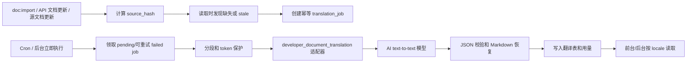

# DeveloperWorkspace 文档多语言 AI 翻译架构方案

## 目标

在 `Weline_DeveloperWorkspace` 内建设文档多语言读取、AI 翻译调度、后台配置、适配器选择、用量概览和生产级状态管理。源文档以模块 `doc` 文件为事实源；`developer_workspace_document` 维护主库索引、文件映射和搜索缓存；翻译结果只写入用户当前主库，不回写模块源码。

## 核心边界

- 源语言默认 `zh_Hans_CN`。
- `developer_workspace_document` 保存源文档索引、文件映射和搜索缓存，不混入多语言副本。
- 普通文档、API 文档、目录树分别进入文档翻译表、目录翻译表、翻译任务表。
- 前台和后台读取都接收 `locale`，缺失译文时 fallback 源文档，并返回翻译状态。
- 页面请求链只负责读取、轻量入队和展示状态，不同步调用 AI。

## 数据模型

- `developer_workspace_document_translation`
  - `source_document_id + locale` 唯一。
  - 保存标题、摘要、正文、源 hash、状态、人工覆盖、错误信息、翻译时间。
- `developer_workspace_document_catalog_translation`
  - `catalog_id + locale` 唯一。
  - 保存目录名、描述、源 hash、状态、人工覆盖、错误信息、翻译时间。
- `developer_workspace_document_translation_job`
  - `target_type + target_id + locale + source_hash` 幂等。
  - 保存状态、重试、锁、模型、AI request id、token、成本、错误信息。

## AI 适配器

专用适配器代码为 `developer_document_translation`，位于：

`app/code/Weline/DeveloperWorkspace/extends/module/Weline_Ai/Adapter/DocumentTranslationAdapter.php`

适配器职责：

- 只支持 text-to-text 模型。
- 固定提示词约束 Markdown 翻译边界。
- 不翻译代码块、inline code、URL、类名、方法名、配置键、JSON/XML/YAML 结构。
- 行注释和块注释允许翻译，但保持缩进、注释符号和代码结构。
- AI 响应必须是 JSON：`{"segments":[{"id":"...","text":"..."}]}`。
- 响应进入 JSON 校验和字段白名单，禁止额外解释性文本。

## 分段与保护

`MarkdownTranslationSegmenter` 负责翻译前后的安全处理：

- Markdown 按字段和段落切分为 segment。
- 代码块整体不翻译，仅提取注释文本作为可翻译 segment。
- inline code、URL、类名、方法名、配置键等进入 protected token。
- AI 返回后按 segment id 回填，再恢复 protected token。
- 恢复后的 Markdown 仍按不可信 AI 输出处理，进入现有 Markdown/HTML 安全链。

## 后台配置

菜单入口：

- `开发文档 > 文档管理配置`
- `系统管理 > 系统配置 > 文档管理配置`

配置项：

- 源语言。
- 支持语言和每个语言是否启用 AI 自动补齐。
- 翻译范围：普通文档、API 文档、目录树。
- 场景适配器状态。
- text-to-text 模型选择。
- 批量大小、最大重试、fallback 策略、单文档 token 上限、每日/月 token 上限。
- 任务状态、最近错误、token 和成本概览。

模型绑定写入 `ai_scenario_adapter.model_bindings` 和 `default_model`，业务配置不重复保存模型。

## 运行流程

## 状态语义

- `missing`：目标语言译文不存在。
- `pending`：任务已入队。
- `translating`：任务执行中。
- `translated`：译文可用。
- `stale`：源 hash 已变化，旧译文继续可读，后台异步重译。
- `failed`：翻译失败。
- `blocked_config`：配置、额度、模型或 Provider 阻塞。
- `disabled`：AI 翻译关闭。

## 生产控制

- 配置保存和任务执行前校验适配器、模型、Provider 账号和额度。
- 任务按 `target_type + target_id + locale + source_hash` 幂等。
- 执行任务加 `locked_at + locked_by`，超时后允许抢占。
- 网络、限流、临时 Provider 错误可重试。
- 格式校验失败、语言不支持、配置缺失归类为失败或配置阻塞。
- 记录 `model_code`、`ai_request_id`、prompt tokens、completion tokens、total tokens、估算/实际成本，并通过 `ai_provider_usage_record.request_id` 关联。

## 读取策略

- 前台文档页、后台文档页、目录树、列表、详情、搜索均支持 `locale`。
- 非源语言无译文或译文不可用时 fallback 源文档。
- 源 hash 变化时标记 `stale`，旧译文继续展示，并异步入队新任务。
- 人工编辑译文后设置 `is_manual_override=1`，默认不被自动翻译覆盖；后台强制重译除外。
- 搜索同时查源文档和目标语言译文，结果去重。
- 缓存按 locale 隔离。

## 验收标准

- 清空文档相关数据库数据后执行 `doc:import`，重复执行不会产生重复源文档。
- 后台配置中文和英文两个语言，启用英文 AI 翻译，选择 `developer_document_translation` 和 text-to-text 模型。
- 适配器测试样例包含 Markdown 标题、表格、代码块、行注释、块注释、inline code、URL，代码不翻译、注释可翻译、格式不破坏。
- 定时任务或后台立即执行后，英文任务完成，失败和阻塞状态可见，token/成本概览有记录。
- 前台切换中文/英文后，目录树、列表、详情、搜索跟随语言读取；英文缺失时 fallback 中文并显示状态。
- 后台文档页切换语言不阻塞 AI；已有译文直接展示，缺失译文显示 fallback 和状态。
- 修改源文档或 API 文档后，目标语言标记 `stale`，旧译文仍可读，新任务完成后切换到新译文。

## 前置修复

后台文档管理页 JS 不再在字符串拼接内直接使用 `@admin-url(...)`，而是先渲染 JS URL 常量，再通过 JS 拼接 `id` 参数，避免模板解析导致 500。
## Large Document Batching

- `developer_document_translation` remains the JSON segment protocol boundary: each AI call receives only the current batch of segments and must return the same ids.
- `DocumentTranslationTaskService` resolves the selected text-to-text model capacity from `ai_model.max_tokens`, `config.context_window`, `provider_config.context_window`, and capability metadata.
- `max_document_tokens` is treated as a per-request safety ceiling, not a whole-document hard failure. A large document is split into multiple AI calls and assembled in memory before writing the final translation row.
- Oversized single segments are split into `segment_id__part_N` subsegments. After AI returns all parts, the service restores the original `segment_id` by joining parts in order.
- Each chunk uses a dedicated `request_id` suffix such as `_c001`; the job stores the base request id and aggregates all matching `ai_provider_usage_record` rows for prompt tokens, completion tokens, total tokens, and actual cost.

## Adapter Response Hardening

- The adapter prompt now states that the whole response is consumed by a JSON parser and any non-JSON character fails the task.
- The required schema is constrained to exactly `{"segments":[{"id":"same input id","text":"translated text"}]}` with no markdown fence, prose, extra keys, renamed ids, merged ids, or missing ids.
- The response parser still enforces the final `segments` protocol, but tolerates common model wrapper mistakes before normalization: markdown fenced JSON, prose before/after JSON, root arrays, `data/result/output/response.segments`, `translations/items`, and text aliases such as `translation`, `translated_text`, `content`, or `value`.
- Format-contract failures are retryable and capped by the existing job retry limit. `doc:translate retry` can reset historical format failures after the adapter has been improved.
