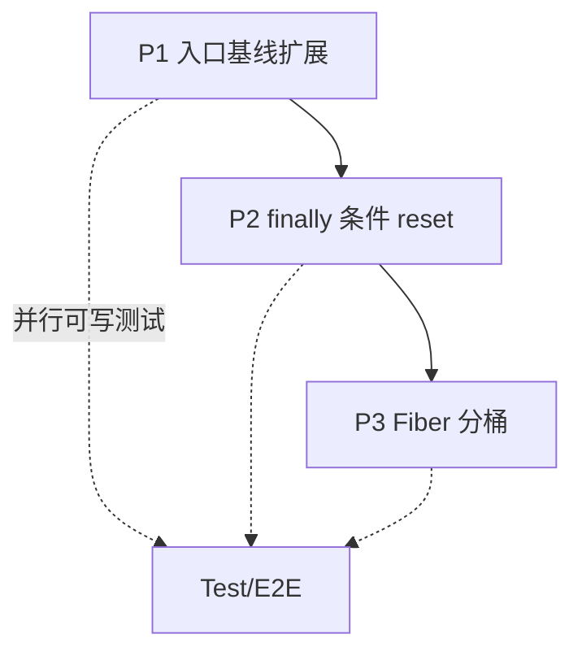

# WLS Fiber × StateManager 阶段 B 实现记录（修订版）

> 目标：在「多请求 Fiber 并发 + 挂起（SSE/yield）」下，避免 `StateManager::reset()` 与挂起 Fiber 的全局状态冲突，同时保证**下一新请求**不因省略 reset 而串会话/模板。  
> 前置：阶段 A 已落地（`WlsFiberContext` 扩展快照、`syncFromServer`、`WlsConcurrency` 计数、`StateManager::reset($omit)` 能力）。

**终态（2026-08-09）：P1、P2、P3 均已编码并验收。** 本文保留原方案推演，用于解释实现选择；状态以本节和代码为准。

**已编码（P1+P2+P3）**

- `StateManager::runWlsPersistentRequestEntryBaseline()`：每个 WLS 新请求在 `emulate` 之后执行，覆盖原分散在 `WlsRuntime` 的 Result/Template/Response 及与下列 omit 名对应的 OM 清理。
- `WlsConcurrency::callbackNamesOmittableWithPeerFibers()`：返回与入口基线对齐的 reset 回调名；当 `getOtherSuspendedRequestFiberCount() > 0` 时，`WlsRuntime::reset()` 对 `StateManager::reset($omit)` 传入该列表。**不省略** `session_*`、`sse_context`、`request_context`、`db_connection_cleanup`、`request_instance` 等。
- `SessionFactory`：Session/AuthSession 使用 `WeakMap<Fiber, RequestScope>`；当前请求 reset 和显式目标 Fiber cleanup 均不触碰同伴 Fiber。
- `SessionRequestState`：shutdown 待落盘队列及请求级日志计数按 Fiber 隔离；无 Fiber 的 CLI/FPM 路径保留 main state。
- Worker 请求 leave：在 RequestContext 清理前精确 reset 当前 Fiber 的 Session scope；异常和取消路径使用同一边界。

---

## 1. 问题重述

- `WlsRuntime::handle()` 的 `finally` 在**当前 Fiber 结束**时调用完整 `StateManager::reset()`，语义等价 FPM「请求结束」。
- 若此时仍存在**其它挂起 Fiber**（`WlsConcurrency::getOtherSuspendedRequestFiberCount() > 0`），reset 中部分回调会清掉进程级单槽（SessionFactory、Template、SseContext 等），与「挂起 Fiber 仍应继续」矛盾。
- 若**简单省略**完整 reset：下一**新进入**的 `handle()` 会继承上一请求的 Template/Session 工厂缓存等 → **串味**。

因此阶段 B 必须同时满足：

1. **挂起 Fiber resume 时**：其依赖的上下文可通过 `WlsFiberContext::restore()` 或与之一致的机制恢复。  
2. **任意新 Fiber 开始 `handle()` 时**：获得与 FPM 等价的「干净请求基线」（至少对 Session/Template/Response/Result 等已注册项）。

---

## 2. 方案对比（选型）

| 方案 | 做法 | 优点 | 缺点 |
|------|------|------|------|
| **B1a 延迟全局 reset** | 仅当 `count(activeFibers)==0` 且无运行中请求 Fiber 时跑完整 reset；中间用「新请求入口强化清理」补洞 | 语义清晰 | 需严格定义「运行中」与 Worker 协作；内存里可能短期堆积 |
| **B1b 按 Fiber 分桶状态** | SessionFactory / Template / 等按 `Fiber` 或 `connId` 分桶，reset 只清「当前结束 Fiber」桶 | 长期最干净 | 改动面大，需改工厂与所有取单例路径 |
| **B2 扩大快照** | `capture()` 反射/序列化更多静态与 OM 实例 | 局部补丁快 | 易漏回调、维护成本高、性能与引用循环风险 |

**推荐路线**：**B1b 为终态**；**中期用 B1a + 入口白名单清理** 过渡（与现有 `WlsRuntime` 入口已加的 `ResultManager`/`Template`/`Response` 清理对齐并扩展）。

---

## 3. 推荐落地顺序（三期）

### 三期总览


```mermaid
flowchart TB
  P1[P1 入口基线扩展] --> P2[P2 finally 条件 reset]
  P2 --> P3[P3 Fiber 分桶]
  P1 -.->|并行可写测试| T[Test/E2E]
  P2 -.-> T
  P3 -.-> T
```

### P1 — 新请求入口「基线清理」（低风险，先做）

**位置**：`WlsRuntime::handle()` 在 `globalsEmulator->emulate($request)` 之后、业务逻辑之前（与现有 `Request::clearStaticUrlPathCache` 同一段）。

**原则**：只做「**下一请求绝不能继承**」的项，且**不依赖**「上一请求 Fiber 已结束」的全局 reset。

**建议扩展清单（逐项评审后加）**：

- 已做：`ResultManager::resetRequestState()`、`Template::resetInstance` + `removeInstance(Template)`、`removeInstance(Response)`。
- 候选：
  - `ObjectManager::removeInstance` 其它**明确请求级**且已在 `StateManager` reset 回调中的类（按模块逐步加，避免误删进程级单例）。
  - `HeaderCollector`：**不在入口全量 reset**（避免与挂起响应抢头）；仍在 `finally` + snapshot 路径处理。
  - 对 `ProcessUrlCache` / Acl 缓存：**保持**现有入口清理。

**验收**：单测「模拟 Fiber1 挂起 → Fiber2 新请求」下，`Template`/`Result`/`Response` 无上一请求残留。

### P2 — `finally` 条件式 `StateManager::reset`（中风险）

**协作数据**（已有 `WlsConcurrency`）：

- `getOtherSuspendedRequestFiberCount()`：当前**挂起**在 `activeFibers` 内的其它请求数。
- **缺口**：「当前是否还有**同步执行中**的另一请求 Fiber」— 同一 Worker 内通常**不会**两个 Fiber 同时跑在 `handle()` 栈上（协作式），但为严谨可增加：
  - `WlsConcurrency::setActiveHandleDepthProvider(callable(): int)` 或由 Worker 在 `requestFiber->start()` 前后维护 `int $requestHandleDepth`。

**策略 A（保守）**：  
- 若 `otherSuspended > 0`：**不调用**完整 `StateManager::reset()`，改为调用 `StateManager::reset($omit, $skipHeader)`，omit 列表仅包含**已证明对挂起 Fiber 无害**且**已由 P1 入口兜底**的回调（初期可为空，与现状一致）。  
- 若 `otherSuspended == 0`：完整 `reset()`。

**策略 B（激进，需 P1 足够厚）**：  
- `otherSuspended > 0` 时 **完全跳过** `StateManager::reset()`，仅靠 P1 + `WlsFiberContext::restore()`。  
- **必须**有 E2E：SSE 挂起 + 并发短请求 + 再开新标签页请求，覆盖 Session 登录态。

**建议**：先 **策略 A + omit 白名单逐步扩大**，监控无回归后再试策略 B。

**omit 白名单设计**（名称与 `StateManager::registerFrameworkResets` 中 `registerResetCallback` 的 **name** 一致）：

1. 建立表：`callback_name | 省略时风险 | P1 是否覆盖 | 可否 omit`  
2. 仅将 `可否 omit = 是` 的加入 `WlsConcurrency::callbackNamesOmittableWithPeerFibers()`（替换当前空数组）。  
3. 单元测试：`StateManagerResetOmitTest` 风格 + 集成测试挂起场景。

**与 `Session::flushRequestSessions()`**：仍在 `finally` **先于** reset 执行；若将来按 Fiber 分 Session 队列，再改为「只 flush 当前 Fiber 注册的 Session」。

### P3 — SessionFactory / Template 等 **Fiber 分桶**（已完成）

**SessionFactory**：

- `sessionInstance` / `authSessionInstances` 已从进程单槽改为 `WeakMap<Fiber, RequestScope>`；无 Fiber（CLI/FPM）走原 main state。
- `createSession()` / `createAuthenticatedSession()` 按 `Fiber::getCurrent()` 取桶，同一 Fiber 内保持实例稳定。
- `resetRequestInstances()` 只 flush/reset 当前 Fiber；`clearRequestInstancesForFiber()` 可精确丢弃已终止目标 Fiber 的桶。
- `SessionRequestState` 同步隔离 shutdown queue 与请求日志计数，避免只修 Factory 后仍发生跨 Fiber flush。

**Template / State / Response**：

- 优先继续 **OM removeInstance + resetInstance**；若仍有静态残留，再考虑分桶或强制 `registerStaticReset`。

**验收结果（2026-08-09）**：

- 单元：Session Fiber 隔离 6 tests / 20 assertions；1000 个短生命周期 Fiber 后 Factory/Session WeakMap 桶均为 0。
- Runtime：主矩阵 82 tests / 327 assertions、旧 Session 路径 32 tests / 53 assertions，均通过。
- 真实 WLS：唯一实例端口 19685、单 Worker；实际 Fiber 路径 2000/2000，SSE 挂起期间 200/200，双 Session 累计 2200 请求 `mismatch=0`。
- 内存：Session Server 两阶段保持 43200 KiB；Worker 在第二阶段由 164976 KiB 回落至 163472 KiB，无线性爬升。

### P3.1 — ObjectManager / w_obj 对象生命周期规则

- `w_obj()` API 不变，继续是 `ObjectManager::getInstance()` 包装；在 WLS 持久模式下，共享实例桶由 `ObjectManager` 按当前 `Fiber` 隔离。
- 请求响应构建完成后，`WlsRuntime::reset()` 在 `StateManager::reset()` 与 reset event 完成之后调用 `ObjectManager::clearCurrentFiberInstances()`，只释放当前请求 Fiber 的 normal/origin 实例桶。
- 该清理不触碰进程级实例，也不清理反射、解析类名、构造参数等 metadata 缓存；内存压力清理由 `WorkerResponseMemoryGuard::compact()` 处理可重建缓存。
- `new` 允许用于短生命周期值对象、DTO、局部临时对象和测试夹具。
- 服务对象优先构造注入或 `w_obj()`；需要明确新实例时使用 `ObjectManager::make()` 或 `ObjectManager::getInstance(..., shared: false)`。
- Model/Controller/Observer/Request/Response/Session 等请求态对象禁止依赖进程级缓存复用；新增 WLS 敏感路径时必须审计是否会跨请求残留。
- 不做全仓批量替换 direct `new`。只在 WLS 请求态、长连接、后台任务、全局缓存写入等敏感路径逐个审计和修改。

---

## 4. Worker / Runtime 边界（接口草案）

```php
// Framework（已实现部分）
WlsConcurrency::setOtherSuspendedFiberCountProvider(callable(): int $f);
WlsConcurrency::getOtherSuspendedRequestFiberCount(): int;

// 建议新增（P2）
WlsConcurrency::setActiveRequestHandleDepthProvider(?callable $f): void;
WlsConcurrency::getActiveRequestHandleDepth(): int;

// WlsRuntime::reset() / finally 伪代码
$peers = WlsConcurrency::getOtherSuspendedRequestFiberCount();
$omit = ($peers > 0) ? WlsConcurrency::callbackNamesOmittableWithPeerFibers() : null;
StateManager::reset($omit, false);
```

Worker 注册：

- `otherSuspended`：已有 `count($activeFibers)`。  
- `handleDepth`：`$handleDepth++` 在 `Fiber` 内调用 `handleRequest` 入口；`finally` 在 Worker 包一层计数（需避免重复计数，建议只在 `handleRequest` 最外层一对）。

---

## 5. 测试矩阵（最小集）

| 场景 | 预期 |
|------|------|
| 仅短请求 A、B 串行 | 与现网一致，完整 reset |
| SSE Fiber 挂起 + 短请求 B | B 不污染 A 的 `$_SERVER`/WELINE；A resume 后 SSE 仍可写 |
| 挂起期间 `StateManager` 部分 omit | 无 Template/Result 串页；Session 登录态正确 |
| 维护模式 / Dispatcher | 与阶段 B 正交，单独回归 |

---

## 6. 不建议做的事

- 在未做 P1/P3 前 **整段跳过** `session_instances`：下一请求极易拿到上一请求的 Session 实例。  
- 在 `WlsFiberContext` 内反射快照 **整个** `ObjectManager`：成本、循环引用与版本维护不可控。

---

## 7. 任务状态

1. **文档评审**：`COMPLETED/ACCEPTED`，P2 使用入口基线 + 精确 omit 白名单。
2. **P1**：`COMPLETED/ACCEPTED`，入口基线与单测已存在。
3. **P2**：`COMPLETED/ACCEPTED`，omit 白名单、失败聚合与 Worker quarantine 已验收。
4. **P3**：`COMPLETED/ACCEPTED`，SessionFactory/Session 请求状态 Fiber 分桶及真实 WLS 有界压力已通过。
5. **并发验收**：`COMPLETED/ACCEPTED`，PHP live harness 覆盖 SSE + 并发 HTTP + 双 Session；本轮 Playwright runner 未安装，因此没有伪造新的 Browser 结果，沿用 2026-07-24 已接受的 Browser 基线。

30 分钟 N=50/200/500 混合长稳态及至少 100 万请求属于极致性能总计划的剩余性能验收，不再是 P3 功能隔离代码的关闭阻塞项。

---

*本文档已从方案草案更新为实现记录；请勿与已冻结的产品需求文档混用。*
