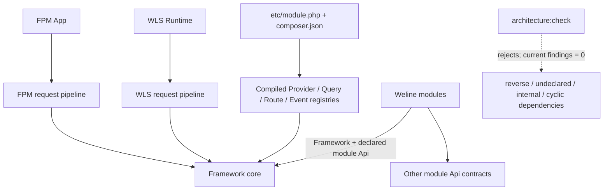

# 当前架构、历史缺陷与剩余设计债务

## 当前已落地架构图

## 历史缺陷与当前设计债务

1. 历史代码曾同时存在 Framework 反向依赖、未声明边、跨模块内部类引用和实际依赖环；当前静态架构门禁已经清零，后续重点是用持续门禁和模块隔离启动验证防止回归。
2. FPM/WLS 已共用同一个应用阶段执行器；Transport/Context 建立、WLS 响应格式化与遥测外壳仍由各 Runtime 保留，后续继续收敛为薄适配器。
3. 部分非编译热路径仍可能触发 ObjectManager、反射或兼容扫描。
4. WLS 进程编排的巨型类和多份 Worker Transport 循环仍使平台兼容、TLS 与普通传输的演进成本偏高。

## 已完成的止血项

- 连接池改为严格有界、单一获取 deadline，超时显式失败，不再创建池外连接。
- BinQuery v1 使用集中 Limits 和缓冲分段写入，错误文案与 4MB/2MB 实际限制一致。
- QueryProvider 生成 O(1) 编译索引；PROD/WLS 不再回退到源文件解析。
- `StateManager` 通过 `RequestResetterInterface` 发布清理，模块自己管理请求态。
- Windows 批量启动使用 1–8 条有界 lane，不再因旧分支退化为单 PowerShell lane。
- Framework 对 Server、Theme、Api、Backend、I18n、Websites 等具体模块的反向引用已通过 Provider/Registry 清零。
- FPM/WLS 已统一为 `PreRouteGate → URL → early response → run_before → lazy Session → Router/Controller once → run_after`；所有出口仍由 Runtime finally/RequestResetter 清理。
- WLS 首页由单 owner 共享预热并执行每 Worker 进程热路径；启动保留 READY、`min_ready` 与原子路由快照。
- Dispatcher 已按 HTTP framing 回收完成响应的半关闭连接，修复每请求泄漏一对 socket、约 488 请求后撞上 macOS 1024 FD 上限并持续 503 的故障。
- Dispatcher 的“全 Worker 不可用”只在异步应用健康审计确认后上报具体失败端口，短暂 accept 压力不再直接升级为全池复活风暴。
- WLS 请求结束先执行 Template/模块/Session 作用域清理，最后释放 `RequestContext`；并发 Fiber 不再跳过 request-id 隔离的 Template 清理。这修复了每请求滞留一个 Template、约 1,300 请求后 16 Worker 同时内存排水的故障。
- `RequestLifecycleTrace` 的 enabled 决策、span/紧凑字典、父栈和 request id 已按 Fiber/Context/请求分片；`reset()` 只清当前请求，不会删除仍挂起的 peer Fiber 链路。
- Worker 请求数回收改为可配置基础预算，并按稳定槽位确定性错峰；Windows、macOS、Linux 共用语义，不再使用所有 Worker 相同的 10,000 次硬编码阈值。
- WLS 性能 Trace 改为固定槽位、分级采样和有界 recent 索引；共享状态服务在高/低水位之间主动释放，不再因 Trace 孤儿键、无界 list 或大数组 LRU 导致 OOM。
- Master 在 reload 和周期租约续期前保证 Session/Memory sidecar 存活；维护模式启动不再等待被维护 Dispatcher 隔离的业务池 ACK。

## 当前模块门禁结果

2026-07-12 当前权威扫描覆盖 83 个模块、3,955 个 PHP 文件和 7,169 个 PHP 引用点，结果为：

- `Framework -> Module = 0`
- 未声明模块引用 = `0`
- 实际依赖循环 = `0`
- 跨模块内部 API 引用 = `0`
- 请求可达原生 `sleep/usleep` = `0`
- Composer / module manifest gate = `0`

此前“3,753 个文件、7,073 个引用、176 个跨模块内部 API 引用”是迁移过程中的中间快照，已不代表当前代码。当前结果证明静态边界门禁通过，但不替代每个模块只安装 Framework 与 `requires` 后的独立启动验证，也不替代 Linux/Windows 原生运行、长稳压测及全部性能发布门槛。
