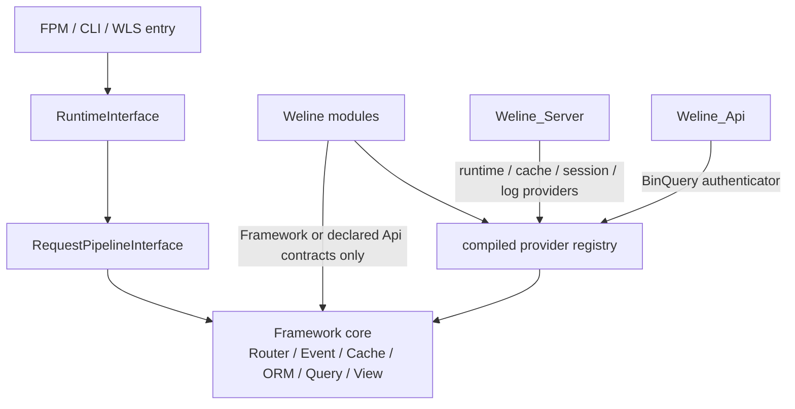
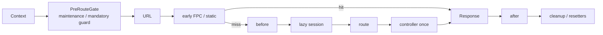

# WelineFramework 2.0 目标架构

## 当前实现状态（2026-07-12）

静态依赖边界已达到目标：当前 `architecture:check` 扫描 83 个模块、3,955 个 PHP 文件和 7,169 个 PHP 引用点，`Framework -> Module`、未声明依赖、实际循环、跨模块内部 API、请求可达原生 `sleep/usleep` 以及 Composer/module manifest gate 均为 0。

该结果只说明本页的依赖方向已有机器门禁保障。编译容器的全热路径替换、Worker Transport 进一步变薄、模块独立启动矩阵、Linux/Windows 原生验证和全部性能预算仍是 2.0 后续验收项，不能据此宣称目标架构已经全部交付。

## 分层和依赖方向

依赖只允许向下：入口依赖 Runtime，Runtime 依赖 Framework 契约，具体模块实现 Provider。Framework 不导入具体模块类。

## 统一请求管线

不变量：

- FPC/static 命中在 Session、Router 和 Controller 之前返回。
- `PreRouteGate` 只允许维护模式等必须早于缓存的强制门禁；普通 `run_before` 在 URL/FPC miss 后执行。
- Controller 每个请求最多执行一次。
- FPM 和 WLS 使用同一阶段接口和响应语义。
- Session 是 lazy 且 request scoped；请求结束清理事务、连接 lease 和请求态。
- 作用域清理顺序固定为：Template/模块/Session/DB resetter 先清理当前 scope，`RequestContext` 最后释放 scope id；并发 Fiber 只能清理自己的 request-id 槽位。
- 遥测只记录通用 Span，Framework/WLS 不再点名业务路径。
- `run_after` 只处理正常路由结果；early response 与异常不执行它，但 Runtime `finally` 和 RequestResetter 对所有出口严格执行一次清理。

## 编译边界

`php bin/w framework:compile` 生成：

- 模块拓扑和 Provider 注册表；
- `generated/framework/container.php` format v1 确定性服务工厂与
  `process/request/fiber/prototype` 生命周期索引；
- QueryProvider 执行定义、最终 descriptor、`provider -> operation` 以及
  `area -> external provider/operation` O(1) 索引；
- 后续阶段的 route、event、hook 和 plugin 索引。

容器 Phase 1 使用显式 `ContainerServiceCatalog`，只在控制面编译时反射构造器；
生成的 Closure 在请求热路径直接构造对象，不扫描目录、不解析源码、
不调用 Reflection 或 ObjectManager。未收录服务在 DEV 可经 ObjectManager
迁移桥解析；PROD/WLS 缺失产物、格式不匹配或服务未编译时必须
fail closed。全局 Provider/Runtime 解析器在切换前仍保持现有路径，避免
Phase 1 将兼容桥误当成已完成的全量迁移。
`reflection:compile` 与 `generated/compiled_factories.php` 是 ObjectManager 旧桥接，
不是 2.0 容器的权威产物；只在未迁移调用点仍需兼容时保留，
最后一个 allowlist 清零后删除，禁止两套工厂同时扩展。

所有 Framework PHP 注册表先在目标同目录写完整临时文件，再由统一
publisher 发布。POSIX 使用同文件系统 `rename` 原子替换；Windows 在独占
编译锁内执行 `target -> backup -> temporary -> target`，第二步失败必须恢复
backup，禁止对已存在 target 原地写入。同一输出目录的编译锁从首个
产物发布保持到整个 `FrameworkCompiler` 会话结束，并在 `finally` 显式释放；
shutdown 只是 fatal 安全网。锁文件尽可能以 close-on-exec 打开，且禁止 fork 子进程
对父 PID 拥有的锁执行 `LOCK_UN`。并发 `framework:compile` 只能有界等待，
超时明确失败。该 Windows 切换协议依赖“编译完成前不创建
Master/Worker”的控制面不变量，不允许在运行中 Worker 内调用。

`server:start` 在重启旧 Master 前使用更强的多文件事务边界：先在
`var/tmp` 私有目录编译完整 generation，对其中的 container 和
runtime-policy provider registry 执行严格预检，并使用不可变的
`generated/hooks.php` 快照生成模板策略。所有预检通过后才持有最终
目录锁提升 5 个注册表，`container.php` 最后切换。任一提升、hash
复核、hooks fence 或最终 container preflight 失败，必须按原始字节
原子恢复全部 5 个文件并逐项验证 SHA-256。编译或策略预检
失败不得修改 live registry，也不得泄露私有 staging 路径。

Phase 1 之后的容器替换清单：

1. 将 App/RequestPipeline/WLS 的 Response、Router、Event 根服务分批改为构造器注入；
2. 将 `RuntimeProviderResolver` 和 `ServiceProviderRegistry` 的实现解析改为编译别名工厂；
3. 将已选中 QueryProvider、Event Observer、Hook/Plugin 执行器改为编译工厂；
4. PROD FPM 和 WLS 都在 `App::init()` 前显式构造容器并验证
   digest，不把第一次请求当预检；WLS Worker 通过 READY v3
   上报 `compiled_container_digest_v1` 和实际 registry digest，Master 只接纳与
   本代启动快照完全一致的 Worker；
5. 全部 Weline 调用点迁移后删除 ObjectManager 编译工厂和动态反射回退。

生产热路径只读不可变编译结果。QueryProvider descriptor 查询不实例化
Provider、不反射 Attribute、不读 Provider PHP 源文件，BinQuery `call/graph/exists`
不遍历全部 Provider。真正执行 operation 时只解析被选中的 Provider 服务。
开发模式可以保留明确的迁移回退，但 PROD/WLS 缺少或遇到旧格式索引时
必须 fail closed 并要求重新执行 `framework:compile`。

## WLS 专项边界

Framework 只提供 Runtime/Pipeline/Resetter 契约。`Weline_Server` 保持 READY、`min_ready`、原子路由快照、首页单 owner 预热、每 Worker 进程热路径命中和 keep-hot 不变量。普通、TLS 和 EventBuffer 只是 Transport Adapter；Windows、macOS、Linux 差异只能出现在 ProcessDriver。

Worker 自主回收不能使用整池相同的请求数或时间阈值。回收预算必须可配置、按槽位确定性错峰，且 Master 保证新 Worker READY/入池后再移除旧 Worker。
