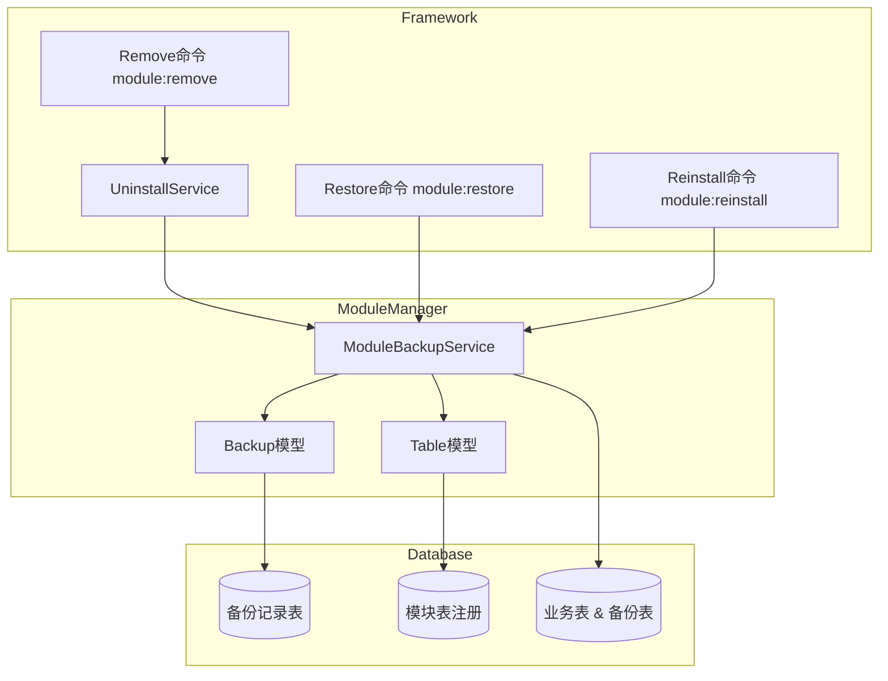

# 模块卸载数据库备份与恢复系统架构

## 设计目标

- **热拔插支持**：模块可安全卸载、回滚、重装，数据库数据可恢复。
- **最小侵入**：对业务模块透明，由 `ModuleManager` 统一管理。
- **可观测**：所有数据库备份有完整的记录表和可查询的元数据。

## 核心组件

- `ModuleBackupService`：模块数据库备份与恢复核心服务。
- `Weline\Framework\Setup\Model\ModuleBackup`：备份记录表模型。
- `Weline\Framework\Setup\Model\ModuleTable`：模块表注册模型，记录模块 → 表名映射。
- `UninstallService`：统一卸载服务，负责文件备份与触发事件。
- `module:remove`：卸载命令，协调卸载流程与数据库备份。
- `module:restore`：恢复命令，从备份记录中恢复数据库表。
- `module:reinstall`：重装命令，支持 `--restore` 选项从卸载备份恢复数据。

## 架构图



## 数据模型

### 1. 模块表注册模型 `ModuleTable`

- `module_name`：模块名，例如 `Weline_Demo`
- `name`：实际表名（通常带前缀），例如 `we_demo_table`
- `model`：对应 Model 类名

### 2. 备份记录模型 `ModuleBackup`

字段：

- `backup_id`：主键
- `module_name`：模块名
- `backup_timestamp`：备份时间戳（`YYYYMMDD_HHMMSS`）
- `backup_date`：备份时间
- `table_count`：备份表数量
- `tables`：JSON，记录每个表的 `original_name` / `backup_name` / `record_count`
- `status`：`active` / `restored` / `deleted`
- `created_at`：创建时间
- `restored_at`：恢复时间

示例 `tables` 字段：

```json
{
  "tables": [
    {
      "original_name": "we_demo_table",
      "backup_name": "we_demo_table_backup_20250127_143000",
      "record_count": 120
    }
  ]
}
```

## 组件交互说明

### 卸载流程（module:remove）

1. 命令 `module:remove` 读取模块列表并确认操作。
2. 如存在 `ModuleBackupService`：
   - 先调用 `backupModuleTables()` 对模块所有表做 **重命名备份**。
3. 之后通过事件触发 `UninstallService::uninstall()`：
   - 进行模块文件备份。
   - 记录卸载步骤并触发 before/after 事件。

### 回滚/恢复流程（module:restore）

1. 命令 `module:restore` 解析模块名与可选的 `--backup=时间戳`。
2. 通过 `ModuleBackupService::restoreModuleTables()`：
   - 查找备份记录（指定时间戳或最新一次）。
   - 删除当前同名表。
   - 将备份表 `ALTER TABLE backup_name RENAME TO original_name`。
3. 将备份记录状态更新为 `restored`。

### 重装流程（module:reinstall --restore）

1. `module:reinstall` 正常执行模块删除、备份（命令内部备份）、重装流程。
2. 如指定 `--restore` 且存在卸载备份：
   - 在模块安装完成后，调用 `ModuleBackupService::restoreModuleTables()`。
   - 用卸载备份表替换当前业务表，实现“带数据的重装”。

## 依赖关系

- `Framework` 依赖 `ModuleManager` 提供的表注册与备份服务。
- `ModuleManager` 依赖数据库连接工厂 `ConnectionFactory`。
- 数据库层只感知表名和 DDL/DML，不感知模块语义。

## 扩展与演进

- 可以进一步为备份表增加批次清理策略（CLI 或后台管理界面）。
- 可在未来接入更细粒度的备份（按列、按数据分区等），与迁移系统集成。


