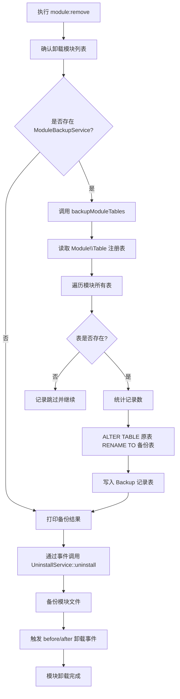
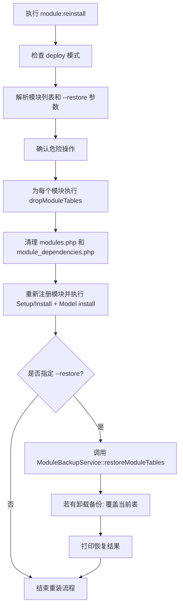
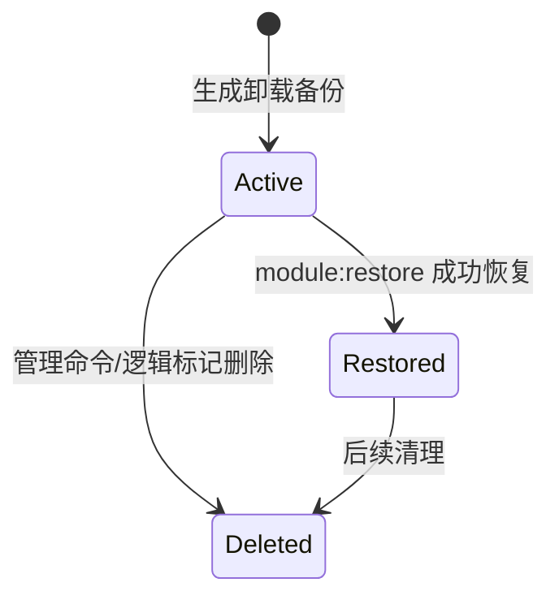

# 模块备份与恢复数据流程图

## 卸载备份流程（module:remove）



## 恢复流程（module:restore）

```mermaid
flowchart TD
    R0[执行 module:restore] --> R1[解析模块名和备份时间戳]
    R1 --> R2[确认危险操作(删除当前表)]
    R2 --> R3[调用 ModuleBackupService::restoreModuleTables]

    R3 --> R4[根据模块名与时间戳查询 Backup 记录]
    R4 --> R5{是否找到备份?}
    R5 -->|否| R6[返回失败信息并结束]
    R5 -->|是| R7[遍历备份记录中的每个表]

    R7 --> R8[DROP TABLE IF EXISTS 原表名]
    R8 --> R9[ALTER TABLE 备份表 RENAME TO 原表名]
    R9 --> R10[打印恢复结果]

    R10 --> R11[更新 Backup 状态为 restored]
    R11 --> R12[返回成功]
```

## 重装并恢复流程（module:reinstall --restore）



## 状态转换图（备份记录）



## 异常与回滚流程

### 1. 备份失败

- 某张表不存在或重命名失败：
  - 在 `ModuleBackupService` 内记录 warning 日志。
  - 跳过该表，继续备份其他表。
- 所有表均未成功备份：
  - 返回 `success = false`。
  - `module:remove` 检测到失败后取消卸载，并输出错误信息。

### 2. 恢复失败

- 某张备份表不存在：
  - 打印 warning，跳过该表。
- RENAME 或 DROP 失败：
  - 记录 error，但继续处理其他表。
- 最终调用者（`module:restore` 或 `module:reinstall --restore`）负责汇总结果并输出。


