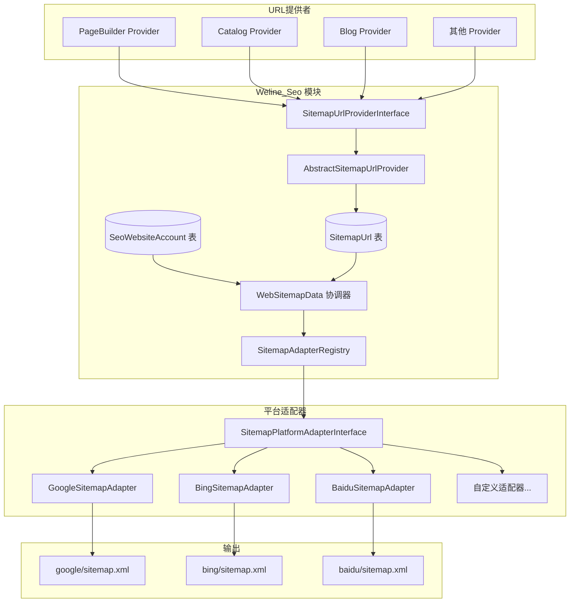
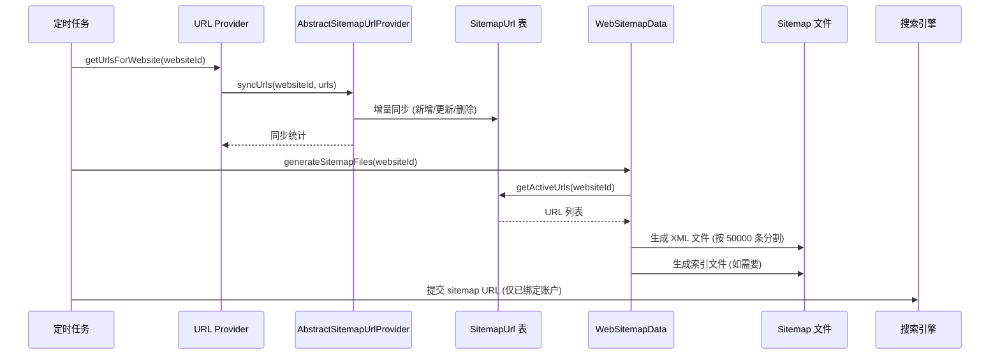
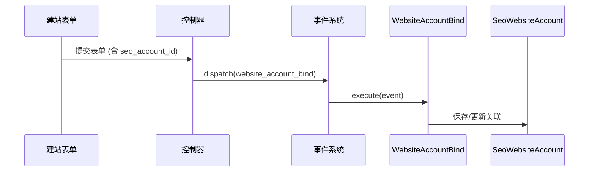

# Sitemap 架构设计

## 架构变更说明

### 当前问题

- Provider 自行生成 sitemap.xml 文件，职责混乱
- 无法统一处理不同平台的 sitemap 规则（Google 50000条限制、索引文件等）
- 缺少 URL 数据持久化，无法增量更新
- 站点与 SEO 账户无关联，无法控制自动提交

### 新架构目标

- Provider 只负责提供 URL 数据，不生成文件
- SEO 模块统一负责 sitemap 生成和平台规则处理
- 支持增量 URL 更新，数据持久化到数据库
- 站点与 SEO 账户关联，控制自动提交
- **站点-平台两级分组**：每个站点按绑定的平台独立生成 sitemap

## 目录结构（站点-平台两级分组）

```
pub/sitemaps/
├── default/                          # 站点：默认站点 (example-a.com)
│   ├── google/                       # 平台：Google Search Console
│   │   ├── sitemap.xml               # ← Google平台总索引（提交给Google）
│   │   ├── sitemap_pagebuilder_1.xml # PageBuilder模块 URL（第1分片）
│   │   ├── sitemap_pagebuilder_2.xml # PageBuilder模块 URL（第2分片，超50K条时）
│   │   ├── sitemap_product_1.xml     # 产品模块 URL（第1分片）
│   │   └── sitemap_blog_1.xml        # 博客模块 URL
│   │
│   ├── bing/                         # 平台：Bing Webmaster
│   │   ├── sitemap.xml               # ← Bing平台总索引（提交给Bing）
│   │   ├── sitemap_pagebuilder_1.xml
│   │   └── sitemap_product_1.xml
│   │
│   └── baidu/                        # 平台：Baidu 站长平台
│       ├── sitemap.xml               # ← Baidu平台总索引（提交给Baidu）
│       ├── sitemap_pagebuilder_1.xml # 因Baidu 10MB限制，可能分片更多
│       ├── sitemap_pagebuilder_2.xml
│       └── sitemap_pagebuilder_3.xml
│
├── shop_us/                          # 站点：美国商城 (shop-us.com)
│   └── google/                       # 只绑定了Google
│       ├── sitemap.xml               # ← Google平台总索引
│       ├── sitemap_product_1.xml
│       └── sitemap_product_2.xml
│
└── blog_cn/                          # 站点：中文博客 (blog-cn.com)
    └── baidu/                        # 只绑定了Baidu
        ├── sitemap.xml               # ← Baidu平台总索引
        └── sitemap_blog_1.xml
```

## 平台规则

| 平台 | URL 限制 | 文件大小限制 | 提交方式 |
|------|----------|-------------|---------|
| Google | 50,000 条 | 50 MB | Search Console API / Ping |
| Bing | 50,000 条 | 50 MB | Webmaster API / Ping |
| Baidu | 50,000 条 | 10 MB | 站长平台 API |
| Yandex | 50,000 条 | 50 MB | Webmaster API |

## 提交方式

| 站点 | 平台 | 提交 URL |
|------|------|---------|
| example-a.com | Google | `https://example-a.com/sitemaps/default/google/sitemap.xml` |
| example-a.com | Bing | `https://example-a.com/sitemaps/default/bing/sitemap.xml` |
| example-a.com | Baidu | `https://example-a.com/sitemaps/default/baidu/sitemap.xml` |
| shop-us.com | Google | `https://shop-us.com/sitemaps/shop_us/google/sitemap.xml` |
| blog-cn.com | Baidu | `https://blog-cn.com/sitemaps/blog_cn/baidu/sitemap.xml` |

## 架构图



## SOLID 原则实现

### 单一职责原则 (SRP)
- **WebSitemapData**: 只负责协调站点、账户、适配器之间的关系
- **平台适配器**: 只负责自己平台的规则和生成逻辑
- **AdapterRegistry**: 只负责适配器的发现和管理

### 开闭原则 (OCP)
- 添加新平台只需创建新的适配器类
- 无需修改 WebSitemapData 或其他现有代码

### 里氏替换原则 (LSP)
- 所有适配器都可以替换 AbstractSitemapPlatformAdapter
- 协调器通过接口调用，不依赖具体实现

### 接口隔离原则 (ISP)
- SitemapPlatformAdapterInterface 定义了最小必要接口
- 适配器可以选择性实现 supportsAutoSubmit()

### 依赖倒置原则 (DIP)
- WebSitemapData 依赖 SitemapPlatformAdapterInterface 接口
- 不依赖具体的 Google/Bing/Baidu 适配器

## 数据流程



## 核心组件

### 1. SeoWebsiteAccount Model

**职责：** 站点与 SEO 账户关联

**文件：** `Model/SeoWebsiteAccount.php`

**字段：**
| 字段 | 类型 | 说明 |
|------|------|------|
| id | int | 主键 |
| website_id | int | 站点ID（唯一） |
| account_id | int | SEO账户ID |
| is_auto_submit | tinyint | 是否自动提交 |
| created_at | timestamp | 创建时间 |
| updated_at | timestamp | 更新时间 |

### 2. SitemapUrl Model

**职责：** 存储所有站点的 URL 数据

**文件：** `Model/SitemapUrl.php`

**字段：**
| 字段 | 类型 | 说明 |
|------|------|------|
| url_id | int | 主键 |
| website_id | int | 站点ID |
| provider_scope | varchar(50) | Provider 标识 |
| provider_module | varchar(100) | 模块名 |
| url_key | varchar(255) | 唯一标识符 |
| loc | varchar(500) | 完整URL |
| lastmod | date | 最后修改时间 |
| changefreq | enum | 更新频率 |
| priority | decimal(2,1) | 优先级 |
| status | tinyint | 1=活跃, 0=已删除 |

**唯一索引：** `(website_id, provider_scope, provider_module, url_key)`

### 3. SitemapUrlProviderInterface

**职责：** 定义 URL 提供者接口

**文件：** `Interface/SitemapUrlProviderInterface.php`

**方法：**
```php
interface SitemapUrlProviderInterface
{
    public function getScope(): string;
    public function getModule(): string;
    public function getWebsiteIds(): array;
    public function getUrlsForWebsite(int $websiteId): array;
    public function getDescription(): string;
}
```

### 4. AbstractSitemapUrlProvider

**职责：** 提供增量同步功能的抽象父类

**文件：** `Provider/AbstractSitemapUrlProvider.php`

**核心方法：**
- `getExistingUrlKeys()` - 获取已存在的 URL keys
- `syncUrls()` - 智能增量同步

### 5. WebSitemapData 服务（协调器）

**职责：** 协调站点、SEO账户、平台适配器之间的关系

**文件：** `Service/WebSitemapData.php`

**核心方法：**
- `getWebsiteAdapters()` - 获取站点绑定的适配器列表
- `generateSitemapFiles()` - 调用各适配器生成文件
- `submitSitemaps()` - 调用各适配器提交到平台

### 6. SitemapPlatformAdapterInterface

**职责：** 定义平台适配器接口

**文件：** `Interface/SitemapPlatformAdapterInterface.php`

**核心方法：**
```php
interface SitemapPlatformAdapterInterface
{
    public function getPlatformCode(): string;
    public function getPlatformName(): string;
    public function getMaxUrlsPerFile(): int;
    public function getMaxFileSizeBytes(): int;
    public function generateSitemapFiles(...): array;
    public function submitSitemap(...): array;
}
```

### 7. 内置平台适配器

| 适配器 | 平台 | URL 限制 | 文件大小限制 | 提交方式 |
|--------|------|----------|-------------|---------|
| GoogleSitemapAdapter | Google | 50,000 条 | 50 MB | Ping / Search Console API |
| BingSitemapAdapter | Bing | 50,000 条 | 50 MB | Webmaster API / IndexNow |
| BaiduSitemapAdapter | 百度 | 50,000 条 | 10 MB | 链接提交 API |

### 8. SitemapAdapterRegistry

**职责：** 适配器注册中心，发现和管理所有适配器

**文件：** `Service/SitemapAdapterRegistry.php`

**核心方法：**
- `getAdapters()` - 获取所有已注册适配器
- `getAdapter($platformCode)` - 获取特定平台适配器
- `extractPlatformFromProvider()` - 从 provider 代码提取平台

## 站点账户绑定

### 绑定事件

**事件名：** `Weline_Seo::domain::website_account_bind`

**数据契约：**
```php
[
    'website_id' => int,      // 站点ID
    'account_id' => int,      // SEO账户ID
    'is_auto_submit' => bool, // 是否自动提交
]
```

### 绑定流程



### 账户选择标签

**使用：**
```php
<w:seo:account:select 
    id="seo_account" 
    name="seo_account_id" 
    value="accountId|''" 
    display="accountName|'请选择SEO账户'" 
/>
```

## Cron 任务流程

### SitemapSubmit 任务

**执行步骤：**

1. **收集 URL 数据**
   - 遍历所有 Provider
   - 调用 `getUrlsForWebsite()` 同步 URL 到数据库

2. **生成 sitemap 文件**
   - 遍历所有站点
   - 调用 `WebSitemapData::generateSitemapFiles()`
   - 按 50000 条分割，生成索引文件

3. **检查账户绑定**
   - 查询 `SeoWebsiteAccount` 表
   - 记录未绑定的站点

4. **提交到搜索引擎**
   - 只提交已绑定且启用自动提交的站点
   - 通过对应的 Adapter 提交

5. **发送消息通知**
   - 未绑定的站点发送 `Weline_Admin::msg` 消息
   - 提醒管理员绑定 SEO 账户

## 扩展指南

### 添加新的平台适配器

添加新的搜索引擎平台只需创建新的适配器类，无需修改任何现有代码。

**步骤：**

1. 创建适配器类继承 `AbstractSitemapPlatformAdapter`
2. 实现平台特定的规则和提交方法
3. 放置到 `extends/module/Weline_Seo/SitemapAdapter/` 目录

**示例：添加 Yandex 适配器**
```php
<?php
namespace YourModule\Extends\Module\Weline_Seo\SitemapAdapter;

use Weline\Seo\Adapter\AbstractSitemapPlatformAdapter;

class YandexSitemapAdapter extends AbstractSitemapPlatformAdapter
{
    public function getPlatformCode(): string
    {
        return 'yandex';
    }

    public function getPlatformName(): string
    {
        return 'Yandex';
    }

    public function getPlatformColor(): string
    {
        return '#FF0000';
    }

    public function getMaxUrlsPerFile(): int
    {
        return 50000;
    }

    public function getMaxFileSizeBytes(): int
    {
        return 52428800; // 50 MB
    }

    public function supportsAutoSubmit(): bool
    {
        return true;
    }

    public function submitSitemap(string $sitemapUrl, array $accountConfig): array
    {
        // 实现 Yandex Webmaster API 提交逻辑
        $apiKey = $accountConfig['api_key'] ?? '';
        // ... 提交逻辑
        return ['success' => true, 'message' => '已提交到 Yandex'];
    }
}
```

**文件位置：**
```
app/code/YourModule/
└── extends/
    └── module/
        └── Weline_Seo/
            └── SitemapAdapter/
                └── YandexSitemapAdapter.php
```

适配器会被 `SitemapAdapterRegistry` 自动发现和加载。

---

### 添加新的 URL Provider

1. 创建 Provider 类继承 `AbstractSitemapUrlProvider`
2. 实现接口方法
3. 放置到 `extends/module/Weline_Seo/SitemapProvider/` 目录

**示例：**
```php
<?php
namespace YourModule\Extends\Module\Weline_Seo\SitemapProvider;

use Weline\Seo\Provider\AbstractSitemapUrlProvider;

class YourSitemapProvider extends AbstractSitemapUrlProvider
{
    public function getScope(): string
    {
        return 'your_scope';
    }
    
    public function getModule(): string
    {
        return 'YourModule';
    }
    
    public function getWebsiteIds(): array
    {
        // 返回站点ID列表
    }
    
    public function getUrlsForWebsite(int $websiteId): array
    {
        $urls = []; // 获取 URL 数据
        
        // 调用父类方法同步到数据库
        $this->syncUrls($websiteId, $urls);
        
        return $urls;
    }
    
    public function getDescription(): string
    {
        return __('Your URL Provider');
    }
}
```

## 文件结构

```
app/code/Weline/Seo/
├── Interface/
│   └── SitemapUrlProviderInterface.php    # 新增
├── Model/
│   ├── SeoWebsiteAccount.php              # 新增
│   └── SitemapUrl.php                     # 新增
├── Observer/
│   └── WebsiteAccountBind.php             # 新增
├── Provider/
│   └── AbstractSitemapUrlProvider.php     # 新增
├── Service/
│   └── WebSitemapData.php                 # 新增
├── Taglib/
│   └── AccountSelect.php                  # 新增
├── Cron/
│   └── SitemapSubmit.php                  # 修改
└── event.php                              # 修改
```

## 相关文档

- [Sitemap 扩展开发指南](./Sitemap扩展开发指南.md)
- [事件系统设计文档](./事件系统设计文档.md)
- [账户与定时任务简要说明](./账户与定时任务简要说明.md)

---

**最后更新：** 2026-01-30  
**版本：** 1.0.0
