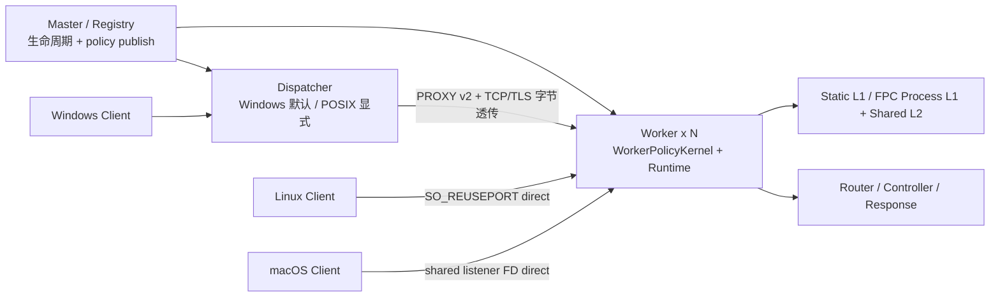

# Weline Server 模块

高性能异步常驻内存 HTTP 服务器，支持跨平台多进程架构。

## 📦 模块信息

- **模块名**: `Weline_Server`
- **类型**: 基础设施模块
- **协议支持**: HTTP/1.1, WebSocket, TCP, UDP

## 🚀 快速开始

```bash
# 启动服务器（自动探测最佳配置）
php bin/w server:start

# 查看状态
php bin/w server:status

# 压力测试（自动探测运行中的服务器）
php bin/w server:benchmark

# 停止服务器
php bin/w server:stop
```

## 📖 服务器类型

### 1. WLS (Weline Server) - 高性能服务器

适用于 **生产环境** 和 **高并发场景**。

#### 特性

| 特性 | 说明 |
|-----|------|
| 常驻内存 | 启动后常驻内存，避免每次请求重新加载 |
| 多进程 | 支持多 Worker 进程，充分利用多核 CPU |
| 异步 I/O | 基于事件循环的非阻塞 I/O |
| 高性能 | 常驻内存、多 Worker 和可选 libevent 事件循环；实际 QPS 以本机 `server:benchmark` 为准 |
| 跨平台 | 支持 Windows/Linux/Mac |

#### 启动命令

```bash
# 默认启动（智能模式）
php bin/w server:start

# Linux/macOS 显式切换 Dispatcher 对照/兼容
php bin/w server:start --dispatcher

# Linux/macOS 显式 direct（auto 已默认直连）
php bin/w server:start --direct

# 命名实例
php bin/w server:start api-server

# 指定端口和进程数
php bin/w server:start -p 9000 -c 8

# 守护进程模式（仅 Linux/Mac）
php bin/w server:start -d
```

#### 配置参数

| 参数 | 简写 | 说明 | 默认值 |
|-----|------|------|--------|
| `--port` | `-p` | 监听端口 | 9981 |
| `--host` | `-h` | 监听地址 | 127.0.0.1 |
| `--count` | `-c` | Worker 进程数 | 智能推算 |
| `--daemon` | `-d` | 守护进程模式 | false |
| `--direct` | - | 显式 direct（Linux 使用 SO_REUSEPORT，macOS 使用 Master 共享监听 FD） | POSIX `auto` 已选择 |
| `--dispatcher` | - | 显式 Dispatcher TCP 透传 | Windows `auto` 已选择 |

#### 平台拓扑

| 平台 | `auto` 结果 | 说明 |
|---|---|---|
| Windows | Dispatcher | Windows 只支持 Dispatcher 透传；`--direct`、`--no-dispatcher` 启动前拒绝 |
| Linux | Direct | 通过 ext-event、SO_REUSEPORT 真实双监听 accept 分布和策略能力检查后，客户端直达 Worker |
| macOS | Direct | Master 只 bind 一个公开 listener 并以 FD 3 传给全部 Worker；Worker 竞争同一 accept queue，没有代理透传 |

Direct 时不启动 Dispatcher，不创建第二条 Worker 后端连接。两种拓扑都在 Worker 加载同一 RuntimePolicyBundle，因此 Host、后台 Key、Origin Token、安全规则、限流、Static/FPC 和维护模式不会因 direct 而失效。POSIX direct 能力检查失败时停止启动，需运维明确使用 `--dispatcher`，不静默降级。

#### 智能模式

当 `worker_count` 设置为 `'auto'` 时，系统会根据服务器性能自动推算：

| 工作模式 | 计算公式 | 适用场景 |
|---------|---------|---------|
| `io` | CPU 核心数 × 2 | 数据库查询、API 请求、文件 I/O |
| `cpu` | CPU 核心数 | 图像处理、加密计算、复杂算法 |

> **Windows 限制**: 由于 Windows 多进程开销较大，推荐值不超过 CPU 核心数

### 2. CLI Server - 开发服务器

适用于 **开发环境** 和 **快速调试**。

#### 特性

| 特性 | 说明 |
|-----|------|
| 内置服务器 | 使用 PHP 内置 CLI 服务器 |
| 单进程 | 简单轻量，适合开发调试 |
| 热重载 | 文件修改后自动生效 |
| 零配置 | 无需额外配置即可启动 |

#### 启动命令

```bash
# 启动 CLI 服务器
php bin/w server:start cli -p 8080

# 或使用 PHP 内置命令
php -S 127.0.0.1:8080 -t pub
```

## ⚙️ 环境配置 (env.php)

在 `app/etc/env.php` 中配置服务器参数：

```php
'server' => [
    'host' => '127.0.0.1',      // 监听地址
    'port' => 9443,             // 监听端口（HTTPS 默认 443/9443）
    'worker_count' => 'auto',   // 'auto' 或具体数字
    'mode' => 'io',             // 'io' 或 'cpu'
    'https' => true,            // 启用 HTTPS（默认 true）
    'http_redirect_port' => 9980, // HTTP 重定向端口（可选，默认 = HTTPS端口 - 463）
],

'wls' => [
    'runtime' => [
        'topology' => 'auto',  // auto/direct/dispatcher/independent
    ],
],

// 多实例配置（可选）
'servers' => [
    'api' => [
        'host' => '127.0.0.1',
        'port' => 9001,
        'worker_count' => 4,
    ],
    'websocket' => [
        'host' => '0.0.0.0',
        'port' => 9002,
        'worker_count' => 2,
    ],
],
```

## 📊 命令参考

### server:start

启动服务器。

```bash
php bin/w server:start [name] [-p port] [-c count] [--host ip] [-d]
```

### server:stop

停止服务器。

```bash
# 停止默认实例
php bin/w server:stop

# 停止指定实例
php bin/w server:stop api-server

# 停止所有实例
php bin/w server:stop --all
```

### server:status

查看服务器状态（树形展示）。

```bash
# 查看所有实例
php bin/w server:status

# 查看指定实例
php bin/w server:status api-server
```

指定实例的详细状态会校验 endpoint schema v3 中的完整 `runtime_selection` 与根级兼容投影，并显示 requested/effective topology、listener strategy、event loop、SSL engine、policy compatibility 与完整 digest。投影冲突时 fail closed，不从其他字段重新推导拓扑；旧 schema 仅标记为 legacy projection。

输出示例：

```
实例 [default] 状态

╔══════════════════════════════════════════════════════════════╗
║                    实例详细信息                                ║
╠══════════════════════════════════════════════════════════════╣
║  实例名称：default                                           ║
║  监听地址：http://127.0.0.1:9981                             ║
║  端口范围：9981 - 9984                                       ║
║  Worker 数：4                                                ║
╚══════════════════════════════════════════════════════════════╝

Worker 进程状态：

  ├─ Worker #1 (端口: 9981) ● 运行中
  │    └─ 内存：22.45 MB (PID: 28212)
  ├─ Worker #2 (端口: 9982) ● 运行中
  │    └─ 内存：22.48 MB (PID: 28524)
  ├─ Worker #3 (端口: 9983) ● 运行中
  │    └─ 内存：22.32 MB (PID: 28836)
  └─ Worker #4 (端口: 9984) ● 运行中
       └─ 内存：22.51 MB (PID: 29148)

状态：全部运行中 (4/4)
```

### server:benchmark

压力测试（自动探测运行中的服务器）。

```bash
# 仅有一个可验证的运行实例时自动选择
php bin/w server:benchmark

# 推荐：精确指定实例，安全归因运行时元数据
php bin/w server:benchmark --instance api-server

# 自定义参数
php bin/w server:benchmark --instance api-server -c 500 -n 50000
```

参数说明：

| 参数 | 简写 | 说明 | 默认值 |
|-----|------|------|--------|
| `--concurrency` | `-c` | 并发数 | 100 |
| `--requests` | `-n` | 总请求数 | 10000 |
| `--path` | - | 请求路径 | `/_wls/health` |
| `--instance` | - | 精确指定运行实例，并归因 schema v3 运行时元数据 | - |
| `--port` | `-p` | 指定端口（可选） | 自动探测 |
| `--no-keepalive` | - | 强制 fresh connection；HTTPS 时同时代表 fresh TLS | false |

报告保存到 `var/log/wls/benchmark_report_*.json`，schema v3 除原有 QPS/延迟/错误字段外，还记录 `target_attribution`、endpoint schema/runtime selection 校验结果、requested/effective topology、listener、event loop、SSL engine、Worker 数、policy compatibility/digest、keep-alive/fresh TLS 和响应观测到的 cache source。手动 `-p` 只有在 host/port（以及显式 SSL 要求）唯一匹配运行中的本地 endpoint 时才归因实例；零匹配或多匹配仍可压明确端口，但运行时字段保持 `null`。有多个运行实例且未指定目标时，命令直接拒绝自动选择，避免误压生产实例。

## 🔧 性能优化

### 事件循环（最重要！）

Weline Server 支持多种事件循环。`server:start` 会先检查当前 PHP：在有可验证安装链的 Linux/macOS 上，缺少 `ext-event` 时会自动安装、启用并用新 PHP 进程继续启动。默认不会在安装失败后静默降级。

| 事件循环 | 性能 | 安装方式 | 说明 |
|---------|------|---------|------|
| **Event 扩展** | libevent 驱动，收益取决于路由与业务负载 | 支持的 Linux/macOS 由 `server:start` 自动安装 | 默认优先，安装后会使用当前 PHP 验证 |
| stream_select | 兼容性基线 | 无需安装 | 平台无安全安装链，或显式使用 `--no-auto-deps` 时使用 |

#### 检测与优雅降级

```
启动时自动检测：
┌─────────────────────────────────────────────────────────────┐
│ 1. event 可用 → 直接使用 libevent                          │
│ 2. 受支持且缺失 → 当前平台安装、新 PHP 验证、继续启动   │
│ 3. 安装失败 → 停止启动并给出原始错误，不静默降级         │
│ 4. --no-auto-deps → 由运维显式接受兼容运行时             │
└─────────────────────────────────────────────────────────────┘
```

#### 安装 Event 扩展

**Linux/macOS（手动预装，适合镜像构建）:**
```bash
php bin/w env:install event -y
```

**Windows:**
1. 只使用与当前 PHP 版本、架构、TS/NTS 和编译器 ABI 全部匹配的 `php_event.dll`。
2. DLL 已存在于当前 PHP `extension_dir` 时，启动预检会尝试启用并验证。
3. 没有可验证 DLL 时使用 Windows 稳定兼容运行时；框架不会自动下载不明 ABI 的二进制文件。

生产镜像建议在构建阶段执行 `env:install`；不允许启动时修改系统的只读容器可预装依赖，并用 `--no-auto-deps` 明确关闭启动安装。

### 推荐配置

| 配置项 | 推荐值 | 说明 |
|-------|--------|------|
| `opcache` 扩展 | 启用 | 提升 PHP 执行速度 50%+ |
| `opcache.enable_cli` | 1 | CLI 模式启用 OPCache |
| `opcache.jit` | tracing | PHP 8+ JIT 编译器 |
| `proc_open` 函数 | 启用 | 精确的进程管理 |
| `memory_limit` | 256M+ | 内存限制 |

### php.ini 配置示例

```ini
; OPCache 配置
opcache.enable=1
opcache.enable_cli=1
opcache.jit=tracing
opcache.jit_buffer_size=128M

; 内存限制
memory_limit=256M

; 移除禁用函数
; 从 disable_functions 中移除: proc_open, proc_close, proc_get_status
```

## 🏗️ 架构说明

### 当前跨平台数据面



- Windows 只使用 Dispatcher 透传。Dispatcher 负责 L4 准入、READY Worker 选择、背压和 failover，TLS/HTTP 语义由 Worker 处理。
- Linux `auto` 由 SO_REUSEPORT Worker 共享公开端口；macOS `auto` 由 Master 绑定一个 listener 并将同一 FD 继承给 Worker。两者都没有 Dispatcher、后端连接或字节透传；可用 `--dispatcher` 显式切换对照。
- Worker 在两种拓扑中都先执行 mandatory guard，再命中 Static/FPC，最后才进入 Session、Router 和 Controller。
- 策略、缓存 epoch 和维护 epoch 由 Master 版本化发布；Worker active digest 不匹配时不得 READY。

完整组件、时序与请求顺序见 [WLS 运行时架构](doc/WLS架构图.md) 和 [WLS 安全与规则配置推演](doc/WLS安全与规则配置推演.md)。


### 内存缓存管理（智能模式）

WLS 内置智能内存缓存系统，采用冷热淘汰策略管理静态文件缓存。

```
┌──────────────────────────────────────────────────────────────────────┐
│                     Worker 内存缓存架构                               │
├──────────────────────────────────────────────────────────────────────┤
│                                                                       │
│   ┌─────────────────────────────────────────────────────────────┐   │
│   │                    静态文件缓存池                             │   │
│   │                                                               │   │
│   │   ┌─────────┐  ┌─────────┐  ┌─────────┐  ┌─────────┐       │   │
│   │   │ file.js │  │ app.css │  │ img.png │  │  ...    │       │   │
│   │   │ hits:50 │  │ hits:30 │  │ hits:5  │  │         │       │   │
│   │   │  HOT    │  │  WARM   │  │  COLD   │  │         │       │   │
│   │   └─────────┘  └─────────┘  └─────────┘  └─────────┘       │   │
│   │                                                               │   │
│   │   总容量: auto (系统内存 2%, 32MB-256MB)                       │   │
│   │   单文件上限: 1MB                                             │   │
│   │   淘汰阈值: 剩余 5MB 时开始淘汰冷数据                           │   │
│   └─────────────────────────────────────────────────────────────┘   │
│                                                                       │
│   淘汰策略: score = hits × 10 + recency_bonus                        │
│   recency_bonus = max(0, 100 - age_minutes)                          │
│                                                                       │
└──────────────────────────────────────────────────────────────────────┘
```

#### env.php 配置

```php
'server' => [
    'cache' => [
        'static_file_max_total' => 'auto',     // 'auto' 或 '100M' 或 数字
        'static_file_max_size' => '1M',        // 单文件上限
        'eviction_threshold' => 5242880,       // 5MB
    ],
],
```

#### 智能内存分配

| 系统内存 | 自动计算的缓存上限 |
|----------|-------------------|
| 2GB | 40MB |
| 4GB | 80MB |
| 8GB | 160MB |
| 16GB+ | 256MB（上限） |

#### 启动时内存检查

- 检查系统可用内存
- 不足时自动缩减缓存大小
- 严重不足（<50%需求）时拒绝启动

### 核心组件

| 组件 | 路径 | 说明 |
|-----|------|------|
| Worker | `Worker.php` | 核心 Worker 类 |
| Event Loop | `Event/Select.php` | 事件循环（stream_select） |
| Connection | `Connection/TcpConnection.php` | TCP 连接管理 |
| Protocol | `Protocol/Http.php` | HTTP 协议解析 |
| Timer | `Timer.php` | 定时器 |

### 共享内存服务（WLS 强一致）

本模块已支持统一共享内存服务（Session 与 Cache 统一接口），用于解决多 Worker 下状态不一致问题：

- 统一契约：`Shared/Contract/MemoryServiceInterface.php`
- 长连接复用：`Shared/Connection/ConnectionPoolManager.php`
- 协议客户端：`Shared/Client/SharedStateClient.php`
- 统一服务实现：`Shared/Service/SharedMemoryService.php`
- 领域包装：`Service/SessionMemoryService.php`、`Service/CacheMemoryService.php`

设计边界：

- 请求结束不主动断连，连接池在 Worker 进程级复用
- Session 不再走本地文件降级真值路径，统一以共享内存服务为准
- WLS 缓存主存储改为共享内存服务，避免跨 Worker 命中分裂

## 📝 开发指南

### 自定义 Worker

```php
use Weline\Server\Worker;

$worker = new Worker('http://0.0.0.0:8080');
$worker->count = 4;
$worker->name = 'MyHttpServer';

$worker->onMessage = function($connection, $request) {
    $connection->send('Hello World!');
};

Worker::runAll();
```

### 支持的协议

| 协议 | 类 | 说明 |
|-----|-----|------|
| HTTP | `Protocol\Http` | HTTP/1.1 协议 |
| WebSocket | `Protocol\WebSocket` | WebSocket 协议 |
| Text | `Protocol\Text` | 文本协议（换行符分隔） |

## 📁 目录结构

```
Weline/Server/
├── bin/                    # 可执行脚本
│   └── worker.php          # Worker 启动脚本
├── Connection/             # 连接管理
│   ├── ConnectionInterface.php
│   └── TcpConnection.php
├── Console/Server/         # CLI 命令
│   ├── Start.php           # server:start
│   ├── Stop.php            # server:stop
│   ├── Status.php          # server:status
│   ├── Benchmark.php       # server:benchmark
│   └── ...
├── Event/                  # 事件循环
│   ├── EventInterface.php
│   └── Select.php
├── Protocol/               # 协议解析
│   ├── Http.php
│   ├── WebSocket.php
│   └── ...
├── Service/                # 服务层
│   ├── HttpServer.php
│   └── ServerInstanceService.php
├── i18n/                   # 国际化
├── Test/                   # 测试
├── Worker.php              # 核心 Worker 类
├── Timer.php               # 定时器
└── register.php            # 模块注册
```

## 🔗 相关文档

- [WLS 实例隔离机制（核验版）](doc/WLS实例隔离机制.md)
- [Weline Framework 官方文档](https://weline.cc/docs)

## 📄 许可证

MIT License
