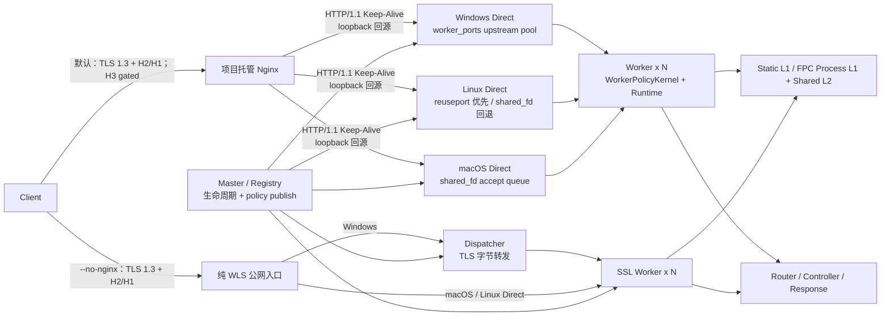

# Weline Server 模块

高性能异步常驻内存 HTTP 服务器，支持跨平台多进程架构。

## 📦 模块信息

- **模块名**: `Weline_Server`
- **类型**: 基础设施模块
- **协议支持**: 默认由 Nginx 提供 TLS 1.3、HTTP/2 和 HTTP/1.1 回退，HTTP/3 可用且真实门禁通过时启用；显式 `--no-nginx` 时由纯 WLS 提供 TLS 1.3、HTTP/2 默认和 HTTP/1.1 自动回退
- **公网入口**: 默认使用项目托管 Nginx；无法使用 Nginx 的环境可显式选择 `--no-nginx`。纯 WLS 不提供 HTTP/3，TLS Session Ticket/跨 Worker 恢复仍待实现和验证；详见 `doc/WLS模式部署指南.md`

## 🚀 快速开始

```bash
# 首次使用前显式安装托管 Nginx
php bin/w server:nginx:install

# 默认启动项目托管 Nginx；WLS 自动固定 loopback 明文 H1；普通 start 不下载或编译
php bin/w server:start -p 9981

# Nginx 不可用时显式退化为纯 WLS；默认 HTTPS + TLS 1.3 + H2/H1
php bin/w server:start pure-wls -p 9982 --no-nginx

# 查看状态
php bin/w server:status

# 压力测试（自动探测运行中的服务器）
php bin/w server:benchmark

# 停止服务器
php bin/w server:stop
```

## ♻️ 可恢复任务观察

- WLS 模式由 Master 托管唯一的 `runtime:task:watch --daemon` 服务。
- PHP-FPM、Apache 等非 WLS 部署由 `weline_runtime_task_watch` Cron 每分钟执行一次 `RuntimeTaskWatchdog::tick()`；`setup:upgrade` 会自动收集并安装该任务，无需另建系统 crontab。
- 两种入口复用同一持久状态和原子恢复声明；短暂重叠只会有一个观察者取得恢复权，不会重复启动业务任务。

## 📖 服务器类型

### 1. WLS (Weline Server) - 高性能服务器

适用于 **生产环境** 和 **高并发场景**。

#### 特性

| 特性 | 说明 |
|-----|------|
| 常驻内存 | 启动后常驻内存，避免每次请求重新加载 |
| 多进程 | 支持多 Worker 进程，充分利用多核 CPU |
| 异步 I/O | 基于事件循环的非阻塞 I/O |
| 高性能 | 常驻内存、多 Worker 和可选 libevent 事件循环；实际 QPS 以本机 `server:benchmark` 为准 |
| 跨平台 | 支持 Windows/Linux/Mac |

#### 启动命令

```bash
# 启动 Nginx 的 WLS 明文 H1 回源
php bin/w server:start -p 9981

# 命名实例
php bin/w server:start api-server -p 9000

# 指定端口和进程数
php bin/w server:start -p 9000 -c 8

# 守护进程模式（仅 Linux/Mac）
php bin/w server:start -d -p 9981

# 无 Nginx 环境：纯 WLS 默认直接提供 HTTPS、H2 与 H1 回退
php bin/w server:start pure-wls -p 9982 --no-nginx
```

#### 配置参数

| 参数 | 简写 | 说明 | 默认值 |
|-----|------|------|--------|
| `--port` | `-p` | Nginx 模式为 WLS 明文回源端口；`--no-nginx` 时为纯 WLS HTTPS 公网端口 | 9981 为常用值；Nginx 公网端口默认按 `8080/8443 + projectPortOffset` 分配，可由 env 覆盖 |
| `--host` | `-h` | Nginx 模式自动约束为 loopback；`--no-nginx` 时作为纯 WLS 监听地址 | 127.0.0.1 |
| `--count` | `-c` | Worker 进程数 | 智能推算 |
| `--daemon` | `-d` | 守护进程模式 | false |
| `--no-nginx` | — | 跳过托管 Nginx，直接启动纯 WLS；默认启用 HTTPS、TLS 1.3、H2/H1 | false |

#### 平台拓扑

| 平台 | `auto` 结果 | 说明 |
|---|---|---|
| Windows | Nginx：Direct (`worker_ports`)；纯 WLS：Dispatcher | Nginx 可直接均衡每个 Worker 的独立 loopback 端口；`--no-nginx` 使用 Dispatcher 接收公网 TLS 字节并转交 SSL Worker，不安装或编译扩展 |
| Linux | Direct | `auto` 优先使用经能力验证的 `reuseport` 独立 accept 队列；当前 PHP/内核不支持时回退 Master-owned `shared_fd` |
| macOS | Direct | 默认由 Master 创建一个 `shared_fd` listener，所有 Worker 共享同一 accept 队列；只需 POSIX FD 原语和 `ext-event` |
| 其他系统 | 不启动 | 没有受支持的平台驱动时，在创建 Master/Worker 前明确失败，不回退到兼容拓扑 |

默认 Nginx 模式在所有平台都选择 Direct：Windows 由 Nginx 直接均衡 `worker_ports`；Linux 自动优先 `reuseport`，在 PHP `sockets` 或内核 `SO_REUSEPORT` 不可用时回退 `shared_fd`；macOS 使用 `shared_fd`。显式 `--no-nginx` 时，macOS/Linux 继续使用 Direct 并由 SSL Worker 直接监听，Windows `auto` 固定选择 Dispatcher，由 Dispatcher 传递原始 TLS/H2/H1 字节给 SSL Worker。两条 POSIX Direct 路径都要求预装 `ext-event`。所有拓扑都加载同一 RuntimePolicyBundle，因此 Host、后台 Key、Origin Token、安全规则、限流、Static/FPC 和维护模式不会因监听策略不同而失效。

Dispatcher 仍可在所有平台显式选择；在 Nginx 模式它是兼容/诊断拓扑，在 Windows 纯 WLS 模式则是 `auto` 的受支持公网 TLS 拓扑。Windows 纯 WLS 显式 `direct`/`independent` 会在创建子进程前拒绝。

#### 智能模式

当 `worker_count` 设置为 `'auto'` 时，系统会根据服务器性能自动推算：

| 工作模式 | 计算公式 | 适用场景 |
|---------|---------|---------|
| `io` | CPU 核心数 × 2 | 数据库查询、API 请求、文件 I/O |
| `cpu` | CPU 核心数 | 图像处理、加密计算、复杂算法 |

> **Windows 限制**: 由于 Windows 多进程开销较大，推荐值不超过 CPU 核心数

### 2. 已退役：CLI Server

当前启动链不再提供 `server:start --cli` 或名为 `cli` 的替代服务器分支。默认验收经过项目托管 Nginx；明确使用 `--no-nginx` 时经过纯 WLS TLS 数据面。直接运行 `php -S` 不受 WLS 生命周期、TLS 或协议门禁管理，不是受支持的 WLS 启动方式。


## ⚙️ 环境配置 (env.php)

在 `app/etc/env.php` 中配置服务器参数：

```php
'server' => [
    'host' => '127.0.0.1',      // Nginx 回源地址
    'port' => 9981,             // Nginx 回源端口
    'worker_count' => 'auto',   // 'auto' 或具体数字
    'mode' => 'io',             // 'io' 或 'cpu'
    'https' => true,            // Nginx 公网 TLS；--no-nginx 时是纯 WLS 默认 TLS
],

'wls' => [
    'runtime' => [
        'topology' => 'auto',  // Nginx -> 全平台 Direct；纯 WLS Windows -> Dispatcher
        'listener_mode' => 'auto', // Windows -> worker_ports；Linux -> reuseport/shared_fd；macOS -> shared_fd
    ],
    'edge' => [
        'adapter' => 'nginx',  // 默认值；当次 --no-nginx 会切换为纯 WLS
        'nginx' => [
            'managed' => true,
            'auto_start' => true,
        ],
    ],
],

// 多实例配置（可选）
'servers' => [
    'api' => [
        'host' => '127.0.0.1',
        'port' => 9001,
        'worker_count' => 4,
    ],
    'secondary' => [
        'host' => '127.0.0.1',
        'port' => 9002,
        'worker_count' => 2,
    ],
],
```

## 📊 命令参考

### server:start

启动服务器。

```bash
php bin/w server:start [name] [-p port] [-c count] [-d] [--no-nginx]

# 仅在运维明确允许本次安装副作用时使用
php bin/w server:start [name] --install-deps
```

普通 `server:start` 默认使用项目托管 Nginx，只探测当前 PHP、平台与已安装的 Nginx，不下载、安装或编译 PHP 扩展、Nginx 或协议组件。`--install-deps` 仅在运维显式允许时处理 PHP 运行依赖；项目托管 Nginx 缺失时，默认启动返回非零并提示单独执行 `server:nginx:install`。环境无法运行 Nginx 时可显式传入 `--no-nginx`，该模式不触碰 Nginx 生命周期并默认启用纯 WLS HTTPS。

### server:nginx:install

项目托管 Nginx 只允许通过显式命令准备：

```bash
php bin/w server:nginx:install
php bin/w server:nginx:install --force  # 必须先停止托管 Nginx
```

macOS/Linux 的显式安装命令可能构建固定摘要的 Nginx 1.30.4，Windows 解压官方预编译包；这是安装 Web Server，不是用编译实现 PHP 协议。Unix 显式安装把 PCRE2 头文件和 Nginx rewrite 模块视为硬依赖；缺失时立即失败，不会以 `--without-http_rewrite_module` 构建一个无法运行标准配置的二进制。普通 start/reload/restart 永远不会调用该流程。HTTP/3 也只由 Nginx 提供：配置和 `nginx -V` 必须证明 HTTP/3/QUIC 能力；PHP cURL 支持 HTTP/3 时还必须通过 owner 绑定的 HTTP/3-only 真实 QUIC 请求抵达 WLS health，不能用 Nginx 本地响应或边缘缓存代替。客户端 verifier 不可用时状态保持 pending，不能冒充已验证。

Windows 分支把下载缓存、解压目录、已校验 candidate 和 final 全部放在同一项目身份的本机 LOCALAPPDATA 根；候选的 PE 架构、二进制 SHA 与 manifest 全部通过后才执行目录级原子发布，--force 失败会恢复旧安装。安装器不会在 UNC/Parallels 共享目录解压，也不会逐文件覆盖正式安装。

托管 Nginx 的 `upstream_keepalive_timeout_sec` 默认为 5 秒。Worker reload 的安全 drain 下限固定为该 idle timeout 再加 5 秒；这给旧 upstream Keep-Alive 连接一个明确排空窗口，不会在旧 Worker 退场时把正在复用的回源连接直接重置。

### TLS Session 恢复边界

Nginx 模式的公网 TLS 由 Nginx 终结。TLS 恢复门禁固定使用 `fresh-share-two-connection-pair-v1`：每一对都创建新的 cURL SSL session share，且只包含一个 fresh issuer 与一个 fresh-TCP resume probe；至少 8 个有效 probe、`failed=0`、恢复握手 P95 不超过 50ms。多 Nginx Worker 必须在各自成对的 issuer/probe PID 上同时证明 same-worker 与 cross-worker 恢复；单 Worker 的 cross-worker 状态为 `not_applicable`。该结论只覆盖 Nginx TCP/TLS；HTTP/3/QUIC Session Resumption 仍未验证。

纯 WLS 模式使用 PHP Stream TLS。当前已经验证 TLS 1.3、ALPN `h2`、HTTP/2 多路复用、HTTP/1.1 Keep-Alive/回退和连接级 TLS 复用，但 fresh TCP 的 Session Ticket/Session Resumption 以及跨 Worker 恢复尚未打通；不得引用 Nginx 的恢复证据，也不得把长连接复用描述为跨连接 TLS 会话恢复。

### Nginx 回源 authority 与 H1 fresh 门禁

托管配置把 `$http_host` 映射为 WLS 的公开 authority；HTTP/3 中 `$http_host` 为空时使用 `$host:$server_port`，并同时转发 `X-Forwarded-Proto` 与 `X-Forwarded-Port`。RuntimePolicyBundle 固定把 `127.0.0.0/8`、`::1/128` 视为 trusted proxy transport peer，使 Worker 能在明文 H1 回源上重建真实公开 origin；这不把 loopback 加入业务 whitelist，也不绕过安全规则。

只有 Nginx loopback allowlist 保护的 `/_wls/` 探测位置会把客户端精确的 `Connection: close` 传播给 WLS，用于 fresh H1 分流门禁；普通业务位置始终清空 upstream `Connection` 头并保留 Nginx upstream Keep-Alive 池。

### server:stop

停止服务器。

```bash
# 停止默认实例
php bin/w server:stop

# 停止指定实例
php bin/w server:stop api-server

# 停止所有实例
php bin/w server:stop --all
```

### server:status

查看服务器状态（树形展示）。

```bash
# 查看所有实例
php bin/w server:status

# 查看指定实例
php bin/w server:status api-server
```

指定实例的详细状态只接受 endpoint schema v4，并从嵌套 `runtime_selection` 显示 requested/effective topology、listener mode、event loop、policy compatibility 与完整 digest。旧 endpoint schema、缺失 `runtime_selection` 或根级投影都会 fail closed；状态命令不重新推导或补写拓扑。endpoint 必须持续保留由 Start 验证的 `edge_adapter=nginx|wls` 与对应 HTTP 策略：Nginx 为 H1 私网回源，纯 WLS 为 TLS H2/H1 公网入口；Master/Orchestrator 写回不得删除这些协议策略，否则 Worker 在绑定监听前拒绝 READY。

输出示例：

```
实例 [default] 状态

╔══════════════════════════════════════════════════════════════╗
║                    实例详细信息                                ║
╠══════════════════════════════════════════════════════════════╣
║  实例名称：default                                           ║
║  监听地址：http://127.0.0.1:9981                             ║
║  端口范围：9981 - 9984                                       ║
║  Worker 数：4                                                ║
╚══════════════════════════════════════════════════════════════╝

Worker 进程状态：

  ├─ Worker #1 (端口: 9981) ● 运行中
  │    └─ 内存：22.45 MB (PID: 28212)
  ├─ Worker #2 (端口: 9982) ● 运行中
  │    └─ 内存：22.48 MB (PID: 28524)
  ├─ Worker #3 (端口: 9983) ● 运行中
  │    └─ 内存：22.32 MB (PID: 28836)
  └─ Worker #4 (端口: 9984) ● 运行中
       └─ 内存：22.51 MB (PID: 29148)

状态：全部运行中 (4/4)
```

### server:benchmark

压力测试（自动探测运行中的服务器）。

```bash
# 仅有一个可验证的运行实例时自动选择
php bin/w server:benchmark

# 推荐：精确指定实例，安全归因运行时元数据
php bin/w server:benchmark --instance api-server

# 自定义参数
php bin/w server:benchmark --instance api-server -c 500 -n 50000

# 跨主机负载发生器：TCP 连接 Windows/Linux 节点，TLS SNI 与 HTTP Host 保持公开域名
php bin/w server:benchmark --host 10.0.0.8 --authority-host app.weline.test -p 15443 --ssl --http-version 2 --physical-connections 3 -c 96 -n 5000
```

参数说明：

| 参数 | 简写 | 说明 | 默认值 |
|-----|------|------|--------|
| `--concurrency` | `-c` | 并发数 | 100 |
| `--requests` | `-n` | 总请求数 | 10000 |
| `--path` | - | 请求路径 | `/_wls/health` |
| `--instance` | - | 精确指定运行实例；读取 endpoint schema v4 归因到 Benchmark report schema v4 | - |
| `--port` | `-p` | 指定端口（可选） | 自动探测 |
| `--authority-host` | - | 跨主机压测的 TLS SNI/HTTP Host；TCP 目的地址仍由 `--host` 指定 | - |
| `--no-keepalive` | - | 对所选目标强制 fresh connection；`--instance` 自动选择该实例绑定的 Nginx 或纯 WLS 公网端点 | false |

压测开始后会立即输出首批请求的真实状态，不必等到 10% 才看到进度；运行中约每 0.5 秒刷新一次完成数、活动请求句柄、已发送数、耗时和实时 QPS，最后一次完成会强制刷新。进度只统计实际完成/失败的请求，不按时间模拟。

报告保存到 `var/log/wls/benchmark_report_*.json`。这里的 **Benchmark report schema v4** 仅是压测报告格式，不是实例 endpoint 版本；实例归因必须先通过 **endpoint schema v4** 的嵌套 `runtime_selection` 校验。报告还记录 `target_attribution`、endpoint/runtime selection 校验结果、requested/effective topology、listener、event loop、Worker 数、policy compatibility/digest、keep-alive 和响应观测到的 cache source。跨主机模式额外记录 `target_connect_host`、`target_authority_host` 与 `target_resolve_explicit`；它只改变 cURL 的 TCP resolve，URL、TLS SNI 与 HTTP Host 始终使用 authority。未携带本机 endpoint 证据的远端目标仍标记为 `unattributed_endpoint`，不能冒充实例归因；但在显式强制 HTTP/2/3 时可以建立隔离的 multiplex lanes，并以实际协商版本、连接数和并发 Stream 观测决定门禁。每条物理连接 lane 只使用其 `curl_multi` 默认的 DNS/connection/TLS Session cache；不叠加 `CURLSH`，所以 `connection_share_enabled` 与 `ssl_session_share_enabled` 固定为 false。`curl_multi_tls_session_cache_enabled=true` 只表示客户端缓存能力，不是服务端恢复证据；本次 benchmark 没有服务端证据时必须保持 `curl_multi_tls_session_resumption_verified=false`。Nginx 恢复结论以 owner-bound Doctor/verifier 为准；纯 WLS 当前必须保持 Session 恢复未验证。`qps`/“完成 QPS”按所有已完成请求（成功和失败）计算，`success_qps`/“成功 QPS”单独表示成功吞吐；`latency_ms` 默认覆盖所有已完成请求，因此 HTTP 错误和 curl 超时也会有真实耗时。百万请求也不使用采样：延迟值写入有界分片，最后经精确外部归并计算分位数；内存占用不随请求数线性增长，schema v4 和门禁语义保持不变。显式 `--instance` 必须解析到实例记录的有效公网端点：Nginx 模式要求 owner/config generation 一致并且 live 验证通过；纯 WLS 模式要求 edge/origin/protocol policy 一致。只有运维显式给出内部 host/port 时才测 `wls_endpoint`，报告必须如实标记该内部 surface。有多个运行实例且未指定目标时，命令拒绝自动选择，避免误压生产实例。

## 🔧 性能优化

### 事件循环（最重要！）

Weline Server 支持多种事件循环。普通 `server:start` 只检查当前 PHP 与已配置 Nginx，绝不下载、安装、编译或修改 PHP 配置，也不安装 Nginx。Linux `auto` 先只读验证 `sockets + SO_REUSEPORT` 并优先使用 `reuseport`；能力不可用时回退只要求 POSIX FD 原语的 `shared_fd`。Linux 两种监听与 macOS `shared_fd` 都要求预装 `ext-event`。只有运维显式传入 `--install-deps`，本次启动才允许调用 `env:install` 并用新 PHP 进程复验。

| 事件循环 | 性能 | 安装方式 | 说明 |
|---------|------|---------|------|
| **Event 扩展** | libevent 驱动，收益取决于路由与业务负载 | 预装，或显式运行 `server:start --install-deps` | Linux `reuseport/shared_fd` 与 macOS `shared_fd` Direct 要求；安装后会使用当前 PHP 验证 |
| bounded select | Windows 稳定基线 | 无需安装 | Nginx 模式的 `worker_ports` Direct Worker 使用 `stream_select`；纯 WLS 的 Windows Dispatcher 使用可分片的 `socket_select` |

#### 检测与优雅降级

```
启动依赖决策：
┌─────────────────────────────────────────────────────────────┐
│ 1. 普通启动 → 只读探测，不安装、不编译、不修改 PHP       │
│ 2. POSIX Direct 依赖齐全 → 直接使用 libevent              │
│ 3. POSIX Direct 依赖缺失 → 停止并给出缺失项               │
│ 4. POSIX 显式 --install-deps → 安装/配置独立 ini 并用新 PHP 复验 │
│ 5. Windows Nginx → Direct；纯 WLS → Dispatcher，无需安装  │
└─────────────────────────────────────────────────────────────┘
```

#### 安装 Event 扩展（仅 POSIX Direct）

**Linux/macOS（手动预装，适合镜像构建）:**
```bash
php bin/w env:install event -y
```

在半安装主机上显式执行 `php bin/w server:start --install-deps` 时，WLS 会先检查当前 `PHP_BINARY` 的 loaded php.ini、实际 additional ini scan dir 与 `extension_dir`。如果 `event.so` 已存在但未加载，WLS 只在实际扫描目录原子发布独立的 `99-weline-event.ini`，不修改主 php.ini；随后使用同一 PHP 二进制的新子进程验证扩展、`EventBase`、`EventBufferEvent` 以及该 ini 确实已被扫描。扫描目录不可写、存在符号链接穿越或子进程验证失败时会回滚新配置并输出诊断，不会声称安装成功。

**Windows:**
1. WLS 不通过 `--install-deps` 编译或下载 ext-event；Windows Nginx 的 `worker_ports` 与纯 WLS Dispatcher 保持内置 select 运行时。
2. 如运维自行启用 ext-event，只能使用与当前 PHP 版本、架构、TS/NTS 和编译器 ABI 全部匹配的 `php_event.dll`。
3. 普通启动只读探测当前 PHP 已加载的扩展，不会修改 php.ini 或下载不明 ABI 二进制。

生产镜像建议在构建阶段执行 `env:install` 并预装 PHP 依赖。普通启动默认已经禁止安装；`--no-auto-deps` 仅保留给旧脚本表达同一默认行为，不能与 `--install-deps` 同时使用。HTTP/3 不属于 WLS/PHP 依赖，只检查公网 Nginx 的 HTTP/3/QUIC 模块与真实端点门禁。

### 推荐配置

| 配置项 | 推荐值 | 说明 |
|-------|--------|------|
| `opcache` 扩展 | 启用 | 提升 PHP 执行速度 50%+ |
| `opcache.enable_cli` | 原生运行时为 1 | Windows ARM64 + x64 PHP 仿真由 WLS 托管档案自动设为 0；其他平台启用字节码缓存 |
| `opcache.jit` | 按同机基准决定 | 原生受支持运行时可测试 tracing；Windows ARM64 + x64 PHP 仿真必须关闭 |
| `proc_open` 函数 | 启用 | 精确的进程管理 |
| `memory_limit` | 256M+ | 内存限制 |

### php.ini 配置示例

```ini
; OPCache 配置
opcache.enable=1
opcache.enable_cli=1

; JIT 仅在原生受支持运行时按同机 benchmark 决定是否启用。
; Windows ARM64 + x64 PHP 仿真下，WLS 托管档案会对后续 PHP 进程使用
; opcache.enable_cli=0、opcache.jit=off、opcache.jit_buffer_size=0；不改写全局 php.ini。
; opcache.jit=tracing
; opcache.jit_buffer_size=64M

; 内存限制
memory_limit=256M

; 移除禁用函数
; 从 disable_functions 中移除: proc_open, proc_close, proc_get_status
```

## 🏗️ 架构说明

### 当前跨平台数据面


```mermaid
flowchart LR
  CLIENT["Client"] -->|"默认：TLS 1.3 + H2/H1；H3 gated"| NGINX["项目托管 Nginx"]
  CLIENT -->|"--no-nginx：TLS 1.3 + H2/H1"| PURE["纯 WLS 公网入口"]
  NGINX -->|"HTTP/1.1 Keep-Alive\nloopback 回源"| WIN["Windows Direct\nworker_ports upstream pool"]
  NGINX -->|"HTTP/1.1 Keep-Alive\nloopback 回源"| LINUX["Linux Direct\nreuseport 优先 / shared_fd 回退"]
  NGINX -->|"HTTP/1.1 Keep-Alive\nloopback 回源"| MAC["macOS Direct\nshared_fd accept queue"]
  PURE -->|"Windows"| DISPATCHER["Dispatcher\nTLS 字节转发"]
  DISPATCHER --> SSLWORKER["SSL Worker x N"]
  PURE -->|"macOS / Linux Direct"| SSLWORKER
  MASTER["Master / Registry\n生命周期 + policy publish"] --> WIN
  MASTER --> LINUX
  MASTER --> MAC
  MASTER --> DISPATCHER
  MASTER --> SSLWORKER
  WIN --> WORKER["Worker x N\nWorkerPolicyKernel + Runtime"]
  LINUX --> WORKER
  MAC --> WORKER
  WORKER --> CACHE["Static L1 / FPC Process L1 + Shared L2"]
  SSLWORKER --> CACHE
  WORKER --> APP["Router / Controller / Response"]
  SSLWORKER --> APP
```

- 默认 Nginx 入口负责 TLS 1.3、HTTP/2 与 HTTP/1.1 回退；HTTP/3 只在模块/UDP/Alt-Svc 与 owner 绑定的 HTTP/3-only 真实 WLS health 门禁全部通过后启用，本地响应或缓存不算。WLS 回源自动关闭重复 TLS，并固定为 loopback H1 Keep-Alive。
- 显式 `--no-nginx` 由纯 WLS 直接终结 TLS 1.3，默认 H2、自动回退 H1；不提供 H3，TLS Session Ticket/跨 Worker 恢复仍为 pending。
- Windows Nginx 模式的 `auto` 使用 `worker_ports` Direct；Windows 纯 WLS 的 `auto` 使用 Dispatcher。两者都只依赖内置 select，不安装或编译 `event/ev`。
- Windows 从 UNC/Parallels 共享项目冷启动时，首页 READY 单次预算默认从本地盘的 30 秒提高到有界 60 秒，Orchestrator 默认基线从 90 秒提高到 150 秒且绝对上限仍为 300 秒；显式环境/配置值继续优先。该兼容预算不改变 READY 的 Process FPC HIT 要求，也不能替代本地盘发布性能门禁。
- Windows 后台启动使用精确 argv 的 WMI 隔离创建 Master，共享 Session/Memory 批次也隔离父进程标准句柄；非交互调用会在 READY/协议门禁完成后正常返回，不会因 Master 或 sidecar 继承调用端管道而继续等待。子进程自身 PID 与 IPC 注册仍是运行身份权威。
- Linux 的 `auto` 优先经验证的 `reuseport` Direct，并在 `sockets`/`SO_REUSEPORT` 不可用时回退 Master-owned `shared_fd`；macOS 的 `auto` 使用 `shared_fd`。显式 `--dispatcher` 在所有平台仍受支持。`shared_fd` rolling reload 使用标准安全分批；`reuseport` 使用独立监听队列的既有安全交接。
- Worker 在两种内部拓扑中都先执行 mandatory guard，再命中 Static/FPC，最后才进入 Session、Router 和 Controller。
- 策略、缓存 epoch 和维护 epoch 由 Master 版本化发布；Worker active digest 不匹配时不得 READY。

完整组件、时序与请求顺序见 [WLS 运行时架构](doc/WLS架构图.md) 和 [WLS 安全与规则配置推演](doc/WLS安全与规则配置推演.md)。


### 内存缓存管理（智能模式）

WLS 内置智能内存缓存系统，采用冷热淘汰策略管理静态文件缓存。

```
┌──────────────────────────────────────────────────────────────────────┐
│                     Worker 内存缓存架构                               │
├──────────────────────────────────────────────────────────────────────┤
│                                                                       │
│   ┌─────────────────────────────────────────────────────────────┐   │
│   │                    静态文件缓存池                             │   │
│   │                                                               │   │
│   │   ┌─────────┐  ┌─────────┐  ┌─────────┐  ┌─────────┐       │   │
│   │   │ file.js │  │ app.css │  │ img.png │  │  ...    │       │   │
│   │   │ hits:50 │  │ hits:30 │  │ hits:5  │  │         │       │   │
│   │   │  HOT    │  │  WARM   │  │  COLD   │  │         │       │   │
│   │   └─────────┘  └─────────┘  └─────────┘  └─────────┘       │   │
│   │                                                               │   │
│   │   总容量: auto (系统内存 2%, 32MB-256MB)                       │   │
│   │   单文件上限: 1MB                                             │   │
│   │   淘汰阈值: 剩余 5MB 时开始淘汰冷数据                           │   │
│   └─────────────────────────────────────────────────────────────┘   │
│                                                                       │
│   淘汰策略: score = hits × 10 + recency_bonus                        │
│   recency_bonus = max(0, 100 - age_minutes)                          │
│                                                                       │
└──────────────────────────────────────────────────────────────────────┘
```

#### env.php 配置

```php
'server' => [
    'cache' => [
        'static_file_max_total' => 'auto',     // 'auto' 或 '100M' 或 数字
        'static_file_max_size' => '1M',        // 单文件上限
        'eviction_threshold' => 5242880,       // 5MB
    ],
],
```

#### 智能内存分配

| 系统内存 | 自动计算的缓存上限 |
|----------|-------------------|
| 2GB | 40MB |
| 4GB | 80MB |
| 8GB | 160MB |
| 16GB+ | 256MB（上限） |

#### 启动时内存检查

- 检查系统可用内存
- 不足时自动缩减缓存大小
- 严重不足（<50%需求）时拒绝启动

### 核心组件

| 组件 | 路径 | 说明 |
|-----|------|------|
| Worker | `Worker.php` | 核心 Worker 类 |
| Event Loop | `Event/Select.php` | 事件循环（stream_select） |
| Connection | `Connection/TcpConnection.php` | TCP 连接管理 |
| Protocol | `Protocol/Http.php` | HTTP 协议解析 |
| Timer | `Timer.php` | 定时器 |

### 共享内存服务（WLS 强一致）

本模块已支持统一共享内存服务（Session 与 Cache 统一接口），用于解决多 Worker 下状态不一致问题：

- 统一契约：`Shared/Contract/MemoryServiceInterface.php`
- 长连接复用：`Shared/Connection/ConnectionPoolManager.php`
- 协议客户端：`Shared/Client/SharedStateClient.php`
- 统一服务实现：`Shared/Service/SharedMemoryService.php`
- 领域包装：`Service/SessionMemoryService.php`、`Service/CacheMemoryService.php`

设计边界：

- 请求结束不主动断连，连接池在 Worker 进程级复用
- Session 不再走本地文件降级真值路径，统一以共享内存服务为准
- WLS 缓存主存储改为共享内存服务，避免跨 Worker 命中分裂

## 📝 开发指南

### 自定义 Worker

```php
use Weline\Server\Worker;

$worker = new Worker('http://127.0.0.1:8080'); // 仅作为 Nginx 回源或本机调试
$worker->count = 4;
$worker->name = 'MyHttpServer';

$worker->onMessage = function($connection, $request) {
    $connection->send('Hello World!');
};

Worker::runAll();
```

### 支持的协议 surface

| Surface | 归属 | 说明 |
|-----|-----|------|
| 公网 HTTP/2 | Nginx / 纯 WLS | 两种模式均为默认协议；Nginx 需匹配 owner generation/backend identity，纯 WLS 需匹配实例 endpoint 与 H2 自检 |
| 公网 HTTP/1.1 | Nginx / 纯 WLS | 两种模式都在客户端不支持 H2 时自动回退 |
| 公网 HTTP/3 | Nginx | 仅配置、模块、UDP、Alt-Svc 与 owner 绑定的 HTTP/3-only 真实 WLS health 请求全部通过后确认；Nginx 本地响应/缓存不构成证据，PHP cURL verifier 不可用时保持 pending |
| Nginx → WLS 回源 HTTP/1.1 | `Protocol\Http` | Nginx 模式唯一回源数据面；业务请求保持 upstream Keep-Alive，只有 `/_wls/` fresh 门禁可传播精确 `Connection: close` |
| 纯 WLS TLS H2/H1 | `worker_ssl.php` | `--no-nginx` 公网数据面；TLS 1.3、ALPN H2、H1 回退可用，H3 与跨连接 Session 恢复不可用 |
| Text | `Protocol\Text` | 内部文本协议（换行符分隔） |

`Protocol\WebSocket` 仍是通用 Worker API 组件。项目托管 WLS 当前没有“公网 101 握手 + 帧往返”的发布证据，因此不把 WebSocket 列为本轮受支持 surface；Nginx 只透传精确的 `Upgrade: websocket`，其它 Upgrade 值一律剥离。

边缘默认终结于 **Nginx**；显式 `--no-nginx` 时终结于纯 WLS。仓库中的 Caddy 与独立 Protocol Edge 仍属于不可达遗留代码，不是配置项、安装项或降级路径。

## 📁 目录结构

```
Weline/Server/
├── bin/                    # 可执行脚本
│   └── worker.php          # Worker 启动脚本
├── Connection/             # 连接管理
│   ├── ConnectionInterface.php
│   └── TcpConnection.php
├── Console/Server/         # CLI 命令
│   ├── Start.php           # server:start
│   ├── Stop.php            # server:stop
│   ├── Status.php          # server:status
│   ├── Benchmark.php       # server:benchmark
│   └── ...
├── Event/                  # 事件循环
│   ├── EventInterface.php
│   └── Select.php
├── Protocol/               # 协议解析
│   ├── Http.php
│   ├── WebSocket.php
│   └── ...
├── Service/                # 服务层
│   ├── HttpServer.php
│   └── ServerInstanceService.php
├── i18n/                   # 国际化
├── Test/                   # 测试
├── Worker.php              # 核心 Worker 类
├── Timer.php               # 定时器
└── register.php            # 模块注册
```

## 🔗 相关文档

- [WLS 实例隔离机制（核验版）](doc/WLS实例隔离机制.md)
- [Weline Framework 官方文档](https://weline.cc/docs)

## 📄 许可证

MIT License
