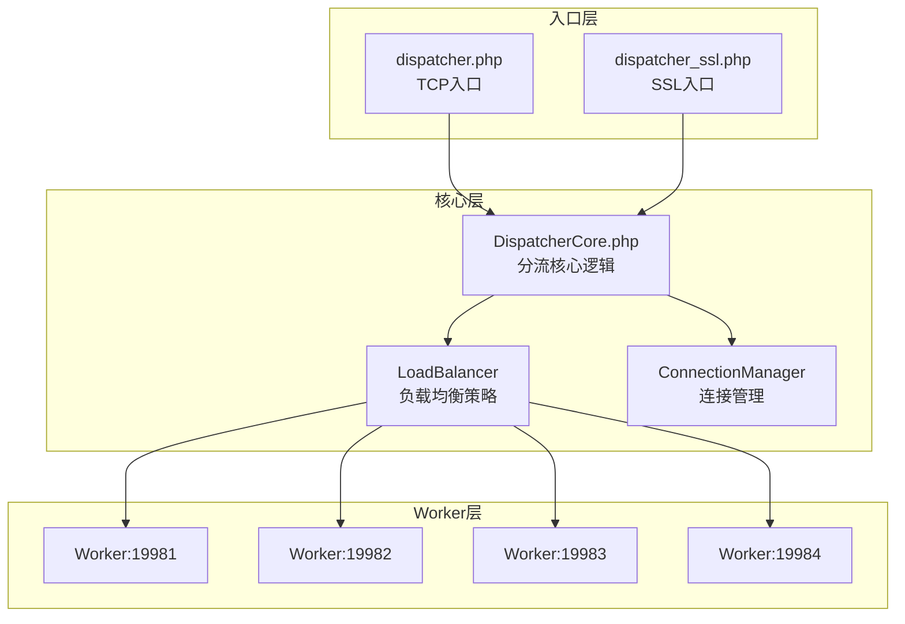

# Dispatcher 分流架构设计

Dispatcher 是 WLS（Weline Server）的负载均衡层：接收客户端连接，解析 HTTP 请求，按策略将请求转发到多个 Worker 端口，并回传响应。HTTP（TCP）与 HTTPS（SSL）共用同一套分流核心。

## 1. 架构背景

### 1.1 重构前问题

- `dispatcher.php` 与 `dispatcher_ssl.php` 存在大量重复代码（约 60%）
- TCP 版本为同步处理，性能差且无故障转移
- 两套入口的负载均衡算法不一致（简单轮询 vs Round-Robin + 故障转移）
- Master 心跳检查仅在 SSL 版本实现

### 1.2 设计目标

- 将分流逻辑从 SSL/TCP 入口中抽离，形成统一的**负载均衡核心**
- HTTP 与 HTTPS 共享同一套分流机制与故障转移
- 入口脚本只负责建连（TCP/SSL context），核心逻辑可复用、可测试

## 2. 架构图



## 3. 核心文件结构

```
app/code/Weline/Server/
├── bin/
│   ├── dispatcher.php          # TCP 入口（只处理 TCP socket）
│   └── dispatcher_ssl.php      # SSL 入口（只处理 SSL context）
└── Dispatcher/
    ├── DispatcherCore.php      # 核心分流逻辑（事件循环、连接管理）
    ├── LoadBalancer.php        # 负载均衡策略（RoundRobin、故障转移）
    └── HttpParser.php          # HTTP 请求/响应解析
```

## 4. 核心组件

### 4.1 DispatcherCore.php

- **职责**：统一事件循环、接受新连接、转发请求、回传响应、Master IPC/PID 生命租约检查
- **依赖**：监听 `$serverSocket`、Worker 端口列表 `$workerPorts`、`LoadBalancer`
- **要点**：`run()` 内按 Master IPC 连接与启动参数中的 Master PID 判断生命租约，然后执行 `selectAndProcess()`（如 `stream_select` 多路复用）；不再读取实例 JSON 做运行态共识。

### 4.2 LoadBalancer.php

- **职责**：Round-Robin 选 Worker、故障时尝试下一 Worker（`forwardWithFailover`）
- **状态**：`$currentIndex`、`$failedPorts`（可选，临时失败记录）
- **扩展**：新增策略（最少连接、加权轮询）只需改此类或新增策略类

### 4.3 HttpParser.php

- **职责**：解析 HTTP 请求（首行、头、体）、拼装/解析与 Worker 通信的格式，供 DispatcherCore 与 LoadBalancer 使用

### 4.4 入口脚本

- **dispatcher.php**：解析参数 → 创建 TCP `stream_socket_server` → `new DispatcherCore($socket, $workerPorts)` → `$core->run()`
- **dispatcher_ssl.php**：解析参数 → SSL 证书校验 → 创建 SSL context 与 `stream_socket_server`（或 Windows 降级为 TCP）→ 同上 `DispatcherCore` 初始化与 `run()`

## 5. 改动影响

| 文件 | 改动类型 | 说明 |
|------|----------|------|
| `bin/dispatcher.php` | 重写 | 精简为入口，核心逻辑移至 DispatcherCore |
| `bin/dispatcher_ssl.php` | 重写 | 精简为入口，核心逻辑移至 DispatcherCore |
| `Dispatcher/DispatcherCore.php` | 新建 | 核心分流逻辑 |
| `Dispatcher/LoadBalancer.php` | 新建 | 负载均衡策略 |
| `Dispatcher/HttpParser.php` | 新建 | HTTP 解析工具 |
| `Console/Server/Start.php` | 小改 | 更新 Dispatcher 启动逻辑（参数微调） |

## 6. 优势

1. **代码复用**：公共逻辑只写一次，维护成本低
2. **一致性**：HTTP 与 HTTPS 使用相同的分流算法和故障转移
3. **可扩展**：新增负载均衡策略只需修改或扩展 LoadBalancer
4. **可测试**：核心逻辑独立，便于单元测试
