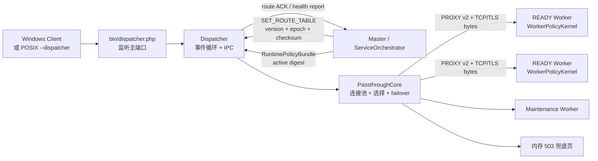
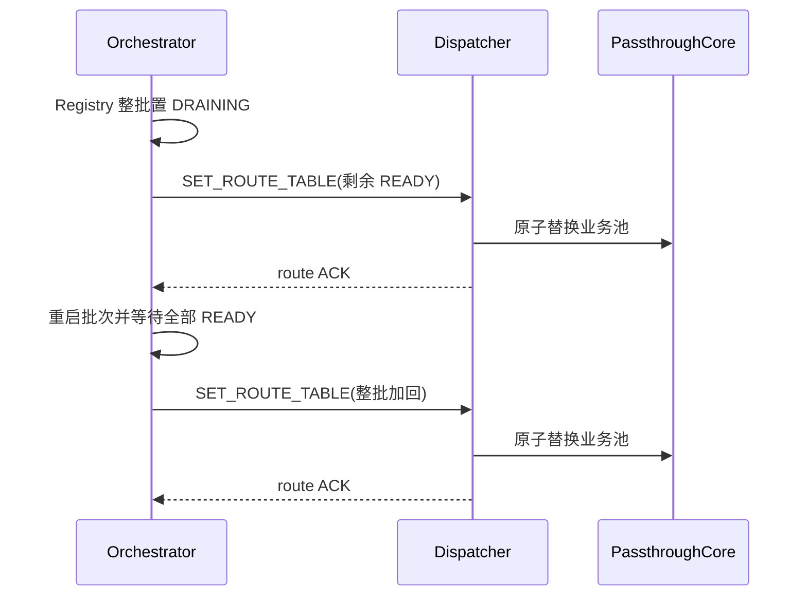
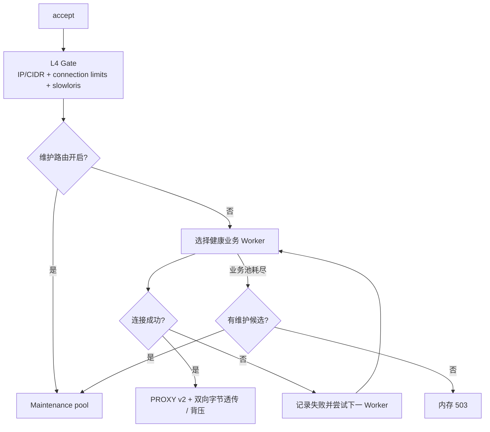

# Dispatcher 分流架构

> 状态：现行设计，2026-07-10。总体边界见 [WLS 运行时架构](WLS架构图.md)。

Dispatcher 是 Windows `auto` 与 Linux/macOS 显式 `--dispatcher` 时的数据面入口。它接收客户端连接、执行 L4 准入、维护 Master 下发的 Worker 路由快照，并由 `PassthroughCore` 完成后端连接、字节透传、背压和故障隔离。Dispatcher 不拥有 Worker 生命周期，也不执行 HTTP 规则、FPC、静态缓存或首页渲染。

Linux `auto` 是 SO_REUSEPORT direct，macOS `auto` 是 Master 共享监听 FD direct。两种拓扑都不启动 Dispatcher；客户端直接连 Worker，也不存在后端连接和 TCP 二次透传。

## 1. 组件关系

现行核心文件：

- `bin/dispatcher.php`：参数、监听 socket、实例/lease 元数据和 `Dispatcher` 启动。
- `Dispatcher/Dispatcher.php`：主事件循环、Master IPC、路由快照、准入与恢复任务调度。
- `Dispatcher/PassthroughCore.php`：后端连接、Worker 选择、连接复用、黑名单、维护回退。
- `Dispatcher/LoadBalancer.php`、`RoutingCacheService.php`、`SniParser.php`：连接级选择、路由与 TLS ClientHello 元数据。

旧文档中的 `DispatcherCore.php`、`dispatcher_ssl.php` 和逐端口 `add_worker/remove_worker` 已不是当前架构。

## 2. 路由权威

`SET_ROUTE_TABLE` 是唯一业务池权威。快照至少包含 role、version、epoch、端口、Worker 元数据和 checksum。

约束：

- Dispatcher 不从端口扫描、历史 PID 或旧池推导新的 Worker。
- POSIX Supervisor 通道会把 Master `SET_ROUTE_TABLE` 编码为 `POOL_SNAPSHOT`；`scope=business` 与 `scope=maintenance` 都是权威快照，不得忽略 maintenance scope。
- Dispatcher 加载 maintenance 快照后，必须对每个已入池端口返回 `worker_pool_ack`；Master 收齐后才提交维护态。只回 `pool_snapshot_ack` 不能代替端口级入池证明。
- 业务快照同时是退出显式维护路由的权威信号；ACK barrier 失败时 Master 强制回发业务快照并回收未提交维护容量。
- 正常重载先由 Master 在 Registry 完成整批状态 fence，再发布一次摘批快照。
- 批内 READY 事件暂不逐个发布；全部 READY 后一次性加回。
- force 整池切换只在 maintenance 池已 READY 且所有 Dispatcher ACK 后允许。
- 真故障可发布空业务池，此时进入恢复/维护兜底，而不是继续路由死端口。

## 3. 请求路径

健康探测只验证 Worker 已进入事件循环并可接入；首页 FPC 构建和进程缓存预热属于 Worker READY gate，不再由 Dispatcher 执行。

Dispatcher 只处理不需解密 HTTP 的 L4 子集：IP/CIDR allow/ban、连接数/连接速率、slow connection、TLS 握手失败计数和维护入口。Host、后台 Key、Origin Token、URI/Header/Body、请求限流、Static/FPC 始终在 Worker 执行，因为 Dispatcher 透传 TLS 字节时不具备可靠的 HTTP 语义。

Dispatcher 在连接 Worker 前写入含实例认证信息的 PROXY Protocol v2。Worker 只有在该元数据校验通过后才采用其 peer IP，防止外部客户端伪造代理头。

## 4. 调度公平性

Dispatcher 的 deferred 队列仅保留路由准入、黑名单探测和健康审计：

1. `set_pool`、`audit_worker_health`、全池恢复属于高优先控制任务。
2. `probe_blacklisted_workers` 属于低优先任务，accept pending 时可以暂停。
3. 若低优先 Fiber 已运行但队列出现高优先任务，会继续有界推进到完成，随后高优先任务越过其它 probe。
4. 首页 warmup Fiber 已删除，避免控制面与渲染职责耦合。

因此持续流量可以推迟普通探测，但不能永久饿死路由切换和 Worker 恢复。

## 5. 故障与维护回退

- 单端口连接失败：临时隔离并尝试其它 READY Worker。
- 全业务池不可用：排入高优先恢复审计；有 maintenance 候选时切维护池。
- maintenance 也不可用：返回内存 503，避免连接无界等待。
- Dispatcher 与 Master IPC/lease 失效：按子进程自治规则退出或重连，不读取实例 JSON 作为运行时共识。

## 6. 配置边界

常用配置在 `wls.dispatcher`：

- `max_accept_per_loop`
- `worker_connect_select_timeout_sec`
- `worker_health_audit_enabled`
- `fast_tls_path_enabled`
- `ssl_backend_preconnect_per_worker`

`homepage_warmup_enabled` 仅保留兼容入口，默认必须为 `false`。关闭时 Dispatcher 启动也不会扫描 warmup path observers。

Dispatcher 不单独读取 `security-rules.json` 或运行自己的 HTTP 规则轮询器。Master 发布同一 RuntimePolicyBundle，Dispatcher 只激活其中标记为 L4/dispatcher 的描述符，Worker 激活 mandatory/cache/deep/response 描述符。任一关键描述符无法执行时，该进程不得 ACK 新 digest。

## 7. 验证重点

- route version/epoch/checksum 只增不倒退，ACK 对应当前快照。
- reload 每批只有一次摘除和一次加回，不出现逐端口路由抖动。
- 持续 accept 下 `set_pool`、audit 和 all-workers recovery 仍前进。
- Worker kill 后死端口被移除；恢复 Worker 只有 READY 后才重新入池。
- keepalive、SSE、maintenance fallback 和硬 503 均有独立冒烟证据。
- Dispatcher/direct 对同一 HTTP 语料的 mandatory guard、限流、Static/FPC 和响应必须一致。
- Windows `auto` 必须保留 Dispatcher；Linux/macOS `auto` 不得意外启动 Dispatcher。
