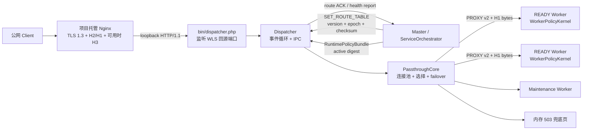
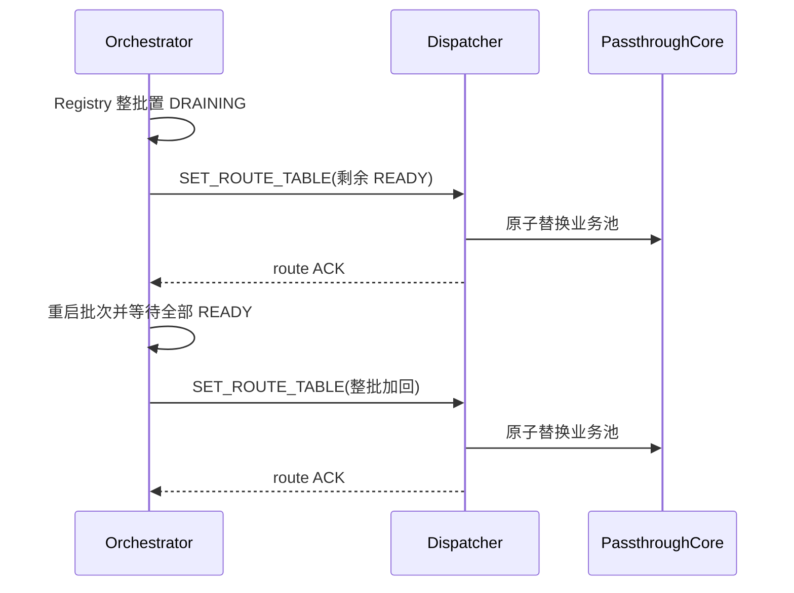
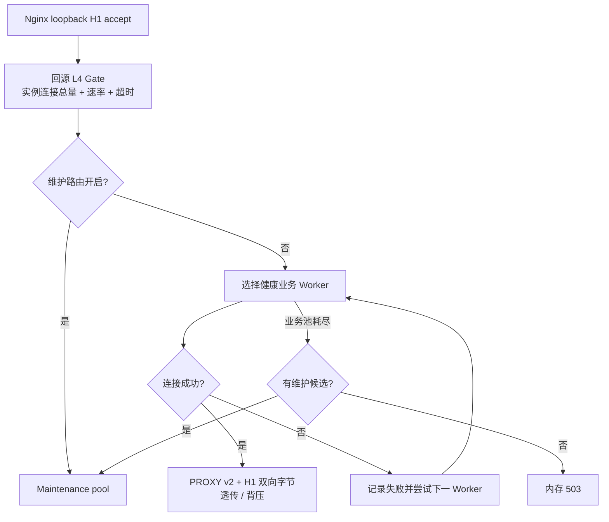

# Dispatcher 分流架构

> 状态：显式兼容/诊断拓扑，2026-07-26；不是任何平台的 `auto` 默认。总体边界见 [WLS 运行时架构](WLS架构图.md)。

Dispatcher 是所有平台显式 `--dispatcher` 时的 **WLS loopback HTTP/1.1 兼容入口**。公网客户端只连接项目托管 Nginx；Nginx 终结 TLS 1.3 与 H2/H1（H3 可用时），再把明文 H1 请求送到 Dispatcher。Dispatcher 维护 Master 下发的 Worker 路由快照，并由 `PassthroughCore` 完成后端连接、字节透传、背压和故障隔离；它不拥有 Worker 生命周期，也不执行 HTTP 规则、FPC、静态缓存或首页渲染。Windows `auto` 已改为 Nginx 直连 `worker_ports`，不会启动本组件。

所有平台 `auto` 都是 Direct：Linux 优先使用经能力验证的 `reuseport`，不可用时回退 Master 创建的 `shared_fd` loopback listener；macOS 使用 `shared_fd`；Windows 每个 Worker 绑定独立 `worker_ports`，由 Nginx upstream 直接均衡。Direct 不启动 Dispatcher，但也不是公网直连模式。

`shared_fd` rolling reload 使用标准安全分批，不启用 reuseport new-first surge，以避免退役独立 accept backlog 时产生 RST。Nginx upstream Keep-Alive 的 idle timeout 默认为 5 秒，因此 Worker drain 下限为 10 秒（idle + 5 秒）。这些是内部回源契约；公网入口仍然唯一属于项目托管 Nginx。

## 1. 组件关系

```mermaid
flowchart LR
  CLIENT["公网 Client"] --> NGINX["项目托管 Nginx\nTLS 1.3 + H2/H1 + 可用时 H3"]
  NGINX -->|"loopback HTTP/1.1"| ENTRY["bin/dispatcher.php\n监听 WLS 回源端口"]
  ENTRY --> DISP["Dispatcher\n事件循环 + IPC"]
  MASTER["Master / ServiceOrchestrator"] -->|"SET_ROUTE_TABLE\nversion + epoch + checksum"| DISP
  MASTER -->|"RuntimePolicyBundle\nactive digest"| DISP
  DISP --> CORE["PassthroughCore\n连接池 + 选择 + failover"]
  CORE -->|"PROXY v2 + H1 bytes"| W1["READY Worker\nWorkerPolicyKernel"]
  CORE -->|"PROXY v2 + H1 bytes"| W2["READY Worker\nWorkerPolicyKernel"]
  CORE --> MW["Maintenance Worker"]
  CORE --> FALLBACK["内存 503 兜底页"]
  DISP -->|"route ACK / health report"| MASTER
```

现行核心文件：

- `bin/dispatcher.php`：参数、监听 socket、实例/lease 元数据和 `Dispatcher` 启动。
- `Dispatcher/Dispatcher.php`：主事件循环、Master IPC、路由快照、准入与恢复任务调度。
- `Dispatcher/PassthroughCore.php`：后端连接、Worker 选择、连接复用、黑名单、维护回退。
- `Dispatcher/LoadBalancer.php`、`RoutingCacheService.php`：连接级选择与路由。`SniParser.php` 仅属于不可达的历史 WLS TLS 路径，不参与 Nginx-only 回源。

旧文档中的 `DispatcherCore.php`、`dispatcher_ssl.php` 和逐端口 `add_worker/remove_worker` 已不是当前架构。

## 2. 路由权威

`SET_ROUTE_TABLE` 是唯一业务池权威。快照至少包含 role、version、epoch、端口、Worker 元数据和 checksum。

```mermaid
sequenceDiagram
  participant O as Orchestrator
  participant D as Dispatcher
  participant P as PassthroughCore

  O->>O: Registry 整批置 DRAINING
  O->>D: SET_ROUTE_TABLE(剩余 READY)
  D->>P: 原子替换业务池
  D-->>O: route ACK
  O->>O: 重启批次并等待全部 READY
  O->>D: SET_ROUTE_TABLE(整批加回)
  D->>P: 原子替换业务池
  D-->>O: route ACK
```

约束：

- Dispatcher 不从端口扫描、历史 PID 或旧池推导新的 Worker。
- POSIX Supervisor 通道会把 Master `SET_ROUTE_TABLE` 编码为 `POOL_SNAPSHOT`；`scope=business` 与 `scope=maintenance` 都是权威快照，不得忽略 maintenance scope。
- Dispatcher 加载 maintenance 快照后，必须对每个已入池端口返回 `worker_pool_ack`；Master 收齐后才提交维护态。只回 `pool_snapshot_ack` 不能代替端口级入池证明。
- 业务快照同时是退出显式维护路由的权威信号；ACK barrier 失败时 Master 强制回发业务快照并回收未提交维护容量。
- 正常重载先由 Master 在 Registry 完成整批状态 fence，再发布一次摘批快照。
- 批内 READY 事件暂不逐个发布；全部 READY 后一次性加回。
- force 整池切换只在 maintenance 池已 READY 且所有 Dispatcher ACK 后允许。
- 真故障可发布空业务池，此时进入恢复/维护兜底，而不是继续路由死端口。

## 3. 请求路径

```mermaid
flowchart TD
  A["Nginx loopback H1 accept"] --> L4["回源 L4 Gate\n实例连接总量 + 速率 + 超时"]
  L4 --> B{"维护路由开启?"}
  B -->|是| M["Maintenance pool"]
  B -->|否| C["选择健康业务 Worker"]
  C --> D{"连接成功?"}
  D -->|是| E["PROXY v2 + H1 双向字节透传 / 背压"]
  D -->|否| F["记录失败并尝试下一 Worker"]
  F --> C
  C -->|业务池耗尽| G{"有维护候选?"}
  G -->|是| M
  G -->|否| H["内存 503"]
```

健康探测只验证 Worker 已进入事件循环并可接入；首页 FPC 构建和进程缓存预热属于 Worker READY gate，不再由 Dispatcher 执行。

Dispatcher 只处理回源 transport 的实例连接总量、速率、超时、路由和维护入口。公网客户端身份由项目托管 Nginx 通过固定 trusted-loopback 的转发头交给 Worker 重建；Host、后台 Key、Origin Token、URI/Header/Body、请求限流、Static/FPC 始终在 Worker 执行。Dispatcher 不再接收 TLS ClientHello，也不从 loopback socket peer 推导公网客户端身份。

Dispatcher 在连接 Worker 前写入含实例认证信息的 PROXY Protocol v2。Worker 只有在该元数据校验通过后才接纳该回源连接；公网客户端 IP 仍按托管 Nginx trusted-proxy 契约逐请求解析。

ACME HTTP-01 的公网路径由项目托管 Nginx 的 `/.well-known/acme-challenge/` location 转发到 Worker。Nginx 模式下 Dispatcher 的 `httpsEnabled=false`，因此不会对每个明文 upstream connection 执行 50ms inline peek；遗留 inline ACME shortcut 只有 Dispatcher 自己拥有 HTTPS 时才可能触发，而该拓扑已不可达。

## 4. 调度公平性

Dispatcher 的 deferred 队列仅保留路由准入、黑名单探测和健康审计：

1. `set_pool`、`audit_worker_health`、全池恢复属于高优先控制任务。
2. `probe_blacklisted_workers` 属于低优先任务，accept pending 时可以暂停。
3. 若低优先 Fiber 已运行但队列出现高优先任务，会继续有界推进到完成，随后高优先任务越过其它 probe。
4. 首页 warmup Fiber 已删除，避免控制面与渲染职责耦合。

因此持续流量可以推迟普通探测，但不能永久饿死路由切换和 Worker 恢复。

## 5. 故障与维护回退

- 单端口连接失败：临时隔离并尝试其它 READY Worker。
- 客户端发送 FIN：Dispatcher 立即向对应 Worker 传播写侧半关闭，同时继续排空 Worker→客户端下行；不得把客户端 `CLOSE_WAIT` 与后端 `ESTABLISHED` 成对保留到通用超时。
- 全业务池不可用：排入高优先恢复审计；有 maintenance 候选时切维护池。
- maintenance 也不可用：返回内存 503，避免连接无界等待。
- Dispatcher 与 Master IPC/lease 失效：按子进程自治规则退出或重连，不读取实例 JSON 作为运行时共识。

## 6. 配置边界

现行 Nginx 回源常用配置在 `wls.dispatcher`：

- `max_accept_per_loop`
- `worker_connect_select_timeout_sec`
- `worker_health_audit_enabled`

`fast_tls_path_enabled`、`ssl_backend_preconnect_per_worker` 与 SNI/TLS 配置只属于不可达的历史 WLS TLS 路径，不是当前调优入口。

`homepage_warmup_enabled` 仅保留兼容入口，默认必须为 `false`。关闭时 Dispatcher 启动也不会扫描 warmup path observers。

Dispatcher 不单独读取 `security-rules.json` 或运行自己的 HTTP 规则轮询器。Master 发布同一 RuntimePolicyBundle，Dispatcher 只激活其中标记为 L4/dispatcher 的描述符，Worker 激活 mandatory/cache/deep/response 描述符。任一关键描述符无法执行时，该进程不得 ACK 新 digest。

## 7. 验证重点

- route version/epoch/checksum 只增不倒退，ACK 对应当前快照。
- reload 每批只有一次摘除和一次加回，不出现逐端口路由抖动。
- 持续 accept 下 `set_pool`、audit 和 all-workers recovery 仍前进。
- Worker kill 后死端口被移除；恢复 Worker 只有 READY 后才重新入池。
- keepalive、SSE、maintenance fallback 和硬 503 均有独立冒烟证据。
- 连续多轮短 keep-alive 压测后，Dispatcher 的 `CLOSE_WAIT`/后端 `ESTABLISHED` 不随轮次累积，QPS 不因 select 集合膨胀持续下降。
- 显式 Dispatcher 与各平台内部 Direct 对同一 Nginx 回源 HTTP 语料的 mandatory guard、限流、Static/FPC 和响应必须一致。
- 所有平台 `auto` 都不得意外启动 Dispatcher；Windows 必须报告 `direct/worker_ports/select`。
- `/.well-known/acme-challenge/` 经 Nginx→Worker 可达，同时普通 H1 upstream accept 不得出现逐连接 50ms ACME peek。
