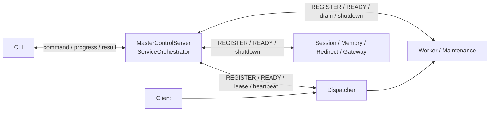
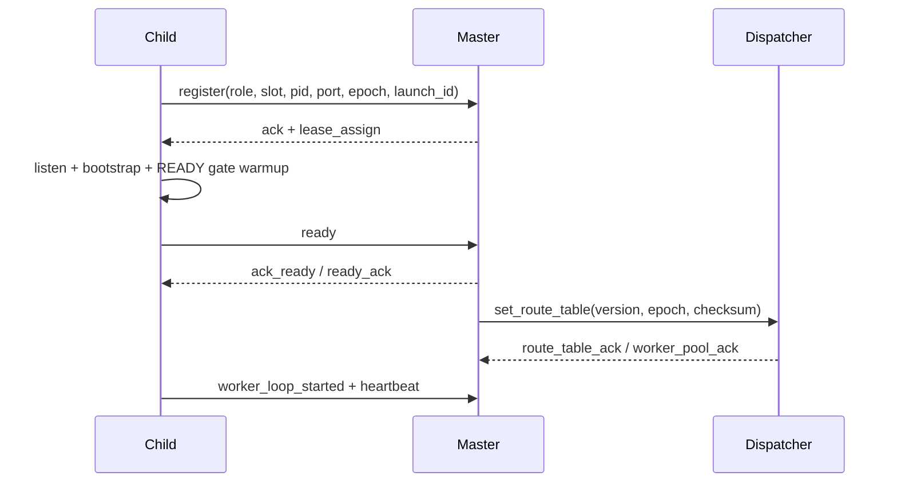
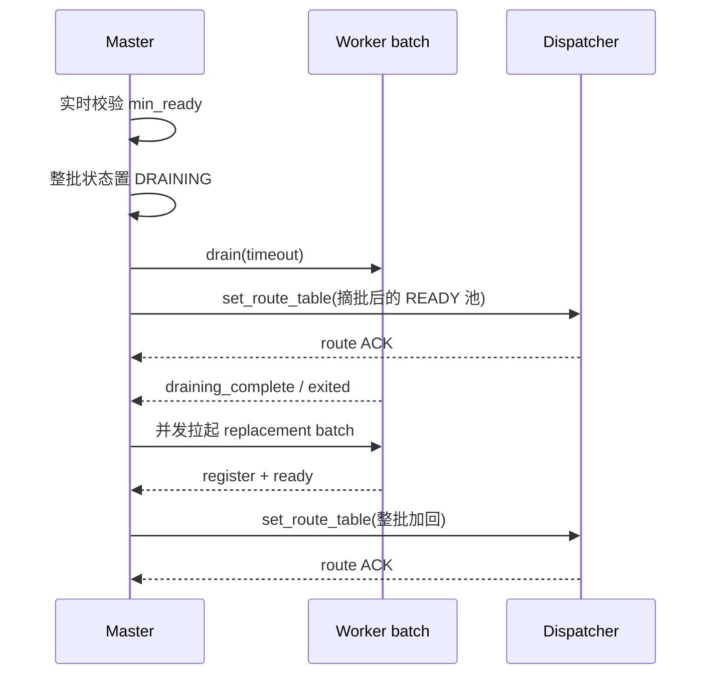

# WLS IPC 控制通道架构

> 状态：现行协议摘要，2026-07-10。消息常量以 `IPC/ControlMessage.php` 为准。

WLS 使用 NDJSON 控制通道连接 CLI、Master、Dispatcher、Worker 和其它子服务。控制面传递身份、READY、路由快照、排水、重载、停止与遥测；用户 HTTP/TLS 流量始终走独立数据面。

## 1. 控制面与数据面



控制 endpoint 由 Master 启动时分配，只监听本机并写入实例元数据供 CLI/子进程发现。`instance.json` 不是运行时共识；已连接会话、lease token、epoch、launch id 和 Master Registry 才是控制事实。

## 2. 帧格式

每条消息是一行 JSON 加换行符：

```json
{"type":"register","role":"worker","worker_id":2,"pid":12345,"port":19982}
{"type":"ready","role":"worker","worker_id":2,"port":19982}
```

接收方必须按 NDJSON 增量解析，不能假设一次 socket read 等于一条完整消息。未知类型记录后忽略；非法身份、过期 epoch/launch id 或不匹配 lease 的消息不得改变 Registry。

## 3. 启动闭环



语义：

- `REGISTER` 证明进程身份已接入控制面，不代表可服务。
- `READY` 必须晚于端口监听、框架初始化与 READY gate。
- Worker 只有进入 Master Registry 的 READY 状态后才可出现在路由快照中。
- `route_table_ack`/`worker_pool_ack` 关闭 Master 到 Dispatcher 的发布闭环。
- PID 为 0 仅表示尚未观察到 PID，不是生命周期状态。

## 4. 路由与重载闭环

逐端口 `add_worker/remove_worker` 不再是运行时权威。业务池只使用版本化 `set_route_table` 全量快照。



批内 READY 期间 Master 抑制逐个路由发布。成功时整批加回；失败/中止时解除抑制并把已 READY 的部分容量重新收敛。

## 5. 主要消息族

| 消息族 | 方向 | 用途 |
|---|---|---|
| `register`、`ack`、`lease_assign` | Child ↔ Master | 身份、槽位、租约 |
| `ready`、`ack_ready`、`ready_ack`、`worker_loop_started` | Child ↔ Master | 可服务验收 |
| `heartbeat`、`ping`、`pong`、`status_report` | 双向 | 存活与状态 |
| `set_route_table`、`route_table_ack`、`worker_pool_ack` | Master ↔ Dispatcher | 路由快照闭环 |
| `drain`、`draining_complete`、`shutdown`、`exited`、`exit_reason` | Master ↔ Child | 排水与终结 |
| `command`、`command_accept`、`command_done`、`command_result` | CLI ↔ Master | 运维命令 |
| `reload_progress`、`reload_completed`、`reload_failed` | Master → CLI | 长操作进度 |
| `dispatcher_alert`、`telemetry`、`route_observation` | Child → Master | 自愈与观测 |
| `set_maintenance_mode`、`maintenance_mode_ack` | Master ↔ Worker | 维护状态确认 |

完整的证书、Fiber、扩缩容、Gateway 和安全消息不在本文重复枚举，直接查 `ControlMessage`。

## 6. 主动终结与意外掉线

- Master 先发 `shutdown`：属于计划终结，子进程排水并退出，不触发错误复活。
- IPC 意外断开且 lease/Master 仍有效：子进程尝试重连并重新闭合 REGISTER/READY。
- lease 失效或 Master 身份不匹配：子进程按 `ChildMasterGuard` 自治退出，避免孤儿继续占端口。
- Master 以 Registry、PID/端口实时校验和角色策略决定单槽复活或升级；status/peek 查询不得写回这些状态。

## 7. 不变量

1. 任何消息只有通过实例、role、slot、epoch、launch id 和 lease 校验后才能改变生命周期。
2. READY 与路由是两个闭环；收到 READY 不等于 Dispatcher 已确认入池。
3. Dispatcher 不反向修改 Master Registry，也不从旧端口表恢复 Worker。
4. stop/reload/route/recovery 控制消息不能被持续 accept 流量永久饿死。
5. 所有 IPC 等待都有总 deadline；超时进入明确失败/降级路径，不叠加无界等待。
6. CLI 发现文件、PID 索引与端口历史都可重建，不可覆盖实时身份事实。

## 8. 代码锚点

- `IPC/ControlMessage.php`：消息与 action 常量。
- `IPC/MasterControlServer.php`：Master 监听与会话。
- `IPC/ChildControl/*`：子进程会话、lease 与 Master guard。
- `Service/ServiceOrchestrator.php`：消息处理、Registry、路由与恢复。
- `Dispatcher/Dispatcher.php`：Dispatcher IPC 和路由 ACK。
- `Console/Server/*`：CLI command/progress/result。
