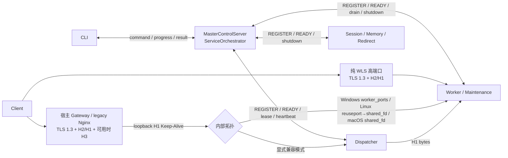
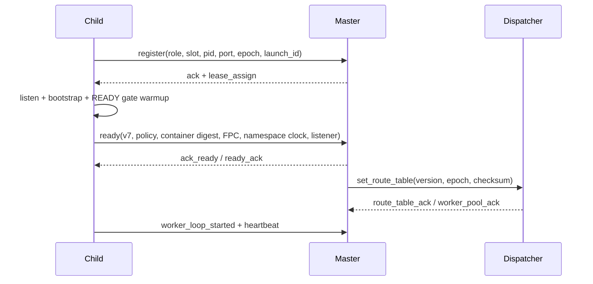
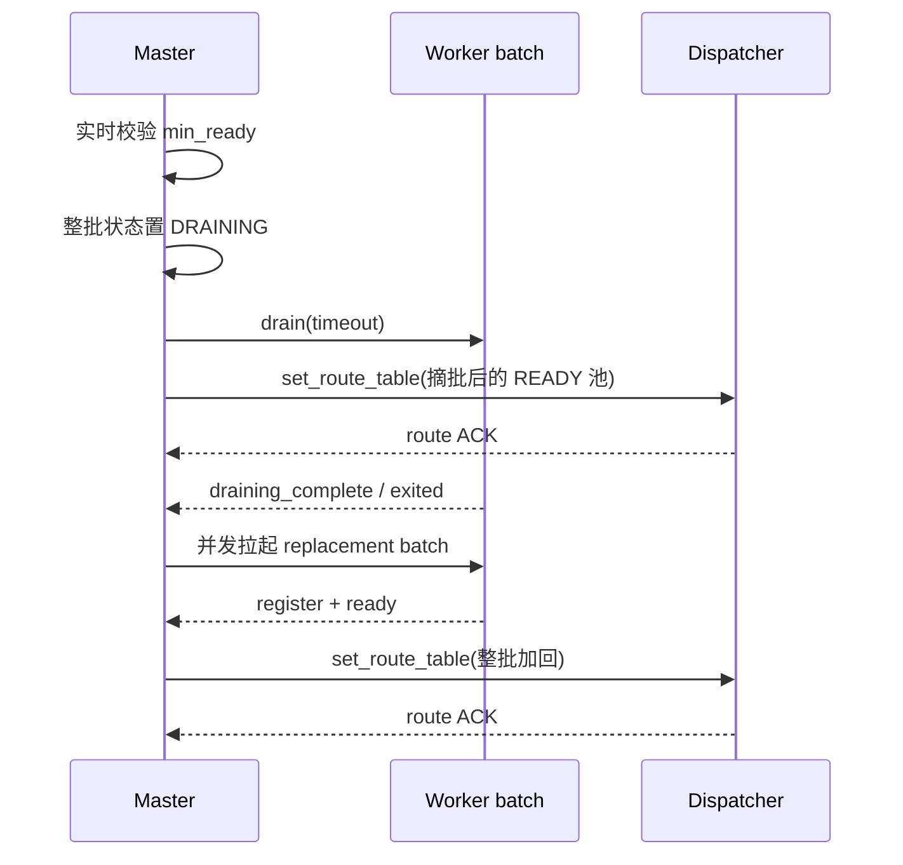

# WLS IPC 控制通道架构

> 状态：现行协议摘要，2026-07-24；包含 readiness v7 与 namespace IPC v1。消息常量与超时预算以 `IPC/ControlMessage.php` 为准。

WLS 使用 NDJSON 控制通道连接 CLI、Master、Dispatcher、Worker 和其它子服务。控制面传递身份、READY、路由快照、排水、重载、停止与遥测；公网协议不进入该通道。

现行公网数据面有两种：宿主级 Weline Gateway Nginx 或 legacy 项目 Nginx，均经 loopback HTTP/1.1 Keep-Alive 回源 Direct Worker；纯 WLS 则由 `worker_ssl.php` 直接提供 TLS 1.3/H2/H1 高端口入口。Windows 回源由 Nginx 均衡独立 `worker_ports`；Linux 自动优先 `reuseport`，不可用时回退 `shared_fd`；macOS 使用 `shared_fd`。这里的 Direct 仅表示内部回源 socket 由 Worker 接受。

## 1. 控制面与数据面


```mermaid
flowchart LR
  CLI["CLI"] <-->|"command / progress / result"| MASTER["MasterControlServer\nServiceOrchestrator"]
  MASTER <-->|"REGISTER / READY / lease / heartbeat"| DISP["Dispatcher"]
  MASTER <-->|"REGISTER / READY / drain / shutdown"| WORKER["Worker / Maintenance"]
  MASTER <-->|"REGISTER / READY / shutdown"| SIDE["Session / Memory / Redirect"]
  CLIENT["Client"] --> EDGE["宿主 Gateway / legacy Nginx\nTLS 1.3 + H2/H1 + 可用时 H3"]
  CLIENT --> PURE["纯 WLS 高端口\nTLS 1.3 + H2/H1"]
  EDGE -->|"loopback H1 Keep-Alive"| ROUTE{"内部拓扑"}
  PURE --> WORKER
  ROUTE -->|"显式兼容模式"| DISP
  ROUTE -->|"Windows worker_ports / Linux reuseport→shared_fd / macOS shared_fd"| WORKER
  DISP -->|"H1 bytes"| WORKER
```

控制 endpoint 由 Master 启动时分配，只监听本机并写入实例元数据供 CLI/子进程发现。`instance.json` 不是运行时共识；已连接会话、lease token、epoch、launch id 和 Master Registry 才是控制事实。

Nginx 的 owner/config generation、TLS/H2/H1/H3 运行证据属于公网边缘事实；Master Registry、Worker READY 与显式兼容模式下的 Dispatcher 路由 ACK 属于 WLS 回源事实。两者必须分别验证，不能用 IPC READY 推导公网协议已可用，也不能用 Nginx 本地响应替代真实 WLS health。

### 1.1 Supervisor 本机 endpoint 选择

Windows 保持 `127.0.0.1` 稳定 TCP 端口。POSIX 使用 UNIX socket，并在 bind/connect 两端通过同一个 `ControlEndpointResolver` 按以下顺序解析：

1. 原兼容路径 `BP/var/server/run/{sanitized-instance}/supervisor.sock`，总长度不超过 103 bytes 时原样使用。
2. 原路径超限时使用 `BP/var/server/run/.s/{socket-id}.sock`。
3. 项目内压缩路径仍超限时使用 `sys_get_temp_dir()/weline-{effective-uid}/{socket-id}.sock`。
4. 三个候选均超过 103 bytes 时，在 bind 前明确失败；不得静默切换 TCP 或截断实例名。

`socket-id` 是 `sha256(canonical-BP + NUL + 完整实例名)` 的前 24 个十六进制字符，即 96-bit 标识。项目内 `.s` 与用户临时目录必须由当前用户持有、拒绝符号链接并保持 `0700`；socket bind 后继续保持 `0600`。因此长 BP、中文路径或超长实例名不会突破 `sockaddr_un` 路径预算，也不会让不同项目/实例共享同一个临时 endpoint。

## 2. 帧格式

每条消息是一行 JSON 加换行符：

```json
{"type":"register","role":"worker","worker_id":2,"pid":12345,"port":19982}
{"type":"ready","role":"worker","worker_id":2,"port":19982,"readiness_protocol_version":7,"readiness_capabilities":["dynamic_first_render_proof_v1","compiled_container_digest_v1","cache_namespace_invalidation_v1"],"namespace_authority_clock":42}
```

接收方必须按 NDJSON 增量解析，不能假设一次 socket read 等于一条完整消息。未知类型记录后忽略；非法身份、过期 epoch/launch id 或不匹配 lease 的消息不得改变 Registry。

## 3. 启动闭环


```mermaid
sequenceDiagram
  participant C as Child
  participant M as Master
  participant D as Dispatcher

  C->>M: register(role, slot, pid, port, epoch, launch_id)
  M-->>C: ack + lease_assign
  C->>C: listen + bootstrap + READY gate warmup
  C->>M: ready(v7, policy, container digest, FPC, namespace clock, listener)
  M-->>C: ack_ready / ready_ack
  M->>D: set_route_table(version, epoch, checksum)
  D-->>M: route_table_ack / worker_pool_ack
  C->>M: worker_loop_started + heartbeat
```

语义：

- `REGISTER` 证明进程身份已接入控制面，不代表可服务。
- `READY` 必须晚于端口监听、框架初始化与 READY gate。
- 业务 Worker 的当前 READY v7 必须携带 `dynamic_first_render` 精确回执：`host/path/status_code/body_length/elapsed_ms/target_ms/attempts/fpc_status/ready/reason`，并声明 `compiled_container_digest_v1` 能力与 64 位 `container_registry_digest`。Master 只接受真实动态首页（`path=/`、FPC 非 HIT、2xx/3xx、非空正文）；配置了首屏耗时门禁时还必须满足 `elapsed_ms < target_ms`。Worker 容器摘要必须与 Master 启动快照相同；缺少版本、能力、摘要或任一证明字段都 fail closed。
- Maintenance Worker 不执行动态首页，因此不要求 `dynamic_first_render` 通过业务门禁；拓扑、策略、container digest、监听与 maintenance warmup 证明仍必须通过。
- 缺字段不代表“旧协议”。只有双方明确协商的版本/能力才可进入独立兼容分支；当前 Worker 统一使用 readiness v7。Namespace capability 是 v7 内的增量能力，没有单独提高 readiness 版本。
- Worker 只有进入 Master Registry 的 READY 状态后才可出现在路由快照中。
- `route_table_ack`/`worker_pool_ack` 关闭 Master 到 Dispatcher 的发布闭环。
- PID 为 0 仅表示尚未观察到 PID，不是生命周期状态。

## 4. 路由与重载闭环

逐端口 `add_worker/remove_worker` 不再是运行时权威。业务池只使用版本化 `set_route_table` 全量快照。


```mermaid
sequenceDiagram
  participant M as Master
  participant W as Worker batch
  participant D as Dispatcher

  M->>M: 实时校验 min_ready
  M->>M: 整批状态置 DRAINING
  M->>W: drain(timeout)
  M->>D: set_route_table(摘批后的 READY 池)
  D-->>M: route ACK
  W-->>M: draining_complete / exited
  M->>W: 并发拉起 replacement batch
  W-->>M: register + ready
  M->>D: set_route_table(整批加回)
  D-->>M: route ACK
```

批内 READY 期间 Master 抑制逐个路由发布。成功时整批加回；失败/中止时解除抑制并把已 READY 的部分容量重新收敛。

## 5. 主要消息族

| 消息族 | 方向 | 用途 |
|---|---|---|
| `register`、`ack`、`lease_assign` | Child ↔ Master | 身份、槽位、租约 |
| `ready`、`ack_ready`、`ready_ack`、`worker_loop_started` | Child ↔ Master | 可服务验收 |
| `heartbeat`、`ping`、`pong`、`status_report` | 双向 | 存活与状态 |
| `set_route_table`、`route_table_ack`、`worker_pool_ack` | Master ↔ Dispatcher | 路由快照闭环 |
| `drain`、`draining_complete`、`shutdown`、`exited`、`exit_reason` | Master ↔ Child | 排水与终结 |
| `cache_clear(cache_epoch)`、`cache_clear_ack` | Master ↔ READY Worker | 按单调代际原地清理 L1/Static/FPC，并闭合精确 ACK |
| `cache_namespace_invalidate_v1`、`cache_namespace_invalidate_ack_v1` | Master ↔ READY Worker | 只推进 namespace generation 进程快照，不执行任何全量缓存清理 |
| `command`、`command_accept`、`command_done`、`command_result` | CLI ↔ Master | 运维命令 |
| `reload_progress`、`reload_completed`、`reload_failed` | Master → CLI | 长操作进度 |
| `dispatcher_alert`、`telemetry`、`route_observation` | Child → Master | 自愈与观测 |
| `set_maintenance_mode`、`maintenance_mode_ack` | Master ↔ Worker | 维护状态确认 |

完整的证书、Fiber、扩缩容和安全消息不在本文重复枚举，直接查 `ControlMessage`。Gateway/native HTTP/3 等遗留消息仅供历史清理与取证，不得作为当前可配置能力。

### 5.1 异步控制操作终态

`command_result(state=queued)` 只表示 Master 已接纳操作，不代表维护路由、缓存或重载已生效。维护启停完成后，Master 会发送带同一 `operation_id` 的终态 `command_result`，并在 `status.control_operation.last` 保留最近一次有界结果，供已关闭原始连接的 CLI/后台轮询。

Dispatcher 维护启用的提交条件为：

1. maintenance Worker 全部 READY；
2. Supervisor 通道下发 `POOL_SNAPSHOT(scope=maintenance)`；
3. Dispatcher 实际加载维护池，并对每个维护端口返回 `worker_pool_ack(in_pool=true)`；
4. Master 收齐 ACK 后才提交 `maintenance_mode=true`。

无 READY Dispatcher 或 ACK 超时时，Master 必须强制发布业务池快照、停止未提交的 maintenance Worker、恢复 `maintenance_mode=false`，并把失败写入终态结果；禁止留下“Master 显示维护，Dispatcher 仍走业务池”的分裂状态。

### 5.2 Namespace generation 精准失效

Framework 的 `RuntimeNamespaceInvalidationPublisherInterface` 只向每个存活 Master 提交一个有界操作：单实例最多 100ms，整次发布最多 500ms，不在业务事务的 `afterCommit` 回调中等待 Worker ACK。Master 保留“一个 active + 一个按 namespace 最大 generation 合并的 pending”队列，最近 256 个或 10 分钟内的终态可按 `operation_id` 查询。

Worker 只在共享 `WorkerNamespaceGenerationApplier` 中验证严格 v1 帧、幂等推进进程快照并回传权威时钟/代际。Master 以接收操作时快照的 `client + role + worker + slot + lease + slot_generation + PID` 审计 ACK；断线、身份换代、缺能力、时钟落后、代际不足或超时都是结构化失败。三个 Worker 入口共用同一 applier，旧 `cache_clear` 协议与清理语义保持不变。

Worker 每次初始 READY、重连 READY、replacement/surge 准入前都从 DB 重建 namespace 快照，并上报 `cache_namespace_invalidation_v1` 能力和 `namespace_authority_clock`。Master 在发布最终 READY/路由前再次与 DB 权威时钟比对，落后 Worker fail closed。混合控制面必须保留 Supervisor 认证后的 source identity，不得用 Worker 自报字段替代。

#### v1 wire

```json
{
  "type": "cache_namespace_invalidate_v1",
  "schema_version": 1,
  "operation_id": "nsi_0123456789abcdef0123456789abcdef",
  "authority_clock": 42,
  "changes": [
    {"namespace": "website/default", "generation": 18}
  ]
}
```

- `operation_id` 匹配 `^nsi_[a-f0-9]{32}$`。同 ID + 同 payload hash 幂等，同 ID + 不同 hash 返回 `operation_conflict`。
- authority clock/generation 是正整数；changes 为 1..64 条，按 namespace 字典序，重复路径取最大 generation。
- NamespacePath 仅允许 `website/{code}` 或 `global/{scope}` 根，最多 16 段、512 bytes。NDJSON 整帧不得超过 64 KiB。
- 帧中不含 Session、cookie、admin 或 WelineEnv 快照。

ACK 为：

```json
{
  "type": "cache_namespace_invalidate_ack_v1",
  "operation_id": "nsi_0123456789abcdef0123456789abcdef",
  "success": true,
  "applied": true,
  "authority_clock": 42,
  "generations": {"website/default": 18},
  "source": {
    "client_id": 7,
    "role": "worker",
    "worker_id": 2,
    "slot_id": "worker#2",
    "lease_id": "...",
    "slot_generation": 4,
    "pid": 12345
  },
  "error_code": "",
  "error": ""
}
```

Direct 连接的 client id 来自 Master REGISTER ACK；Hybrid 由 Supervisor 用已认证 session 覆盖 source 字段。Master 不信任 Worker 自报身份，且要求 ACK 只包含请求的 namespace，每个 generation 不小于请求值。

#### operation 与失败

`publish()` 返回 `success/completed=false/attempted/operations_by_instance/failed_by_instance/skipped_by_instance`。未点名实例且没有 WLS 时，是可预期跳过：`success=true`、`attempted=[]`、`runtime_not_present`；显式点名不存在实例则失败。accepted 不等于 completed，`publishAndWait()` 才会按 ID 查终态。

Master 最多一个 active + 一个 pending，pending 按 namespace 最大 generation 合并；超过 64 个唯一 namespace 或队列成员上限返回 `queue_capacity_exceeded`。终态按 operation ID 保留最近 256 条或 10 分钟，先到的保留上限先触发淘汰。

`send_failed`、`ipc_disconnected`、`identity_changed`、`worker_rejected`、`ack_timeout` 等独立记录。默认 ACK 总 deadline 为 5 秒，配置范围 0.2..30 秒。

#### 默认、上线与回滚

`cache.namespace.publisher_enabled=false`、`cache.namespace.legacy_full_clear_fallback=true`、`wls.cache_namespace.require_capability=false` 是当前默认。

- Release A 保持上述默认，先上线 DB generation、读时指纹、shared applier/capability，并替换 Worker。
- 只有全部 routing-eligible Worker 已上报 capability + authority clock 后才可开 publisher 并把 capability 设为 required。精准 IPC/FPC 验收后才可关旧全清 fallback。
- 回滚先关 publisher、重开 legacy fallback 并等待 active/pending operation 终态；再执行一次旧 `cache_clear` 并收齐旧 ACK。不降表、不删 generation 历史。

配置切换后要重建 registry/provider 并重启 Master，仅 reload Worker 不足够。本节是源码契约摘要，不声称 Direct/Hybrid、replacement/surge、断线、超时或新旧 Worker 混合版本已在本次任务中实机验收通过。

### 5.3 模块重载 Api 边界

需要在受控后台操作后请求指定实例强制重载的模块，只能调用
`Weline\Server\Api\Control\RuntimeReloadGateway::forceReloadAsync()`，并读取只读
`RuntimeReloadResult`。Api 实现在 Server 内部把请求映射为现有 `reloadAsync(instance, force, timeout)`；
调用模块不得导入 `IPC\ControlMessage`、`Service\Control\IpcControlGateway`，也不得复制 action 字符串。
该边界只负责提交重载和映射 `success/message`，不改变 Master 的 ACK、排水或 READY 闭环。

## 6. 主动终结与意外掉线

- Master 先发 `shutdown`：属于计划终结，子进程排水并退出，不触发错误复活。
- IPC 意外断开且 lease/Master 仍有效：子进程尝试重连并重新闭合 REGISTER/READY。
- lease 失效或 Master 身份不匹配：子进程按 `ChildMasterGuard` 自治退出，避免孤儿继续占端口。
- Master 以 Registry、PID/端口实时校验和角色策略决定单槽复活或升级；status/peek 查询不得写回这些状态。
- REGISTER 只证明控制连接重新建立，不能清除单槽复活队列。只有 Worker 通过完整 READY 能力校验、Registry 状态为 READY，且该 IPC client 仍存在于当前 Control Server 时，Orchestrator 才提交恢复并清除队列。否则“注册后立刻掉线”的子进程会继续沿原 deadline/退避收敛，不能靠反复 REGISTER 把重启计数推到整组重启阈值。

## 7. 不变量

1. 任何消息只有通过实例、role、slot、epoch、launch id 和 lease 校验后才能改变生命周期。
2. READY 与路由是两个闭环；收到 READY 不等于 Dispatcher 已确认入池。
3. Dispatcher 不反向修改 Master Registry，也不从旧端口表恢复 Worker。
4. stop/reload/route/recovery 控制消息不能被持续 accept 流量永久饿死。
5. 所有 IPC 等待都有总 deadline；超时进入明确失败/降级路径，不叠加无界等待。
6. CLI 发现文件、PID 索引与端口历史都可重建，不可覆盖实时身份事实。
7. 缓存清理先快照全部 READY canonical Worker 的 `client + slot + lease + generation + PID`；Worker 只有在本进程全部 L1/Static/FPC reset 成功后才提交 `cache_epoch` 并 ACK。
8. Master 在一个总 deadline 内必须收齐快照中每个 Worker 的同代际、同租约 ACK；发送失败、会话换代、Worker 拒绝或超时都是结构化失败，不得回报清理成功。
9. Shared L2 namespace 清理是幂等操作：共享状态服务明确返回 `not_found` / `Session not found` 代表目标状态已经满足，尤其适用于多个 Worker 并发清同一池；传输、鉴权、超时或其他协议错误仍是硬失败。普通、TLS 与 EventBuffer Worker 统一通过 `WorkerCachePoolResetter` 检查每个池，任一真实失败都不提交 epoch。
10. 初次启动和内部 Direct surge 重载必须复用同一 dynamic first-render 校验器；不能出现初启严格、replacement 宽松或反向漂移。验收后的证明保存到 Registry metadata，`server:status <instance>` 在每个业务 Worker 下展示动态首渲染耗时、目标、状态、正文长度、尝试数、FPC 和实际 host/path。
11. 复活队列的完成条件是 READY + 当前 IPC 会话双重事实；REGISTERED、历史 client id、发现文件或仍存活 PID 都不能单独取消恢复。
12. Namespace generation 只允许单调推进；精准失效不得调用 ObjectManager reset、FPC 全清或旧 `cache_clear`。READY 发布前的 DB authority clock 对齐是必经门禁。

## 8. 代码锚点

- `IPC/ControlMessage.php`：消息与 action 常量。
- `IPC/MasterControlServer.php`：Master 监听与会话。
- `IPC/ChildControl/*`：子进程会话、lease 与 Master guard。
- `Service/ServiceOrchestrator.php`：消息处理、Registry、路由与恢复。
- `Service/Runtime/NamespaceInvalidationProtocol.php`：严格 v1 帧、容量与 operation id 契约。
- `Service/Runtime/WorkerNamespaceGenerationApplier.php`：三 Worker 入口共享的 generation 应用器。
- `Dispatcher/Dispatcher.php`：Dispatcher IPC 和路由 ACK。
- `Console/Server/*`：CLI command/progress/result。
