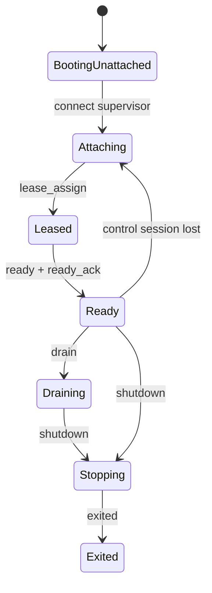

# WLS IPC 高可用重构方案 (2026-04-15)

## 目标

这份方案不是继续修补当前 WLS IPC，而是重新设计控制平面，目标是：

1. 并发启动下控制面稳定，不因连接风暴导致大面积 `connect/register/ready` 失败。
2. 任一子进程控制会话具备明确租约语义，不再依赖“旧 clientId 清理”式补丁维持一致性。
3. 控制消息、状态上报、日志汇聚彼此隔离，反压不会导致控制链路自激断开。
4. Master/Orchestrator 崩溃或重启时，子进程不进入雪崩式重连，数据面可继续服务。
5. 角色恢复路径一致、可观测、可回放，避免同一故障在不同路径下出现不同行为。

## 结论

当前架构的根问题不是“重连参数不对”，而是控制平面模型本身偏脆弱：

- 子进程直接连接一个随 Master 生命周期耦合的控制端点。
- 启动发现依赖实例文件轮询，控制面发现链过长。
- `register` / `ready` 是弱状态报文，没有真正的租约/会话语义。
- `clientId` 既承担连接标识，又被上层误当作实例健康事实。
- 控制消息、状态消息、日志消息共用同一个反压面。
- 子进程采用近似同节拍重连，故障时容易形成重连风暴。

如果目标是高可用，应该把 IPC 从“Master 控制 socket + 子进程直连”重构为“稳定控制平面 + 有租约的会话协议 + 分级消息通道 + 版本化状态收敛”。

## 当前设计的核心缺陷

### 1. 控制端点随 Master 生命周期波动

当前 `MasterControlServer` 是 Master/Orchestrator 生命周期的一部分。

- Master 还没进入主循环时，控制面还没真正 ready。
- Master 重启时，所有子进程的控制连接都会一起断。
- 子进程会把“控制端点不可用”和“Master 永久死亡”混为一谈。

### 2. 启动主路径把控制接入串死

当前子进程启动流程是：

1. 解析控制端点
2. connect
3. register
4. flush
5. ready
6. flush
7. 才完成接入

这在并发启动时会把所有子进程同时压向控制端点，形成 herd effect。

### 3. `clientId` 不是租约，却被当成事实来源

当前 registry 中保存 `ipcClientId`，多个路径把它当作实例是否“还活着”的核心判断依据。
但 `ipcClientId` 本质只是当前 TCP 连接槽位，不是稳定的会话所有权证明。

### 4. 缺少统一状态机

现在控制平面状态分散在：

- `handleRegister()`
- `handleReady()`
- `handleIpcDisconnect()`
- `performHealthChecks()`
- `performMasterSelfAudit()`
- `reconcileRoleSlotGaps()`
- `processResurrectQueue()`

这些路径各自都在“修状态”，导致相同故障在不同路径下被判定为不同类型。

### 5. 消息没有 QoS 分级

至少存在三类不同重要性的消息：

- Critical: register / ready / drain / shutdown / ack
- State: status_report / telemetry / pool_ack
- Best effort: log_line

但现在它们共用一个连接和一套反压面。

### 6. 重连策略没有去同步化

当前重连大多是固定间隔或小步长轮询。在控制面抖动时，所有子进程会近似同节拍重连，导致刚恢复的控制端点再次被打满。

## 新架构总览

新设计引入一个稳定的 `wls-supervisor`，作为 WLS 真正的控制平面根。

### 角色划分

1. `wls-supervisor`
   - 每个实例一个
   - 生命周期长于 Orchestrator、Dispatcher、Worker
   - 负责控制会话、租约、命令编排、状态收敛、事件日志

2. `wls-orchestrator`
   - 不再是“控制端点”
   - 只是 Supervisor 挂载的编排大脑
   - 可以重启、升级、热替换

3. `child-agent`
   - 每个 Worker / Dispatcher / Redirect / Shared Sidecar 内嵌
   - 只和 Supervisor 建立控制会话

4. `dispatcher-state-consumer`
   - Dispatcher 不再依赖一堆增量 ADD/REMOVE 消息维持池状态
   - 而是消费版本化的 Worker Pool Snapshot

## 核心原则

### 原则 1：控制端点必须稳定

控制平面端点不能随着 Orchestrator 重启而变化。

- Linux/macOS: 使用固定 Unix Domain Socket
- Windows: 使用固定 loopback TCP 端点

### 原则 2：实例槽位必须有租约

每个槽位（如 `dispatcher#1`、`worker#2`）任何时刻只能有一个有效控制会话。

引入：

- `slot_id`
- `lease_id`
- `generation`

所有 child -> control 的报文都必须带 `lease_id`。

### 原则 3：控制平面必须事件化、可回放

Supervisor 维护：

- 当前 slot snapshot
- append-only event log
- command progress log

### 原则 4：消息必须分级

1. `critical`
2. `state`
3. `best_effort`

`best_effort` 绝不能把 `critical` 挤死。

### 原则 5：子进程启动与控制接入解耦

推荐状态：

- `BOOTING_UNATTACHED`
- `ATTACHING`
- `LEASED`
- `READY`
- `DRAINING`
- `STOPPING`
- `EXITED`

## 新 IPC 协议

### 会话建立

子进程与 Supervisor 建立连接后第一步不是 `register`，而是：

```json
{"type":"hello","instance":"default","role":"worker","slot_id":"worker#2","pid":12345,"launch_nonce":"...","capabilities":["reload","drain","status"]}
```

Supervisor 返回：

```json
{"type":"lease_assign","slot_id":"worker#2","lease_id":"w2-l-000184","generation":42,"desired_state":"running"}
```

之后所有消息都必须带：

- `slot_id`
- `lease_id`
- `generation`

### READY

```json
{"type":"ready","slot_id":"worker#2","lease_id":"w2-l-000184","listen":{"host":"127.0.0.1","port":18082},"worker_loop_started":true}
```

Supervisor 返回：

```json
{"type":"ready_ack","slot_id":"worker#2","lease_id":"w2-l-000184","pool_snapshot_version":91}
```

### 心跳

```json
{"type":"heartbeat","slot_id":"worker#2","lease_id":"w2-l-000184","state":"ready","metrics":{"connections":12,"active_requests":2,"suspended_fibers":31}}
```

### 命令

CLI 提交：

```json
{"type":"command_submit","command_id":"cmd-000901","action":"rolling_restart","scope":"default","args":{"mode":"code"}}
```

## 新状态机



## Dispatcher 新设计

Dispatcher 只接收版本化全量快照：

```json
{
  "type": "pool_snapshot",
  "scope": "business",
  "version": 91,
  "workers": [
    {"slot_id":"worker#1","lease_id":"w1-l-000201","port":18081,"state":"ready"},
    {"slot_id":"worker#2","lease_id":"w2-l-000184","port":18082,"state":"ready"}
  ]
}
```

Dispatcher 原子替换当前业务池，而不是依赖 ADD/REMOVE 顺序。

## 新的心跳与故障检测

统一引入 `FailureDetector`，输入：

- current lease exists?
- TCP session alive?
- heartbeat age
- process alive
- ready ack age
- pool snapshot ack age

输出：

- `healthy`
- `suspect`
- `lost_control`
- `lost_process`
- `restart_required`
- `full_instance_recover_required`

## 重连策略重设计

### 禁止固定节拍重连

所有 child-agent 使用指数退避 + 抖动：

```text
attempt 1: 300ms ± 30%
attempt 2: 600ms ± 30%
attempt 3: 1.2s ± 30%
attempt 4: 2.4s ± 30%
cap: 15s
```

### 角色优先级

- session/memory: 永不放弃，最高优先恢复
- dispatcher: 高优先
- worker: 中优先
- maintenance: 低优先，但在 maintenance 模式下升高

## 发现机制重设计

### Linux/macOS

固定 UDS：

```text
var/server/run/<instance>/supervisor.sock
```

### Windows

固定 loopback TCP 控制端口，不再依赖短周期实例文件轮询。

## 推荐落地路径

### Phase 0

冻结现有 IPC 扩写，不再继续给 `register/ready/clientId` 模型加补丁。

### Phase 1

实现 Supervisor + 固定控制端点。

### Phase 2

引入 lease 协议：

- `hello`
- `lease_assign`
- `ready_ack`
- `heartbeat`
- `command_submit`
- `command_watch`

### Phase 3

Dispatcher 改为消费 `pool_snapshot(versioned)`。

### Phase 4

统一 `FailureDetector`，替代当前多条“修状态”路径。

### Phase 5

完成日志 / 状态 / 控制三类通道隔离。

## 第一阶段建议创建的代码边界

```text
app/code/Weline/Server/Supervisor/
├── Endpoint/
├── Lease/
├── Journal/
├── Protocol/
├── Command/
├── Runtime/
└── Supervisor.php
```

## 最终架构一句话

不要再让子进程去“连当前这一代 Master 的控制 socket”，而要让它们始终连接一个稳定的 Supervisor，并通过有租约的会话协议接入。

