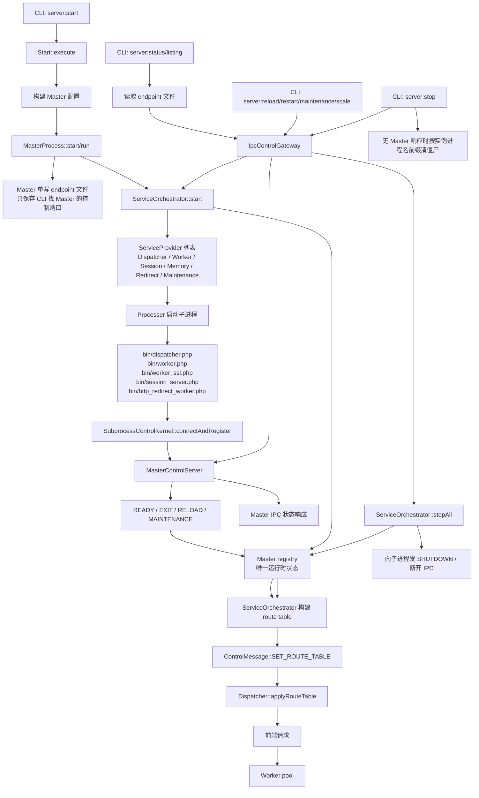

# WLS Master IPC 调用链

本图只描述当前 WLS 运行时权威链路。旧的实例 JSON 共识、进程命令行恢复、Dispatcher 自发现 Worker、直启 Worker 等路径已经移除；不在该链路内且没有生产引用的 private/protected 函数一律删除。

## 追踪口径

- CLI 命令入口、bin 子进程入口、IPC action handler、QueryProvider operation 和框架 public API 视为根入口。
- private/protected 方法必须被生产代码直接调用，或被明确的字符串 operation/action 分发引用；否则判定为不在调用链内。
- 测试不能单独让旧函数存活；如果测试只反射或覆盖已删除旧函数，应同步删除测试里的旧假设。
- Dispatcher 不发现 Worker，不读取实例 JSON，不接受旧 worker pool 增删消息；只接受 Master 下发的 `SET_ROUTE_TABLE`。
- 实例文件不再作为状态共识；endpoint 文件只承担 CLI 找 Master control port 的启动发现职责。
