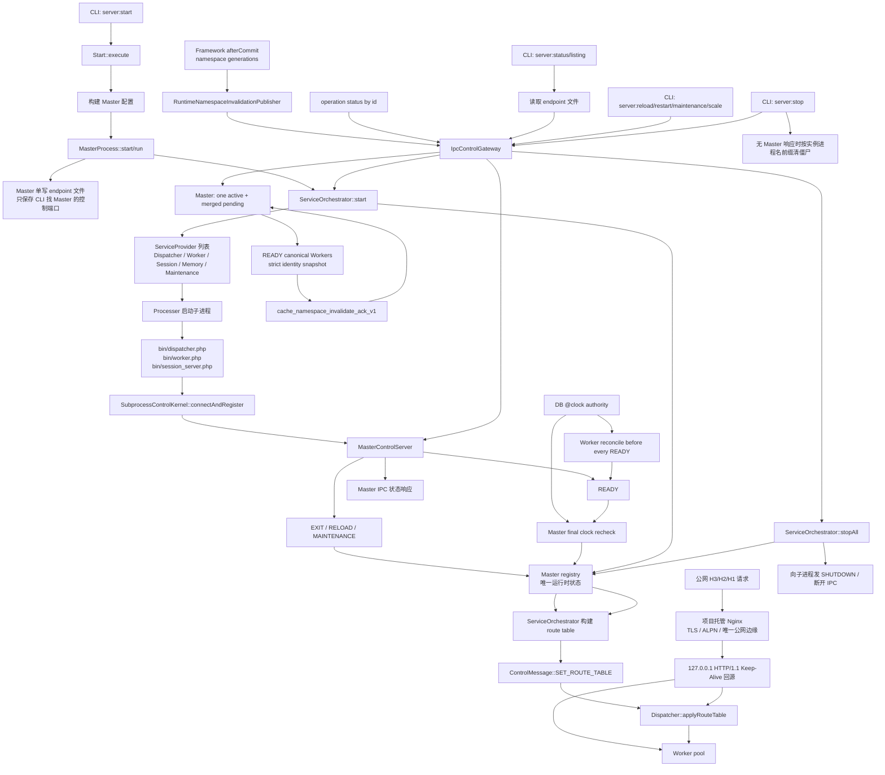

# WLS Master IPC 调用链

本图只描述当前 WLS 运行时权威链路。项目托管 Nginx 是唯一公网边缘，并通过 loopback HTTP/1.1 Keep-Alive 回源 Dispatcher 或 Worker。旧的实例 JSON 共识、进程命令行恢复、Dispatcher 自发现 Worker、直启 Worker 等路径已经移除；不在该链路内且没有生产引用的 private/protected 函数一律删除。

```mermaid
flowchart TD
    CLIStart["CLI: server:start"] --> StartExecute["Start::execute"]
    StartExecute --> MasterConfig["构建 Master 配置"]
    MasterConfig --> MasterProcess["MasterProcess::start/run"]
    MasterProcess --> EndpointFile["Master 单写 endpoint 文件\n只保存 CLI 找 Master 的控制端口"]
    MasterProcess --> Orchestrator["ServiceOrchestrator::start"]

    Orchestrator --> Providers["ServiceProvider 列表\nDispatcher / Worker / Session / Memory / Maintenance"]
    Providers --> SpawnChildren["Processer 启动子进程"]
    SpawnChildren --> ChildBins["bin/dispatcher.php\nbin/worker.php\nbin/session_server.php"]
    ChildBins --> ChildKernel["SubprocessControlKernel::connectAndRegister"]
    ChildKernel --> MasterControl["MasterControlServer"]
    MasterControl --> ReadyEvents["READY"]
    MasterControl --> LifecycleEvents["EXIT / RELOAD / MAINTENANCE"]
    LifecycleEvents --> Registry["Master registry\n唯一运行时状态"]

    ResourceCommit["Framework afterCommit\nnamespace generations"] --> NamespacePublisher["RuntimeNamespaceInvalidationPublisher"]
    NamespacePublisher --> IpcGateway
    IpcGateway --> NamespaceQueue["Master: one active + merged pending"]
    NamespaceQueue --> NamespaceWorkers["READY canonical Workers\nstrict identity snapshot"]
    NamespaceWorkers --> NamespaceAck["cache_namespace_invalidate_ack_v1"]
    NamespaceAck --> NamespaceQueue
    NamespaceStatus["operation status by id"] --> IpcGateway

    NamespaceDb["DB @clock authority"] --> ReadyReconcile["Worker reconcile before every READY"]
    ReadyReconcile --> ReadyEvents
    NamespaceDb --> FinalAdmission["Master final clock recheck"]
    ReadyEvents --> FinalAdmission
    FinalAdmission --> Registry

    Registry --> RouteBuild["ServiceOrchestrator 构建 route table"]
    RouteBuild --> SetRouteTable["ControlMessage::SET_ROUTE_TABLE"]
    SetRouteTable --> Dispatcher["Dispatcher::applyRouteTable"]
    FrontTraffic["公网 H3/H2/H1 请求"] --> ManagedNginx["项目托管 Nginx\nTLS / ALPN / 唯一公网边缘"]
    ManagedNginx --> LoopbackIngress["127.0.0.1 HTTP/1.1 Keep-Alive 回源"]
    LoopbackIngress --> Dispatcher
    LoopbackIngress --> WorkerPool["Worker pool"]
    Dispatcher --> WorkerPool

    CLIStatus["CLI: server:status/listing"] --> EndpointLookup["读取 endpoint 文件"]
    EndpointLookup --> IpcGateway["IpcControlGateway"]
    IpcGateway --> MasterControl
    MasterControl --> StatusSnapshot["Master IPC 状态响应"]

    CLIReload["CLI: server:reload/restart/maintenance/scale"] --> IpcGateway
    IpcGateway --> Orchestrator
    Orchestrator --> Registry
    Registry --> RouteBuild

    CLIStop["CLI: server:stop"] --> IpcGateway
    CLIStop --> PrefixCleanup["无 Master 响应时按实例进程名前缀清僵尸"]
    IpcGateway --> StopFlow["ServiceOrchestrator::stopAll"]
    StopFlow --> Registry
    StopFlow --> ChildShutdown["向子进程发 SHUTDOWN / 断开 IPC"]
```

## 追踪口径

- CLI 命令入口、bin 子进程入口、IPC action handler、QueryProvider operation 和框架 public API 视为根入口。
- private/protected 方法必须被生产代码直接调用，或被明确的字符串 operation/action 分发引用；否则判定为不在调用链内。
- 测试不能单独让旧函数存活；如果测试只反射或覆盖已删除旧函数，应同步删除测试里的旧假设。
- Dispatcher 不发现 Worker，不读取实例 JSON，不接受旧 worker pool 增删消息；只接受 Master 下发的 `SET_ROUTE_TABLE`。
- `worker_ssl.php`、`worker_ssl_event.php`、`http_redirect_worker.php` 与 Gateway 仅为 retired 历史实现，不属于当前启动或公网链路。
- 实例文件不再作为状态共识；endpoint 文件只承担 CLI 找 Master control port 的启动发现职责。
- Namespace 失效操作的接收与 Worker 终态分离；业务事务只负责有界提交，完成态通过 `operation_id` 查询。
- Worker 在 READY/重连/replacement/surge 前对齐 DB authority clock；Master 只向当前 READY canonical 身份快照发送，并对 ACK 的 client/slot/lease/generation/PID 做全量相等校验。
- `publish()` 只在单实例 100ms/总计 500ms 内获取 Master 接纳；Worker 终态由 operation ID 查询，不阻塞业务 afterCommit。
- 回滚顺序是关 publisher、开 legacy full-clear fallback、drain operation、执行旧 `cache_clear`；DB generation 和历史不降级。

## 本次验证边界

本图反映当前源码调用链，不代表本次已在专用 WLS 上完成 Direct/Hybrid、初启/重连/replacement/surge、ACK 超时/断线或混合版本验收。上线前必须用非 9501 的独立实例补齐这些证据。
