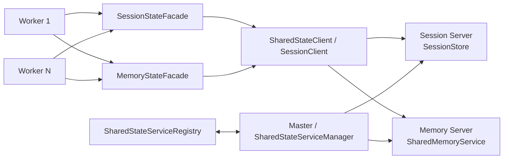
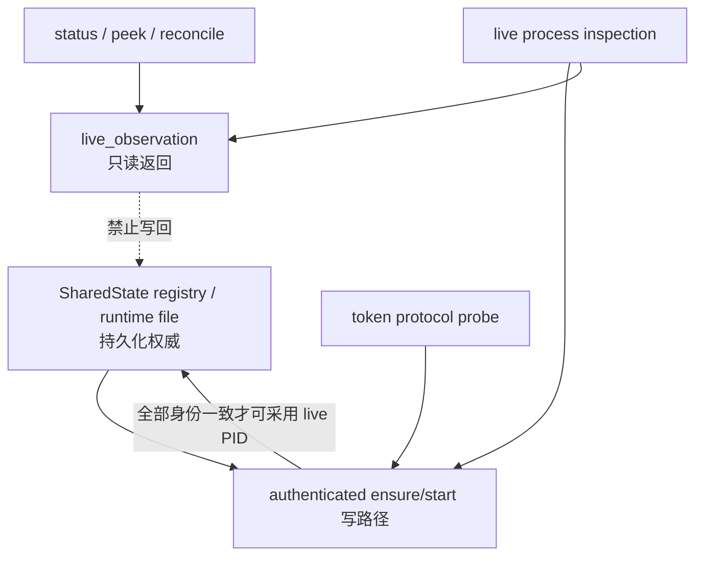
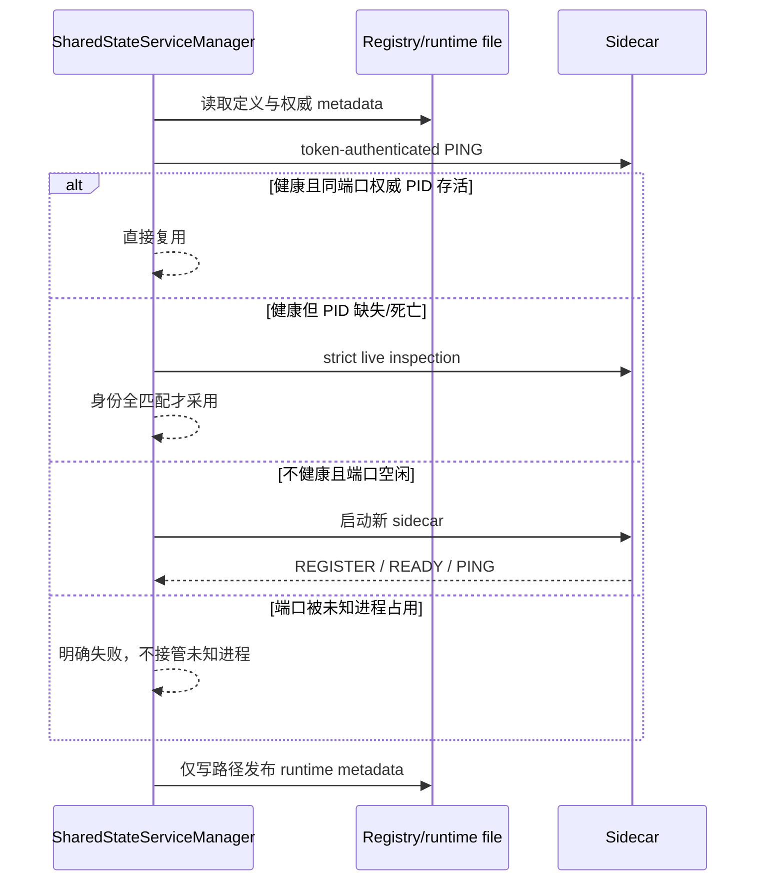

# WLS Session / Memory 共享服务架构

> 状态：现行设计，2026-07-10。本文只描述 WLS 内置 sidecar；Redis/Memcached 后端细节以对应 Backend 类为准。

WLS 将跨 Worker 状态放到两个独立 sidecar：Session Server 保存会话，Memory Server 提供共享缓存与原子操作。Worker 只持有客户端连接池和可重建本地缓存，不把单个 Worker 内存当作跨进程权威。

普通后台启动在 Windows、macOS、Linux 统一通过 `Processer::batchCreate()` 并发拉起 Session 与 Memory，共享一个 READY deadline；只有显式 frontend 可见窗口模式逐个创建独立控制台。launcher 返回值只用于确认提交成功，最终 runtime/registry 的服务 PID 必须来自已认证的 sidecar 存活身份，不能依赖创建顺序。

## 1. 组件关系



主要代码：

- `Service/SharedStateServiceManager.php`：ensure、probe、stop、runtime metadata。
- `Service/SharedStateServiceRegistry.php`：sidecar 元数据与 consumer token。
- `Service/SharedSidecarInspector.php`：PID、角色、进程名、项目 scope 校验。
- `Service/SharedStateProtocolProbe.php`：带 token 的协议 PING/SHUTDOWN。
- `Service/SessionStateFacade.php`、`MemoryStateFacade.php`：Worker 调用边界。
- `Session/Server/*`、`Shared/Service/SharedMemoryService.php`：服务端实现。
- `Service/SharedRuntimeConnectionWarmup.php`：Worker 启动后的连接池预连。

## 2. 状态权威



规则：

1. `status`、`peekRuntime` 和 registry merge 是纯读，不能修改 registry、runtime file 或 PID 索引。
2. 端口历史只能用于观察；不能用“曾经占用该端口的 PID”覆盖权威 PID。
3. 只在 PID 正在运行、协议 token 有效、role、process name、instance/project scope 全部一致时返回 `live_observation`。
4. authenticated ensure 路径可以采用 live PID，但执行同等身份校验。
5. 已认证 PING 成功且同端口 runtime PID 仍存活时，直接沿用该权威 PID，避免每次 ensure 重复慢进程扫描。

## 3. 启动与复用



多个 WLS 实例可以共享同一 sidecar。每个实例登记 consumer token；停止单实例只释放自己的 token。最后一个 token 消失后，sidecar 按 grace period 自治退出或由显式 stop/restart 关闭。

Windows 冷创建也必须遵守同一并发边界。`SharedStateServiceManager` 为 Session/Memory 构造同一批精确 argv；批次项同时携带平台无关 `argv` 与 Windows `windowsArgv`。符合“非阻塞、child owns PID、当前 PHP_BINARY、有效 cwd/log”的项由 `Processer` 一次进入 Master-owned `proc_open(array)`，不得再退回逐项 PowerShell `Start-Process`。两个进程先全部创建，再在一个总 deadline 内并行执行 token-authenticated PING；只有协议回传的 PID、role、instance 和 token 全部一致才发布 READY，任何 PID=0 或关键角色超时都明确失败。

2026-07-17 在 Parallels Windows 11 ARM + PHP 8.4.23 NTS x64 仿真、本地磁盘副本中做了独占冷建：旧 PowerShell 路径实际需要约 3.5–4 秒/进程，并会撞上 2 秒 helper 结果预算；修正后 Session/Memory 两项以 `master_owned_proc_open` 提交共 `36.309ms`，同一秒取得 PID，约 1 秒完成 authenticated PING。该结果证明 sidecar 创建不再制造 10 秒级串行等待；它不替代原生 Windows ARM64 PHP 的后续复测。

## 4. Worker 访问路径

- Session：框架 Session 层 → `SessionStateFacade` → WLS/Redis/Memcached Backend。
- Memory/FPC：Cache Pool → Framework `AdapterFactory` → 编译 Provider → Server
  `WlsMemoryAdapter` → `MemoryStateFacade` → Memory sidecar。Framework 不引用 Server 具体类。
- 模块 KV/批缓冲：Framework `SharedCacheStateFactoryInterface` / `SharedBufferStateFactoryInterface`
  → Server Api Provider → `MemoryStateFacade`。Currency、Visitor 等调用方只依赖 Framework 契约；
  Server 缺失时由调用模块执行进程缓存或数据库持久化降级。
- `WlsMemoryAdapter` 构造只装配配置与本地 L1，不连接共享态；首次远端操作才惰性建立 L2
  连接。远端失败进入短 cooldown：读降级 miss、写/CAS/clear 返回失败，删除保持幂等，
  避免每个请求重复等待。
- Worker 启动后以低优先 Fiber 预连 Session/Memory；失败不阻断事件循环，真实请求仍按连接超时与重连策略处理。
- sidecar 断开是基础设施故障，Master 优先单服务复活；不能把一次 status 查询变成“修正 PID”的副作用。

## 5. TLS Session Cache 边界

业务 Session 命名空间仍不是 TLS Session Cache。PHP 8.4 的 Stream SSL 服务端没有纯 PHP 外部 Session Cache 回调，因此该版本只验证同一 HTTP/1.1 Keep-Alive 或 HTTP/2 多路复用连接内的握手复用；跨连接、跨 Worker TCP TLS 恢复保持 unsupported/unverified。

PHP 8.6 的 `session_new_cb/session_get_cb/session_remove_cb` 与 `Openssl\Session` 已接入独立 TLS 子存储和专用 fail-fast 客户端：逐条 TTL、条目/字节/DER 上限、原子读取删除、禁用持久化，证据不记录 Session ID/DER/密钥或控制令牌；回调不会调用可能阻塞重连的通用业务 `SharedStateClient`。sidecar 不可用时立即退化为完整握手且不能阻断 Worker 事件循环。该机制是 TCP 外部有状态缓存，不是 HTTP/3 原生数据面的无状态 Ticket Key Ring。故障窗口门禁要求所有 HTTPS 请求成功、实际跨 Worker、sidecar 代际切换和恢复后的独立复用证明；故障窗口内的恢复比例只作诊断，因为 sidecar 不可用时完整握手是正确降级。Windows PHP 8.6.0alpha2 x64-on-ARM 样本已实证同 Worker、跨 Worker、reload 与恢复后各 24/24；400 轮故障窗口的 800 次 HTTPS 均成功，其中 382 次为恢复握手，恢复后再次 24/24。当前恢复握手 P95 156.236ms 未通过固定生产门禁 P95 ≤ 50ms，运行时非原生且仍为 prerelease，稳定三平台原生矩阵也未完成；因此默认仍关闭，持久功能证据不得等同当前 active scope 或 production-ready。

## 6. 配置

当前示例位于 `app/etc/env.sample.php`：

```php
'wls' => [
    'session' => [
        'port' => 19970,
        'session_ttl' => 86400,
        'max_sessions' => 50000,
        'persist_interval' => 30,
        'persist_on_writes' => 100,
        'gc_interval' => 300,
        'wls_server' => ['host' => '127.0.0.1', 'port' => 19970],
    ],
    'memory_service' => [
        'enabled' => true,
        // host / port / token_file_name 可按实例配置
    ],
    'shared_service' => [
        'empty_token_exit_grace_sec' => 30,
        'empty_token_check_interval_sec' => 120.0,
    ],
],
```

默认 token 文件位于项目 `var/session/`，端口非默认时 runtime resolver 会生成端口作用域 token，避免不同项目/实例误复用。

## 7. 验证重点

- 多 Worker 写入同一 Session 后读到一致值。
- Memory 原子操作和 FPC shared key 在 Worker 间可见。
- sidecar kill 后只复活该角色，业务 Worker 不整池掉线。
- 连续运行 `server:status`/peek 前后 registry/runtime file 内容不变。
- 端口被非 WLS 或其它项目进程占用时拒绝复用。
- 单实例停止只移除自身 consumer；最后 consumer 释放后按 grace period 清理。
- Windows 全冷状态必须记录 launcher mode、批量提交时间、两个权威 PID 和 authenticated ready 时间；正常 WLS sidecar 批次不得出现 `parallel_helpers`。
- 首页 Shared FPC 写入超过协议帧上限时必须返回失败，不能继续生成 Process receipt 或伪 READY；压缩后的首页载荷需在 Memory 日志验证无 `frame_too_large`，随后每个 Worker 仍须完成 Process L1 精确读回。
