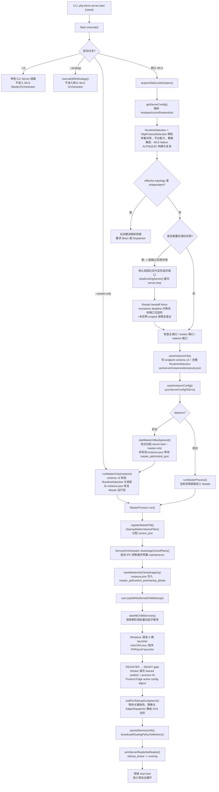
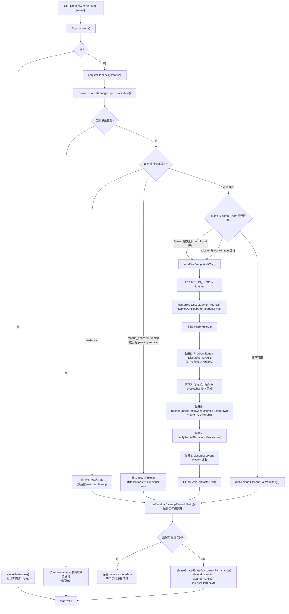

# WLS 启动与关闭链路图

## 适用范围

- 本文描述默认 WLS Orchestrator 模式下的单实例链路，即 `php bin/w server:start [name]` 与 `php bin/w server:stop [name]`。
- `--cli` 和 `--strategy` 会在 `Start::execute()` 早期分流，不进入本文的 Master/Orchestrator 主链路。
- `server:stop --all` 只是外层枚举多个实例，单实例的关闭协议仍然复用本文的关闭链路。

## 启动链路图

## 关闭链路图

## 关键分支说明

- 新启动在停止旧实例之前产生不可变 `RuntimeSelection` 与 `HttpProtocolSelection`，并以 endpoint schema v3 写入完整数组。`--master-only` 不再从多个布尔/字符串重新推导；v3 中任一 topology/listener/event/SSL/HTTP protocol/policy 投影缺失或冲突就在绑定端口前拒绝。旧 v2 只做读取兼容，Master 运行期不会在没有完整 selection 时把它标记为 v3。
- h2/h3 启用时，WLS Native Protocol Engine 的当前平台二进制、ALPN、QUIC、session ticket、upstream keep-alive 与 atomic reload 必须在 Master 创建前通过真实 probe；缺失时单一控制面在带 30 秒锁 deadline 的流程中安装固定摘要 Go 工具链、构建自包含二进制并复验。失败中止启动，不在子进程已经创建后静默改成 h1。
- `independent` 尚无完整 READY/策略保证，`RuntimeStrategyResolver` 和旧 endpoint 的 `--master-only` 重入都明确拒绝，不允许进入永远无法 READY 的运行态。
- `server:start -r` 在调用 `server:stop` 前会固化旧实例当下真实监听的主端口、控制端口、Dispatcher/Worker 端口和 Redirect 端口（排除可跨实例复用的 Session/Memory sidecar）。停止后在一个 monotonic 总 deadline 内反复清理端口探测缓存，只有目标端口全部无监听且本项目+本实例 scoped 进程前缀全部无存活 PID 才能继续。
- 重启交接超时时，端口 owner/scope 只用于诊断；`Start` 不杀 unknown/foreign 进程、不换端口、不跳过栅栏，而是中止新 Master 启动。
- `-r` 和 `-r -f` 都会在停止旧代前保存 `app/etc/env.php` 中的原始 `system.maintenance` 值；平滑 `-r` 随后才临时开启维护态。无论新 Master 成功、超时、端口栅栏失败或中途 return/fatal，启动事务都恢复该原值：原来已开启则保持开启，原来关闭则恢复关闭。
- 后台重启只有在新 Master 已进入 `running` 后才提交维护事务：启动进程绕过实例列表缓存，按显式实例 endpoint 直连控制面，保留本次命令的 `operation_id`，并在一个 monotonic 总 deadline 内等待该操作退出 `active/queued` 且 `maintenance_mode` 等于快照值。Direct Master 只会在全部 READY Worker 完成维护门禁 ACK 后提交该状态；缺失 `maintenance_mode/control_operation` 字段、endpoint 不可控或超时都属于启动失败，禁止打印“维护模式已关闭”。
- 后台 `server:start` 在锁、维护态和启动输出 finalizer 全部执行后才提交 CLI 退出码：实例进入 `running` 返回 `0`；Master 控制面未确认、`WLS_STARTUP_FAIL_FAST`、READY 超时或 READY 数不足统一返回非零。`Cli` 只把命令显式返回的整数映射为跨平台进程退出码，旧命令的 `null/bool/object` 返回值继续按成功处理。
- 前台 `--foreground -r` 的 Master 与启动命令是同一进程，进入 `runMasterProcess()` 前没有可自连的 control endpoint。因此该分支只原子恢复持久维护快照并提交事务；随后 Master 重新读取 `Env`，在 Worker READY 路径把同一初始维护态应用到所有 Worker。前台路径不得在主循环启动前等待自身 IPC。
- `server:start -r -f` 属于停机型切换，旧实例不会走平滑排水等待，而是更快进入本地清理。
- `server:stop -f` 仍然优先走 IPC STOP，但会把 Orchestrator 切到 `skipDrain=true`，也就是跳过关闭阶段 1/2，直接进入统一终止、校验和关闭 IPC。
- 如果 CLI 侧等待 IPC 进度超时，且判断停机流并未继续推进，`Stop` 会强杀 Master 并执行本地 residual cleanup。
- 如果本地 residual cleanup 后仍检测到残留进程，`Stop` 不会立刻删除 `var/server/instances/{instance}.json`，而是保留元数据，避免失去后续恢复和继续清理的控制线索。

## 跨平台批量启动约束

### macOS/Linux

- 先将整批命令严格预检为 `PHP_BINARY` argv，任一项含 shell 操作符或解析失败时，在未创建子进程前放弃优化路径。
- Master 用 `proc_open` argv + `bypass_shell` 启动一个短命 `php -r` launcher；不经 `sh`/`bash`/`dash`，也不为每个 Worker 串行等待 PID。
- launcher 为每项 `pcntl_fork`，子进程 `setsid`、重置 0/1/2 后 `pcntl_exec`最终 PHP argv。fork PID 经 exec 保持不变，因此 batch 回传的是真实 Worker PID，不是 launcher 或 shell PID。
- Linux 从 `/proc/self/fd`、macOS 从 `/dev/fd` 枚举 Master FD；默认将 FD > 2 在 launcher 中映射为 `/dev/null`，Worker 不得继承 Master 的 control/lock FD。macOS direct 只对经探测的公开 listener FD 3 显式保留；FFI 可用时 child 在 exec 前再关闭其它替代槽位。
- PID 回显使用一个总 deadline。收集后立即关管道、终结/回收 launcher 并 `proc_close`；Master 不长期保留 shell、launcher 或子进程 `proc` resource。
- launcher 退出后 Worker PPID 可重托管到 PID 1、`launchd` 或容器 subreaper；以真实 PID + lease + IPC 判定健康，不要求 PPID 恒等于 Master。
- 优化 launcher 不可用时，只能在严格预检尚未产生子进程时回退；已提交但 PID 超时的项返回 0 交给 IPC REGISTER 收敛，不重复启动。
- 通用 POSIX 后台 `Processer::create()` 使用 `cd && exec nohup ... & echo $!`。`exec` 让复合后台子 shell 原位替换为最终 PHP 进程，因此 `$!`、`ps`、PID 索引和子进程自报 PID 必须一致；禁止把短命 launcher 和真实进程同时登记为同一服务。

### Windows

- `Processer::batchCreate()` 将启动项分配到固定 K 路 PowerShell launcher，默认 K=4、范围 1-8；每一路内部顺序 `Start-Process`，各路并行。
- 所有 launcher 提交完成后才开始 batch result 总预算，避免脚本准备时间提前耗尽结果窗口。
- WLS framework child 自己持久化权威 PID，父进程只接收 raw PID，不重复写同一 PID 索引。
- helper 超过 TTL 后只发终止；确认退出前保留资源和结果文件，随后补登记迟到 PID、输出诊断并清理。
- 单 launcher 提交失败会在有界预算内逐项降级，不会让整组 Worker 静默返回 0。

### 进程身份租约与安全退场

- 所有 Master 发起的终止、滚动替换、surge 退场和 PID 文件清理都先冻结 `pid + canonical process_name + launch_id`；探测结果只允许 `running / exited / identity_mismatch / unknown` 四类处理。
- `exited` 与 `identity_mismatch` 表示当前 PID 已不属于该租约，只清理匹配的旧记录，不向该 PID 发信号；`unknown` 必须 fail closed 并保留诊断，不能把“探测不到”当作“可以杀”。
- Worker 终止默认不做进程树 kill；协议边缘 direct 的公开端口归 Edge，legacy direct 的公开端口是共享资源。任何单槽恢复与 surge 退场都禁止按公开端口杀进程。
- 进程标题只保留实例、role、slot、launch/generation 的短标识；PID/端口/生命周期文件和日志不得保存控制 token、TLS key 路径等敏感参数。
- `name_index/pid_index/port_index` 的更新必须持有同一全局锁；清理路径锁失败时 fail closed，不允许退化为无锁删除。`port_index` 只是共享端口的建议代表，删除旧代时只有当前 owner 与冻结租约一致才可 CAS 释放，并优先提升仍存活的共享 owner。
- 端口占用诊断必须分别报告内核 listener PID/命令和 `port_index` 建议 owner；不得把内核 Master PID 与历史 Worker 名称拼成一个伪进程事实。
- `server:status`、实例枚举和普通读取是只读操作，不得因为 endpoint 与 PID index 的短暂发布顺序差异执行清理。读取时可用新鲜 Master lease 覆盖内存视图，但不回写 endpoint；只有 lease 的实例名、running 状态、心跳、epoch、PID 和精确受管进程身份全部匹配，才承认 Master 存活。任何破坏性 stale cleanup 在落盘前必须再次执行同一 lease 校验。

## 运行拓扑平台边界

- Windows `auto` 固定使用 Dispatcher；Linux/macOS `auto` 使用 direct。默认 HTTPS 的公开 listener 由协议边缘拥有：POSIX Edge 直达 Worker，Windows Edge 后接内部 Dispatcher；只有关闭 Edge 的 h1 legacy 路径才使用 SO_REUSEPORT/共享 FD。三者共用 REGISTER→WARMING→READY、policy digest 与分批重载契约；业务 Worker 的 READY v3 必须证明首页 Process FPC 已热，并提交绕过 FPC 的动态首渲染回执。
- 拓扑/依赖预检发生在任何 Master/Worker 创建之前；POSIX direct 不满足能力时明确失败并提示显式 `--dispatcher`，不在已创建进程后静默改拓扑。
- macOS `worker_count=auto` 使用性能核数并受内存预算限制；启动与 Doctor/建议共用同一个 resolver，显式 `-c` 保持不变。
- 旧 `linux-direct` 只做读取兼容，新状态统一写为 `direct`；新实例的 SSL engine 默认为 `stream`。
- 当前 `RuntimeStrategyResolver` 在启动预检阶段同时拒绝 `event_buffer + direct` 与 `event_buffer + authenticated PROXY v2 Dispatcher`；Windows 原生 EventBuffer 也明确拒绝。EventBuffer Adapter 仍属实验代码，不是当前受支持拓扑的可选 SSL engine，不得再把它描述为 macOS/Linux Dispatcher+TLS 可用路径。
- Worker 通过 `--public-origin` 获得对外 scheme/authority；READY 首页预热与真实 HTTP/HTTPS FPC key 一致，实例文件只是兼容兜底。
- macOS shared-FD TLS 与 200ms 首读衔接只属于协议引擎关闭的 legacy Worker-TLS 路径；默认由 WLS Native Protocol Engine 终结公开 TLS/QUIC，Worker 使用私有 h1 keep-alive。

## 平台验收边界

- Windows：必须在原生 Windows 做 2/4/8/16 Worker cold/warm 多轮，核对 PowerShell 返回 PID、IPC REGISTER PID、helper TTL/临时文件回收和 Defender 下 p95；macOS/模拟单元结果不代替该门禁。
- macOS：核对 batch PID = Worker `getmypid()` = REGISTER PID；launcher 退出后 PPID 重托管可接受，但不得残留 `php -r`/shell；用 `lsof -p {worker_pid}` 确认只有 direct 的公开 listener FD 3 可从 Master 继承，control/lock 和其它 listen FD 不得泄漏。
- Linux：必须独立 CI/实机重复 macOS 的 PID/PPID/残留进程检查，并用 `/proc/{worker_pid}/fd` 检查 FD 隔离；额外验证 SO_REUSEPORT/direct、TLS 和容器 subreaper。macOS 结果不代替 Linux。

## Worker 重载约束

- Worker 数达到阈值后默认三批，`worker_reload_min_ready=auto` 默认保留约三分之二 READY 容量。
- 每批 DRAIN 前按实时 Registry 再校验容量；不足时拒绝摘批。
- force 只有在 maintenance 池已被所有 Dispatcher ACK 后才允许整池单批，否则自动降级为安全分批。
- 每批先统一置 DRAINING 并发布一次摘批快照，批内全部 READY 后再发布一次加回快照。
- Direct 使用 new-first：先拉起独立 surge 槽并验证 policy、listener、runtime 和首页 Process FPC。原生协议模式还必须先发布 READY upstream 集合并等待 WLS Native active config digest ACK，才能排水旧槽；canonical 全部 READY 后，surge 按冻结身份租约退场。
- 普通、stream TLS 与 EventBuffer Worker 的 DRAIN 都先停止公开 accept，并完成已分派请求与待写响应。维护模式 ACK 是另一条更短的屏障：策略先立即生效，业务 Worker 至少跨过一个 transport loop，再等待 active request/Fiber 与 response output 清空；空闲 preconnect、未完成 TLS/HTTP 和 slowloris 不得阻塞 ACK。EventBuffer 已完整落入 PHP buffer 的流水线请求属于已接纳工作，按每 tick 有界预算通过同一 WorkerPolicyKernel 生成响应后再 ACK；只有不完整输入可忽略。
- 所有 drain/exit 等待使用总 deadline；到期后报告仍在途的具体阶段，不能用无界等待或静默关闭掩盖长尾。

## 关键代码锚点

- `app/code/Weline/Server/Console/Server/Start.php`
  - `execute()`
  - `runMasterOnly()`
  - `startMasterInBackground()`
  - `runMasterProcess()`
  - `saveInstanceInfo()`
- `app/code/Weline/Server/Service/MasterProcess.php`
  - `run()`
  - `saveMasterInfo()`
  - `stopWithProgress()`
- `app/code/Weline/Server/Service/ServiceOrchestrator.php`
  - `bootstrapControlPlane()`
  - `startAll()`
  - `runLoopWithDeferredChildStartup()`
  - `requestStop()`
  - `stopAll()`
- `app/code/Weline/Server/Service/Runtime/HttpProtocolSelection.php`
- `app/code/Weline/Server/Service/Runtime/ProtocolEdgeRuntime.php`
- `app/code/Weline/Server/Service/Provider/ProtocolEdgeProvider.php`
- `app/code/Weline/Server/Console/Server/Stop.php`
  - `execute()`
  - `stopInstance()`
  - `sendStopViaIpcAndWait()`
  - `runResidualCleanupPairWithRetry()`
- `app/code/Weline/Server/Service/ServerInstanceManager.php`
  - `getInstanceInfo()`
  - `deleteInstance()`
  - `finalizeAfterMasterExit()`

## 读图建议

- 启动图里，`Start.php` 负责“参数固化、锁、端口/证书/实例快照”；`MasterProcess` 负责“控制面启动与主循环”；`ServiceOrchestrator` 负责“子服务并发启动、READY 验收和运行期调度”。
- 关闭图里，CLI `Stop.php` 既是停机发起方，也是最终兜底清理方；真正的统一停机协议在 `ServiceOrchestrator::stopAll()` 中完成。
