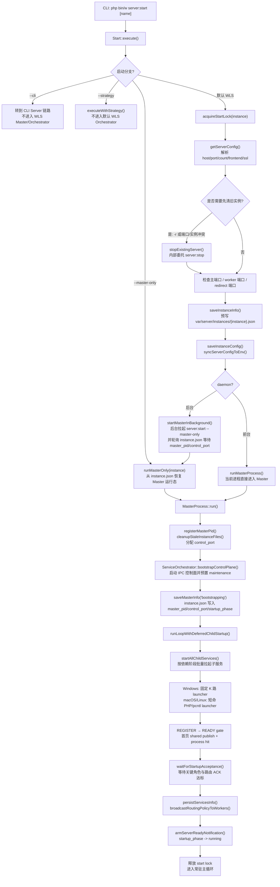
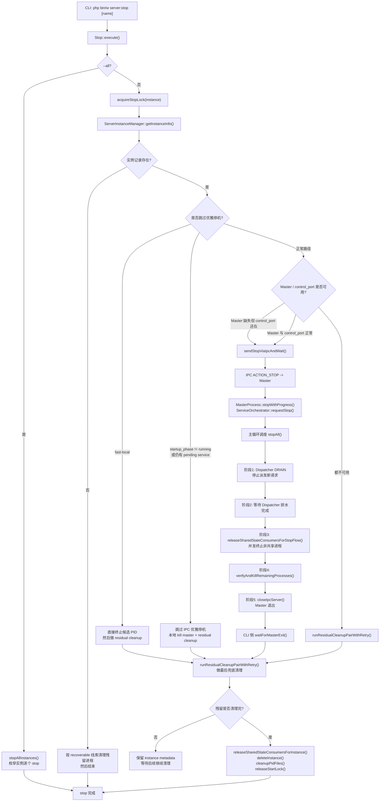

# WLS 启动与关闭链路图

## 适用范围

- 本文描述默认 WLS Orchestrator 模式下的单实例链路，即 `php bin/w server:start [name]` 与 `php bin/w server:stop [name]`。
- `--cli` 和 `--strategy` 会在 `Start::execute()` 早期分流，不进入本文的 Master/Orchestrator 主链路。
- `server:stop --all` 只是外层枚举多个实例，单实例的关闭协议仍然复用本文的关闭链路。

## 启动链路图

## 关闭链路图

## 关键分支说明

- `server:start -r` 会先通过 `stopExistingServer()` 复用 `server:stop` 链路清理旧实例，再进入新的启动链路。
- `server:start -r -f` 属于停机型切换，旧实例不会走平滑排水等待，而是更快进入本地清理。
- `server:stop -f` 仍然优先走 IPC STOP，但会把 Orchestrator 切到 `skipDrain=true`，也就是跳过关闭阶段 1/2，直接进入统一终止、校验和关闭 IPC。
- 如果 CLI 侧等待 IPC 进度超时，且判断停机流并未继续推进，`Stop` 会强杀 Master 并执行本地 residual cleanup。
- 如果本地 residual cleanup 后仍检测到残留进程，`Stop` 不会立刻删除 `var/server/instances/{instance}.json`，而是保留元数据，避免失去后续恢复和继续清理的控制线索。

## 跨平台批量启动约束

### macOS/Linux

- 先将整批命令严格预检为 `PHP_BINARY` argv，任一项含 shell 操作符或解析失败时，在未创建子进程前放弃优化路径。
- Master 用 `proc_open` argv + `bypass_shell` 启动一个短命 `php -r` launcher；不经 `sh`/`bash`/`dash`，也不为每个 Worker 串行等待 PID。
- launcher 为每项 `pcntl_fork`，子进程 `setsid`、重置 0/1/2 后 `pcntl_exec`最终 PHP argv。fork PID 经 exec 保持不变，因此 batch 回传的是真实 Worker PID，不是 launcher 或 shell PID。
- Linux 从 `/proc/self/fd`、macOS 从 `/dev/fd` 枚举 Master FD；所有 FD > 2 在 launcher 中映射为 `/dev/null`，Worker 不得继承 Master 的 listen/control/lock FD。FFI 可用时 child 在 exec 前再关闭这些替代槽位；FFI 被策略禁用时只保留无资源所有权的 `/dev/null` 槽位。
- PID 回显使用一个总 deadline。收集后立即关管道、终结/回收 launcher 并 `proc_close`；Master 不长期保留 shell、launcher 或子进程 `proc` resource。
- launcher 退出后 Worker PPID 可重托管到 PID 1、`launchd` 或容器 subreaper；以真实 PID + lease + IPC 判定健康，不要求 PPID 恒等于 Master。
- 优化 launcher 不可用时，只能在严格预检尚未产生子进程时回退；已提交但 PID 超时的项返回 0 交给 IPC REGISTER 收敛，不重复启动。

### Windows

- `Processer::batchCreate()` 将启动项分配到固定 K 路 PowerShell launcher，默认 K=4、范围 1-8；每一路内部顺序 `Start-Process`，各路并行。
- 所有 launcher 提交完成后才开始 batch result 总预算，避免脚本准备时间提前耗尽结果窗口。
- WLS framework child 自己持久化权威 PID，父进程只接收 raw PID，不重复写同一 PID 索引。
- helper 超过 TTL 后只发终止；确认退出前保留资源和结果文件，随后补登记迟到 PID、输出诊断并清理。
- 单 launcher 提交失败会在有界预算内逐项降级，不会让整组 Worker 静默返回 0。

## 运行拓扑平台边界

- Windows/macOS/Linux 默认都使用 Dispatcher + stream Worker，共用 REGISTER→WARMING→READY、路由 ACK 和分批重载契约。
- `linux-direct` 只保留 stream Worker；`event_buffer + linux-direct` 在启动命令构建时直接拒绝。
- `event_buffer` 在 Windows 拒绝，在 macOS/Linux 仅允许 Dispatcher+TLS，且需要 PHP event/OpenSSL 扩展和独立压测。
- Worker 通过 `--public-origin` 获得对外 scheme/authority；READY 首页预热与真实 HTTP/HTTPS FPC key 一致，实例文件只是兼容兜底。

## 平台验收边界

- Windows：必须在原生 Windows 做 2/4/8/16 Worker cold/warm 多轮，核对 PowerShell 返回 PID、IPC REGISTER PID、helper TTL/临时文件回收和 Defender 下 p95；macOS/模拟单元结果不代替该门禁。
- macOS：核对 batch PID = Worker `getmypid()` = REGISTER PID；launcher 退出后 PPID 重托管可接受，但不得残留 `php -r`/shell；用 `lsof -p {worker_pid}` 确认未继承 Master listen/control/lock FD。
- Linux：必须独立 CI/实机重复 macOS 的 PID/PPID/残留进程检查，并用 `/proc/{worker_pid}/fd` 检查 FD 隔离；额外验证 SO_REUSEPORT/direct、TLS 和容器 subreaper。macOS 结果不代替 Linux。

## Worker 重载约束

- Worker 数达到阈值后默认三批，`worker_reload_min_ready=auto` 默认保留约三分之二 READY 容量。
- 每批 DRAIN 前按实时 Registry 再校验容量；不足时拒绝摘批。
- force 只有在 maintenance 池已被所有 Dispatcher ACK 后才允许整池单批，否则自动降级为安全分批。
- 每批先统一置 DRAINING 并发布一次摘批快照，批内全部 READY 后再发布一次加回快照。

## 关键代码锚点

- `app/code/Weline/Server/Console/Server/Start.php`
  - `execute()`
  - `runMasterOnly()`
  - `startMasterInBackground()`
  - `runMasterProcess()`
  - `saveInstanceInfo()`
- `app/code/Weline/Server/Service/MasterProcess.php`
  - `run()`
  - `saveMasterInfo()`
  - `stopWithProgress()`
- `app/code/Weline/Server/Service/ServiceOrchestrator.php`
  - `bootstrapControlPlane()`
  - `startAll()`
  - `runLoopWithDeferredChildStartup()`
  - `requestStop()`
  - `stopAll()`
- `app/code/Weline/Server/Console/Server/Stop.php`
  - `execute()`
  - `stopInstance()`
  - `sendStopViaIpcAndWait()`
  - `runResidualCleanupPairWithRetry()`
- `app/code/Weline/Server/Service/ServerInstanceManager.php`
  - `getInstanceInfo()`
  - `deleteInstance()`
  - `finalizeAfterMasterExit()`

## 读图建议

- 启动图里，`Start.php` 负责“参数固化、锁、端口/证书/实例快照”；`MasterProcess` 负责“控制面启动与主循环”；`ServiceOrchestrator` 负责“子服务并发启动、READY 验收和运行期调度”。
- 关闭图里，CLI `Stop.php` 既是停机发起方，也是最终兜底清理方；真正的统一停机协议在 `ServiceOrchestrator::stopAll()` 中完成。
