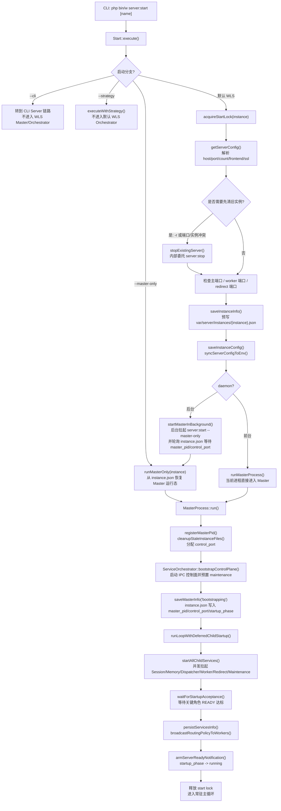
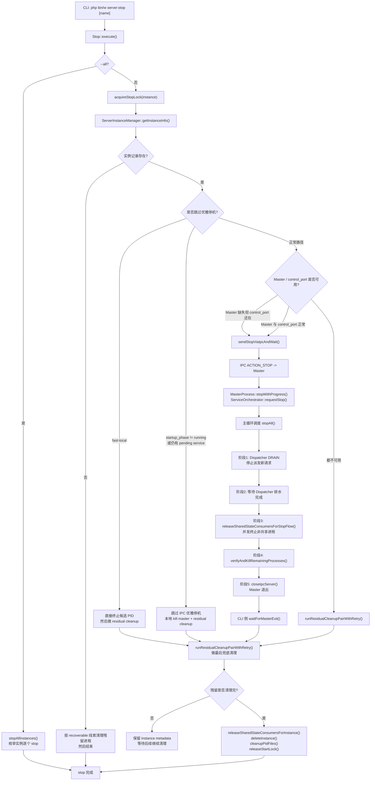

# WLS 启动与关闭链路图

## 适用范围

- 本文描述默认 WLS Orchestrator 模式下的单实例链路，即 `php bin/w server:start [name]` 与 `php bin/w server:stop [name]`。
- `--cli` 和 `--strategy` 会在 `Start::execute()` 早期分流，不进入本文的 Master/Orchestrator 主链路。
- `server:stop --all` 只是外层枚举多个实例，单实例的关闭协议仍然复用本文的关闭链路。

## 启动链路图

## 关闭链路图

## 关键分支说明

- `server:start -r` 会先通过 `stopExistingServer()` 复用 `server:stop` 链路清理旧实例，再进入新的启动链路。
- `server:start -r -f` 属于停机型切换，旧实例不会走平滑排水等待，而是更快进入本地清理。
- `server:stop -f` 仍然优先走 IPC STOP，但会把 Orchestrator 切到 `skipDrain=true`，也就是跳过关闭阶段 1/2，直接进入统一终止、校验和关闭 IPC。
- 如果 CLI 侧等待 IPC 进度超时，且判断停机流并未继续推进，`Stop` 会强杀 Master 并执行本地 residual cleanup。
- 如果本地 residual cleanup 后仍检测到残留进程，`Stop` 不会立刻删除 `var/server/instances/{instance}.json`，而是保留元数据，避免失去后续恢复和继续清理的控制线索。

## 关键代码锚点

- `app/code/Weline/Server/Console/Server/Start.php`
  - `execute()`
  - `runMasterOnly()`
  - `startMasterInBackground()`
  - `runMasterProcess()`
  - `saveInstanceInfo()`
- `app/code/Weline/Server/Service/MasterProcess.php`
  - `run()`
  - `saveMasterInfo()`
  - `stopWithProgress()`
- `app/code/Weline/Server/Service/ServiceOrchestrator.php`
  - `bootstrapControlPlane()`
  - `startAll()`
  - `runLoopWithDeferredChildStartup()`
  - `requestStop()`
  - `stopAll()`
- `app/code/Weline/Server/Console/Server/Stop.php`
  - `execute()`
  - `stopInstance()`
  - `sendStopViaIpcAndWait()`
  - `runResidualCleanupPairWithRetry()`
- `app/code/Weline/Server/Service/ServerInstanceManager.php`
  - `getInstanceInfo()`
  - `deleteInstance()`
  - `finalizeAfterMasterExit()`

## 读图建议

- 启动图里，`Start.php` 负责“参数固化、锁、端口/证书/实例快照”；`MasterProcess` 负责“控制面启动与主循环”；`ServiceOrchestrator` 负责“子服务并发启动、READY 验收和运行期调度”。
- 关闭图里，CLI `Stop.php` 既是停机发起方，也是最终兜底清理方；真正的统一停机协议在 `ServiceOrchestrator::stopAll()` 中完成。
