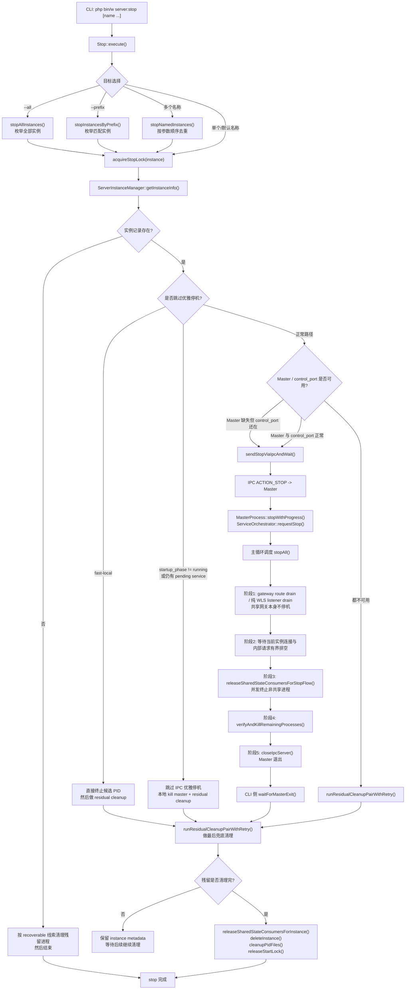

# WLS 启动与关闭链路图

## 适用范围

- 本文描述默认 WLS Orchestrator 模式下的实例链路，即 `php bin/w server:start [name]` 与 `php bin/w server:stop [name ...]`。
- `--edge=auto|gateway|wls` 是 WLS 2.0 唯一 edge mode 入口；`--no-nginx`
  等价 `--edge=wls`。`auto/gateway` 先发现并加入既有受信网关；在明确证明 virgin host、
  公共端口安全且随项目发布的签名包通过校验时，普通 start 可执行一次宿主 Gateway 首装。
  它不会下载/编译 legacy Managed Nginx，也不会借首装执行 upgrade/repair/rebootstrap。
  `wls` 不发现、不建立也不修改宿主网关。
- `server:stop name-a name-b`、`server:stop --prefix <prefix>` 与 `server:stop --all` 都只在外层枚举多个实例；每个实例仍复用同一关闭协议并单独获取 stop lock。

## 启动链路图

```mermaid
flowchart TB
    A["CLI: php bin/w server:start [name]"] --> B["Start::execute()"]
    B --> C{"启动分支?"}
    C -->|无效/不兼容 edge 契约| C1["启动前非零拒绝<br/>不创建 Master/Worker"]
    C -->|--master-only| M1["runMasterOnly(instance)<br/>只校验 endpoint schema v4<br/>读取嵌套 runtime_selection"]
    C -->|默认 WLS| D["acquireStartLock(instance)"]
    D --> E["getServerConfig()<br/>CLI > 实例 > env > auto"]
    E --> E0["ProjectIdentityStore<br/>UUIDv4 + desired/certificate generation CAS"]
    E0 --> E1{"EdgeRuntimeDecision"}
    E1 -->|gateway| E2["只读 status/discover<br/>受信 wls-edge/2 ready 则加入<br/>否则仅 virgin host + 签名发行包可首装<br/>bootstrap journal 同 fingerprint 恢复"]
    E1 -->|auto unavailable| E3["稳定分配 20000–29999<br/>纯 WLS TLS + loopback bind<br/>不创建宿主服务文件"]
    E1 -->|wls / --no-nginx| E4["纯 WLS TLS<br/>显式端口冲突即非零退出"]
    E1 -->|legacy| E5["保持项目 Nginx 原状<br/>等待显式 promote"]
    E2 --> F
    E3 --> F
    E4 --> F
    E5 --> F
    F{"是否需要先清旧实例?"}
    F -->|是: -r 无参数变更| F0["委托 server:reload<br/>滚动排水重启，Master 保持"]
    F -->|是: -r -f 或启动参数变更| G["停止前固化旧代实际监听端口<br/>stopExistingServer() 委托 server:stop"]
    F -->|是: 端口/实例冲突| G
    F -->|否| H["检查 loopback H1、control、Dispatcher/Worker 与托管 Nginx 端口"]
    G --> G1["Restart handoff fence<br/>Windows 正常重启最多 30s；POSIX 12s；fast 6s<br/>等目标端口无监听 + scoped 进程全退出"]
    G1 --> H
    H --> I["saveInstanceInfo()<br/>endpoint schema v4 + runtime_selection<br/>project/instance/master epoch/launch id + edge decision"]
    I --> J["保存 provisional 实例配置<br/>Nginx live 前不提交 env 公网端点"]
    J --> K{"daemon?"}
    K -->|后台| L["startMasterInBackground()<br/>后台拉起 server:start --master-only<br/>并轮询 instance.json 等待 master_pid/control_port"]
    K -->|前台| K0["拒绝 foreground<br/>托管 Nginx live gate 需要启动命令继续编排"]
    L --> M1
    M1 --> N["MasterProcess::run()"]
    N --> O["registerMasterPid()<br/>cleanupStaleInstanceFiles()<br/>分配 control_port"]
    O --> P["ServiceOrchestrator::bootstrapControlPlane()<br/>启动 IPC 控制面并预置 maintenance"]
    P --> Q["saveMasterInfo('bootstrapping')<br/>instance.json 写入 master_pid/control_port/startup_phase"]
    Q --> R["runLoopWithDeferredChildStartup()"]
    R --> S["startAllChildServices()<br/>按依赖阶段批量拉起子服务"]
    S --> S1["Windows: 固定 K 路 launcher<br/>macOS/Linux: 短命 PHP/pcntl launcher<br/>Linux reuseport 不继承 listener；shared_fd 只保留 Master-owned FD"]
    S1 --> T["REGISTER → READY gate<br/>Worker credential store fail-closed readiness<br/>首页 shared publish + process hit<br/>loopback H1 listener ACK"]
    T --> T1["waitForStartupAcceptance()<br/>等待关键角色、策略与 Dispatcher 路由 ACK 达标"]
    T1 --> U["persistServicesInfo()<br/>broadcastRoutingPolicyToWorkers()"]
    U --> V["armServerReadyNotification()<br/>startup_phase -> running"]
    V --> V0["如属重启：恢复并确认 maintenance 快照<br/>必须先回到 READY 业务路由"]
    V0 --> X{"effective edge mode"}
    X -->|gateway| Y["启动项目 Agent<br/>register desired state + instance lease<br/>等待路由 ACTIVE"]
    X -->|wls| Z["验证纯 WLS TLS/H2/H1 listener<br/>auto fallback 报告高端口限制"]
    X -->|legacy| Z1["沿用项目托管 Nginx live gate"]
    Y --> W["释放 start lock<br/>CLI 成功；宿主网关独立常驻"]
    Z --> W
    Z1 --> W
```

## 关闭链路图

```mermaid
flowchart TB
    A["CLI: php bin/w server:stop [name ...]"] --> B["Stop::execute()"]
    B --> C{"目标选择"}
    C -->|--all| C1["stopAllInstances()<br/>枚举全部实例"]
    C -->|--prefix| C2["stopInstancesByPrefix()<br/>枚举匹配实例"]
    C -->|多个名称| C3["stopNamedInstances()<br/>按参数顺序去重"]
    C -->|单个/默认名称| D["acquireStopLock(instance)"]
    C1 --> D
    C2 --> D
    C3 --> D
    D --> E["ServerInstanceManager::getInstanceInfo()"]
    E --> F{"实例记录存在?"}
    F -->|否| F1["按 recoverable 线索清理残留进程<br/>然后结束"]
    F -->|是| G{"是否跳过优雅停机?"}
    G -->|fast-local| G1["直接终止候选 PID<br/>然后做 residual cleanup"]
    G -->|startup_phase != running<br/>或仍有 pending service| G2["跳过 IPC 优雅停机<br/>本地 kill master + residual cleanup"]
    G -->|正常路径| H{"Master / control_port 是否可用?"}
    H -->|Master 缺失但 control_port 还在| H1["sendStopViaIpcAndWait()"]
    H -->|Master 与 control_port 正常| H1
    H -->|都不可用| H2["runResidualCleanupPairWithRetry()"]
    H1 --> I["IPC ACTION_STOP -> Master"]
    I --> J["MasterProcess::stopWithProgress()<br/>ServiceOrchestrator::requestStop()"]
    J --> K["主循环调度 stopAll()"]
    K --> L["阶段1: gateway route drain / 纯 WLS listener drain<br/>共享网关本身不停机"]
    L --> M["阶段2: 等待当前实例连接与内部请求有界排空"]
    M --> N["阶段3: releaseSharedStateConsumersForStopFlow()<br/>并发终止非共享进程"]
    N --> O["阶段4: verifyAndKillRemainingProcesses()"]
    O --> P["阶段5: closeIpcServer()<br/>Master 退出"]
    P --> Q["CLI 侧 waitForMasterExit()"]
    Q --> R["runResidualCleanupPairWithRetry()<br/>做最后兜底清理"]
    G1 --> R
    G2 --> R
    H2 --> R
    R --> S{"残留是否清理完?"}
    S -->|否| S1["保留 instance metadata<br/>等待后续继续清理"]
    S -->|是| T["releaseSharedStateConsumersForInstance()<br/>deleteInstance()<br/>cleanupPidFiles()<br/>releaseStartLock()"]
    T --> Z["stop 完成"]
    F1 --> Z
```

## 关键分支说明

- `server:stop` 可接收多个空格分隔的实例名，例如 `php bin/w server:stop api worker`；名称按输入顺序去重，逐个获取实例级 stop lock 并执行完整单实例关闭链路。某个实例锁被占用时只跳过该实例，继续处理后续名称。
- 新启动在停止旧实例之前产生不可变 `RuntimeSelection`，并以 endpoint schema v4 写入嵌套 `runtime_selection`。`--master-only` 只接受这一个事实源；旧 endpoint、缺失/未知字段或根级 topology/listener/event/SSL 投影都在绑定端口前拒绝，不重新推导或升级。
- 内部拓扑的 `auto` 在所有平台固定为 Direct：Linux 优先经能力验证的 `reuseport`，不可用时回退 Master-owned `shared_fd`；macOS 使用 `shared_fd`；Windows 为 Nginx 均衡的独立 `worker_ports`。所有平台仍允许显式 Dispatcher；已删除的 independent/遗留模式、配置键和命令行别名没有兼容读取入口。
- `server:start -r`（无 `-f`、无端口/拓扑/Worker/SSL 等启动参数变更）委托 `server:reload`，由 Orchestrator **分批次**排水替换 Worker（Worker 数 ≥7 时默认三批，小池按 min_ready 自动拆批），**Master 保持运行**。仅 `-r -f` 或启动参数变更时才完整停 Master 并创建新代。
- `server:start -r -f` 或带启动参数变更的 `-r` 在创建新代前冻结旧代端口与 edge decision。共享宿主 Gateway
  不属于项目进程树，重启/停止项目只能 drain/unregister 本实例租约，不能停止宿主
  Controller 或 Nginx。legacy 项目 Nginx 仍按原 scoped owner 清理。
- Gateway Agent 只有在网关状态同时匹配当前 `project_uuid`、当前实例名并明确为
  `DRAINING` 时才建立停机围栏。该围栏禁止在 300 秒路由排空窗口内新启纯 WLS
  fallback；已经存在的 fallback 立即进入排空，并从 Master 权威租约时间起满 300 秒后
  关闭。其他项目或同项目其他实例的 `DRAINING` 不得影响当前实例，真实数据面故障仍
  保持 90 秒启用、恢复健康 30 秒后排空、排空 300 秒后关闭的生命周期。
- 重启交接超时时，端口 owner/scope 只用于诊断；`Start` 不杀 unknown/foreign 进程、不换端口、不跳过栅栏，而是中止新 Master 启动并返回非零。正常重启清理总预算在 Windows 为 30 秒、macOS/Linux 为 12 秒，fast-local 为 6 秒；Windows 的较长预算只覆盖已退出 PID 的 LISTEN 表延迟，不放宽 owner/scope 栅栏。
- `-r` 和 `-r -f` 完整代际重启路径都会在停止旧代前保存 `app/etc/env.php` 中的原始 `system.maintenance` 值；完整代际 `-r`（参数变更或 `-r -f`）随后才临时开启维护态。滚动 `-r` 由 Reload/Orchestrator 自动管理维护模式。无论新 Master 成功、超时、端口栅栏失败或中途 return/fatal，启动事务都恢复该原值：原来已开启则保持开启，原来关闭则恢复关闭。
- 后台重启只有在新 Master 已进入 `running` 后才提交维护事务：启动进程绕过实例列表缓存，按显式实例 endpoint 直连控制面，保留本次命令的 `operation_id`，并在一个 monotonic 总 deadline 内等待该操作退出 `active/queued` 且 `maintenance_mode` 等于快照值。该恢复与确认必须发生在生成/启动 Nginx 候选和公网 health/protocol gate **之前**；否则门禁请求仍可能落到临时维护路由。Direct Master 只会在全部 READY Worker 完成维护门禁 ACK 后提交该状态；缺失 `maintenance_mode/control_operation` 字段、endpoint 不可控或超时都属于启动失败，禁止打印“维护模式已关闭”。
- 后台 `server:start` 只有在 Master/Worker `running`、托管 Nginx owner/config generation 接管、证书指纹绑定的 TLS 1.3 握手，以及 H2/H1 fresh 请求分别真实到达 owner 绑定的 `/_wls/health?detail=1`、匹配 WLS backend identity/config generation 后才返回 `0`；配置或 ALPN 不能单独写成 `runtime_verified`。H3 还要求 HTTP/3-only fresh QUIC 请求穿过 Nginx 到达同一真实 health；Nginx 本地响应或边缘缓存不算，客户端 verifier 不可用时明确保持 pending。失败门禁按事务规则返回非零并回滚候选配置；旧 generation 无法重新证明时停止 Nginx 并保留恢复证据。
- Nginx shared session cache/tickets 已启用。TLS 恢复门禁固定使用 `fresh-share-two-connection-pair-v1`：每对新建 SSL share，仅含 fresh issuer 与 fresh-TCP probe；有效 probe ≥ 8、`failed=0`、恢复握手 P95 ≤ 50ms。多 Worker 必须在各对 issuer/probe PID 上同时证明 same/cross，单 Worker cross 为 `not_applicable`；HTTP/3/QUIC Session Resumption 仍未验证。
- gateway/legacy 模式仍拒绝会阻断后续 edge live gate 的 `--foreground`；纯 WLS
  可以按自己的 listener 契约运行。
- `server:start -r -f` 属于停机型切换，旧实例不会走平滑排水等待，而是更快进入本地清理。
- `server:stop -f` 仍然优先走 IPC STOP，但会把 Orchestrator 切到 `skipDrain=true`，也就是跳过关闭阶段 1/2，直接进入统一终止、校验和关闭 IPC。
- 如果 CLI 侧等待 IPC 进度超时，且判断停机流并未继续推进，`Stop` 会强杀 Master 并执行本地 residual cleanup。
- 如果本地 residual cleanup 后仍检测到残留进程，`Stop` 不会立刻删除 `var/server/instances/{instance}.json`，而是保留元数据，避免失去后续恢复和继续清理的控制线索。

## 跨平台批量启动约束

### macOS/Linux

- 先将整批命令严格预检为 `PHP_BINARY` argv，任一项含 shell 操作符或解析失败时，在未创建子进程前放弃优化路径。
- Master 用 `proc_open` argv + `bypass_shell` 启动一个短命 `php -r` launcher；不经 `sh`/`bash`/`dash`，也不为每个 Worker 串行等待 PID。
- launcher 为每项 `pcntl_fork`，子进程 `setsid`、重置 0/1/2 后 `pcntl_exec`最终 PHP argv。fork PID 经 exec 保持不变，因此 batch 回传的是真实 Worker PID，不是 launcher 或 shell PID。
- Linux 从 `/proc/self/fd`、macOS 从 `/dev/fd` 枚举 Master FD；默认将 FD > 2 在 launcher 中映射为 `/dev/null`，Worker 不得继承 Master 的 control/lock FD。POSIX `shared_fd` Direct 只对经校验的 loopback H1 listener FD 3 显式保留；其它替代槽位在 exec 前关闭。
- PID 回显使用一个总 deadline。收集后立即关管道、终结/回收 launcher 并 `proc_close`；Master 不长期保留 shell、launcher 或子进程 `proc` resource。
- launcher 退出后 Worker PPID 可重托管到 PID 1、`launchd` 或容器 subreaper；以真实 PID + lease + IPC 判定健康，不要求 PPID 恒等于 Master。
- 优化 launcher 不可用时，只能在严格预检尚未产生子进程时回退；已提交但 PID 超时的项返回 0 交给 IPC REGISTER 收敛，不重复启动。
- 通用 POSIX 后台 `Processer::create()` 使用 `cd && exec nohup ... & echo $!`。`exec` 让复合后台子 shell 原位替换为最终 PHP 进程，因此 `$!`、`ps`、PID 索引和子进程自报 PID 必须一致；禁止把短命 launcher 和真实进程同时登记为同一服务。

### Windows

- `Processer::batchCreate()` 将启动项分配到固定 K 路 PowerShell launcher，默认 K=4、范围 1-8；每一路内部顺序 `Start-Process`，各路并行。
- 所有 launcher 提交完成后才开始 batch result 总预算，避免脚本准备时间提前耗尽结果窗口。
- WLS framework child 自己持久化权威 PID，父进程只接收 raw PID，不重复写同一 PID 索引。
- helper 超过 TTL 后只发终止；确认退出前保留资源和结果文件，随后补登记迟到 PID、输出诊断并清理。
- 单 launcher 提交失败会在有界预算内逐项降级，不会让整组 Worker 静默返回 0。

### 进程身份租约与安全退场

- Master `ServiceRegistry` 是当前进程生命周期、slot、generation、lease、launch id 和 READY 的唯一运行时权威。所有终止、滚动替换和批次退场先从已认证 Registry 冻结 `pid + canonical process_name + launch_id + expected pname`。
- 冻结身份通过 `expected pname + PID` 确定性读取独立 `*-{pid}-pid.json` 租约，并叠加实时 OS 命令行、launch id 和 canonical pname 校验；不扫描目录，也不因 `pid_index/name_index` 暂时缺项放宽身份栅栏。
- `pid_index/name_index` 只承担 CLI 发现、兼容查询和可重建快照。索引存在时必须与独立租约一致；索引缺失不否定 Master 已知的完整租约，索引矛盾则 fail closed。
- 探测结果只允许 `running / exited / identity_mismatch / unknown`。只有 fresh probe 得到 `running + identity_match` 才能执行一次终止动作；其余状态绝不向当前 PID 发信号。
- Windows 索引发布禁止 `unlink(live target) -> rename`。同目录唯一临时文件写完并 flush 后先尝试原子 rename；目标替换不受支持时，在目标 `LOCK_EX` 内完整覆盖，读端 `LOCK_SH` 只能看到完整旧版或完整新版。
- Worker 终止默认不做进程树 kill。未知公网或回源端口 owner 永远不由 WLS 提示
  终止或自动修改；显式主端口冲突非零退出，可选 HTTP redirect 端口冲突只禁用
  redirect。宿主网关进程必须通过后续清单、摘要与 generation fencing 才能恢复。

## 运行拓扑平台边界

- Windows `auto` 固定使用 `worker_ports + stream_select` Direct；Linux `auto` 优先 `reuseport + event`，在 `sockets`/`SO_REUSEPORT` 不可用时回退 `shared_fd + event`；macOS `auto` 使用 `shared_fd + event`。三者共用 REGISTER→WARMING→READY、policy digest 与分批重载契约；业务 Worker 的 READY v3 必须证明首页 Process FPC 已热，并提交绕过 FPC 的动态首渲染回执。动态目标默认是发布性能门禁而非存活门禁；显式开启 strict 开关时才会因超标拒绝 READY。初启与标准分批 replacement 使用同一契约。
- Windows UNC 项目根目录使用有界冷启动兼容预算：首页 READY 单次 60 秒、Orchestrator 默认基线 150 秒、绝对总启动最多 300 秒；Windows 本地盘仍为 30 秒/90 秒，POSIX 不变。预算只延长失败上限，不降低 4/4 Worker、首页 Process FPC HIT、policy digest 或 listener capability 门禁；环境/配置显式值始终优先。
- 业务 Worker 的每一次 READY 发送都经过进程注入的 before-ready guard：首次注册、Master ACK 超时重发、普通 TCP 自动重连和 Supervisor 自动重连都重新检查显式非 local 的 Worker credential store。门禁异常时不发送 READY、不保留 confirmed 状态；自动重连已建立的控制连接会关闭，以便数据库恢复后按重连节流再次尝试。Maintenance Worker 不使用该浏览器凭据链，因此不执行 credential store 检查。
- 拓扑/依赖预检发生在任何 Master/Worker 创建之前；普通启动不下载、编译或补装 PHP/legacy Managed Nginx。Linux 的 `auto` 优先验证并选择 `reuseport` Direct，能力不可用时回退 `shared_fd`；macOS 选择 `shared_fd`，Windows 选择 `worker_ports`。Direct 最终不满足 listener/event/policy 能力时明确失败，显式 Dispatcher 仍受支持。只有 `--install-deps` 分支允许准备 PHP 依赖并用新进程复验。`auto/gateway` 唯一允许的安装副作用，是在 virgin host 上把最终项目发行物自带、已签名的 Gateway/Nginx 包复制到宿主 A/B 槽并建立平台守护；它不构建、不下载，也不使用 legacy `server:nginx:install`。仅显式 `server:nginx:install` 在 Unix 上可能为 legacy 实例构建，且 PCRE2/rewrite 为硬依赖。HTTP/3 只读检查已安装 Nginx 模块与真实 QUIC 门禁，不调用 PHP FFI/native 构建链。
- macOS `worker_count=auto` 使用性能核数并受内存预算限制；启动与 Doctor/建议共用同一个 resolver，显式 `-c` 保持不变。
- 平台无关的 `direct` 是唯一 Direct 状态值。gateway/legacy backend 使用 loopback
  明文 H1；纯 WLS 使用 Stream TLS，提供 H2/H1，不提供 H3。
- `worker_ssl` 是纯 WLS Stream TLS 的受支持项目 edge。
- Worker 通过 `--public-origin` 获得对外 scheme/authority；该 HTTPS `public_origin` 必须经 `ManagedNginxPublicOrigin::normalize()` 校验后，由 endpoint schema v4 穿过 `ServerInstanceManager` allowlist 和 `Start::runMasterOnly()` 配置恢复原样传递，缺失、非字符串或非 HTTPS 时在绑定端口前 fail closed，禁止从内部回源 `host/port` 重建；READY 首页预热与真实 HTTP/HTTPS FPC key 一致。托管 Nginx 有 `$http_host` 时原样转发，H3 空值时用 `$host:$server_port`，再由固定 trusted loopback 上的 `Host` 与 `X-Forwarded-Proto/Port` 重建公开 origin；loopback 不因此成为业务 whitelist。
- H1 fresh 分流门禁仅允许 Nginx loopback allowlist 保护的 `/_wls/` 位置传播精确 `Connection: close`；普通业务位置清空 upstream `Connection`，持续复用 Nginx Keep-Alive 池。
- legacy ACME HTTP-01 仍由项目 Nginx challenge location 处理。WLS 2.0 Gateway 的
  challenge 租约、精确路径开放与首次证书发布属于后续证书任务，当前阶段不得提前
  宣称完成。
- POSIX shared-FD listener 仅承载 loopback 明文 H1；Worker accept 后直接进入 H1 parser，不导出 TLS stream。
- Windows 11 ARM/x64 仿真环境的同规模 H2 2000 请求 A/B 证明了 ACME accept-path 修正：修正前 2000/2000、663.15 QPS、P95 166.699ms；修正后 2000/2000、971.18 QPS、P95 103.55ms，即 QPS +46.4%、P95 -37.9%。该证据只归因“跳过每条 Nginx 明文回源连接的 50ms peek”，不用于推导跨平台绝对性能。

## 平台验收边界

- Windows：必须在原生 Windows 做 2/4/8/16 Worker cold/warm 多轮，核对 PowerShell 返回 PID、IPC REGISTER PID、helper TTL/临时文件回收和 Defender 下 p95；macOS/模拟单元结果不代替该门禁。
- macOS：核对 batch PID = Worker `getmypid()` = REGISTER PID；launcher 退出后 PPID 重托管可接受，但不得残留 `php -r`/shell；用 `lsof -p {worker_pid}` 确认只有 Direct loopback H1 listener FD 3 可从 Master 继承，control/lock 和其它 listen FD 不得泄漏。
- Linux：必须独立 CI/实机重复 PID/PPID/残留进程检查，并用 `/proc/{worker_pid}/fd` 确认 reuseport 默认不继承 Master listener，shared_fd 回退只继承经校验的 listener，control/lock 与其它 FD 隔离；另验证 fresh H1 分布、loopback H1、SO_REUSEPORT 门禁和容器 subreaper。公网 TLS 另对项目托管 Nginx 验证。

## Worker 重载约束

- Worker 数达到阈值后默认三批，`worker_reload_min_ready=auto` 默认保留约三分之二 READY 容量。
- 每批 DRAIN 前按实时 Registry 再校验容量；不足时拒绝摘批。
- 普通 reload 只有在 maintenance/standby 容量已确认时才可整池切换；显式 `server:reload -f` 是用户接受短暂停机的强制契约。Windows `worker_ports` 与 POSIX `shared_fd` Direct 都使用标准安全分批；显式 Dispatcher 兼容模式可按其路由快照契约整池切换。
- 每批先统一置 DRAINING 并发布一次摘批快照，批内全部 READY 后再发布一次加回快照。
- `shared_fd` Direct 每批先停止目标 Worker 接新连接，等待已分派请求与回源 Keep-Alive 有界排空，再启动同批 replacement 并验证 policy、共享 listener、runtime 和首页 Process FPC。排空下限是托管 Nginx `upstream_keepalive_timeout_sec` + 5 秒，默认为 10 秒；不创建独立 accept backlog，避免退役 backlog 产生 RST。不存在 WLS Native active config ACK。
- H1 Worker 的 DRAIN 先停止 loopback accept，并完成已分派请求与待写响应。维护模式 ACK 先立即应用策略，再等待 active request/Fiber 与 response output 清空；空闲 preconnect、partial HTTP 和 slowloris 不得阻塞 ACK。
- 所有 drain/exit 等待使用总 deadline；到期后报告仍在途的具体阶段，不能用无界等待或静默关闭掩盖长尾。

## 请求边界失败隔离

- 每个 WLS 请求的 Session flush、response snapshot、namespace snapshot、trace、`StateManager`、module resetter、globals、`Context::leave()` 与 phase release 分别执行；任一步失败不得跳过后续可执行清理，最后按 stage/capability 聚合报错。
- 普通、异常、SSE 和取消请求共用同一 finally 契约；取消挂起 Fiber 前必须先恢复目标 Fiber 投影，再向 Fiber 抛入 `RequestExitException` 以展开 Runtime/Worker finally，不得直接丢弃 Scope bucket。
- 取消展开允许 session、cache lease、DB 等嵌套 finally 在有界的 16 个协作挂起点内继续清理；真正持续重新挂起的 Fiber 仍按连续 3 次不完整取消进入 Worker quarantine，不会通过扩大重试取消隔离。
- 目标 Fiber 恢复只切换 superglobals、SSE/URL scratch 与已注册请求静态投影；`Context`、`HeaderCollector` 和 ObjectManager request bucket 由各自 Fiber WeakMap 保留，不覆盖主循环状态。
- reset/cleanup、Fiber resume/capture 或 post-response cleanup 任一失败，Worker 都会设置一次性 `drain-after-response` 原因。当前连接强制 `Connection: close`，普通 H1 Worker 消费该原因后立即关闭 listener、停止接单并向 Master 报告 quarantine 退出原因；不允许仅记日志后继续复用。
- module request state 必须位于当前 `RequestContext`/Fiber；进程级配置缓存、指标和共享连接池不得伪装成请求态被 peer Fiber 清空。
- 普通 HTTP 请求 Fiber 由 Worker scheduler 负责首次调度；`AsyncBizAdapters::dispatch()` 的完整框架分发边界不得再次主动 `yield`。协作式挂起只放在显式 I/O、SSE 或 deadline-aware 等待点，避免冷请求在回调前二次入队。

## 关键代码锚点

- `app/code/Weline/Server/Console/Server/Start.php`
  - `execute()`
  - `runMasterOnly()`
  - `startMasterInBackground()`
  - `runMasterProcess()`
  - `saveInstanceInfo()`
- `app/code/Weline/Server/Service/MasterProcess.php`
  - `run()`
  - `saveMasterInfo()`
  - `stopWithProgress()`
- `app/code/Weline/Server/Service/ServiceOrchestrator.php`
  - `bootstrapControlPlane()`
  - `startAll()`
  - `runLoopWithDeferredChildStartup()`
  - `requestStop()`
  - `stopAll()`
- `app/code/Weline/Server/Service/Runtime/HttpProtocolSelection.php`
- `app/code/Weline/Server/Service/Edge/Nginx/ManagedNginxService.php`
- `app/code/Weline/Server/Service/Edge/Nginx/ManagedNginxConfigWriter.php`
- `app/code/Weline/Server/Service/Edge/Nginx/ManagedNginxProcessManager.php`
- `app/code/Weline/Server/Console/Server/Stop.php`
  - `execute()`
  - `stopInstance()`
  - `sendStopViaIpcAndWait()`
  - `runResidualCleanupPairWithRetry()`
- `app/code/Weline/Server/Service/ServerInstanceManager.php`
  - `getInstanceInfo()`
  - `deleteInstance()`
  - `finalizeAfterMasterExit()`

## 读图建议

- 启动图里，`Start.php` 负责参数固化、项目身份、edge decision、端口角色和 endpoint；
  `MasterProcess` 负责控制面与主循环；`ServiceOrchestrator` 负责子服务、READY 与排空；
  宿主 Gateway Controller 独立于任一项目 Master。
- 关闭图里，CLI `Stop.php` 既是停机发起方，也是最终兜底清理方；真正的统一停机协议在 `ServiceOrchestrator::stopAll()` 中完成。
