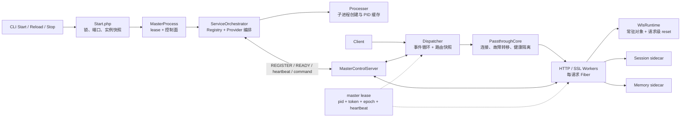
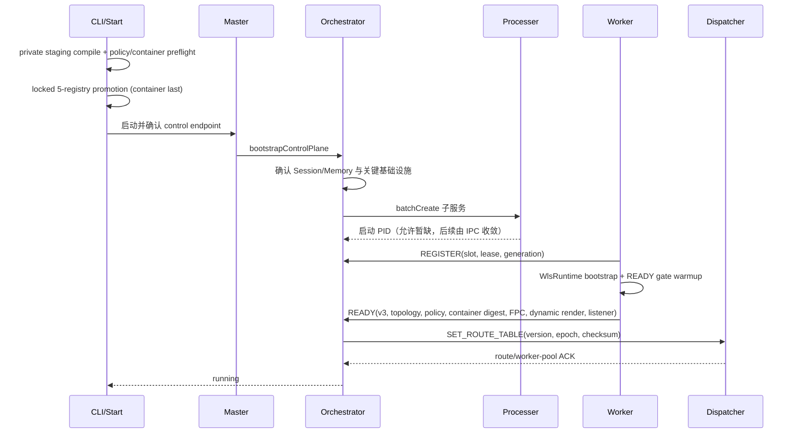
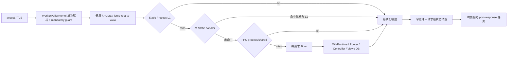
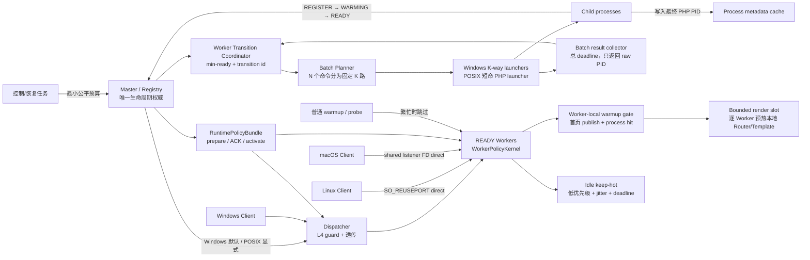
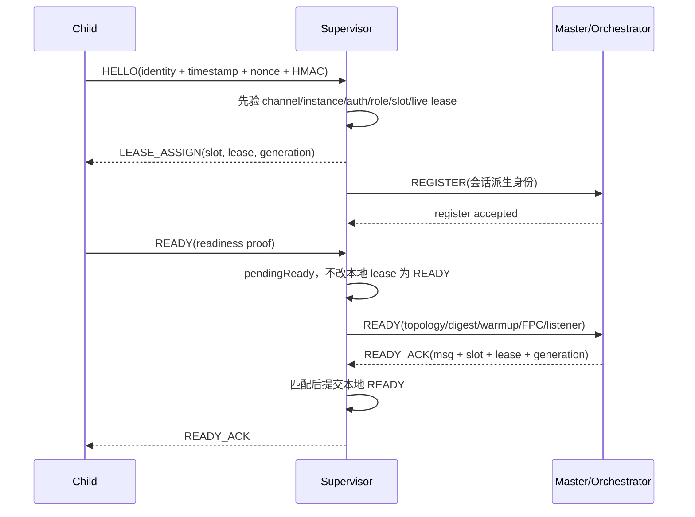
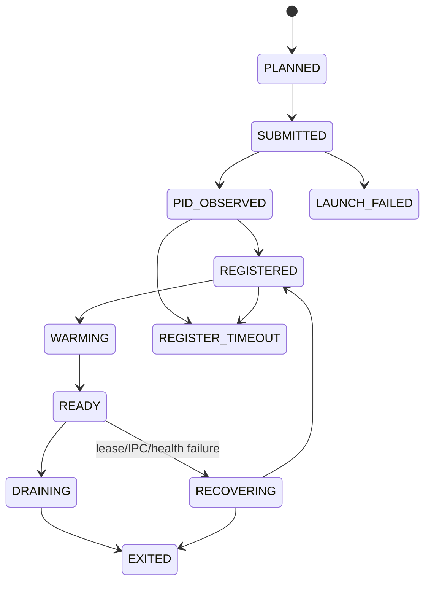
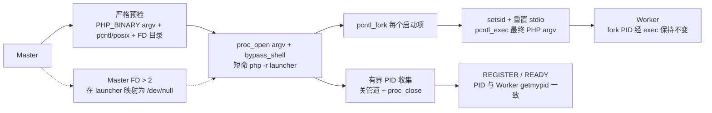

# WLS 运行时架构：现状与目标

> 状态：现行架构权威文档
>
> 改造基线：`8492c8e`；本文同时记录 2026-07-10 本次工作树的落地架构
>
> 范围：启动、控制面、数据面、Worker 生命周期、共享状态、预热与恢复。安全规则、面板和部署细节由各专项文档负责。若本文与源码冲突，以源码为准并同步修正文档。

## 1. 架构边界

WLS 是常驻内存的多进程 HTTP/HTTPS 运行时。`auto` 在 Linux 选择 SO_REUSEPORT direct，在 macOS 选择 Master 共享监听 FD direct；客户端都直接连接 Worker，Master 不 accept/代理请求。Windows 只选择 Dispatcher TCP 透传。两种数据面共用 Master、IPC、READY、RuntimePolicyBundle 和 WorkerPolicyKernel，因此 direct 不会丢失安全、FPC、静态缓存或维护规则。

运行时只保留以下权威边界：

- Master `ServiceRegistry`：服务生命周期、槽位、代际和 READY 的权威。
- `RuntimeSelection`：实例 requested/effective topology、event loop 和 SSL engine 的唯一选择结果。
- RuntimePolicyBundle active digest：当前进程应执行规则的唯一版本。
- Dispatcher 最近一次确认的版本化路由快照：仅在 Dispatcher 拓扑中是数据面路由权威，不反向发明 Worker。
- SharedState registry：Session/Memory sidecar 元数据；只有经过实时身份和 token 探活的写路径可以修正它。

`var/server/instances/*.json` 只用于 CLI 发现 endpoint 和有限事件；PID/端口索引只做可重建缓存，不能代替运行时共识。新启动写入 endpoint schema v3：完整 `runtime_selection` 为唯一选择事实，根级 `requested_topology/effective_topology/topology/listener_strategy/direct_listener_mode/event_loop_driver/ssl_engine` 只是兼容投影。Master 重入会校验每个投影与 `runtime_selection` 严格一致，冲突或缺字段直接拒绝启动，不重新推导；旧 schema v2 仅保留读取兼容，不会被 Master 伪升级为 v3。

可观测命令也遵守同一事实边界：`server:status <name>` 校验并展示持久化的 RuntimeSelection、listener/event/SSL 和 policy digest；`server:benchmark --instance <name>` 把同一快照写入 report schema v3。手动 host/port 只有唯一匹配正在运行的实例时才归因，否则运行时字段为 `null`；多个运行实例不会自动选中 `default` 或目录中第一个记录，避免将压测流量误发到生产实例。Master IPC 暂时不可达时，status 可以从不可变启动事件重建只读视图，但必须按当前 `count` 裁剪到 canonical Worker `1..count`；历史 rolling surge/扩缩容槽位只保留为诊断证据，不能重新计入当前 READY 总数。

`independent` 只保留枚举和旧数据识别，当前没有完整 READY/策略保证；无论新启动还是旧 endpoint 重入都会在创建 Master/Worker 前明确拒绝。

## 2. 改造前架构（As-Is，`8492c8e`）



### 2.1 基线启动时序



旧 Master 仍在线时，Start 不会直接编译到 live registry。编译、策略检查和
container digest 预检全部在 `var/tmp` 私有 staging 完成；随后核对
hooks hash，在一个 final directory lock 内提升 5 个文件，container 最后。
第 N 项失败会恢复全部原始字节并逐项验证 hash；因此失败的新代
不会让旧 Master 补位 Worker 观察到半代 registry。

基线 Worker READY 之前会执行本地 warmup；但普通首页的成功判断仍依赖只在部分 Controller 产生的缓存头，可能重复渲染后 fail-open，并不能证明本 Worker 已得到首页 FPC 热命中。本次实现已改为“共享 FPC 单 owner 发布、各 Worker 进程命中验证”。

### 2.2 基线请求热路径



普通 HTTP、stream TLS 和 EventBuffer 都在 mandatory policy 通过后先查询同一个 `WorkerStaticResponseL1`，再由启动期构造的 `WorkerFullPageCacheFastPath` 查询 Process/Shared FPC。stream TLS 还必须先完成 `force_root_to_www`。Static/FPC 热命中不创建 Fiber，不进入 Router/Session/Controller，不执行文件 stat/md5、请求级 JSON telemetry 或 post-response 任务；benchmark 显式请求的 Worker identity Header 仍由 transport finalizer 注入。

Fiber 是请求执行单元：请求到达时创建，终止后清理；当前实现不存在“预先常驻 100 个可复用请求 Fiber 池”。常驻的是 Worker 进程、框架对象、路由/模板/FPC 等进程内缓存。

### 2.3 已确认的结构性问题

| 位置 | 现状 | 直接后果 |
|---|---|---|
| Windows 批量启动 | PHP 顺序创建 N 个 PowerShell helper，之后才部分并发；parent/child 重复写 PID 索引 | 启动耗时随 Worker 数和 Windows I/O/Defender 放大，索引锁竞争 |
| Worker 重载 | `worker_reload_batch_count` 默认 1，16 个 Worker 会整池下线 | 路由短时为空或仍指向已退出端口，请求失败/长尾 |
| 路由切换 | per-port remove shim 实际反复 full sync，批次状态变化又触发多次同步 | 快照抖动、重复 IPC、可能出现 16→0/1→逐个回满 |
| READY 首页预热 | `/` 在每个 Worker 执行，但用不适用于普通首页的 Controller cache header 验收 | 重复冷渲染、启动变慢，READY 仍未证明首页已热 |
| Dispatcher 首页预热 | 与 Worker 本地 READY 预热职责重复 | 额外网络探活和调度负担，无法保证进程本地热态 |
| deferred 队列 | accept 持续 pending 时所有后台 Fiber 都可被跳过 | recovery/audit 可能饥饿，故障恢复变慢 |
| SharedState status | 只读合并路径可用历史端口 PID 回写 registry | 状态查询污染运行时元数据 |
| 静态路径 | Worker 脚本引用不存在的 `WlsStaticUriPathResolver` | 新代码重启后首个普通请求可能类加载失败；本次已补齐并改为非法路径确定性 400 |
| 长尾观测 | 启动、connect、first-byte、runtime、post-response 尚未形成统一分段预算 | 秒级请求难以快速归因，内部无界等待不易发现 |

## 3. 目标与本次落地架构（To-Be）



### 3.0 数据面选择与统一策略

| 平台 | `auto` | 显式覆盖 | 失败语义 |
|---|---|---|---|
| Windows | Dispatcher | 只允许 `--dispatcher` | `--direct`、`--no-dispatcher` 在启动前拒绝 |
| Linux/macOS | Direct | 允许 `--dispatcher` 诊断/兼容 | direct 能力或策略不兼容时明确失败，不静默降级 |
| 其它平台 | Dispatcher 兼容模式 | `--dispatcher` | direct 默认拒绝 |

POSIX direct 的公开端口由 READY Worker 直接 accept：Linux Worker 各自以 SO_REUSEPORT 绑定，macOS Worker 继承 Master 预绑定的同一 listener FD。两者都不启动 Dispatcher，不创建 Worker 后端连接。Worker AcceptGate 执行 direct 所需 L4 子集，WorkerPolicyKernel 在两种拓扑中执行同一 L7 请求/缓存策略。

Direct 的维护态由业务 Worker 内的 `MaintenanceGate` 执行，通过 Master IPC 全量 ACK 后切换；该拓扑不启动无公开入口的 Maintenance Worker，`desired maintenance workers` 始终为 0。

两种拓扑的 Worker 都遵循同一热路径：

```text
accept/TLS -> 单次请求解析 -> 真实客户端身份
-> Host/后台 Key/Origin Token/Ban/限流/便宜安全规则
-> maintenance -> static -> FPC process/shared
-> body 深度规则 -> lazy session -> Router/Controller -> response -> cleanup
```

单次解析的边界在 `WorkerPolicyKernel`：原始 HTTP 字节只在这里变成不可变 `WorkerPolicyDecision` / Framework `RequestEnvelope`。快照保留已验证的 protocol、canonical path、target/query、Header/body、client identity 和 policy digest；Static L1 直接使用 Decision 的 method、target、条件 Header 与 keep-alive 语义，FPC 也直接读 Decision，动态路由 `WlsRequest::fromEnvelope()` 水合。

Transport Adapter 的 HTTP wire 辅助统一由 `bin/worker_http_message.php` 提供。HTTP 与 stream-TLS Worker 直接加载同一份 request-complete、keep-alive、Header/Cookie、格式化响应 Header、gzip、状态码和请求行实现，不再各自复制函数体；EventBuffer 保留自己的连接与 libevent 状态机，但 Header 读取通过原签名 wrapper 复用同一实现。共享文件不持有 listener、socket、TLS 或 event-loop 状态，Transport 主循环、调用点签名、重复 Header 处理、HTTP/1.0 keep-alive、Connection token 与 CRLF 语义均保持不变。其余仍有 transport 差异的握手、写缓冲和连接关闭逻辑继续留在各 Adapter，不能为了表面去重强行合并。

如果 Worker 的 Framework runtime 初始化失败，数据面只返回通用 500、`request_id` 和 `X-Weline-Request-Id`；`$runtimeError`、异常文件/行号与内部连接细节只进入 WLS 日志。该错误契约在 HTTP、TLS stream 和 EventBuffer 之间保持一致。

因此缓存命中不会绕过 mandatory guard；裸 `/admin/login` 在 FPC 和 Router 前 404，只允许 `/{backend_key}/admin/login`。详细策略 stage 见 [WLS 安全与规则配置推演](WLS安全与规则配置推演.md)。

### 3.1 必须长期成立的不变量

1. 正常启动或重载时，Dispatcher 路由快照和 direct 公开 accept 都不得接纳非 READY Worker。
2. 非 stop/maintenance 转换中，可接入业务 Worker 不得为空；摘批后 `ready_count >= min_ready`。
3. 默认批次由 `min_ready` 推导。多 Worker 默认至少保留约三分之二 READY 容量；配置不能突破该约束。
4. Dispatcher force 全池切换只有在 maintenance/standby 已 READY 并收到 ACK 时允许；direct 由业务 Worker 根据 maintenance epoch 直接响应维护页。
5. Dispatcher 一个批次只发布两次业务快照；direct 使用代际 fence 和公开 bind ACK 保证新旧代安全切换。
6. Worker 的 READY 表示：框架初始化完成、端口可接入、策略 digest 与编译容器 digest 都与本代启动快照一致，同时持有首页 Process FPC 热命中和动态首页非 FPC 的有效响应证明；任一关键证明缺失时不得 READY。`target_ms` 默认是独立发布门禁，避免冷批量启动时因主机瞬时负载反复杀 Worker；只有显式启用 `wls.worker.dynamic_warmup_block_on_target_ms` 才把该耗时变成进程存活硬门禁。Dispatcher 拓扑还必须收到该槽位/租约的入池 ACK，Master 才能把整站标记为 running。
7. Dispatcher 只负责 L4 准入、路由、字节透传、背压和故障转移，不负责 HTTP 规则、FPC、静态缓存或首页渲染；生命周期变化只由 Master 决策。
8. 业务 Worker READY 必须显式声明 readiness protocol v3、`dynamic_first_render_proof_v1` 和 `compiled_container_digest_v1`，并携带当前 effective topology、active policy digest、64 位 container registry digest、warmup state、首页 FPC proof、动态首渲染 receipt 和真实 listener capabilities；不允许把字段缺失解释成旧协议，也不允许混合 digest 服务请求。Hybrid Supervisor 只负责完整传输这些 readiness 字段，最终 READY ACK 只能由 Orchestrator 在能力门禁通过后发出，Supervisor 不得提前本地确认。Maintenance Worker 不要求业务动态首渲染证明，但同样必须通过 container digest 门禁。
9. 所有 WLS 自有网络/文件/锁等待必须有总 deadline；用户请求优先，但控制恢复任务每轮都有最小推进预算。
10. status/peek 是纯读取，不得修改 registry、PID 索引或运行时文件。
11. SSE/长连接的单连接异常只能终结该连接，不能触发 Worker 或整池退出。
12. 启动器返回的必须是最终 PHP 子进程 PID；Worker 不得继承 Master 的 control/lock FD。唯一例外是 macOS direct 经能力探测后显式传入的公开 listener FD 3；其它 Master FD 仍必须隔离。
13. Direct Worker 的公开主端口是拓扑共享资源，不是单槽独占端口。单 Worker 自主回收不得调用按端口 kill/force-release；只回收该 PID，并在 3 秒内以新 generation 补回同槽。
14. macOS 共享 `php://fd/3` listener 只能用于事件就绪，不能直接承担 TLS accept；Worker 必须原生 `socket_accept()` 后 `socket_export_stream()`，得到具备 `tcp_socket/ssl` crypto ops 的连接。
15. TLS 握手完成后，OpenSSL 可能已把首个 HTTP 请求读入用户态缓冲而 ext-event 不再收到内核可读事件；仅对新握手连接执行 200ms 有界首读泵送，普通 keep-alive 不做全连接扫描。
16. Dispatcher 解析到完整响应并确认 `Connection: close` 时，由公开连接侧在缓冲写完后 half-close/close；不能让客户端长期等待 EOF，也不能把所有 TIME_WAIT 推给客户端。
17. Darwin `shared_fd + event` 的单次事件回调最多 accept 1 个连接。成功 accept 后按共享 listener 的剩余 backlog 进入自适应冷却：有 backlog 时默认使用 500us busy cooldown 并刷新 20ms busy hold；瞬时空队列但仍在 busy hold 内时继续使用 500us，只有持续空闲超过该窗口才使用 5ms idle cooldown，让 fresh TLS 在吞吐与 Worker 分布之间取得稳定平衡。共享 listener 的 Event watcher 在 Worker 整个可路由生命周期内必须常驻；冷却只过滤本轮 ready 结果，禁止通过 `del/free/re-add` watcher 实现，否则重建失败会产生“进程/IPC 存活但永不 accept”的假 READY Worker。
18. Master 对 Worker 做终止、退场或 PID 记录清理前，必须冻结并核验 `pid + canonical process_name + launch_id` 租约。PID 已退出或身份不匹配只释放本租约；身份未知时 fail closed，禁止按共享端口或裸 PID 猜测清理。PID/端口索引写入由全局锁串行化，且生命周期文件不得持久化控制 token、证书参数等敏感 argv。
19. POSIX 后台进程必须由 launcher `exec` 到最终 PHP，确保返回 PID、内核 PID、IPC REGISTER PID 和索引 PID 相同。Master 自注册后只允许存在 1 条 Master 记录；短命 shell/launcher 不得成为同名历史代。
20. Direct maintenance 的状态只有在全部 READY Worker ACK 后提交。业务 Worker 启用维护后至少推进一个 transport loop，使 OpenSSL 用户态首字节有机会进入请求缓冲；ACK 只等待已分派请求/Fiber、完整可派发的 EventBuffer 请求和待写响应，不能等待空闲 preconnect、未完成握手或 partial slowloris。
21. 多索引清理必须持全局锁并 fail closed；共享端口 owner 只能按冻结 `canonical pname + launch_id + epoch` CAS 释放。内核 listener 事实和 `port_index` 建议代表必须独立展示。

#### 3.1.1 Hybrid Supervisor 控制面信任边界

Hybrid 模式同时保留现有 Master Control Server 和 Supervisor 通道。Supervisor 只是已认证的会话、租约和消息传输层；Master/Orchestrator 仍是 REGISTER、READY 能力验收和进程生命周期的唯一权威。



控制面必须长期保持以下约束：

- 在 Supervisor HELLO 认证链路中，Hybrid 使用当前 Master token 作为 HMAC-SHA256 密钥，不在 HELLO 包中传输明文 token。签名覆盖 instance、channel、role、slot、PID、launch nonce、lease/generation、时间戳和随机 nonce；当前允许时钟偏差±30秒，nonce 重放窗口60秒。
- 任何 HELLO 必须在改写 lease 之前通过 channel/instance、签名、role/slot 形状和当前 live lease 冲突检查。同一时刻不允许第二个会话覆盖同一 `slot_id + lease_id + generation`。POSIX Unix socket 目录与 socket 权限分别为 `0700` 和 `0600`。
- HELLO 成功后先向 Orchestrator 发 REGISTER，只有会话仍存活时才标记 `masterAccepted`。READY 先保存为 `pendingReady`；只接受与 pending 的 `msg_id + slot_id + lease_id + generation` 完全一致的 Master ACK。拒绝或不匹配 ACK 不得把 Supervisor lease 变为 READY。
- 非 Supervisor lease 协议消息必须同时通过“当前已注册 lease + `masterAccepted` + role×message 白名单”。`source_instance/role/pid/port/worker_id/slot/lease/generation` 从服务端会话派生，安全敏感字段不信任子进程自报。
- 会话关闭只释放当前会话精确匹配的 `slot_id + lease_id + generation`；旧会话不能释放新代 lease。子进程显式 `EXITED` 立即按 `client_exited` 关闭当前会话；重连前清空旧 lease/generation，防止旧心跳抢在新 `LEASE_ASSIGN` 前到达。

role×message 边界以“最小必需权限”为准：

| 会话 role | 允许的子进程上行能力 | 明确不允许的代表 |
|---|---|---|
| Worker | 策略 ACK/状态、drain/exit、loop/status/log、telemetry、fiber/maintenance ACK、pong | `worker_pool_ack`、route-table ACK、Dispatcher alert |
| Maintenance | Worker 子集，不包含 fiber pool 统计 | Worker pool/route-table ACK |
| Dispatcher | 策略 ACK/状态、drain/exit/status/log、Dispatcher alert、worker-pool/route/snapshot ACK、pong | Worker telemetry/fiber 事件 |
| Redirect | exit/status/log/pong | 策略、路由、Worker 健康权威消息 |
| Session/Memory | drain/exit/status/log/pong | 策略、路由、Worker pool 权威消息 |

资源边界不能为解决压力而改为无上限：

| 边界 | 当前上限/预算 | 超限行为 |
|---|---:|---|
| Supervisor 会话 | 256 总会话，64 未注册 | 拒绝新连接 |
| HELLO / 已注册 idle | 5秒 / 60秒 | 关闭会话；子进程每5秒有界心跳 |
| 单会话读/写缓冲 | 各2 MiB | 关闭溢出会话 |
| Supervisor NDJSON 调度 | 32行/批，192行/次 wake，64 KiB/次写 | 保留跨会话公平性 |
| Hybrid passthrough | 1024条、2 MiB 总量、512 KiB/条 | 关键生命周期、策略 ACK 和路由 ACK 超限时断开源会话；log/telemetry 等可损消息记录丢弃而不拖断控制通道 |

心跳不能依赖 Master 先下发可读数据。Worker/Dispatcher 事件循环在构造控制 socket 写集合前调用 `hasPendingWrites()`；Supervisor Client 在该边界先调度到期的5秒心跳，立即尝试非阻塞写入，未写完的部分留在上述有界缓冲。因此完全空闲且 Master 无下行消息时，会话仍不会误触60秒 idle 超时。

### 3.2 统一状态机



PID 为 0 不是生命周期状态，只表示尚未观察到 PID。IPC REGISTER/READY 是最终验收事实；raw PID 只用于跟踪和早崩清理。

### 3.3 首页快速预热与持续热态

- READY gate 只预热一个 canonical host 的首页。共享 build lock 只允许一个 Worker 冷构建；其它 Worker 有界等待 fresh shared FPC，然后各自装入 process FPC。
- Server 默认动态关键路径也只有 `/`。商品、分类、账户等业务路径不得硬编码进 WLS；模块必须通过 `wls.worker.dynamic_critical_paths` / `wls.worker.dynamic_hot_paths` 或 `Weline_Server::dispatcher::warmup_paths` 提交真实、可访问的路径。不存在的演示路径不会再拖慢 READY 后的空闲预热或污染首渲染基准。
- 首页 owner 协调池是实例/策略级事实，不能包含每槽不同的 generation；槽位 generation 只用于进程租约，不能把“单 owner”错误拆成每 Worker 一个 owner。
- 首页 owner 的内部请求以 `WlsRequest` 已解析 server snapshot 作为 Context 权威输入；在 Process FPC 发布成功的同一位置捕获 exact receipt，记录实际 `full_uri`、语言/货币 Cookie、统一 cache key 和 identity digest。共享发布、Follower L2 装载与最终 Process 命中证明必须读取该 request-scoped receipt，不能在发布后根据可变 Context 重算，也不能用预热前的公开 `/` 猜测 FPC key。
- Shared/Process FPC 命中时，预热证明头必须写入实际返回的缓存响应对象；不得只写到已经被替换的请求默认 Response。
- 一次首页 warmup transaction 以 HTTP 2xx/3xx、非空响应、无 `Set-Cookie`、无 `private/no-store` 和 `source=process` 验收，不再依赖 Controller 专属 header。
- 同一 Worker 在 READY 前还必须绕过 FPC 真实执行动态首页，并生成包含 host、`/`、2xx/3xx、正文长度、耗时/目标、尝试数、FPC 非 HIT 和 reason 的不可变回执。共享 owner 只构建 generation 前置；每个 Worker 都必须执行自己的 Router/Controller/Template 本地渲染。批量启动时这些本地渲染通过带 TTL、总 deadline 和 owner token 的共享 render slot 串行进入，避免 16 个冷进程同时争抢 CPU；该锁不进入公开请求路径。Master 的初启与 Direct surge admission 复用同一证明校验器；`server:status` 从 Registry metadata 展示该回执，不能用 CLI 自测结果替代 READY 事实。
- 动态预热耗时超过目标但页面证明有效时，默认记录 `ready:slow` 并允许 Worker READY；发布仍必须用 `server:benchmark:first-render` 对公开入口独立执行 `< target_ms` 门禁。这样区分“进程正确可用”和“当前机器性能达标”，不会再把一次冷机竞争放大成重启风暴。
- READY 已完成首页 Process FPC 与动态首页硬门禁；`wls.worker_bootstrap_warmup` 的 READY 后 registry 二次预载默认关闭，避免 Worker 刚变为可路由又重复执行同一批 bootstrap。只有实例声明额外 registry 贡献并配置允许角色时才显式开启。
- 其它动态热路径由一个 owner 发现，再按 Worker 分片；不让每个 Worker 重复遍历同一列表。
- keep-hot 在 Worker 主循环的低优先级 Fiber 中运行并带 Worker jitter；仅在无活跃/待处理请求、无 TLS handshake、非排水、无内存压力时执行。
- 运行期 keep-hot 只从仍有效的 fresh shared FPC 重装并验证 process FPC；shared miss 立即降级，绝不在可路由业务 Worker 中同步冷渲染 Controller。
- keep-hot 不进入 post-response queue，避免持续流量下饥饿或把维护开销归到用户请求尾部。
- Dispatcher 的 homepage warmup 职责删除，只保留轻量健康审计。

### 3.4 调度优先级与长尾边界

优先级从高到低：

1. stop/reload/route/recovery 控制闭环；
2. 已接入的用户连接和响应写缓冲；
3. health audit / blacklist recovery；
4. keep-hot、普通 warmup、诊断采样。

持续 accept 流量下，第 1 级每轮仍至少推进一个有界 step；第 4 级可直接跳过。WLS 记录 `spawn / register / warmup / route_ack / dispatcher_connect / worker_first_byte / runtime / response_flush / post_response` 分段耗时，并对 WLS 自有阶段设置 deadline。

内存压力清理属于进程级操作。Worker 只能通过 `WlsConcurrency` 注册的 active-Fiber 事实源判断窗口：存在任一 peer/挂起请求时，阶段压缩延后，`compactRuntimeCaches()` 也必须返回零操作，不能清理 peer 可见的 ObjectManager MemoryStore、Template 或模块进程缓存。Trace 的 enabled/span/父栈/request id 按 Fiber/Context/请求分片，任一请求结束只清自己的 Trace。

WLS 可以消除自身的无界等待和调度饥饿，但无法承诺外部数据库、第三方 API 或业务代码永不变慢；这些依赖必须在各自边界配置 timeout/circuit-breaker，并在分段指标中与 WLS 热路径区分。

### 3.5 精简后的配置面

保留少量正交配置：

- Windows launcher 固定并发度 K 和 batch result 总 deadline；
- POSIX launcher 结果总 deadline，不暴露 shell/launcher 实现分叉；
- Worker reload `min_ready` / 最大批次；
- 首页 warmup path、总 timeout、fail-open；
- keep-hot interval、jitter、单次 budget；
- Worker failure threshold / cooldown。

旧 single-helper/per-child-helper 布尔分叉、WLS parent PID 猜测等待、Dispatcher 首页渲染预热和重复 per-port 路由 shim 在迁移完成后废弃。

### 3.6 跨平台适配边界

业务状态机、READY 契约和 WorkerPolicyKernel 保持一致；平台差异只停留在子进程启动、端口复用、Dispatcher 可用性和 TLS 事件引擎边界。

POSIX 快速路径的进程与 FD 契约如下：



- 所有命令先解析为严格 PHP argv；出现 shell 操作符、非 `PHP_BINARY` 或任一项无法安全解析时，整批不进入优化 launcher。
- Master 用 argv 形式 `proc_open(..., bypass_shell=true)` 启动一个短命 PHP launcher，不经 `sh`/`bash`/`dash`。Linux 从 `/proc/self/fd`、macOS 从 `/dev/fd` 枚举 Master 已打开 FD；所有 FD > 2 先在 launcher 描述符表中替换为 `/dev/null`，阻断 listen、control 和 lock FD 泄漏；本地 PHP 允许 FFI 时，fork child 在 exec 前进一步关闭这些替代槽位，避免长期 Worker 保留冗余 `/dev/null` FD。FFI 被策略禁用时只保留无资源所有权的替代槽位。
- launcher 为每项 `fork`；子进程 `setsid`、重置 0/1/2 后 `pcntl_exec`。`fork` 返回的 PID 在 `exec` 后保持不变，因此回传的是最终 PHP Worker PID，不是 shell 或 launcher PID。
- PID 收集只使用一个总 deadline。收集结束即关闭管道、终结/回收 launcher 并 `proc_close`；`batchCreate()` 返回后 Master 不保留 shell、launcher 或子进程 `proc` resource。
- launcher 退出后 Worker PPID 可被重托管给 PID 1、`launchd` 或容器 subreaper；这是预期拓扑，健康判定使用真实 PID + lease + IPC，不依赖 PPID 等于 Master。

| 平台 | 批量子进程 | 默认数据面 | 平台专属验收边界 | 本轮证据边界 |
|---|---|---|---|---|
| Windows | 固定 K 路 PowerShell launcher | Dispatcher + 当前 ABI 可验证的最优 Worker | 2/4/8/16 Worker 实机；核对 raw PID/REGISTER PID、helper TTL/临时文件、Defender 下 p95 | 仅当匹配 DLL 已存在时启用 event；不自动下载未验证 ABI 二进制，否则 stream/select 是平台稳定基线 |
| macOS | 短命 PHP/pcntl launcher，显式保留 Master listener FD 3，其余 `/dev/fd` 隔离 | Master-owned shared listener FD direct + stream SSL + event loop | 核对 Worker 真实 PID、FD 隔离、两个消费进程真实 accept 分布、`ext-event` 新 PHP 验证、Dispatcher/direct 对照 | Darwin SO_REUSEPORT 双 bind 实测会粘在单 Worker，因此禁用于 macOS direct；共享 FD probe 才是能力事实源 |
| Linux | 同一 POSIX launcher，从 `/proc/self/fd` 隔离 FD | SO_REUSEPORT direct + stream SSL + event loop | 独立 Linux CI/实机核对 PID/PPID、`/proc/{pid}/fd`、包管理器/PECL 安装、SO_REUSEPORT/direct 和 TLS | 已实现当前发行版策略与安装后验证；macOS 数据不代替 Linux 实机门禁 |

- Master 将含 scheme、public host 和非默认主端口的 `public-origin` 作为离散 argv 固化给业务 Worker；因此 HTTP/HTTPS FPC key 不再错配，Windows 替换 `instance.json` 时的短暂空窗也不会让 READY 退回 loopback。
- Static Process L1 用有界 URI 索引直接定位已预构建的响应头和文件字节；共享的
  `WorkerStaticResponseL1` 再为普通 GET/HEAD/304 提供 16MB 严格有界的 O(1) 响应快路径。
  热命中不执行多路径 `is_file/filemtime/filesize/md5`；Range 仍走完整校验，cache epoch
  会同时清理内容、URI 索引与预格式化响应。HTTP/TLS/EventBuffer 共用同一 Decision-only lookup；TLS 静态热命中还会跳过周期 GC 的 status JSON，冷 miss/动态请求仍保留原有有界压缩。
- FPC 热命中直接复用 Coordinator 已格式化的 `HIT/source/variant` 响应；不再逐请求查 ObjectManager/Env，也不再无条件生成 request-id、写 TraceStore、上报 telemetry、执行 post-response 或追加多个性能 Header。只有显式 `X-WLS-Performance-Diagnostics: 1` / `X-Weline-Performance-Diagnostics: 1` 才记录面板 fast-path trace；`X-WLS-Benchmark-Worker: 1` 只批量追加 Worker ID/port/PID。
- READY 首页以精确 `full_uri + locale/currency cookie + identity digest` 发布不可变 receipt。后续“同 scheme、同 host、根路径、无 Cookie”的匿名请求允许复用该 receipt，避免缺少默认语言/货币 Cookie 时误构造第二个 FPC 变体并回退 Framework。非根路径或任何携带 Cookie 的请求仍使用自身身份，不能借用预热变体。
- RuntimePolicyBundle 的 `CACHE` stage 在 Worker 启动/激活时编译成随 Decision 传播的只读位图。三种 transport 的 Static L1、canonical static、FPC fast path 与 Framework FPC pipeline 共用该事实；禁用策略不会命中或发布缓存，热请求不扫描 descriptor。
- Route hint 仅在 Dispatcher 拓扑注入；Direct 客户端本就直连 Worker，不为无消费者的 hint 复制整个 FPC body。`Cache-Control: no-cache/no-store/max-age=0`、`Pragma: no-cache`、SSE 和 protocol upgrade 在 Worker fast path 明确 bypass。
- Worker 完整 GC 默认每 512 请求执行一次，可用
  `wls.memory_guard.request_gc_interval` 在 64–65536 之间调整；不再每 50 请求执行
  `gc_mem_caches()`。非阻塞写入以 64KB 提交给 stream/OpenSSL，每连接每轮仍受
  128KB 预算约束。

- WLS 日志在无 file/stdout/IPC/DEV mirror sink 时，非 ERROR/FATAL 在日期、内存与
  context 格式化前返回；开启 verbose 时保留原完整日志路径。
- 启动依赖预检位于任何 Master/Worker 创建之前，并与最终 RuntimeSelection 共用同一 `requested/effective topology`。POSIX Direct 对 `sockets + ext-event` fail-closed，HTTPS 在 Direct/Dispatcher 都对当前 `PHP_BINARY` 的 OpenSSL fail-closed；显式 Dispatcher 的 ext-event 是可选优化，安装失败时保持 Dispatcher + 有界 `stream_select`，不静默改写拓扑。
- SSL engine 默认为 `stream`。当前 `RuntimeStrategyResolver` 对 `event_buffer + direct` 以及 `event_buffer + authenticated PROXY v2 Dispatcher` 都在启动预检阶段 fail-fast；因此所有当前受支持的 HTTPS 拓扑使用 stream SSL，POSIX direct 再配合 event loop。EventBuffer Adapter 保留为实验实现，不视为可选生产路径。
- macOS shared-FD probe 只把“双消费者均能真实 accept”作为能力事实；短采样的 `max/min > 1.5` 记录为 `balance_warning`，不能随机把可用能力判成失败。发布门槛仍要求对真实 fresh connections 做足量分布压测。
- Darwin shared listener 的自适应 accept 冷却只在 `Darwin + shared_fd + event` 同时成立时启用。它是成功 accept 后的本地竞争退让，不是严格轮转或中心调度；rolling reload 的旧代、新代和 surge Worker 仍在同一个共享 accept queue 上竞争。
- 自动 Worker 数由同一个 `RuntimeStrategyResolver` 同时服务启动参数和 Doctor/建议面。当前 Apple Silicon 主机检测到 10 个逻辑/10 个物理核、4 个性能核，因此 `auto` 选择 4 个 Worker；显式 `-c` 不被覆盖。
- Linux 验证是独立交付门禁；macOS 结果只证明 POSIX 实现方向，不代替 Linux 实机。

### 3.7 TLS 1.3 进程性能策略与实测证据

WLS 默认允许 TLS 1.2/1.3，`wls.ssl.key_exchange_profile` 默认为 `performance`。该策略在创建 Master/Worker 子进程前生成不可变的 OpenSSL 进程配置，仅设置 `Groups = X25519:P-256`，使 TLS 1.3 full handshake 优先使用低 CPU、低报文放大的 X25519。

策略边界必须保持：

- 运维在启动 WLS 前已设置 `OPENSSL_CONF` 时，该配置永远优先，WLS 不覆盖。请求 `performance` 时有效 profile 记录为 `external`；请求 `system` 时仍记录为 `system`。
- `key_exchange_profile=system` 显式退出 WLS 性能 profile，保留 OpenSSL 系统/运维组策略，例如 OpenSSL 3.5+ 选择的 ML-KEM 混合组。
- WLS 生成的 profile **不设置 `Ciphersuites`**；TLS 1.3 密码套件仍由 OpenSSL 和客户端协商，避免将某一并发档位的实验结果固化为全局顺序。
- 默认 protocols 包含 TLS 1.3 时，当前 PHP/OpenSSL 构建若不暴露 `STREAM_CRYPTO_METHOD_TLSv1_3_SERVER`，启动在创建子进程前明确失败，不静默回退到旧协议。
- `wls.ssl.protocols` 只允许 TLS 1.2/1.3；配置键存在时空值或任何未知值必须在启动前拒绝，Worker 也会二次验证，不回退到宽泛 `TLS_SERVER`。

正式 A/B 环境为当前 macOS 主机、4 个 Direct Worker、shared listener FD、stream SSL + ext-event、首页 fresh TLS、强制 TLS 1.3；每档预热后测 5 轮取中位数。两组均协商 `TLS_AES_256_GCM_SHA384`，只更换 key-exchange group：

| 并发 / 基准 | Profile / 实际 group | QPS 中位数 | p95 中位数 | 相对 system | 失败 |
|---|---|---:|---:|---|---:|
| 32 / system | `system` / `X25519MLKEM768` | 2,093.75 | 18.095 ms | 基准 | 0 |
| 32 / performance | `performance` / `X25519` | 2,338.50 | 18.523 ms | QPS +11.69%，p95 +2.37% | 0 |
| 128 / system | `system` / `X25519MLKEM768` | 2,090.96 | 69.075 ms | 基准 | 0 |
| 128 / performance | `performance` / `X25519` | 2,295.33 | 62.214 ms | QPS +9.77%，p95 -9.93% | 0 |

另行将 TLS 1.3 套件顺序强制为 AES128 的实验虽在并发 128 得到 2,368.83 QPS、60.194ms p95（相对 X25519/AES256 分别 +3.20% / -3.25%），但并发 32 只得到 2,077.50 QPS，相对 2,338.50 回退约 11.2%，超过 5% 回归门禁。因此该实验被拒绝，运行代码与任务证据 profile 都只保留 `Groups = X25519:P-256`。

### 3.8 macOS 实测证据

### 3.8.1 2026-07-10 macOS event 实测证据

测试环境为当前 macOS 主机、PHP 8.4.22、Event 3.1.4、16 Worker，客户端与 WLS 同机。数据用于验证驱动切换和回归趋势，不是跨机器的 QPS 承诺。

| 路径 / 拓扑 | 并发 / 请求 | QPS | p95 | 失败 |
|---|---:|---:|---:|---:|
| health / Dispatcher | 32 / 10,000 | 9,818.95 | 5.647 ms | 0 |
| health / Dispatcher | 128 / 20,000 | 7,071.22 | 28.192 ms | 0 |
| health / direct | 32 / 10,000 | 7,141.71 | 5.192 ms | 0 |
| health / direct | 128 / 20,000 | 7,001.89 | 22.086 ms | 0 |
| 首页 / Dispatcher | 32 / 2,000 | 2,564.79 | 15.055 ms | 0 |
| 首页 / direct | 32 / 2,000 | 3,951.51 | 6.871 ms | 0 |

对照结论：health 这类纯传输合成路径不代表业务性能；当前首页基线 direct QPS 高于 Dispatcher 且 p95 更低。因此 Linux/macOS `auto` 选择 direct，同时保留显式 `--dispatcher` 用于兼容与对照；Windows 固定 Dispatcher。

### 3.8.2 2026-07-11 macOS Direct/Dispatcher 收敛证据

测试环境仍为当前 macOS 主机、PHP 8.4.22、Event 3.1.4。HTTP A/B 使用同机相同策略；HTTPS fresh connection 在 shared-FD TLS 修复后单独验证。

| 路径 / 拓扑 | 并发 / 请求 | QPS | p95 | p99 / max | 失败 |
|---|---:|---:|---:|---:|---:|
| 首页 HTTP / direct，5 次中位数 | 32 | 9,273.51 | 5.607 ms | — | 0 |
| 首页 HTTP / Dispatcher，5 次中位数 | 32 | 6,966.57 | 7.346 ms | — | 0 |
| 首页 HTTP / direct，5 次中位数 | 128 | 8,351.68 | 20.923 ms | — | 0 |
| 首页 HTTP / Dispatcher，5 次中位数 | 128 | 6,732.35 | 26.760 ms | — | 0 |
| health HTTPS / direct fresh TLS | 32 / 10,000 | 1,753.28 | 24.780 ms | 29.389 / 83.103 ms | 0 |
| 首页 HTTPS / direct fresh TLS | 32 / 4,000 | 1,736.58 | 24.621 ms | 27.398 / 35.358 ms | 0 |
| 首页 HTTPS / direct keep-alive | 32 / 20,000 | 8,963.04 | 8.472 ms | 12.689 / 393 ms | 0 |
| 首页 HTTPS / direct + Hybrid control plane | 100,000 | 8,435.55 | 24.166 ms | 31.181 / 87.624 ms | 0 |
| 首页 HTTPS / direct + Hybrid 长稳门禁 | 128 / 1,000,000 | 9,218.56 | 21.737 ms | 26.959 / 95.714 ms | 0 |
| 首页 HTTPS / direct TLS 1.3 keep-alive + rolling reload | 32 / 100,000 | 9,562.78 | 6.230 ms | 8.132 / 28.194 ms | 0 |
| 首页 HTTPS / direct fresh TLS 1.3 + rolling reload | 32 / 100,000 | 1,776.06 | 21.725 ms | 25.199 / 71.907 ms | 0 |
| 首页 HTTPS / reload 后当前代 fresh TLS 1.3 | 32 / 20,000 | 1,657.62 | 24.479 ms | 41.880 / 98.584 ms | 0 |
| 首页 HTTPS / 最终当前代 TLS 1.3 keep-alive | 128 / 100,000 | 10,313.37 | 18.669 ms | 22.211 / 87.271 ms | 0 |
| 首页 HTTPS / 最终当前代 fresh TLS 1.3 | 32 / 20,000 | 1,869.76 | 21.201 ms | 31.553 / 56.240 ms | 0 |
| 首页 HTTPS / final rolling reload 重叠 fresh TLS 1.3 | 32 / 20,000 | 1,549.87 | 28.330 ms | 35.528 / 105.782 ms | 0 |

- Direct 首页相对 Dispatcher：并发 32 的 QPS +33.11%、p95 -23.67%；并发 128 的 QPS +24.05%、p95 -21.81%，均通过相对性能门槛。
- 100,000 个 Direct HTTP 请求为 0 错误，9,495.25 QPS，p95 5.614ms、p99 7.919ms、max 56ms；预热后 RSS 保持平台期。单 Worker kill 后 1.561s 恢复 READY，其他槽未重启。
- 4 Worker 的 4,000 个 fresh TLS 首页请求分布 `max/min=1.307`，通过 `<=1.5` 门槛。16 Worker Dispatcher 的 20,000 个 fresh HTTP 首页请求每槽恰好 1,250 个。
- Hybrid 控制面已验证完整透传 READY readiness，并由 Orchestrator 作为唯一 ACK 权威。10 次 macOS `direct + hybrid`、4 Worker HTTPS 冷启动均达到 4/4 READY，范围 2.354–2.402s，median 约 2.372s、p95 约 2.402s，通过完整 READY median ≤3s、p95 ≤5s 门槛。
- 最新 `direct + hybrid` HTTPS 100,000 请求为 0 错误，8,435.55 QPS，p95 24.166ms、p99 31.181ms、max 87.624ms；单 Worker kill 后 0.849s 恢复 READY，其他 Worker 持续服务。
- 2026-07-11 的 rolling reload 回归在真实流量中同时观察到旧代、surge 和新代 PID：100,000 次 TLS 1.3 keep-alive 与 100,000 次 fresh TLS 1.3 都为 0 错误。reload 结束后仅保留 4 个 canonical Worker，另测 20,000 次 fresh TLS 的当前代分布 `max/min=1.055`；跨代样本不能用总体 `max/min` 判断单代均衡，因为各代存活窗口不同。
- 生命周期收口后的最终实例再次完成 100,000 次 keep-alive、20,000 次 fresh TLS、以及与 rolling reload 重叠的 20,000 次 fresh TLS，三组均 0 错误。最终稳态 fresh TLS 分布 `max/min=1.036`；reload 后 PID 索引严格为 1 Master + 4 canonical Worker，全部存活且无存活或 PID 索引中的 launcher/surge 残留。
- 空闲 TLS 1.3 preconnect 落在业务 Worker 时，Direct maintenance 仍完成全部 Worker ACK 并提交 enabled；连接不被 ACK 屏障强制关闭，随后 disable 也正常收敛。完整 restart 两次分别约 4.01s、3.94s，4/4 Worker 均在约 1s 内 READY 并完成首页 Process FPC 预热。
- 1,000,000 请求门禁期间 Master 与四个 Worker PID 均未变，结束后仍为 4/4 READY，Worker 分布 `max/min=1.158`；预热后单 Worker RSS 增长 3.7%–4.4%，低于 10% 门禁，首页仍为 Process-FPC HIT。
- 当前仍未完成项：HTTP Direct p95 5.607ms 比本机绝对目标 5.5ms 高 0.107ms；Linux/Windows 原生矩阵尚未执行，不能据 macOS 结果宣称跨平台发布完成。2 小时壁钟持续测试未单独执行，但计划中与其二选一的 1,000,000 请求门禁已通过。

### 3.8.3 2026-07-11 macOS shared listener accept 公平性

测试环境为当前 macOS 主机、4 个 Direct Worker、shared listener FD、stream SSL 与 ext-event。fresh TLS 每个请求建立新连接，Worker ratio 为各 Worker accept 数的 `max/min`；正式并发结果取 5 轮中位数，最差 ratio 取 5 轮最大值。

| 场景 | 并发 / 请求 | QPS | p95 | p99 / max | Worker ratio | 失败 |
|---|---:|---:|---:|---:|---:|---:|
| 首页 fresh TLS | 1 / 100 | 587.64 | 3.790 ms | 7.929 ms / — | 1.174 | 0 |
| 首页 fresh TLS，5 次中位数 | 32 / 640 | 1,874.83 | 21.197 ms | — | 最差 1.219 | 0 |
| 首页 fresh TLS，5 次中位数 | 128 / 1,024 | 1,836.07 | 76.898 ms | — | 最差 1.279 | 0 |
| 首页 keep-alive | 128 / 20,000 | 9,533.27 | 21.616 ms | 31.116 / 67.970 ms | 1.221 | 0 |

相对改造前同机 fresh TLS 基线，并发 32 的 QPS 基本持平、p95 约改善 9%；并发 128 的 QPS 提升约 9.7%、p95 约改善 11.2%。串行 fresh TLS 也覆盖全部 READY Worker，并保持 `max/min=1.174`。

最终采用的策略是“每轮 budget 1 + 100us busy cooldown + 20ms busy hold + 5ms idle cooldown”。固定 100us cooldown 虽能维持高并发吞吐，但不能满足串行 fresh connection 覆盖全部 Worker；全局 time-slice 会把共享 accept 所有权引入事件循环调度，增加热路径耦合和抖动。两种实验均未采用。当前方案仍是竞争式共享 accept，不承诺严格 round-robin；rolling surge 的均衡性继续按真实 fresh-connection 分布门槛验收。

2026-07-12 的持续压测复现了 watcher 生命周期缺陷：4 个 Worker 都显示 READY/IPC 存活，但其中 1 个永久不再响应数据面；keep-alive 20,000 次出现 7 个 30 秒超时，fresh TLS 400 次出现 85 个 30 秒超时，成功响应只来自另外 3 个 Worker。进程采样显示失效 Worker 空闲在 `EventBase -> kevent`，不是业务、数据库或 Fiber 阻塞。将 listener 改为永久注册、仅过滤冷却窗口的 ready 结果后，同实例 rolling reload 验证如下：

| 回归场景 | 结果 | Worker 分布 | 延迟 |
|---|---|---|---|
| fresh TLS c32 / 400 | 400/400，0 错误 | 4/4 命中；小样 max/min 1.597 | max 54.187ms |
| fresh TLS c32 / 4,000 | 4,000/4,000，0 错误 | 4/4 命中；max/min 1.053 | p95 69.852ms，p99 114.251ms，max 155.361ms |
| keep-alive c32 / 20,000 | 20,000/20,000，0 错误 | 4/4 命中；max/min 1.426 | p99 56.819ms，max 265.020ms |

该回归运行时主机 load average 约 9–16，因此吞吐和 p95 不作为最终低噪声性能基线；它只证明 watcher 不再失活、30 秒超时清零且足量 fresh connection 分布重新满足 `max/min <= 1.5`。

### 3.8.4 2026-07-13 READY receipt 首页快路径复核

环境为当前 macOS 主机、PHP 8.4.22、4 Worker、ext-event + stream TLS、同一默认安全策略；性能轮仅为同机压测源显式发布 loopback whitelist，测试后立即删除并重新发布默认策略。

| 首页 Process FPC / 拓扑 / 并发 / 请求 | 成功 | QPS | p95 | p99 | max |
| --- | ---: | ---: | ---: | ---: | ---: |
| Direct / 32 / 10,000 | 10,000 | 4,726.77 | 16.775ms | 30.804ms | 66.262ms |
| Dispatcher / 32 / 10,000 | 10,000 | 3,930.59 | 16.449ms | 37.335ms | 148.435ms |

两组均 0 错误，Direct QPS 相对 Dispatcher 提升 20.26%，p99 降低 17.48%，max 降低 55.36%。直连的 QPS 相对门禁已通过；本轮主机 load average 仍在 9 以上，Direct p95 与 Dispatcher 接近，不据此宣称 p95 相对改善 20%。报告为 `benchmark_report_20260713_041843_368817_root_pid97525.json` 和 `benchmark_report_20260713_041846_817344_root_pid97524.json`。

### 3.8.5 2026-07-13 macOS 16 Worker 冷启动、长压与单槽恢复复核

环境为当前 macOS 主机、PHP 8.4.22、`direct/shared_fd/event/stream`、TLS 1.3、16 Worker 和默认完整策略。数据分开证明不同门槛，不能把持续压测通过解释为整个跨平台发布计划完成。

| 场景 | 结果 |
| --- | --- |
| 冷启动 READY | 16/16，CLI 完整 READY 约 5 秒；每 Worker 动态冷构建经 bounded render slot 串行进入 |
| 对外动态首页绕过 FPC | 连续 20 次 0 失败，16.84–28.99ms，均 `<70ms` |
| 首页 Process FPC，c32 × 10,000，5 轮 | 全部 0 错误；QPS 6,770.37 / 6,302.45 / 6,090.32 / 5,884.78 / 5,087.91，中位 6,090.32；p95 中位 9.521ms |
| fresh TLS health，c128 × 20,000 | 0 错误，751.43 QPS，p95 252.876ms，p99 296.22ms，max 418.778ms；16 Worker 全命中，max/min 1.202 |
| 热态 health + 杀 Worker #8，c128 × 100,000 | 0 错误，8,424.4 QPS，p95 26.249ms，p99 50.973ms，max 203.729ms；替补 PID 在同轮接管 389 请求 |
| 单槽恢复 | 替补 257ms REGISTER、1,511ms READY，最终 16/16；未触发整组重启 |
| 长稳压 | 1,000,000/1,000,000，0 错误，10,192 QPS，p95 16.593ms，p99 22.976ms，max 150.757ms；该结果只证明本机该轮持续负载 |

对应报告：`benchmark_report_20260713_071233_910814_root_pid45280.json` 至 `benchmark_report_20260713_071248_074079_root_pid50490.json`、`benchmark_report_20260713_071334_403766_wls-health_pid55576.json`、`benchmark_report_20260713_071438_244151_wls-health_pid80021.json`、`benchmark_report_20260713_062157_238600_root_pid80964.json`。Windows 和 Linux 仍必须在原生平台执行各自门禁；macOS 数据不能替代它们。

### 3.8.6 2026-07-13 重复实现审计与回归收口

提交拓扑审计确认 `codex/welineframework-2-architecture` 是 `master/dev` 的线性祖先，当前功能分支、`master` 与 `dev` 在修复前共同指向 `83ccfe358`；不存在重复 merge、重复 cherry-pick 或多个 worktree 互相回灌。重复行为来自同一后续架构提交内的两处版本错位，必须按符号和测试证据处理，不能再把它归因于分支数量：

- READY 已完成首页 Process FPC 与每 Worker 动态首页证明，但后续改动又把 `worker_bootstrap_warmup` 缺省值从关闭改为开启，导致 Worker 刚成为可路由状态后重复执行 registry bootstrap。缺省值现已恢复为关闭，额外 registry 贡献只能显式开启。
- 延迟恢复同时保存 authenticated service PID 与 process-tree tracking PID；后续改动错误地把两者都写为 service PID。foreground wrapper/root 仍存活时会丢失真正的槽位占用事实。恢复队列现分别保留 `pid` 和 `tracking_pid`，防止提前拉起重复 Worker。
- readiness v3 引入 compiled-container digest 与动态首渲染证明后，旧启动测试夹具仍发送旧 READY 结构，造成 3 个 error 和 5 个 failure。夹具已升级到同一协议事实源；`ServiceOrchestratorStartupTest` 为 93/93、440 assertions，`WlsRuntimeInternalWarmupInputTest` 为 23/23、52 assertions。

独立实例 `ai-test-wls-regression-20260713-1710` 在 macOS 上以 `auto -> direct/shared_fd/event/stream`、4 Worker 完整 READY 约 2 秒；公开动态首页 BYPASS-FPC first-render 为 46.52ms，首页 200、裸 `/admin/login` 404、带后台 Key 登录页 200，TLS 实际协商为 TLS 1.3 / `TLS_AES_256_GCM_SHA384`。Browser 可见性来自同一代码和策略的前一独立实例 `ai-test-wls-regression-20260713-1645`：首页和带 Key 登录表单正常可见，Console error/warn 为 0；Chrome 对后续 9882 端口返回客户端拦截，因此没有把 1645 的可见性伪记为 1710 的结果。测试白名单已恢复为关闭，两个实例及其共享 Session/Memory 进程均已停止。

本审计不把尚未完成的工作包装成已完成：三个 Worker 入口仍分别为 5,484 / 6,472 / 2,103 行，当前只统一了 HTTP wire helper、策略内核、FPC/static fast path、控制面和 telemetry；它们还不是计划所述的“薄 Transport Adapter + 单一主循环”。Linux/Windows 原生矩阵也没有可用本机 runner 或现有 WLS CI，仍属于独立交付缺口。

## 4. 实施映射

| 阶段 | 目标 | 主要代码锚点 | 核心验证 |
|---|---|---|---|
| 已落地 | URI resolver、健康/静态 FPC eligibility | `Server/Service`、`bin/worker*.php` | health/static 不触发页面 FPC；非法路径返回 400 |
| 已落地 | 安全分批重载与原子路由快照 | `ServiceOrchestrator`、`Dispatcher` | 实时 `min_ready`；每批整批摘除/整批加回 |
| 已落地 | Windows K 路 launcher、单一 PID owner、预算回收 | `Processer`、`ServiceOrchestrator` | 固定 K 路、批次结果预算、helper TTL 与失败降级 |
| 已落地 | READY 首页 transaction 和 idle keep-hot | `WlsRuntime`、`worker*.php` | 单 owner publish、每 Worker process hit；运行期不冷渲染 |
| 已落地 | deferred 控制公平性和 SharedState 只读纯度 | `Dispatcher`、`SharedStateServiceManager` | accept 压力下 recovery 前进；status/peek 不写 registry |
| 本轮 | 平台无关 RuntimeSelection 与 POSIX auto direct | `RuntimeStrategyResolver`、Provider | Windows 拒绝 direct；Linux 通过 reuseport 分布 probe，macOS 通过共享 FD accept 分布 probe 后 direct |
| 本轮 | 编译 RuntimePolicyBundle 和原子 digest 发布 | policy compiler/store/control message | 两拓扑策略结果一致；混合 digest 不 READY |
| 已落地 | READY 后单槽恢复闭环 | `ServiceOrchestrator`、`ChildMasterGuard` | REGISTER 不取消复活；仅同租约 READY 且 IPC 会话仍存在时提交恢复 |
| 已落地 | 重复预热与 PID 事实源回归收口 | `WlsRuntime`、`ServiceOrchestrator`、readiness v3 测试夹具 | READY 后不再默认重复 bootstrap；service/tracking PID 分离；116 项定向测试通过 |
| P2 | 统一分段指标与慢请求归因 | telemetry / worker / dispatcher | p50/p95/p99/max 可定位到具体阶段 |
| P4 待完成 | Worker 入口收敛为薄 Transport Adapter | `bin/worker*.php`、共享 Worker 主循环 | 三种 Transport 只保留 socket/TLS/event 差异，策略、解析、缓存、动态管线不再复制 |
| 平台待完成 | Linux/Windows 原生矩阵 | 独立 runner / CI | Linux SO_REUSEPORT；Windows Dispatcher、批量启动、TLS、恢复和长稳实测 |

## 5. 验收门槛

- 只在唯一名称、9502+ 端口的独立实例验证，不触碰默认实例。
- Windows 2/4/8/16 Worker 各做 cold/warm 多轮 A/B；至少记录 `launcher_submit_ms`、`result_collect_ms`、`register_ms`、`warmup_ms`、`route_ack_ms`。
- macOS/Linux 2/4/8/16 Worker 各验证批量提交不随单 Worker PID 等待线性增长；优化路径必须证明未经 `sh`/`bash`/`dash`。
- 对每个 POSIX Worker，回传 PID、IPC REGISTER PID 和 `getmypid()` 必须一致；PPID 允许在 launcher 退出后重托管，但不得存在长期 `php -r` launcher 或 shell。
- macOS 用 `lsof -p {worker_pid}`、Linux 用 `/proc/{worker_pid}/fd` 核对 Worker 未继承 Master 的 listen/control/lock FD；启动后 Master 不保留子进程 `proc` resource。
- 16 Worker `batchCreate` 建议 median ≤2s、p95 ≤3s；若机器受 Defender 影响，以相对旧实现下降 ≥60%且不再近似随 N 线性为准。
- 启动和 reload 全程 `READY business workers >= min_ready`，无空业务路由、无死端口留在已确认快照。
- READY 后首页首个外部请求与持续压测分别记录 cold/hot p50、p95、p99、max；WLS 自有阶段不得出现无 deadline 的秒级等待。
- 覆盖 Worker kill、IPC 短断、route ACK、keepalive、SSE、health、static、Session/Memory sidecar 冒烟。
- 自动验证完成后停止测试实例并确认 PID、端口和 helper 临时文件已释放。

## 6. 相关文档

- [WLS 启动与关闭链路图](WLS启动与关闭链路图.md)
- [IPC 控制通道架构](IPC控制通道架构.md)
- [Dispatcher 分流架构设计](Dispatcher分流架构设计.md)
- [WLS Session/Memory 共享服务架构](WLS_Session共享服务架构.md)
- [WLS 模式部署指南](WLS模式部署指南.md)
