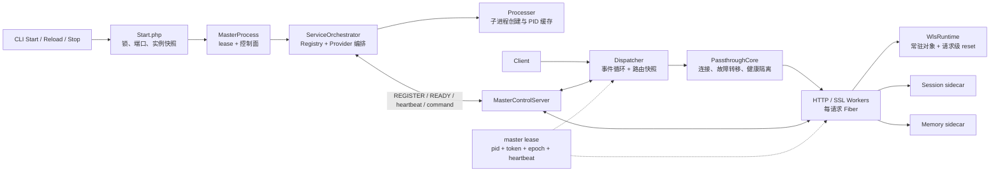
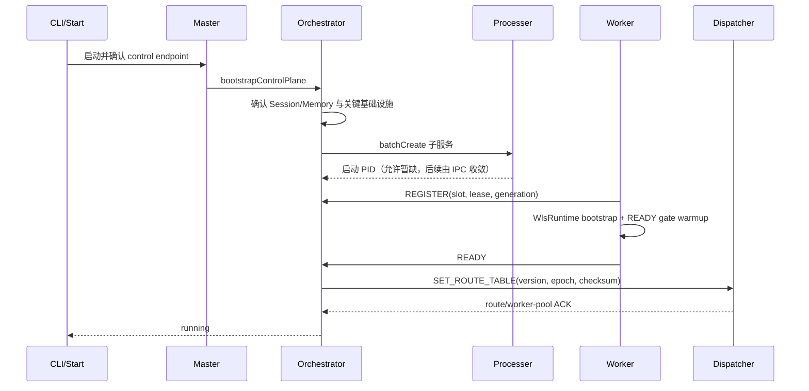
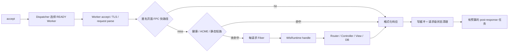
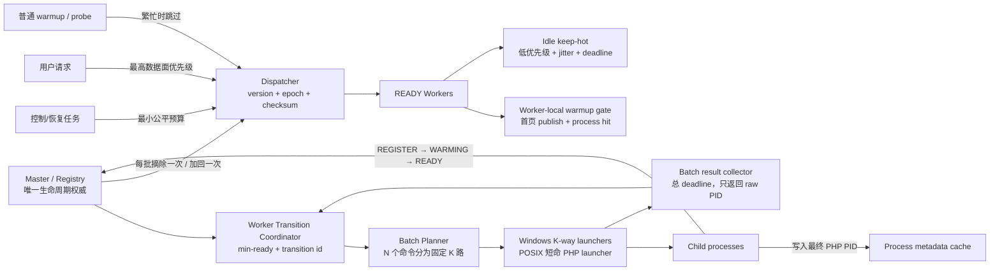
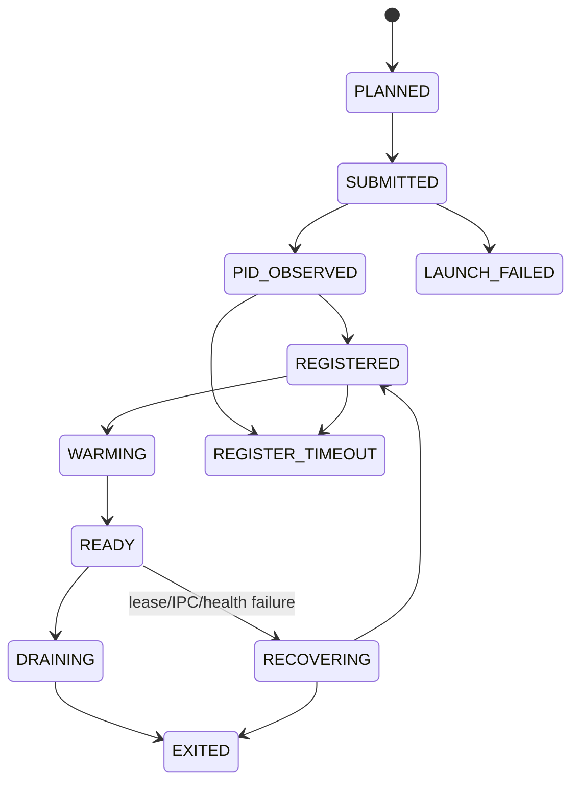
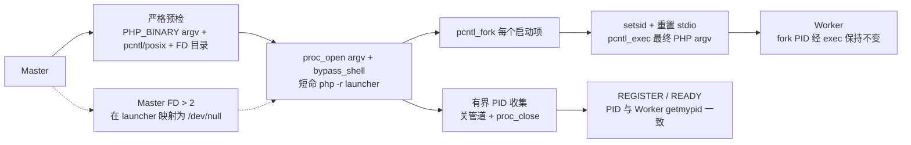

# WLS 运行时架构：现状与目标

> 状态：现行架构权威文档
>
> 改造基线：`8492c8e`；本文同时记录 2026-07-10 本次工作树的落地架构
>
> 范围：启动、控制面、数据面、Worker 生命周期、共享状态、预热与恢复。安全规则、面板和部署细节由各专项文档负责。若本文与源码冲突，以源码为准并同步修正文档。

## 1. 架构边界

WLS 是常驻内存的多进程 HTTP/HTTPS 运行时。默认分流模式由 Dispatcher 统一接入，Worker 负责 TLS/HTTP 和框架请求；macOS/Linux direct 模式可绕过 Dispatcher，但不改变 Master、IPC、READY 和 Worker 本地运行时的基本契约。

运行时只保留三个权威边界：

- Master `ServiceRegistry`：服务生命周期、槽位、代际和 READY 的权威。
- Dispatcher 最近一次确认的版本化路由快照：数据面路由权威，不反向发明 Worker。
- SharedState registry：Session/Memory sidecar 元数据；只有经过实时身份和 token 探活的写路径可以修正它。

`var/server/instances/*.json` 只用于 CLI 发现 endpoint 和有限事件；PID/端口索引只做可重建缓存，不能代替运行时共识。

## 2. 改造前架构（As-Is，`8492c8e`）

### 2.1 基线启动时序

基线 Worker READY 之前会执行本地 warmup；但普通首页的成功判断仍依赖只在部分 Controller 产生的缓存头，可能重复渲染后 fail-open，并不能证明本 Worker 已得到首页 FPC 热命中。本次实现已改为“共享 FPC 单 owner 发布、各 Worker 进程命中验证”。

### 2.2 基线请求热路径

基线 SSL Worker 的 FPC 快路径早于健康、ACME 和静态短路；本次已在 FPC 协调器入口排除系统、ACME、静态/媒体、资产扩展名与非 HTML 请求，使这些请求不再访问共享 FPC。

Fiber 是请求执行单元：请求到达时创建，终止后清理；当前实现不存在“预先常驻 100 个可复用请求 Fiber 池”。常驻的是 Worker 进程、框架对象、路由/模板/FPC 等进程内缓存。

### 2.3 已确认的结构性问题

| 位置 | 现状 | 直接后果 |
|---|---|---|
| Windows 批量启动 | PHP 顺序创建 N 个 PowerShell helper，之后才部分并发；parent/child 重复写 PID 索引 | 启动耗时随 Worker 数和 Windows I/O/Defender 放大，索引锁竞争 |
| Worker 重载 | `worker_reload_batch_count` 默认 1，16 个 Worker 会整池下线 | 路由短时为空或仍指向已退出端口，请求失败/长尾 |
| 路由切换 | per-port remove shim 实际反复 full sync，批次状态变化又触发多次同步 | 快照抖动、重复 IPC、可能出现 16→0/1→逐个回满 |
| READY 首页预热 | `/` 在每个 Worker 执行，但用不适用于普通首页的 Controller cache header 验收 | 重复冷渲染、启动变慢，READY 仍未证明首页已热 |
| Dispatcher 首页预热 | 与 Worker 本地 READY 预热职责重复 | 额外网络探活和调度负担，无法保证进程本地热态 |
| deferred 队列 | accept 持续 pending 时所有后台 Fiber 都可被跳过 | recovery/audit 可能饥饿，故障恢复变慢 |
| SharedState status | 只读合并路径可用历史端口 PID 回写 registry | 状态查询污染运行时元数据 |
| 静态路径 | Worker 脚本引用不存在的 `WlsStaticUriPathResolver` | 新代码重启后首个普通请求可能类加载失败；本次已补齐并改为非法路径确定性 400 |
| 长尾观测 | 启动、connect、first-byte、runtime、post-response 尚未形成统一分段预算 | 秒级请求难以快速归因，内部无界等待不易发现 |

## 3. 目标与本次落地架构（To-Be）

### 3.1 必须长期成立的不变量

1. 正常启动或重载时，任何路由快照都不得包含非 READY Worker。
2. 非 stop/maintenance 转换中，业务路由不得为空；摘批后 `ready_count >= min_ready`。
3. 默认批次由 `min_ready` 推导。多 Worker 默认至少保留约三分之二 READY 容量；配置不能突破该约束。
4. force 全池切换只有在 maintenance/standby 已 READY 并收到 Dispatcher ACK 时允许，否则自动降级为安全分批。
5. 一个批次只发布两次业务快照：摘批一次、批内全部 READY 后加回一次。
6. Worker 的 READY 表示：框架初始化完成、端口可接入、首页本地预热契约成功或按明确 fail-open 策略记录失败；Dispatcher 拓扑还必须收到该槽位/租约的入池 ACK，Master 才能把整站标记为 running。
7. Dispatcher 只负责路由、数据面健康和告警，不负责渲染首页；生命周期变化只由 Master 决策。
8. 所有 WLS 自有网络/文件/锁等待必须有总 deadline；用户请求优先，但控制恢复任务每轮都有最小推进预算。
9. status/peek 是纯读取，不得修改 registry、PID 索引或运行时文件。
10. SSE/长连接的单连接异常只能终结该连接，不能触发 Worker 或整池退出。
11. 启动器返回的必须是最终 PHP 子进程 PID；Worker 不得继承 Master 的 listen/control/lock FD，也不得依赖 launcher 或 shell 长期存活。

### 3.2 统一状态机

PID 为 0 不是生命周期状态，只表示尚未观察到 PID。IPC REGISTER/READY 是最终验收事实；raw PID 只用于跟踪和早崩清理。

### 3.3 首页快速预热与持续热态

- READY gate 只预热一个 canonical host 的首页。共享 build lock 只允许一个 Worker 冷构建；其它 Worker 有界等待 fresh shared FPC，然后各自装入 process FPC。
- 一次首页 warmup transaction 以 HTTP 2xx/3xx、非空响应、无 `Set-Cookie`、无 `private/no-store` 和 `source=process` 验收，不再依赖 Controller 专属 header。
- 其它动态热路径由一个 owner 发现，再按 Worker 分片；不让每个 Worker 重复遍历同一列表。
- keep-hot 在 Worker 主循环的低优先级 Fiber 中运行并带 Worker jitter；仅在无活跃/待处理请求、无 TLS handshake、非排水、无内存压力时执行。
- 运行期 keep-hot 只从仍有效的 fresh shared FPC 重装并验证 process FPC；shared miss 立即降级，绝不在可路由业务 Worker 中同步冷渲染 Controller。
- keep-hot 不进入 post-response queue，避免持续流量下饥饿或把维护开销归到用户请求尾部。
- Dispatcher 的 homepage warmup 职责删除，只保留轻量健康审计。

### 3.4 调度优先级与长尾边界

优先级从高到低：

1. stop/reload/route/recovery 控制闭环；
2. 已接入的用户连接和响应写缓冲；
3. health audit / blacklist recovery；
4. keep-hot、普通 warmup、诊断采样。

持续 accept 流量下，第 1 级每轮仍至少推进一个有界 step；第 4 级可直接跳过。WLS 记录 `spawn / register / warmup / route_ack / dispatcher_connect / worker_first_byte / runtime / response_flush / post_response` 分段耗时，并对 WLS 自有阶段设置 deadline。

WLS 可以消除自身的无界等待和调度饥饿，但无法承诺外部数据库、第三方 API 或业务代码永不变慢；这些依赖必须在各自边界配置 timeout/circuit-breaker，并在分段指标中与 WLS 热路径区分。

### 3.5 精简后的配置面

保留少量正交配置：

- Windows launcher 固定并发度 K 和 batch result 总 deadline；
- POSIX launcher 结果总 deadline，不暴露 shell/launcher 实现分叉；
- Worker reload `min_ready` / 最大批次；
- 首页 warmup path、总 timeout、fail-open；
- keep-hot interval、jitter、单次 budget；
- Worker failure threshold / cooldown。

旧 single-helper/per-child-helper 布尔分叉、WLS parent PID 猜测等待、Dispatcher 首页渲染预热和重复 per-port 路由 shim 在迁移完成后废弃。

### 3.6 跨平台适配边界

业务状态机、READY 契约和 Dispatcher 路由协议保持一致；平台差异只停留在子进程启动、端口复用和 TLS 事件引擎边界。

POSIX 快速路径的进程与 FD 契约如下：

- 所有命令先解析为严格 PHP argv；出现 shell 操作符、非 `PHP_BINARY` 或任一项无法安全解析时，整批不进入优化 launcher。
- Master 用 argv 形式 `proc_open(..., bypass_shell=true)` 启动一个短命 PHP launcher，不经 `sh`/`bash`/`dash`。Linux 从 `/proc/self/fd`、macOS 从 `/dev/fd` 枚举 Master 已打开 FD；所有 FD > 2 先在 launcher 描述符表中替换为 `/dev/null`，阻断 listen、control 和 lock FD 泄漏；本地 PHP 允许 FFI 时，fork child 在 exec 前进一步关闭这些替代槽位，避免长期 Worker 保留冗余 `/dev/null` FD。FFI 被策略禁用时只保留无资源所有权的替代槽位。
- launcher 为每项 `fork`；子进程 `setsid`、重置 0/1/2 后 `pcntl_exec`。`fork` 返回的 PID 在 `exec` 后保持不变，因此回传的是最终 PHP Worker PID，不是 shell 或 launcher PID。
- PID 收集只使用一个总 deadline。收集结束即关闭管道、终结/回收 launcher 并 `proc_close`；`batchCreate()` 返回后 Master 不保留 shell、launcher 或子进程 `proc` resource。
- launcher 退出后 Worker PPID 可被重托管给 PID 1、`launchd` 或容器 subreaper；这是预期拓扑，健康判定使用真实 PID + lease + IPC，不依赖 PPID 等于 Master。

| 平台 | 批量子进程 | 默认数据面 | 平台专属验收边界 | 本轮证据边界 |
|---|---|---|---|---|
| Windows | 固定 K 路 PowerShell launcher | Dispatcher + stream Worker | 2/4/8/16 Worker 实机；核对 raw PID/REGISTER PID、helper TTL/临时文件、Defender 下 p95 | 静态/单元证据不代替 Windows 实机；`event_buffer` 明确拒绝 |
| macOS | 短命 PHP/pcntl launcher，从 `/dev/fd` 隔离 FD | Dispatcher + stream Worker | 核对 Worker 真实 PID、重托管后 PPID、无残留 `php -r`/shell/proc resource、Worker 未持有 Master FD | 只证明 Darwin 路径；PHP event 扩展缺失时不宣称 `event_buffer` 已验证 |
| Linux | 同一 POSIX launcher，从 `/proc/self/fd` 隔离 FD | Dispatcher + stream Worker | 独立 Linux CI/实机核对 PID/PPID、`/proc/{pid}/fd`、无残留 launcher/shell；另验 SO_REUSEPORT/direct 和 TLS | macOS 结果不代替 Linux；容器 subreaper 重托管需单独记录 |

- Master 将含 scheme、public host 和非默认主端口的 `public-origin` 作为离散 argv 固化给业务 Worker；因此 HTTP/HTTPS FPC key 不再错配，Windows 替换 `instance.json` 时的短暂空窗也不会让 READY 退回 loopback。
- `event_buffer + linux-direct` 在 Provider 阶段 fail-fast，不再接受一个无法履行 reuseport/defer-SSL 契约的配置。
- Linux 验证是独立交付门禁；macOS 结果只证明 POSIX 实现方向，不代替 Linux 实机。

## 4. 实施映射

| 阶段 | 目标 | 主要代码锚点 | 核心验证 |
|---|---|---|---|
| 已落地 | URI resolver、健康/静态 FPC eligibility | `Server/Service`、`bin/worker*.php` | health/static 不触发页面 FPC；非法路径返回 400 |
| 已落地 | 安全分批重载与原子路由快照 | `ServiceOrchestrator`、`Dispatcher` | 实时 `min_ready`；每批整批摘除/整批加回 |
| 已落地 | Windows K 路 launcher、单一 PID owner、预算回收 | `Processer`、`ServiceOrchestrator` | 固定 K 路、批次结果预算、helper TTL 与失败降级 |
| 已落地 | READY 首页 transaction 和 idle keep-hot | `WlsRuntime`、`worker*.php` | 单 owner publish、每 Worker process hit；运行期不冷渲染 |
| 已落地 | deferred 控制公平性和 SharedState 只读纯度 | `Dispatcher`、`SharedStateServiceManager` | accept 压力下 recovery 前进；status/peek 不写 registry |
| P1 | lease/IPC/Worker 退出原因可追踪 | `ChildMasterGuard`、`MasterControlServer` | 单 Worker 故障只影响该槽并可收敛 |
| P2 | 统一分段指标与慢请求归因 | telemetry / worker / dispatcher | p50/p95/p99/max 可定位到具体阶段 |

## 5. 验收门槛

- 只在唯一名称、9502+ 端口的独立实例验证，不触碰默认实例。
- Windows 2/4/8/16 Worker 各做 cold/warm 多轮 A/B；至少记录 `launcher_submit_ms`、`result_collect_ms`、`register_ms`、`warmup_ms`、`route_ack_ms`。
- macOS/Linux 2/4/8/16 Worker 各验证批量提交不随单 Worker PID 等待线性增长；优化路径必须证明未经 `sh`/`bash`/`dash`。
- 对每个 POSIX Worker，回传 PID、IPC REGISTER PID 和 `getmypid()` 必须一致；PPID 允许在 launcher 退出后重托管，但不得存在长期 `php -r` launcher 或 shell。
- macOS 用 `lsof -p {worker_pid}`、Linux 用 `/proc/{worker_pid}/fd` 核对 Worker 未继承 Master 的 listen/control/lock FD；启动后 Master 不保留子进程 `proc` resource。
- 16 Worker `batchCreate` 建议 median ≤2s、p95 ≤3s；若机器受 Defender 影响，以相对旧实现下降 ≥60%且不再近似随 N 线性为准。
- 启动和 reload 全程 `READY business workers >= min_ready`，无空业务路由、无死端口留在已确认快照。
- READY 后首页首个外部请求与持续压测分别记录 cold/hot p50、p95、p99、max；WLS 自有阶段不得出现无 deadline 的秒级等待。
- 覆盖 Worker kill、IPC 短断、route ACK、keepalive、SSE、health、static、Session/Memory sidecar 冒烟。
- 自动验证完成后停止测试实例并确认 PID、端口和 helper 临时文件已释放。

## 6. 相关文档

- [WLS 启动与关闭链路图](WLS启动与关闭链路图.md)
- [IPC 控制通道架构](IPC控制通道架构.md)
- [Dispatcher 分流架构设计](Dispatcher分流架构设计.md)
- [WLS Session/Memory 共享服务架构](WLS_Session共享服务架构.md)
- [WLS 模式部署指南](WLS模式部署指南.md)
