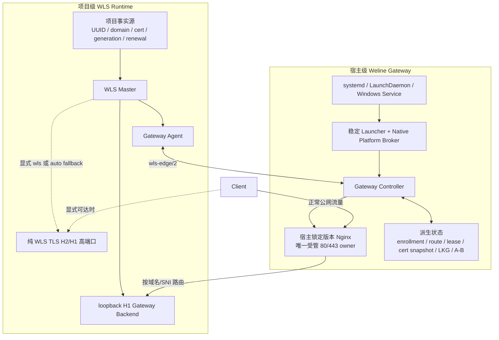

# WLS 2.0 运行时与共享网关架构

> 本文描述 WLS 2.0 的现行架构契约。每个 WLS 2.0 项目发行物持有平台锁定的签名
> Gateway/Nginx 包，但共享运行时安装到宿主独立 A/B 槽；WLS 1.x 的“每个项目直接
> 启动自己的 Nginx 占用公共端口”只保留为等待显式提升的 `legacy` 兼容状态。
>
> 状态边界：当前源码已经包含 edge 决策、宿主包、Platform Broker、Gateway
> Controller、锁定 Nginx、`wls-edge/2`、证书快照、LKG/A-B 恢复和同 Master
> 高端口降级等实现面；但“源码中存在”不等于“三平台生产就绪”。最终状态以
> WLS 2.0 迁移前实施记录已清理；当前架构以本文及源码为准。
> 的最新检查点为准。当前仍是静态修复与统一验收阶段，不得跳过 PostgreSQL、
> 当前源码百万请求、macOS/Windows 系统服务和外部 CA/DNS 门禁。

## 1. 架构总览

WLS 2.0 把公网入口和项目运行时分为两个独立生命周期：

```mermaid
flowchart TB
  C["Client"]

  subgraph H["宿主级 Weline Gateway"]
    S["systemd / LaunchDaemon / Windows Service"]
    L["稳定 Launcher + Native Platform Broker"]
    G["Gateway Controller"]
    N["宿主锁定版本 Nginx<br/>唯一受管 80/443 owner"]
    HS["派生状态<br/>enrollment / route / lease / cert snapshot / LKG / A-B"]
    S --> L
    L --> G
    G --> N
    G <--> HS
  end

  subgraph P["项目级 WLS Runtime"]
    F["项目事实源<br/>UUID / domain / cert / generation / renewal"]
    M["WLS Master"]
    A["Gateway Agent"]
    B["loopback H1 Gateway Backend"]
    W["纯 WLS TLS H2/H1 高端口"]
    F --> M
    M --> A
    M --> B
    M -. "显式 wls 或 auto fallback" .-> W
  end

  C -->|"正常公网流量"| N
  N -->|"按域名/SNI 路由"| B
  A <-->|"wls-edge/2"| G
  C -. "显式可达时" .-> W
```

宿主网关不属于安装它的项目。首个项目停止、迁移或删除后，平台服务、Controller、
锁定 Nginx 和其他租户仍必须独立运行。网关 Nginx 位于宿主不可变 A/B 槽，不使用
系统中任意已安装的 Nginx，也不长期依赖项目目录。项目发行包中的
`extend/server/wls-gateway/<target-profile>` 只作为签名安装源；首次建立后实际运行字节
位于宿主 A/B 槽。

### 1.1 三类事实源

| 范围 | 权威事实 | 可否随项目迁移 |
| --- | --- | --- |
| 项目 | `app/etc/wls-project.json` 中的 UUID 和 generation、项目域名期望、`app/etc/ssl` 及已授权额外目录中的证书源、续签与 ACME 待确认状态 | 是 |
| 宿主网关 | enrollment、能力凭据、实例租约、派生路由、证书内容寻址快照、active/LKG、A/B 槽与恢复状态 | 否；可由项目重新注册重建 |
| 操作系统 | 平台服务身份、ACL/对等身份、固定控制端点、80/443 socket owner | 宿主本地 |

项目不得把“已在某宿主注册”写成可迁移事实。项目移到新宿主后，可以重新 enrollment
并注册，也可以直接以纯 WLS 运行；证书和 generation 不因曾加入网关而失去独立使用
能力。

## 2. edge 模式

公开启动接口只有：

| 模式 | 行为 |
| --- | --- |
| `--edge=auto` | 默认。优先加入已安装、签名可信、协议兼容且可注册的 WLS 2.0 网关；不存在且公共端口、权限、平台守护和项目签名包条件都安全时，首项目自动建立宿主独立网关并加入。无法建立或加入时分配高端口并运行纯 WLS。 |
| `--edge=gateway` | 必须加入既有可信网关，或在同一安全前置下完成首次建立；首次签发可以停在已鉴权的 challenge-only 状态，其他失败非零退出。 |
| `--edge=wls` | 完全绕过网关，由项目直接终结 TLS；不启动网关发现或注册。 |

`--no-nginx` 是 `--edge=wls` 的兼容别名。配置优先级是 CLI > 已保存实例配置 >
环境配置 > `auto`。

`legacy` 不是公开启动模式。它只能表示从没有 edge 字段的 WLS 1.x 已保存配置识别
出的项目托管 Nginx；只有管理员显式执行 `server:gateway:promote`，完成影子验证、
受控端口交接和失败回滚后，才可转换为宿主共享网关。

现行决策实现见
[GatewayStartupDecision.php](../Service/Edge/Gateway/GatewayStartupDecision.php) 和
[EdgeRuntimeDecision.php](../Service/Edge/Gateway/EdgeRuntimeDecision.php)。

## 3. 80/443 与高端口规则

普通项目启动对宿主公共端口只做安全分类：

| 观察结果 | `auto` | `gateway` |
| --- | --- | --- |
| 可信 WLS 2.0 网关可注册 | 加入网关 | 加入网关 |
| 无网关，80/443 空闲，签名包、平台权限和守护条件齐全 | 在独立宿主 bootstrap 锁内建立，确认数据面 ready 后加入 | 建立并加入；任一步失败则退出 |
| 无网关但缺包、坏签名、无权限、守护建立失败，或既有网关未 ready/不兼容 | 纯 WLS 高端口并报告原因 | 失败退出 |
| 80/443 被未知 Nginx、Apache、容器代理或其他程序占用 | 不询问、不停止、不修改 owner；标记 `PORT_TAKEN` 并降级 | 不操作 owner，失败退出 |

首次建立先在项目侧无副作用预检固定路径和签名，再取得 root-only
`package-bootstrap.lock`；锁内复查可信状态并重复验签，整个等待/安装/ready 观察使用
同一绝对 deadline。并发第二项目取锁后若发现胜者已建立网关，只加入而不重复 stage。
初始安装完成后不得因首项目停止而清理宿主服务。普通启动只拥有这一次初始安装权限，
不能自动 upgrade、repair、rebootstrap 或 promote。

端口语义必须区分：

- gateway/legacy scope 的 `-p` 是项目 loopback backend，不是公网 80/443。
- `--edge=wls -p <port>` 的 `-p` 是精确 public port；冲突即失败，不静默换号。
- `auto` fallback 的 public port 在 `20000–29999` 中按项目 UUID 稳定选取，并以
  宿主协调锁、持久租约和实际 bind 共同确认。多个项目必须得到不同的已绑定地址。
- 未显式扩大 bind 时，高端口默认只监听 loopback。它不是 80/443 的透明替代；WLS
  只报告实际地址及 DNS、防火墙、反向代理或负载均衡限制，不自动修改网络策略。

端口租约实现见
[GatewayPortLeaseAllocator.php](../Service/Edge/Gateway/GatewayPortLeaseAllocator.php)。

## 4. 注册、路由与租约

### 4.1 WLS Edge Protocol 2

项目 Agent 与宿主 Controller 使用 `wls-edge/2`。POSIX 使用固定 Unix Domain
Socket，Windows 使用固定 Named Pipe；管理通道和项目通道分离，并由 OS peer
identity、ACL、项目能力凭据、nonce、防重放、请求摘要和 fencing 共同约束。

项目生命周期消息为：

- `register`：提交完整项目期望和实例后端身份；
- `renew`：以预期 route generation 更新已有注册；
- `heartbeat`：只续租和报告实例摘要，不得夹带路由、证书或域名变更；
- `drain`：进入有界排空；
- `unregister`：只移除当前实例后端，不停止宿主网关，也不自动撤销项目 enrollment。

注册信封绑定 project UUID、规范项目根、instance ID、gateway epoch、project
generation、instance generation、幂等摘要、后端身份、route 和 certificate
generation。同 generation/同摘要的重放幂等成功；低 generation 拒绝；同
generation/异摘要拒绝；较高 generation 串行事务发布。

### 4.2 路由状态与隔离

可观察路由状态包括：

`PENDING_BACKEND`、`PENDING_CERTIFICATE`、`PENDING_PUBLICATION`、
`ACTIVE`、`DRAINING`、`STALE` 和 `REMOVED`。

- 后端通过 project UUID、instance ID、generation、launch/lease identity 的真实
  loopback 探针后才能成为可服务候选。
- 域名统一转为小写 IDNA ASCII。跨项目精确域名冲突、通配符覆盖冲突和未经授权的
  transfer 一律拒绝。
- HTTPS 的 SNI 与 Host 必须解析为同一项目，否则返回 421。HTTP 未知 Host 返回
  中性 404；HTTPS 未知 SNI 使用宿主中性证书，普通校验客户端可能在看到 421 前先
  因证书不匹配失败。
- 不存在“第一个项目”或 default server 回退。未知域名绝不能落到引导项目。
- `website_id=0/code=default` 是合法站点，构建路由时不得按假值过滤。

### 4.3 默认租约

- Agent 心跳间隔：10 秒。
- 45 秒未续租：路由进入 `STALE`，新请求返回 503。
- 主动停止排空：300 秒。
- STALE/操作保留：24 小时。
- 未被 active 或保留 LKG 引用的证书快照：7 天后才可回收。
- 每条活动路由至少每 60 秒重新验证一次后端身份。

同项目可以有多个实例，但默认是确定性首选实例加健康热备。只有管理员授权且每个活动
实例都提供匹配的 `stateless` 或同源 `shared_session` 运行证明时，Controller
才允许多后端分流。

协议与控制器入口见
[GatewayClient.php](../Service/Edge/Gateway/GatewayClient.php)、
[GatewayRegistrationLifecycle.php](../Service/Edge/Gateway/GatewayRegistrationLifecycle.php)
和 [wls_gateway_controller.php](../bin/wls_gateway_controller.php)。

## 5. 证书与 ACME

项目证书始终是唯一事实源：

1. 默认从项目 `app/etc/ssl` 读取；额外目录必须在 enrollment 中显式授权。
2. Native Broker 使用 no-follow 语义读取，拒绝符号链接穿越和特殊文件，并校验
   权限、大小、复制前后摘要、证书/私钥匹配、SAN/有效期和 certificate generation。
3. 校验通过后，宿主生成只读的内容寻址证书快照；Nginx 配置只引用宿主快照，不直接
   长期引用项目路径。
4. 摘要在复制期间变化、证书无效或快照发布失败时，保留当前 active/LKG，不以坏证书
   替换现有 TLS。
5. 纯 WLS 从相同项目事实源和 generation 建立 TLS context；加入过网关不会改变项目
   独立启动能力。

首次没有有效证书时：

- 网关只可开放精确且带过期时间的 ACME HTTP-01 challenge 路径；普通 443 业务路由
  在有效证书发布前保持关闭。
- 通配符证书必须走 DNS-01。
- `gateway` 可报告 `PENDING_CERTIFICATE/challenge-only`；显式纯 WLS 和
  `auto` fallback 不生成隐式公网自签名证书，而是明确报告
  `TLS_CERTIFICATE_UNAVAILABLE`。
- 续签结果先写项目待确认队列。网关恢复后，Agent 以 generation/摘要幂等重放。

WLS 2.0 v1 对共享网关租户关闭 TLS session cache、session ticket 和 0-RTT；不能用
per-route ticket key 推导租户隔离。H3 只有宿主 Nginx 的 QUIC 数据面、UDP/443、
Alt-Svc 和真实后端探针同时通过才可声明；纯 WLS 当前只提供 H2/H1。

## 6. 项目运行时数据面

共享网关不替代 WLS Master/Worker 运行时：

- gateway scope：宿主 Nginx 终结公网 TLS/H1/H2，门禁通过时可启用 H3；回源是受
  loopback 能力保护的 H1 Keep-Alive。Nginx 必须覆盖客户端伪造的内部 token、
  `Forwarded`、`X-Forwarded-*` 和 hop-by-hop 头。
- pure WLS scope：Stream TLS Worker 直接终结 TLS 1.3，协商 H2/H1；不提供 H3。
- 两种 scope 共用 Master、READY、RuntimePolicyBundle、WorkerPolicyKernel、Direct/
  Dispatcher、rolling reload 和连接排空不变量。Worker 未 READY 时不能进入路由。
- `server:stop <instance>` 只排空并注销该实例；共享 Gateway 的停机由管理员专用
  `server:gateway:stop` 控制，并持久化停机意图。

项目 Worker 的拓扑细节分别由
[WLS启动与关闭链路图.md](WLS启动与关闭链路图.md)、
[IPC控制通道架构.md](IPC控制通道架构.md) 和
[Dispatcher分流架构设计.md](Dispatcher分流架构设计.md) 维护；本文不复制它们的
完整状态机。

## 7. 网关健康与自动恢复

生产网关采用三层恢复边界：

1. 平台服务：systemd、LaunchDaemon 或 Windows Service。
2. 稳定 Launcher + Native Platform Broker + Gateway Controller。
3. 锁定 Nginx 数据面。

Controller 以 5 秒周期检查控制面、自有 Nginx 进程身份、配置 generation、IPv4/
IPv6 公共 listener 和真实 SNI/Host/证书/后端链路。健康分类必须区分：

| 状态 | 行为 |
| --- | --- |
| `CONTROL_DEGRADED` | Nginx 数据面仍健康时保留流量，只恢复 Controller；项目不得开启 fallback。 |
| `DATA_PLANE_DOWN` | 公共入口或租户数据面失败，进入完整恢复链并启动项目侧 90 秒故障计时。 |
| `DISK_PRESSURE` | 保留已验证 active/LKG，拒绝新持久 mutation，避免 Controller 重启循环；管理员确认恢复后才解除。 |

完整恢复链按以下顺序收敛：

1. **无中断接管**：只有 PID/birth、可执行文件摘要、A/B 槽、config generation 和真实
   探针全部匹配本网关 manifest，Controller 才接管现有 Nginx，且不触发 reload。
2. **快速重启**：连续核心探针失败后，只重启清单中经过身份验证的网关 Nginx；未知
   80/443 owner 永远不在自动操作范围。
3. **配置回滚**：候选配置先经语法检查、原子发布和观察窗；反复启动/探针失败时回到
   完整 LKG。active config、route、certificate closure 和 generation 必须共同匹配。
4. **A/B 二进制回滚**：宿主包在不可变 A/B 槽间切换。新槽需完成影子验证和五分钟
   健康观察；崩溃循环自动回旧槽，旧槽至少保留 24 小时。
5. **状态重建**：快照/journal 损坏时隔离损坏文件，从可信 LKG 恢复 TLS 并统一返回
   503；gateway epoch 更新后，各项目重放完整期望状态并逐路由恢复。
6. **熔断和退避**：15 分钟累计 10 次恢复失败后停止高频重启，使用最长 5 分钟的指数
   退避维护重试；状态命令报告阶段、原因、generation、A/B 槽和下次重试时间。

### 7.1 项目最终降级与回切

当项目仍处于期望运行状态，且网关**数据面**连续不可用 90 秒时，Gateway Agent 在
同一 WLS Master 内增加纯 WLS TLS 高端口，不启动第二个 Master。网关恢复
`ACTIVE` 并连续健康 30 秒后，新流量切回 80/443；高端口继续排空 300 秒再释放。

仅 Controller 故障而 Nginx 正常时不得降级。fallback 期间 Agent 继续按退避发现可信
网关；显式 `--edge=wls` 不发现网关。任何回切阶段失败都保留当前可用的纯 WLS
入口，不把公网 TLS listener 误注册成明文 gateway backend。

主要实现入口：

- [HostGatewayPackageManager.php](../Service/Edge/Gateway/HostGatewayPackageManager.php)
- [GatewayPlatformServiceInstaller.php](../Service/Edge/Gateway/GatewayPlatformServiceInstaller.php)
- [Agent.php](../Console/Server/Gateway/Agent.php)
- [ManagedNginxService.php](../Service/Edge/Nginx/ManagedNginxService.php)
- [NginxConfigPublication.php](../Service/Edge/Nginx/Runtime/NginxConfigPublication.php)
- [POSIX Broker](../Service/Edge/Gateway/Native/posix/wls_gateway_broker.c) /
  [Windows Broker](../Service/Edge/Gateway/Native/windows/wls_gateway_broker.c)

## 8. 三平台边界

| 平台 | 宿主服务与控制通道 | 宿主根目录 | 项目数据面默认 | 当前证据边界 |
| --- | --- | --- | --- | --- |
| Linux | systemd system unit；Unix Domain Socket；POSIX Launcher/Broker | `/var/lib/weline-gateway`，运行端点在 `/run/weline-gateway` | Direct `shared_fd`；`reuseport` 是显式性能选项 | 隔离 VM 已有 systemd、真实 80/443、reboot、LKG/A-B、fallback/rejoin 和 legacy promote 证据；当前源码统一门禁仍须以最新计划重跑 |
| macOS | system-domain LaunchDaemon；Unix Domain Socket；POSIX Launcher/Broker | `/Library/Application Support/WelineGateway`，运行端点在 `/var/run/weline-gateway` | Direct `shared_fd` | 随机高端口 Native Broker/Launcher/数据面已有实测；系统域安装、root ACL 与 reboot 仍未闭合 |
| Windows | Windows Service；Named Pipe + SID/DACL；Windows Launcher/Broker | `%PROGRAMDATA%\Weline\Gateway` | gateway backend 使用 `worker_ports` Direct；纯 WLS 使用 Dispatcher | 源码、编译/self-test 与跨平台合同已有覆盖；Windows Service、Named Pipe DACL、NTFS reparse 和 reboot 仍需真实 Windows Runner/VM |

无法安装或验证平台服务、固定信任路径、权限、安全控制通道以及安装 profile 要求的
80/443 listener 时，宿主网关不得标记 ready。普通项目 `auto` 只能降级，不能用
用户级临时进程冒充生产网关。

平台路径与控制端点的源码权威见
[GatewayPaths.php](../Service/Edge/Gateway/GatewayPaths.php)。

## 9. WLS 2.0 v1 边界

v1 明确支持：

- 单一物理机或虚拟机、同一管理员控制的 OS 信任域；
- 域名/SNI 级多项目路由；
- 每项目多实例的首选/热备，以及经过能力证明后的有限分流；
- 单宿主内控制器、Nginx、配置、证书、状态和二进制恢复。

v1 不声称支持：

- 跨项目路径路由；
- 跨宿主无感高可用；宿主断电、网络或整盘故障需要外部负载均衡和后续多宿主网关；
- 彼此敌对的同 UID 项目、未经 ACL/只读共享卷设计的跨用户或跨容器注册；
- 自动修改 DNS、防火墙或外部负载均衡；
- 自动终止或接管未知 Nginx/Apache/代理；
- 普通项目升级共享网关；
- 纯 WLS HTTP/3，或通过 TLS ticket/0-RTT 获得的跨租户会话复用。

## 10. 实现状态与发布门禁

状态统一采用四种表述：

| 表述 | 含义 |
| --- | --- |
| 已验证 | 当前源码已在明确列出的真实环境和 surface 运行通过。 |
| 已实现，待验证 | 实现或静态合同存在，但目标平台、系统服务、冷重启或专用环境证据不足。 |
| 未实现 | 当前代码不提供该能力，不能以“pending”或设计文档替代。 |
| 外部环境延期 | 等待公网、专用 Runner 或生产级平台环境。 |

当前结论是 **LOCAL_RUNTIME_VERIFIED / GA_BLOCKED_EXTERNAL**。macOS、Linux 和
Windows QEMU x64 兼容环境的纯 WLS 直接 HTTP/2 百万请求已经按当前源码完成；该证据
不覆盖 managed Gateway 公网路径、物理 Windows/MSVC/SCM 冷重启、macOS system-domain
冷重启或公网 CA/DNS 首签。纯 WLS HTTP/3/QUIC 与 HTTP/2 SSE DATA-frame 流式当前
明确为未实现。

最新数字、报告摘要和全部未完成项只维护在
[WLS 当前能力与验收状态](WLS当前能力与验收状态.md)。运维命令、状态字段和故障处理
方法见 [WLS 2.0 Gateway 使用指南](WLS-Gateway使用指南.md)。带日期的实施计划和任务
记录仅作为历史证据，不能覆盖当前状态页。

## 11. 相关文档

- [WLS 2.0 Gateway 使用指南](WLS-Gateway使用指南.md)
- [WLS 模式部署指南](WLS模式部署指南.md)
- [WLS 启动与关闭链路图](WLS启动与关闭链路图.md)
- [IPC 控制通道架构](IPC控制通道架构.md)
- [Dispatcher 分流架构设计](Dispatcher分流架构设计.md)
- [WLS Session/Memory 共享服务架构](WLS_Session共享服务架构.md)
- [WLS 实例隔离机制](WLS实例隔离机制.md)
