# WLS Panel Prototype

## Backend Entry

```text
Framework Backend
└─ System Service
   └─ WLS Panel
```

The backend menu is only an authorization and entry point. The panel itself uses an independent shell.

## Desktop Wireframe

```text
┌────────────────────────────────────────────────────────────────────┐
│ WLS Panel Sidebar        │ Header: Dashboard  [Theme] [Project] [Exit]│
│ - Dashboard              ├───────────────────────────────────────────┤
│ - Projects               │ Metrics: Projects / Gateway / Plugins /   │
│ - Gateway                │ Security Events                            │
│ - Security               ├───────────────────────────────────────────┤
│ - Marketplace            │ Gateway Settings                           │
│                          │ - route count / enabled / running          │
│                          │ - target selector / Apply Routes Now       │
│                          ├───────────────────────────────────────────┤
│                          │ Managed Projects                           │
│                          │ - Current Project: admin / panel / PHP     │
│                          │ - Child WLS: admin / panel / PHP           │
│                          ├───────────────────────────────────────────┤
│                          │ Gateway, Security, Runtime action cards    │
└──────────────────────────┴───────────────────────────────────────────┘
```

## Mobile Wireframe

```text
┌──────────────────────────────┐
│ WLS Panel                    │
│ Dashboard | Projects         │
│ Gateway   | Security         │
│ Marketplace                  │
├──────────────────────────────┤
│ Header actions wrap          │
├──────────────────────────────┤
│ Metrics stack                │
│ Project cards stack          │
│ Action cards stack           │
└──────────────────────────────┘
```

## Responsive Theme Shell Prototype

The WLS Panel is visually independent from the framework backend. The backend
only owns authorization and the entry link; after entry, the panel shell owns
navigation, theme, page layout, and plugin capability menus.

```text
Desktop >= 1101px
+----------------------+-----------------------------------------------+
| WLS Panel sidebar    | Page header: title + theme/project/exit       |
| - Dashboard          |                                               |
| - Projects           | Dashboard / Gateway / Security / Marketplace  |
| - Gateway            | cards use responsive grids                    |
| - Security           |                                               |
| - Marketplace        | plugin grids auto-fit available width         |
| Plugin Capabilities  |                                               |
| - File Manager       |                                               |
+----------------------+-----------------------------------------------+

Tablet/mobile <= 1100px
+--------------------------------------------------------------+
| WLS Panel brand                                               |
| Dashboard | Projects                                         |
| Gateway   | Security                                         |
| Marketplace                                                   |
| Plugin Capabilities                                           |
| File Manager | Deploy                                         |
+--------------------------------------------------------------+
| Page title                                                    |
| [Theme] [Project Admin] [Exit]                                |
| Content cards collapse before horizontal overflow appears     |
+--------------------------------------------------------------+

Phone <= 520px
+------------------------------+
| WLS Panel                    |
| Dashboard                    |
| Projects                     |
| Gateway                      |
| Security                     |
| Marketplace                  |
| Plugin Capabilities          |
| File Manager                 |
+------------------------------+
| Page title                   |
| [Theme]                      |
| [Project Admin]              |
| [Exit]                       |
| Single-column content        |
+------------------------------+
```

Theme contract:

- Light and dark mode use the same layout and spacing tokens.
- Dark mode covers the main content, cards, form fields, status chips, and
  sidebar variables.
- The shell stores the operator preference in `wls_panel_theme`.
- The shell sets `data-wls-theme` for styling and `data-wls-panel-theme` on the
  document/body for diagnostics and test assertions.
- Theme changes must not require returning to the framework backend.

Layout assertions:

- `document.scrollingElement.scrollWidth <= window.innerWidth`.
- At desktop width, the sidebar and main column do not overlap.
- At `1100px` and below, the sidebar becomes top navigation and main content
  starts below it.
- Plugin capability dividers span all nav columns.
- Header actions left-align below the page title on narrow layouts.
- Long translated button labels wrap inside their buttons instead of forcing
  horizontal overflow.

## Security Page Prototype

```text
+--------------------------------------------------------------------+
| WLS Panel / Security                                               |
+--------------------------------------------------------------------+
| Metrics: Events / Blocked / Critical / Blocked IPs                 |
+--------------------------------------------------------------------+
| Project Security Drilldown                                         |
| [Project A risk] Events Blocked Critical  [View Logs] [Edit Policy]|
| [Project B risk] Events Blocked Critical  [View Logs] [Edit Policy]|
+--------------------------------------------------------------------+
| Project Security Policy                                            |
| Selected project/domain + custom-policy status                     |
| Toggle: Enable project override                                    |
| Policy Inheritance Map: global value vs project effective value    |
| Rate Limit       Path Rate       Path Scan       SSL Handshake      |
| Unknown Route    IP Whitelist    Protected Paths                    |
| Save Project Policy / Remove Custom Policy                         |
+--------------------------------------------------------------------+
| Security Policy Audit                                              |
| Latest changes: action / source / scope / domain / changed sections |
| Filters: action / source / domain / changed section / keyword / limit|
+--------------------------------------------------------------------+
| Common Rule Editor                         | Rule Summary          |
| Rate / Path / SSL / Unknown / Whitelist    | Enabled switches      |
| Change Preview                             |                       |
| Merged Rules JSON                          |                       |
+--------------------------------------------------------------------+
| Recent Attack Logs: scope / instance / ip / severity / type filters|
+--------------------------------------------------------------------+
```

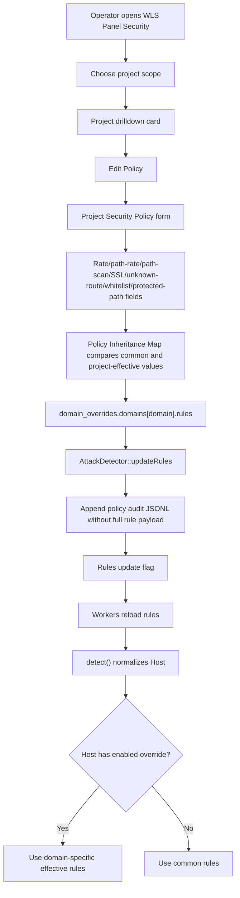

## Marketplace Prototype

```text
┌────────────────────────────────────────────────────────────────────┐
│ Marketplace                                                        │
│ Type Tag: module:wls        Search: wls-file-manager       Filter │
├────────────────────────────────────────────────────────────────────┤
│ WLS File Manager     tags: module:wls custom:wls-file-manager      │
│ WLS Deploy           tags: module:wls custom:wls-deploy            │
│ WLS PHP Manager      tags: module:wls custom:wls-php-manager       │
│ WLS DB Manager       tags: module:wls custom:wls-database-manager  │
└────────────────────────────────────────────────────────────────────┘
```

## Typed Tag Marketplace Logic Prototype

WLS-specific marketplace discovery stays tag-based. A plugin module does not
inherit a WLS PHP contract just to appear in the panel. It declares
`module:wls` in `etc/marketplace/meta.json`; optional tags such as
`custom:wls-file-manager`, `feature:file-manager`, and `system:false` describe
the plugin identity and capabilities.

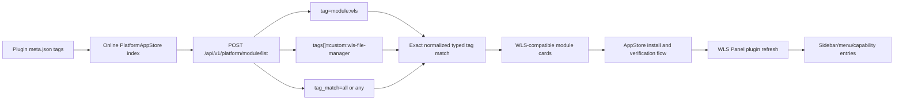

```text
meta.json
  tags:
    - module:wls
    - custom:wls-file-manager
    - category:server-tools
    - feature:file-manager
    - capability:files-read
    - capability:files-write
    - capability:files-policy
    - capability:files-delete-tree
    - system:false

PlatformAppStore list filter:
  tag=module:wls
  tags[]=custom:wls-file-manager
  tag_match=all
```

## Panel Page Map

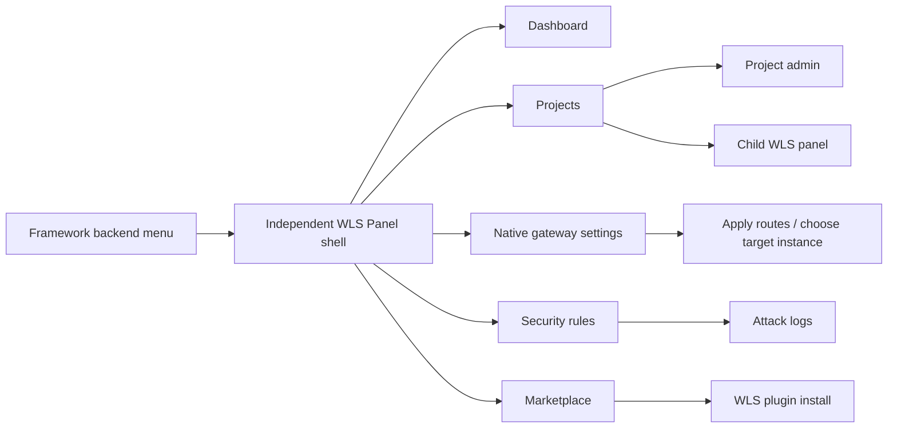

## Plugin-Contributed Menu Prototype

WLS keeps the normal framework backend as an authorized entry only. Once inside
the independent shell, installed `module:wls` plugins can add their own panel
entries from meta:

```text
+------------------------------------------------------------------------+
| WLS Panel Sidebar         | Header: Dashboard [Theme] [Project] [Exit] |
+---------------------------+--------------------------------------------+
| Dashboard                 | Metrics                                    |
| Projects                  | Operations Capability Center               |
| Gateway                   | - PHP profiles / DB profiles / Files       |
| Security                  | - Deploy release slot                      |
| Marketplace               |                                            |
|                           | WLS Panel Plugin Entries                   |
| Plugin Capabilities       | - File Manager      [Open Panel Entry]     |
| - File Manager            | - Deploy Releases   [Open Panel Entry]     |
| - Deploy Releases         |                                            |
+---------------------------+--------------------------------------------+
```

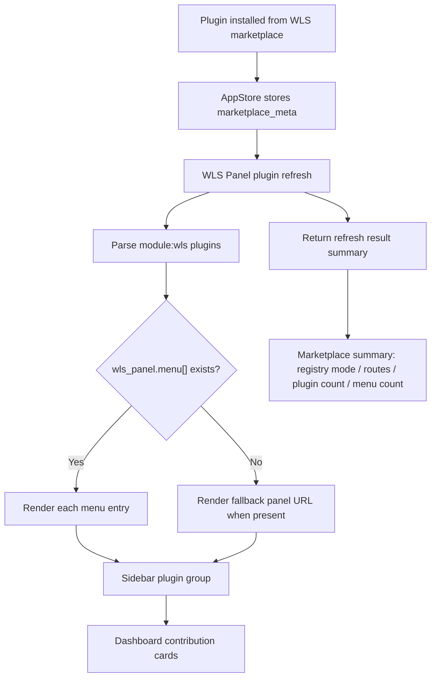

## Plugin Refresh Result Prototype

The panel refresh action must be visible as an operational reload, not a silent
redirect. After a marketplace install/update or a manual refresh click, WLS
returns to the independent marketplace page with a concise result strip:

```text
+------------------------------------------------------------------------+
| WLS Panel > Marketplace                          [Theme] [Project]     |
+------------------------------------------------------------------------+
| Notice: Panel plugin capabilities have been refreshed.                  |
+------------------------------------------------------------------------+
| Capability Reload                                  [Routes Refreshed]   |
| Panel plugin refresh result                                             |
| +----------------+ +----------------+ +----------------+ +------------+ |
| | Registry mode  | | Registry mods  | | Route modules  | | WLS plugins| |
| | incremental    | | 4              | | 4              | | 4          | |
| +----------------+ +----------------+ +----------------+ +------------+ |
| +----------------+                                                    |
| | Panel entries  |                                                    |
| | 4              |                                                    |
| +----------------+                                                    |
+------------------------------------------------------------------------+
| Online WLS Plugins | Installed WLS Plugins | Tag Contract              |
| Installed plugin cards immediately open contributed panel entries.      |
+------------------------------------------------------------------------+
```

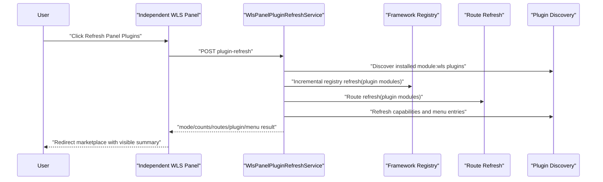

## WLS File Manager Plugin Shell Prototype

`Weline_FileManager` is the first real WLS plugin slice. It is a bundled system
module, but it declares the same typed marketplace meta as online plugins:
`module:wls`, `custom:wls-file-manager`, `feature:file-manager`,
`capability:files-read`, `capability:files-write`,
`capability:files-policy`, and `system:true`.

```text
+---------------------------------------------------------------+
| WLS File Manager Sidebar | WLS File Manager                    |
| - WLS Panel              | Project context: id / domain / type |
| - Paths                  | Actions: Project Admin / Back WLS   |
| - Browse                 +--------------------------------------+
| - Write                  | Notice / error banner                |
| - Logs                   +--------------------------------------+
| - Capabilities           | Path Summary                         |
| - Marketplace            | - Project root     read-only root    |
| [Theme]                  | - app/code         read-only root    |
|                          | - var              controlled write  |
|                          | - pub              controlled write  |
|                          +--------------------------------------+
|                          | Path Policy                          |
|                          | - profile key / enabled roots / time |
|                          | - enable var/pub/project_var/pub     |
|                          | - SAVE_PATH_POLICY confirmation      |
|                          +--------------------------------------+
|                          | Directory Browser                    |
|                          | Root tabs: project / app / var / pub |
|                          | Current path + Go Up                 |
|                          | Name | Type | Size | Modified | State|
|                          +--------------------------------------+
|                          | Controlled Write                     |
|                          | - Create directory + checkbox        |
|                          | - Save small text + SAVE_TEXT phrase |
|                          | - Disabled on read-only roots        |
|                          +--------------------------------------+
|                          | Operation Logs                       |
|                          | JSONL audit, latest 20 entries       |
|                          +--------------------------------------+
|                          | Capability Stages                    |
|                          | - Path allowlist    partial          |
|                          | - File browsing     enabled          |
|                          | - Change operations controlled       |
+---------------------------------------------------------------+
```

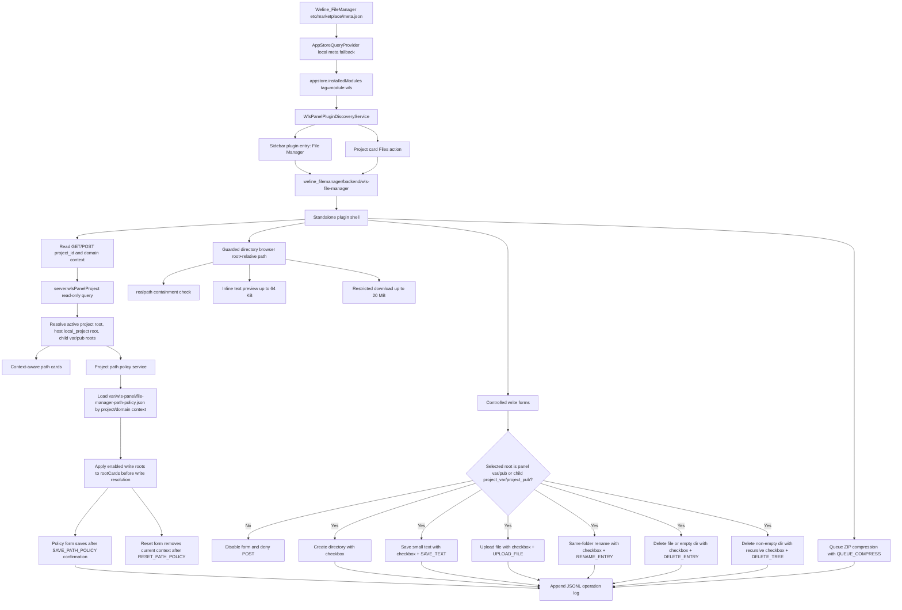

The second shell slice allows read-only directory listing inside the selected
active project/app/var/pub root. When a managed project context resolves
through `server.wlsPanelProject`, the active project root points at the child
project, the host panel root appears as `local_project`, and child `var`/`pub`
appear as `project_var`/`project_pub`. The third read-only slice adds text/config/code
preview up to 64 KB and framework-response downloads up to 20 MB for readable
files that remain inside the selected allowlisted root. The fourth slice opens
only non-destructive directory creation and small text-file saves for current
panel `var`/`pub` or resolved child `project_var`/`project_pub` roots. The fifth
slice adds guarded upload, same-folder rename, and file or empty-directory
delete under the same controlled-root boundary. The next slice adds bounded
recursive directory delete for non-empty directories. It keeps `project`,
`local_project`, and `app_code` read-only, requires the
`Weline_FileManager::wls_file_manager_write` ACL, requires explicit in-panel
confirmation, rejects unsafe names/extensions/binary content, and writes JSONL
audit entries to `var/log/wls_file_manager_operations.log`.
The audit slice scans the latest 200 JSONL entries, shows counts for scanned,
shown, success, denied, and failed events, and lets the operator filter the
latest operation list by action, result, root, and keyword without leaving the
standalone plugin shell.
The path-policy slice adds a persistent project/domain-scoped write-root
selector. Operators can enable or disable only the controlled write roots
(`var`, `pub`, `project_var`, and `project_pub`) after typing
`SAVE_PATH_POLICY`; saved policies are stored under
`var/wls-panel/file-manager-path-policy.json` and are applied before every
guarded write action. The reset slice adds a second confirmation path:
operators can type `RESET_PATH_POLICY` to delete the current safe context entry
and return that project/domain to default inherited controlled roots.
The queue-backed large-file slice adds `QUEUE_COMPRESS`: the request only
creates a `Weline_Queue` task, while the worker revalidates root boundaries,
rejects symlinks/path escapes, caps sources at 2000 entries and 512 MB, and
creates a sibling ZIP without overwriting existing archives.

FileManager controlled-write rules:

- Directory names and file names must be single path segments; path separators,
  leading dots, drive separators, and parent traversal are rejected.
- Text saves are capped at 128 KB and allow only safe text extensions.
- Uploads are capped at 5 MB and allow only safe text, document, archive, and
  web-asset extensions.
- Rename stays in the same folder; moving between directories is not part of
  this slice.
- Delete accepts files or empty directories with `DELETE_ENTRY`. Non-empty
  directory delete requires the recursive checkbox plus `DELETE_TREE`, rejects
  symlinks, scans before deletion, caps the tree at 100 entries and 10 MB, and
  emits a `delete_tree` operation log.
- Compression creates sibling ZIP archives only inside writable allowlisted
  roots. The first slice is bounded to 200 entries and 10 MB source data, does
  not overwrite existing archives, rejects symlinks, and writes operation logs
  for success, denial, and filesystem failure.
- Queued compression uses `Weline\FileManager\Queue\WlsFileManagerLargeOperationQueue`
  through `w_query('queue', 'create', ...)`; recent queue status is shown in the
  standalone plugin shell and the worker applies its own 2000-entry / 512 MB
  root-boundary revalidation.
- Recoverable queued trash uses the same worker and queue section. The panel
  requires `QUEUE_TRASH`, moves the selected file or directory to the same-root
  `.wls-trash` directory, records `trash_path` and `trash_relative_path` in the
  queue content, and exposes a Restore action for completed jobs while the
  original path is still free. Restore posts only `queue_id` plus confirmation;
  the server reloads the queue payload and refuses path escapes, symlinks, and
  existing restore targets.
- Recoverable trash history is a separate card in the queue section, not hidden
  inside generic compression jobs. It shows up to 30 queue-created trash entries,
  marks whether each row is restorable, waiting, blocked by an existing target,
  unavailable, or failed, and reuses the same `RESTORE_TRASH` server-side
  restore form.
- The same history card now exposes a quiet secondary dangerous action for
  permanent purge when the queue-created `.wls-trash` entry still exists. The
  purge form posts only `queue_id`, requires the `PURGE_TRASH` phrase, reloads
  the queue payload server-side, and marks purged rows distinctly instead of
  mixing them with missing/unavailable trash files.
- Existing files require an explicit overwrite checkbox.
- Every success, denial, and filesystem failure is visible in the Operation
  Logs section, which now includes summary counters and action/result/root/
  keyword filters.
- Safe-text editor ergonomics are part of the current guarded `SAVE_TEXT`
  prototype: wrap/font controls, dirty state, line/character/byte/cursor
  metrics, safe revert, and mobile-safe toolbar wrapping are available without
  weakening the existing confirmation checkbox, phrase, controlled-root, and
  extension allowlist checks.
- Existing-file source-code editing is a separate opt-in path-policy slice:
  when source editing is enabled for `project`, `local_project`, or `app_code`,
  eligible previews enter a guarded `SAVE_SOURCE` form, stay capped at 128 KB,
  reject symlinks/protected paths, and stay separate from ordinary writable
  roots. Enabled source roots can now create one new small allowlisted source
  file through the dedicated `SOURCE_CREATE_FILE` form when the containing
  directory already exists and the target file does not, and can rename one
  existing allowlisted file in the same directory through the dedicated
  `SOURCE_RENAME` form. The next implemented layer moves one existing
  allowlisted source file into the same-root `.wls-trash` folder through the
  dedicated `SOURCE_TRASH` form; it stays synchronous, single-file only, capped
  at 128 KB, and does not enable hard delete, purge, directories, or ordinary
  source queue operations.
- Source queue operations are now split into dedicated bounded slices:
  `SOURCE_QUEUE_TRASH` for recoverable single-file trash,
  `SOURCE_QUEUE_ARCHIVE` for a read-only single-file ZIP snapshot,
  `SOURCE_QUEUE_ARCHIVE_TREE` for a read-only ZIP snapshot of one existing
  child directory under the current enabled source-policy path, and
  `SOURCE_QUEUE_ARCHIVE_SELECTION` for a read-only ZIP snapshot of up to 20
  explicitly named direct child files or directories in the current source
  policy directory. All source archive queues write only under
  `var/wls-panel/file-manager/source-archives/`. Broader multi-directory,
  multi-root, or source-write queue operations remain future policy slices.

### FileManager Source-Tree Policy Split

The remaining source-tree write work must stay layered. The panel should not
turn source roots into ordinary writable roots. Each source action gets a
separate policy flag, confirmation phrase, audit action, and validation gate.

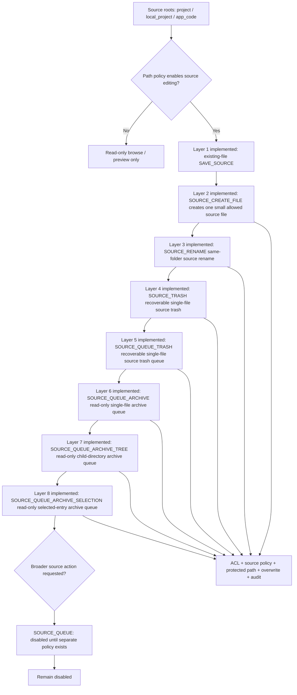

| Layer | State | Allowed intent | Must remain blocked |
| --- | --- | --- | --- |
| 0 | Implemented | Read-only browse, preview, download inside source roots | All source-root writes |
| 1 | Implemented | Existing small file edit with `SAVE_SOURCE` | New file outside `SOURCE_CREATE_FILE`, rename outside `SOURCE_RENAME`, upload, delete, queue |
| 2 | Implemented | Create one small allowed source file with `SOURCE_CREATE_FILE` | Directories, overwrite, upload, rename outside `SOURCE_RENAME`, delete, queue, protected paths |
| 3 | Implemented | Same-folder source rename with `SOURCE_RENAME` | Cross-folder move, overwrite, extension change to unsafe type, protected paths |
| 4 | Implemented | Recoverable single-file source trash with `SOURCE_TRASH` into same-root `.wls-trash` | Hard delete, recursive delete, purge, broad source queue, generated/vendor/env/lock paths |
| 5 | Implemented | Recoverable single-file source trash queue with `SOURCE_QUEUE_TRASH` and `source_trash_entry` worker revalidation | Upload, batch, hard delete, purge, ordinary `QUEUE_TRASH`/`QUEUE_COMPRESS` against source roots |
| 6 | Implemented | Read-only single-file source archive queue with `SOURCE_QUEUE_ARCHIVE` and `source_archive_file` worker revalidation into `var/wls-panel/file-manager/source-archives/` | Source-root ZIP writes, upload, delete, overwrite, batch |
| 7 | Implemented | Read-only child-directory source archive queue with `SOURCE_QUEUE_ARCHIVE_TREE` and `source_archive_tree` worker revalidation, capped at 200 entries and 10 MB, into `var/wls-panel/file-manager/source-archives/` | Multi-directory, recursive source writes, source-root ZIP writes, upload, delete, overwrite, batch |
| 8 | Implemented | Read-only selected-entry source archive queue with `SOURCE_QUEUE_ARCHIVE_SELECTION` and `source_archive_selection` worker revalidation, capped at 20 direct children, 200 traversed entries, and 10 MB, into `var/wls-panel/file-manager/source-archives/` | Cross-directory selection, multi-root selection, source-root ZIP writes, upload, delete, overwrite, batch |
| 9 | Future blocked | Broader source queue operation only after a separate policy exists | Reusing ordinary ZIP/trash queue flows against source roots |

Source-tree writes must keep these no-go zones even when a future policy is
enabled: `.env`, `app/etc/env.php`, lock files, `.git`, `.wls-trash`,
`generated`, `vendor`, `node_modules`, `var`, symlinks, unreadable paths, path
escapes, binary content, and oversized payloads.

## WLS PHP Manager Plugin Shell Prototype

`Weline_PhpManager` is the first real PHP operation plugin. It is a bundled
system module, but uses the same WLS marketplace meta contract as installable
plugins: `module:wls`, `custom:wls-php-manager`,
`feature:php-config`, `capability:php-runtime-read`,
`capability:php-profile-write`, `capability:php-ini-apply`,
`capability:wls-reload-request`, and `system:true`.

```text
+-----------------------------------------------------------------+
| WLS PHP Manager Sidebar      | WLS PHP Manager                   |
| - WLS Panel                  | Project context: id/domain/type   |
| - Runtime                    | Actions: WLS Panel / Project Admin|
| - Project Profile            +------------------------------------+
| - php.ini                    | Metrics: runtime PHP / extensions |
| - Extensions                 |          / saved profile state     |
| - Audit                      |          / pending ini changes     |
| - Marketplace                +------------------------------------+
| [Theme]                      | Project Context                    |
|                              | operation / project_id / domain   |
|                              +------------------------------------+
|                              | Current PHP Runtime                |
|                              | version / SAPI / binary / php.ini |
|                              | memory / upload / post / timezone |
|                              +------------------------------------+
|                              | Project PHP Profile                |
|                              | binary / php.ini / memory / time  |
|                              | upload / post / timezone          |
|                              | required extensions               |
|                              | disabled functions                |
|                              | runtime action: save only / reload|
|                              | confirm guarded save              |
|                              +------------------------------------+
|                              | php.ini Apply Plan                 |
|                              | target / managed block / backup   |
|                              | directive diff: current -> profile|
|                              | apply phrase / rollback phrase    |
|                              | optional WLS reload after action   |
|                              +------------------------------------+
|                              | Loaded Extensions                  |
|                              | read-only chip list                |
|                              +------------------------------------+
|                              | Recent Audit                       |
|                              | profile save JSONL entries        |
+-----------------------------------------------------------------+
```

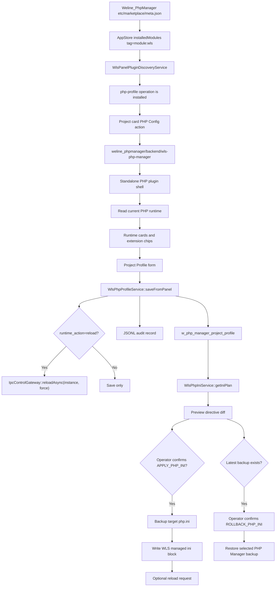

Implemented PHP rules:

- The plugin reads the current PHP process and loaded extensions.
- The page accepts only safe WLS project context:
  `operation`, `project_id`, `domain`, and `project_type`.
- Project Profiles are persisted by `profile_key` derived from `project_id`,
  `domain`, or `local`.
- Binary and ini paths are sanitized text fields; list fields are normalized
  comma-separated identifiers.
- php.ini apply writes only a WLS-managed directive block after creating a
  backup.
- php.ini rollback restores only PHP Manager backups with sidecar metadata.
- Allowed ini targets are bundled/sandbox paths such as `extend/server/php` and
  WLS PHP Manager sandbox directories.
- Audit entries write to `var/log/wls/php-manager-audit.jsonl`.
- Runtime reload is operator-selected and requires a target WLS instance; save
  only is the default.
- Future slices own extension install/remove and per-project runtime
  inheritance conflict display.

## WLS Database Manager Plugin Shell Prototype

`Weline_DbManager` is the first real database operation plugin. It is a bundled
system module, but uses the same WLS marketplace meta contract as installable
plugins: `module:wls`, `custom:wls-database-manager`,
`feature:database-profile`, `capability:database-read`,
`capability:database-test`, `capability:database-write`,
`capability:wls-reload-request`, and `system:true`.

```text
+-----------------------------------------------------------------+
| WLS Database Manager Sidebar | WLS Database Manager              |
| - WLS Panel                  | Project context: id/domain/type   |
| - Profiles                   | Actions: WLS Panel / Project Admin|
| - Project Profile            +------------------------------------+
| - Test                       +------------------------------------+
| - Marketplace                | Metrics: Profiles / Ready / Guard |
| [Theme]                      +------------------------------------+
|                              | Project Context                    |
|                              | operation / project_id / domain   |
|                              +------------------------------------+
|                              | Database Profiles                  |
|                              | tabs: master / default / slaves    |
|                              | driver / host / db / masked user   |
|                              | password state / prefix / charset  |
|                              +------------------------------------+
|                              | Project Database Profile           |
|                              | source profile / driver / host     |
|                              | database / username / password     |
|                              | runtime action: save only / reload |
|                              | confirm guarded save               |
|                              +------------------------------------+
|                              | Connection Test                    |
|                              | env profile or Project Profile     |
|                              | select profile -> POST SELECT 1    |
|                              | sanitized success/error result     |
|                              +------------------------------------+
|                              | Recent Audit                       |
|                              | save/test JSONL entries, no secret |
+-----------------------------------------------------------------+
```

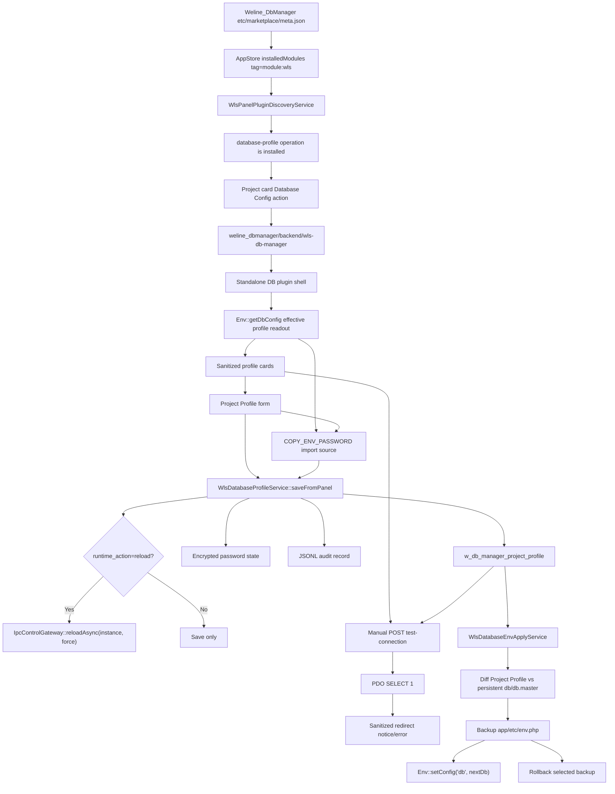

First-slice database rules:

- The plugin reads effective DB config only; it does not write `env.php`.
- The page accepts only safe WLS project context:
  `operation`, `project_id`, `domain`, and `project_type`.
- Username is masked and password is never rendered.
- The test action is POST-only and sanitizes username/password from error
  messages.

Second-slice database rules:

- Project Profiles are persisted by `profile_key` derived from
  `project_id`, `domain`, or `local`.
- The env profile remains an inherited baseline; saving a project Profile does
  not write `env.php` yet.
- Password input is write-only. Blank keeps the existing encrypted value, and a
  dedicated clear checkbox removes it.
- An explicit import control can copy the selected source env profile password
  into the encrypted Project Profile only after the operator types
  `COPY_ENV_PASSWORD`; the clear value is never rendered.
- Audit entries write to `var/log/wls/db-manager-audit.jsonl` and never include
  clear passwords or SQL text.
- Runtime reload is operator-selected and requires a target WLS instance; save
  only is the default.

Third-slice database env apply rules:

- The Env Apply panel writes the persistent `app/etc/env.php` `db`/`db.master`
  target or an already existing `db.slaves.*` entry, even when the effective
  runtime readout is `sandbox_db`.
- The plan shows target label, write mode, profile key, password source, latest
  backup, and a masked field diff before any write.
- Slave writes are restricted to already configured entries; this flow does not
  create, delete, or reorder read replicas.
- Password values are never rendered. If the Project Profile has no encrypted
  password, the apply service preserves the current env target password.
- Apply requires the `APPLY_DB_ENV` phrase plus an explicit confirmation
  checkbox, creates a backup under `var/backups/wls/db-manager`, and records a
  JSONL audit event.
- Rollback requires the `ROLLBACK_DB_ENV` phrase plus an explicit confirmation
  checkbox, restores only backups from the DbManager backup directory, then
  calls `Env::reload()` so the current PHP process sees the restored config.
- Lifecycle planning now has a vendor-aware adapter preview: mysql/pgsql
  create database, create user/role, and grant actions render allowlisted SQL,
  verification queries, rollback/cleanup guidance, the
  `db.lifecycle.plan_ready` audit event, and the disabled
  `RUN_DB_LIFECYCLE` execution boundary. No DB connection or SQL execution is
  performed from this shell yet.
- MySQL and PostgreSQL `backup_database` now have guarded execution slices
  behind `RUN_DB_BACKUP`, checkbox confirmation, enabled Project Profile,
  `mysqldump`/`pg_dump`, artifact confinement, optional `.sql.gz` compression,
  metadata, checksum, and audit. MySQL now has a real disposable
  MariaDB-backed success-path harness that verifies seeded data, metadata,
  checksum, sanitized audit, artifact cleanup, and container cleanup. Restore,
  migration execution, and explicit slave create/remove flows remain future
  slices.

```text
+-----------------------------------------------------------------+
| Env Apply And Rollback                         Ready / Guarded   |
+-----------------------------------------------------------------+
| Write Target        db.master                                      |
| Write Mode          Master/default / Existing slave                 |
| Profile Key         project:<id>                                   |
| Password Source     Project Profile secret / Existing env password |
| Latest Backup       2026-.. / -                                    |
+-----------------------------------------------------------------+
| Field               Current env.php          Project Profile       |
| Persistent conn     Enabled                  Disabled              |
| Charset             UTF8                     UTF8                  |
+-----------------------------------------------------------------+
| Runtime action      [Apply only v]           Target instance       |
| Confirmation        APPLY_DB_ENV             [x] backup confirmed  |
| [Apply env.php]                                                   |
+-----------------------------------------------------------------+
| Latest backup rollback                                            |
| Confirmation        ROLLBACK_DB_ENV          [x] restore confirmed |
| [Rollback env.php]                                                |
+-----------------------------------------------------------------+
```

## Data-Backed Dashboard Prototype

The dashboard must not render sample counts or sample child projects. Its first data-backed slice uses existing WLS sources and leaves the full project registry for Stage 2.

```text
WlsPanel controller
└─ WlsPanelDashboardDataService
   ├─ ReverseProxy::getAllRules()
   │  └─ gateway rule count + interim gateway project cards
   ├─ AttackLog::getStatistics('', 7)
   │  └─ 7-day security event and blocked-event metrics
   └─ ServerInstanceManager::getAllPersistedInstanceInfo()
      └─ runtime instance / running worker summary
```

Dashboard rendering rules:

- Always include the current project card.
- Add one interim gateway project card for each ReverseProxy rule.
- When no gateway rules exist, show only the current project; do not invent a child WLS project.
- Gateway project cards display `domain`, `status`, and `upstream` from the ReverseProxy rule.
- Full project `admin_url`, `panel_url`, `path`, `php_profile`, and `database_profile` belong to the Stage 2 project registry; until then, database profile links open the WLS Database Manager install/search flow.

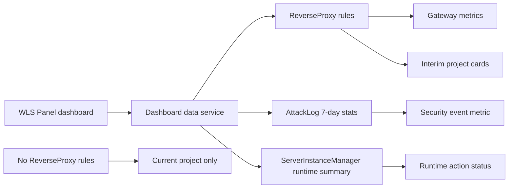

## Panel Project Registry Prototype

Stage 2 turns the project area from read-only cards into a small management console. The panel still stays independent from the normal framework backend; the framework backend only provides the authorized entry and the current admin session.

```text
+--------------------------------------------------------------------------+
| Projects                                                  Save Project   |
+-------------------------------+------------------------------------------+
| Project name                  | Domain                                   |
| Admin URL                     | Child WLS Panel URL                       |
| Project path                  | Status                                   |
| PHP profile                   | Database profile                         |
| Gateway enabled               | Backend host / port / HTTPS              |
| Description                                                               |
+--------------------------------------------------------------------------+
| Managed Projects                                                          |
| - current project: admin / panel / PHP / database / security              |
| - registered child WLS: admin / child panel / gateway / PHP / database    |
| - orphan ReverseProxy rule: gateway card until attached to a project       |
+--------------------------------------------------------------------------+
```

Form behavior:

- `domain` is the unique project identity in the panel registry.
- `admin_url` is the project business backend jump target.
- `panel_url` is the child WLS independent panel jump target.
- `project_path` is stored for future file-manager and deployment plugins.
- `php_profile` and `database_profile` remain plain profile labels in the project registry, while installed operation plugins can open native configuration pages with safe project context. The first database page is `Weline_DbManager`, and the first PHP page is `Weline_PhpManager`.
- `gateway_enabled`, `backend_host`, `backend_port`, and `backend_ssl` create or update the linked ReverseProxy rule.
- Removing a registered project removes its linked ReverseProxy rule when one exists.

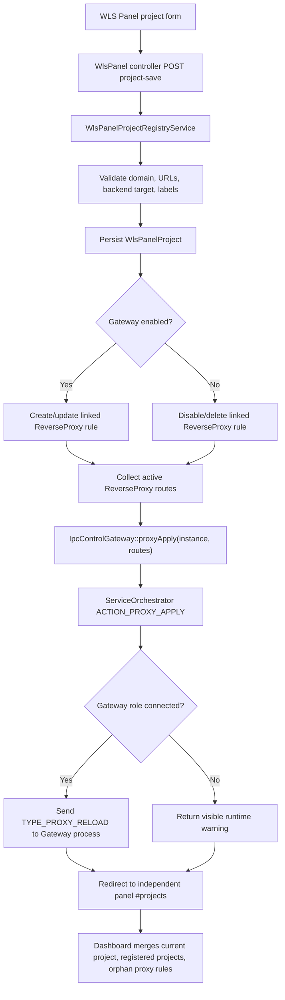

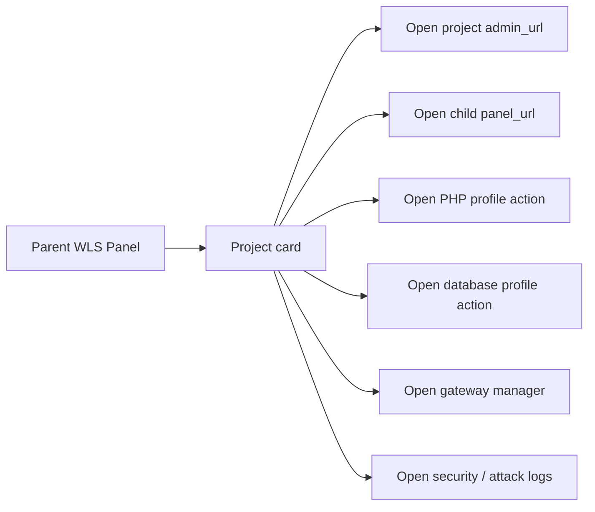

Runtime apply rule:

- The registry save/delete flow persists data, synchronizes `ReverseProxy`, and attempts runtime apply through `IpcControlGateway::proxyApply()`.
- If the target WLS Master is reachable but no Gateway role is connected, the panel shows the runtime warning and keeps the saved project/proxy state visible.
- Full Gateway-role E2E routing is now proven for the first slice: a Gateway process can register with the Master, receive `TYPE_PROXY_RELOAD`, update its in-memory route table, and route a real TLS SNI request to a child HTTPS WLS backend without a full restart.
- When the form/API provides `instance`, `gateway_instance`, or `wls_instance`, that target instance is used for runtime apply. If no target is supplied, the service may auto-select exactly one running Gateway-enabled instance; ambiguous multi-instance cases must be resolved by a future native target selector.
- The native panel now includes a Gateway Settings slice before Projects. It shows active route count, Gateway-enabled/running instance counts, WLS instance cards, a running-target selector, and an `Apply Routes Now` action.
- Gateway Settings also includes a native Gateway mode configuration form:
  `gateway_enabled`, `gateway_listen`, `gateway_traffic_mode`,
  `gateway_instance`, and `apply_routes`. It persists
  `wls.gateway.enabled`, `wls.gateway.listen`, and
  `wls.gateway.traffic_mode` through `Env::setConfig()` and keeps route apply
  as a separate runtime push.
- `gateway_traffic_mode` accepts `auto`, `direct_listen`, and `passthrough`.
  `direct_listen` is the high-throughput target where workers listen directly
  with SO_REUSEPORT; `passthrough` forces Dispatcher/Gateway passthrough;
  `auto` lets WLS choose the stable topology for the platform.
- The panel displays saved versus effective Gateway state. If process environment variables override saved config, the panel warns the operator instead of hiding the mismatch.
- The target selector filters to instances that are currently running or have a running Gateway process. Stopped historical instances remain visible as status cards but are not offered as apply targets.
- If multiple running Gateway targets exist, the selector is required before runtime apply.
- Gateway Settings now exposes a runtime action selector:
  `reload` refreshes workers after saving, `restart` submits an expanded
  `server:start <instance> -r -f` command for listener/Gateway-role or
  traffic-mode changes,
  and `none` only persists config or applies routes.
- Restart maps `direct_listen` to `--topology direct` and `passthrough` to
  `--topology dispatcher`. Ordinary `server:start` also maps saved
  `wls.gateway.traffic_mode` when runtime `topology` remains `auto`.
- Panel-triggered restart must preserve the selected instance runtime shape:
  current port, worker count, HTTP/HTTPS mode, topology, and memory limits are
  read from `ServerInstanceInfo` plus raw instance JSON before the command is
  handed to `Processer::create()`.

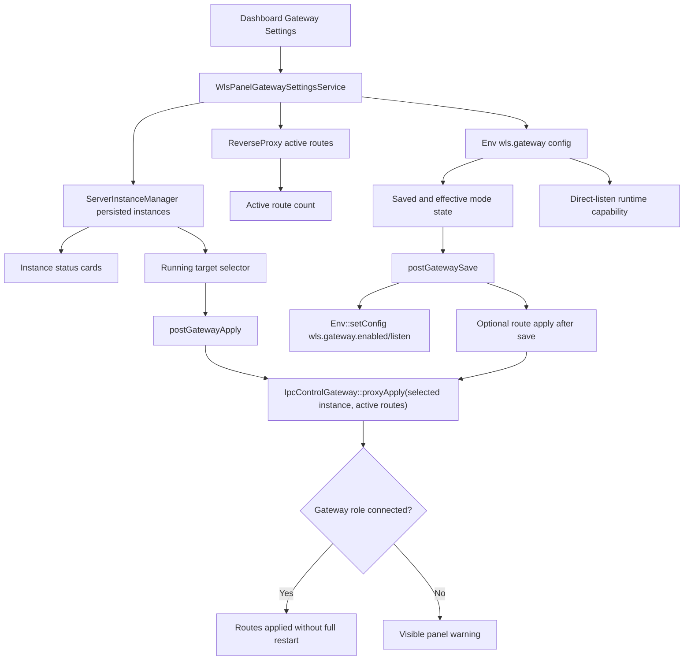

```text
+--------------------------------------------------------------------------+
| Gateway Settings                                            Advanced     |
+--------------------------------------------------------------------------+
| Active routes | Gateway enabled | Gateway running | Traffic mode       |
+--------------------------------------------------------------------------+
| Gateway Mode Configuration                                              |
| [x] Enable Gateway mode   Listen: 0.0.0.0:443                            |
| Traffic mode: auto / direct listen / passthrough                         |
| Direct listen capability: supported/unavailable  Runtime OS: Linux/Win   |
| Apply target: auto/current gateway        Runtime: reload workers        |
| [x] Apply routes after saving                                             |
| Effective listen: 0.0.0.0:443          Saved listen: 0.0.0.0:443          |
| Effective mode: Auto                    Saved mode: Auto                  |
|                                                       Save Gateway Mode   |
+--------------------------------------------------------------------------+
| Apply Routes Now                                                        |
| Target: auto/current gateway                             Apply Routes     |
+--------------------------------------------------------------------------+
| Instance cards: main listen / topology / control port / gateway status   |
+--------------------------------------------------------------------------+
```

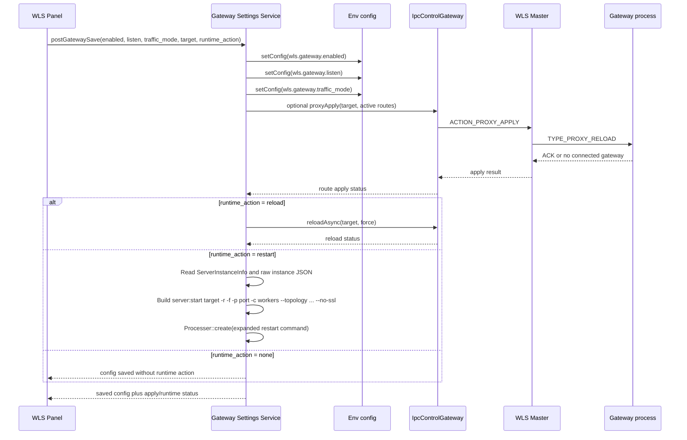

Runtime action rule:

- `reload` refreshes existing runtime workers and code/config state.
- `restart` is required for listener address or Gateway role changes because a
  new Gateway process may need to be spawned on the selected public port. The
  command must preserve the selected instance runtime shape instead of relying
  only on `server:start <name>` configuration memory.
- `restart` is also required when an operator changes `gateway_traffic_mode` to
  a concrete mode; `direct_listen` maps to runtime topology `direct`, and
  `passthrough` maps to runtime topology `dispatcher`.
- Direct-listen capability is shown from `RuntimeCapabilityDetector`. The
  panel still keeps the `direct_listen` option visible, but marks the current
  runtime as supported or unavailable so the operator knows whether
  SO_REUSEPORT can actually be used on this host before restart.
- `none` is for operators who only want to save env/config and apply routes manually later.

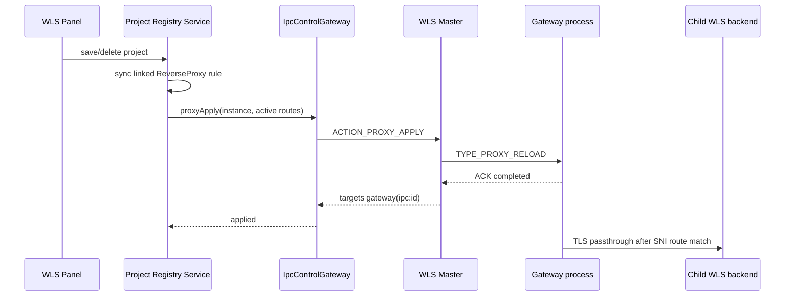

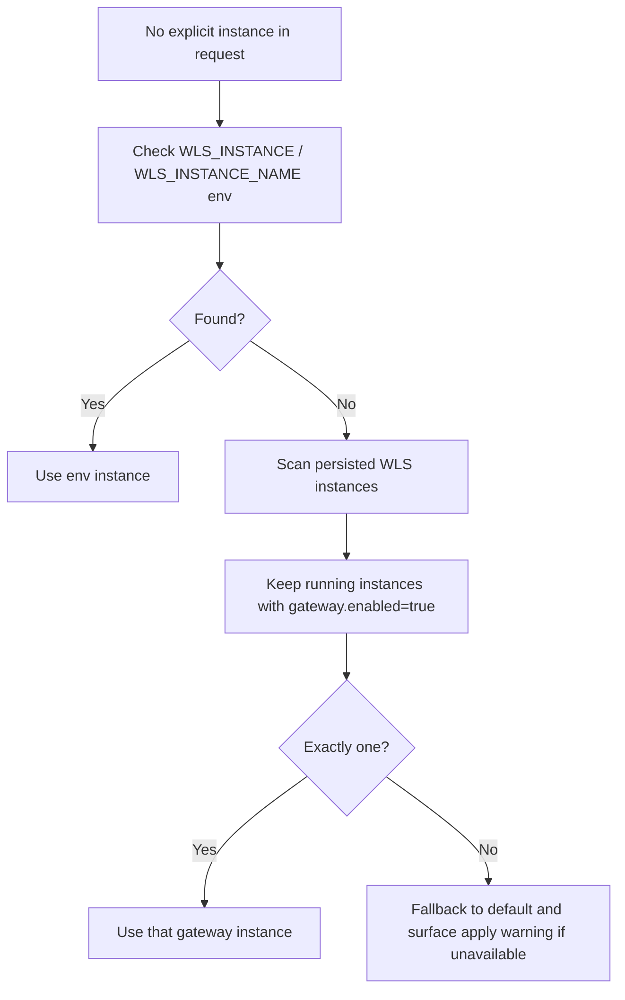

## WLS Plugin Identification Prototype

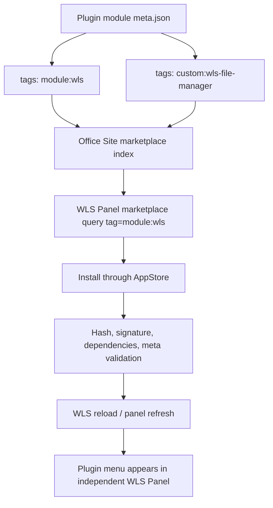

## Native Security Page Prototype

The Security page is the first operations page moved from legacy links into the
independent WLS Panel shell. It keeps advanced legacy links available, but gives
operators the common rule and attack-log visibility without leaving the panel.

```text
+--------------------------------------------------------------------------+
| Security                                           Advanced | Attack Log  |
+--------------------------------------------------------------------------+
| Events in 7d | Blocked in 7d | Critical in 7d | Blocked IPs             |
+--------------------------------------------------------------------------+
| Project Security Drilldown                                               |
| - each project: events / blocked / risk / top type / latest event        |
| - View Logs jumps into native logs with the matching project scope        |
+--------------------------------------------------------------------------+
| Common Rule Editor                                                       |
| rate_limit / path_scan / ssl_handshake_failure / unknown_route_ban       |
| path_rate_limits row editor / ip_whitelist / protected_paths             |
| Rule Change Preview: field path / before / after                         |
| Merged Rules JSON                                                        |
| { rate_limit, path_scan, ssl_handshake_failure, unknown_route_ban, ... } |
|                                                    Save Security Rules   |
+--------------------------------------------------------------------------+
| Rule Summary                         | Native Attack Logs                |
| - Rate Limit enabled/configured      | - Project scope / instance filter |
| - Path Scan enabled/configured       | - IP / severity / attack type     |
| - Protected paths configured         | - Blocked status / limit / pages  |
| - Blocked IPs tracked                | - Paginated event cards           |
+--------------------------------------------------------------------------+
```

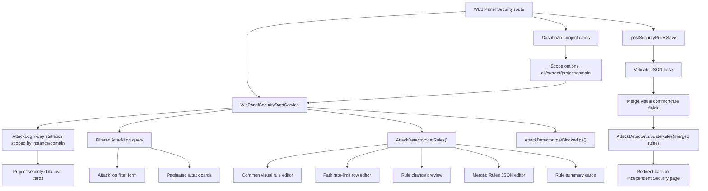

Security page rules:

- Keep the independent WLS Panel shell, sidebar, theme switch, and responsive layout.
- Save rules through a POST action inside `WlsPanel`; do not send operators to a separate backend shell for the common path.
- Keep legacy Security Rules and Attack Log links as advanced/deep-dive exits while the native page continues to grow.
- Use a common visual rule editor for `rate_limit`, `path_scan`, `ssl_handshake_failure`, `unknown_route_ban`, `ip_whitelist`, and `protected_paths`.
- Include `path_rate_limits.rules` as a row-level editor: each row controls enabled state, path prefix, window seconds, max requests, and block duration; a blank row appends a new rule and clearing a path removes that row.
- Show a rule change preview before the merged JSON editor. The preview lists affected rule paths with before/after values and reports invalid JSON before the operator saves.
- Keep merged JSON visible as the advanced editing surface; visual fields overwrite matching common keys on save and unexposed advanced rules remain in JSON.
- Treat configured list fields as replacement lists during `AttackDetector` merge so removing a protected path or whitelist entry does not silently restore a default numeric-index item.
- Panel reads call `AttackDetector::getRules()`, which force-checks the persisted update flag before returning data. This keeps immediate save-and-redirect views consistent across multiple WLS workers.
- Native attack logs support project scope, instance, IP, severity, attack type, blocked status, page size, and previous/next pagination.
- Project scope options are built from `panelDashboardData['projects']`. The first slice maps selected project scope to `AttackLog.domain`, so current project, registered child projects, and gateway-derived cards can share the same log contract.
- Project security drill-down cards summarize each managed scope with 7-day events, blocked events, critical count, top attack type, latest event, and a direct `View Logs` link back into the native filtered log list.

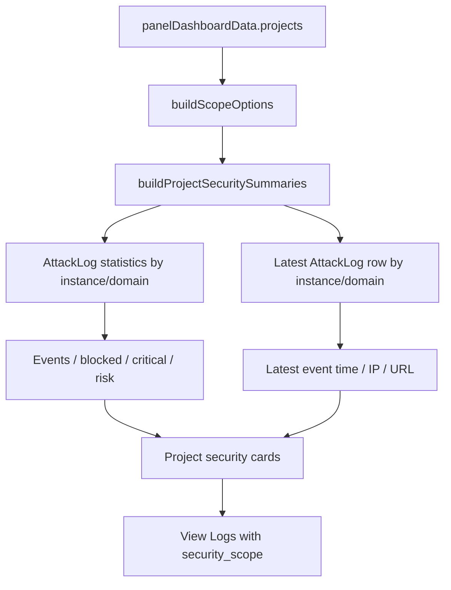

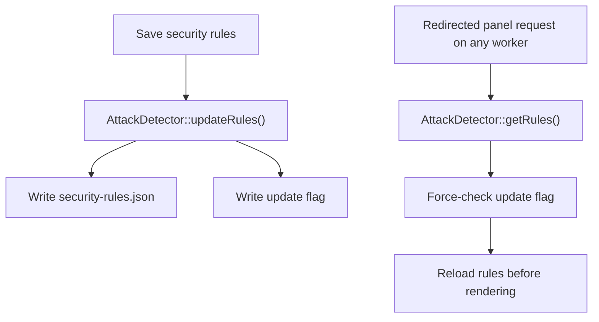

```mermaid
flowchart TD
  A["Path rate visual rows"] --> B["WlsPanelSecurityDataService::mergePathRateLimits"]
  B --> C["Normalize path prefix"]
  B --> D["Clamp window/max/block values"]
  B --> E["Skip blank path rows"]
  C --> F["Merged rules.path_rate_limits.rules"]
  D --> F
  E --> F
  F --> G["AttackDetector::updateRules"]
  G --> H["AttackDetector merge replaces configured rules list"]
```

```mermaid
flowchart TD
  A["Security rule form"] --> B["Read current rules_json"]
  B --> C{"Valid JSON?"}
  C -->|No| D["Show invalid preview state"]
  C -->|Yes| E["Merge visual fields locally"]
  E --> F["Flatten merged and original rules"]
  F --> G{"Any changed paths?"}
  G -->|No| H["No pending changes"]
  G -->|Yes| I["List path / before / after"]
  I --> J["Save uses server-side merge contract"]
```

## Plugin Card Prototype

```text
┌────────────────────────────────────────────────────────────┐
│ WLS File Manager                              Install Check │
│ Vendor_WlsFileManager                                      │
│ tags: module:wls custom:wls-file-manager system:false      │
│ surfaces: backend                                          │
│ Capability: files.read / files.write / path guard          │
└────────────────────────────────────────────────────────────┘
```

## Marketplace AppStore Entry Prototype

The WLS Panel marketplace page stays visually independent from the normal backend, but it does not duplicate the AppStore install engine. The panel shows WLS-specific entry cards and forwards users to AppStore with the WLS typed tag already applied.

```text
+------------------------------------------------------------------+
| Plugin Marketplace                                               |
+----------------------+----------------------+--------------------+
| Online WLS Plugins   | Installed WLS Plugins| Tag Contract       |
| tag=module:wls       | tag=module:wls       | module:wls         |
| surface=backend      | surface=backend      | WLS discovery tag  |
| Open Marketplace     | Installed Plugins    |                    |
+------------------------------------------------------------------+
| Type Tag: module:wls       Search: wls-file-manager      Filter  |
+------------------------------------------------------------------+
| WLS File Manager     tags: module:wls custom:wls-file-manager    |
| Open Install Flow -> appstore/backend?tag=module:wls&...         |
+------------------------------------------------------------------+
```

```mermaid
flowchart LR
  A["WLS Panel marketplace"] --> B["AppStore index URL"]
  A --> C["AppStore installed URL"]
  B --> D["tag=module:wls"]
  B --> E["surface=backend"]
  C --> D
  C --> E
  B --> F["AppStore install authorization"]
  F --> G["Signature, hash, dependency, permission checks"]
  G --> H["Module installed"]
  H --> I["WLS Panel reload shows plugin capability"]
```

WLS-origin AppStore links also carry `wls_panel_return=1`. This is not a new
installer path; it is a return-context marker. AppStore keeps the marker in
filters, authorization, install, check-update, and update forms, shows a
`Back To WLS Panel` action, and redirects successful installs/updates back to
`server/backend/wls-panel/marketplace?panel_notice=plugins_refreshed&panel_auto_refresh=plugins#installed-plugins`.
The returned panel page auto-submits the existing `plugin-refresh` POST form
once, then the POST redirect clears `panel_auto_refresh` to avoid loops.
The online marketplace entry uses the generated AppStore index route
`appstore/backend`; package actions still use
`appstore/backend/index/download`, `appstore/backend/index/install`, and
`appstore/backend/index/authorize-install`.

```mermaid
sequenceDiagram
  participant Panel as WLS Panel
  participant Store as AppStore shared UI
  participant Installer as Package installer
  Panel->>Store: tag=module:wls, surface=backend, wls_panel_return=1
  Store-->>Panel: Back To WLS Panel action available
  Store->>Store: Preserve return context through forms
  Store->>Installer: Install/update verified package
  Installer-->>Store: Success
  Store-->>Panel: Redirect to WLS Panel Marketplace with panel_auto_refresh=plugins
  Panel->>Panel: Auto-submit plugin-refresh POST form once
  Panel-->>Panel: Redirect without panel_auto_refresh
  Panel->>Panel: Show refreshed installed plugin cards
```

## Installed Plugin Capability Prototype

After a module is installed and its marketplace meta has `module:wls` plus `surface:backend` or `surfaces: ["backend"]`, the independent WLS Panel asks AppStore for installed plugins through the shared query layer. The panel renders installed plugins as capability cards before the candidate marketplace cards. The native refresh action reruns discovery immediately after module install/update so the standalone panel can load new menu/capability contributions without going back to the framework backend.

```text
+--------------------------------------------------------------------------------+
| Installed Panel Plugins                                   [Refresh Plugins]     |
+--------------------------------------------------------------------------------+
| Success: Panel plugin capabilities refreshed.                                   |
+--------------------------------------------------------------------------------+
| No installed WLS plugins yet.                                                   |
| Install modules tagged module:wls to extend this standalone panel.              |
+--------------------------------------------------------------------------------+
| WLS File Manager                                      Installed                 |
| Vendor_WlsFileManager                                                           |
| tags: module:wls custom:wls-file-manager backend                                |
| [Open Plugin Panel] or [No panel entry declared]                                |
+--------------------------------------------------------------------------------+
```

```mermaid
sequenceDiagram
  participant Panel as WLS Panel
  participant WLS as WlsPanelPluginDiscoveryService
  participant Query as w_query
  participant AppStore as AppStoreQueryProvider
  participant DB as installed module table
  Panel->>WLS: getInstalledPlugins()
  WLS->>Query: appstore.installedModules(tag=module:wls, surface=backend)
  Query->>AppStore: execute installedModules
  AppStore->>DB: read installed modules and marketplace meta
  AppStore-->>Query: normalized plugin items
  Query-->>WLS: items, count
  WLS-->>Panel: installed WLS plugin capability list
```

```mermaid
sequenceDiagram
  participant Operator
  participant Panel as WLS Panel Marketplace
  participant Refresh as WlsPanelPluginRefreshService
  participant Registry as RegistryUpdateService
  participant Routes as RouteUpdateService
  participant WLS as WlsPanelPluginDiscoveryService
  participant AppStore as appstore.installedModules
  Operator->>Panel: Click Refresh Panel Plugins
  Panel->>Refresh: refreshPanelCapabilities()
  Refresh->>Registry: Refresh module registries
  Refresh->>WLS: Discover installed module:wls plugins
  WLS->>AppStore: tag=module:wls, surface=backend
  AppStore-->>WLS: installed plugin module names
  Refresh->>Routes: Refresh plugin module routes
  Refresh->>WLS: refreshCapabilities()
  WLS->>AppStore: tag=module:wls, surface=backend
  AppStore-->>WLS: marketplace_meta, capabilities, panel entry fields
  WLS-->>Refresh: refreshed plugin + operation capability snapshot
  Refresh-->>Panel: registry, route, and capability refresh result
  Panel-->>Operator: Show refreshed notice and updated cards
```

## Operations Capability Center Prototype

The dashboard has a native capability center before Gateway Settings. This is
the panel-level bridge between managed project fields and optional operation
plugins. WLS defines fixed operation slots, but the actual pages are owned by
installed modules that declare typed marketplace tags.

```text
+-----------------------------------------------------------------------+
| Operations Capability Center                         0 installed      |
|                                                       4 required       |
|                                         Open WLS Marketplace           |
+-----------------------------------------------------------------------+
| PHP Profiles                    Plugin required                        |
| Weline_PhpManager                                                     |
| Configure PHP runtime profiles, versions, extensions, and project bind |
| Required Tag: custom:wls-php-manager                                  |
| Feature Tag:  feature:php-config                                      |
| tags: module:wls custom:wls-php-manager feature:php-config            |
| Install Plugin -> appstore/backend?tag=module:wls&surface=...          |
+-----------------------------------------------------------------------+
| Database Profiles               Plugin required                        |
| Required Tag: custom:wls-database-manager                             |
+-----------------------------------------------------------------------+
| File Manager                    Plugin required                        |
| Required Tag: custom:wls-file-manager                                 |
+-----------------------------------------------------------------------+
| Deploy Releases                 Plugin required                        |
| Required Tag: custom:wls-deploy                                       |
+-----------------------------------------------------------------------+
```

Installed state is resolved by exact tag matching:

```mermaid
flowchart LR
  A["Dashboard render"] --> B["WlsPanelPluginDiscoveryService"]
  B --> C["getInstalledPlugins tag=module:wls surface=backend"]
  C --> D["Installed plugin items"]
  B --> E["Fixed operation definitions"]
  D --> F["Collect tag_codes/tags/marketplace_meta.tags"]
  E --> G{"custom tag found?"}
  F --> G
  G -->|Yes| H["Installed operation card"]
  G -->|No| I["Plugin required card"]
  I --> J["AppStore URL with tag=module:wls"]
  H --> K["Open plugin panel URL when exposed"]
```

The first implemented capability slots are:

| Operation | Required tag | Feature tag | Planned owner |
| --- | --- | --- | --- |
| PHP Profiles | `custom:wls-php-manager` | `feature:php-config` | `Weline_PhpManager` |
| Database Profiles | `custom:wls-database-manager` | `feature:database-profile` | `Weline_DbManager` |
| File Manager | `custom:wls-file-manager` | `feature:file-manager` | `Weline_FileManager` |
| Deploy Releases | `custom:wls-deploy` | `feature:tag-deploy` | `Weline_Deploy` |

Project cards now reuse these same slots for their action row:

```text
Managed Project Card
| Project Admin | Open Panel | PHP Config | Database Config | Files | Deploy |
```

```mermaid
flowchart LR
  A["Project card action"] --> B["Operation key"]
  B --> C["php-profile"]
  B --> D["database-profile"]
  B --> E["file-manager"]
  B --> F["deploy"]
  C --> G["Installed plugin URL plus project_id/domain/operation"]
  D --> G
  E --> G
  F --> G
  C --> H["Missing plugin AppStore URL tag=module:wls"]
  D --> H
  E --> H
  F --> H
```

Project operation links intentionally pass only safe routing context:

- `operation`
- `project_id` when the project is registered
- `domain` when available
- `project_type`

Raw local `project_path` stays visible in the panel card but is not copied into
query strings. File manager plugins should resolve path access through the WLS
project registry after authorization.

This keeps WLS extensibility tag-based:

- WLS owns the slot definitions and marketplace filter.
- AppStore owns package discovery, install checks, signature, hash,
  dependency, and authorization.
- Plugin modules own their pages and should expose a WLS panel URL in installed
  metadata when the page exists.
- No WLS-specific PHP inheritance contract is required just to appear as an
  installable panel capability.

## Project Config Center Prototype

The Project Config Center is a native WLS Panel aggregation layer above the
managed project cards. It does not own PHP, database, file, deploy, or security
implementation details; it gives operators one project-scoped place to open
those capabilities.

```text
+--------------------------------------------------------------------------------+
| Project Config Center                     3 projects / Ready / 8 slots ready   |
+--------------------------------------------------------------------------------+
| All managed projects are ready for panel operations.       8 / 8 operations    |
+--------------------------------------------------------------------------------+
| Current Project                    Local project                                |
| p11005ce4.weline.test:9828                                                    |
| Safe Context: domain=p11005ce4.weline.test / type=current                      |
|                                                                                |
| [Ready]                                             8 / 8 checks ready          |
| Core links and WLS operation plugins are ready.                                 |
| + Core Links 4/4 + Operations 4/4 + Security Ready + Gateway Off               |
|                                                                                |
| [Project Admin] [Child Panel] [Attack Logs] [Security Policy] [Gateway]         |
| +----------------------+ +----------------------+                               |
| | PHP Config           | | Database Config      |                               |
| | Runtime profile...   | | Database profile...  |                               |
| | custom:wls-php...    | | custom:wls-database  |                               |
| +----------------------+ +----------------------+                               |
| +----------------------+ +----------------------+                               |
| | Files                | | Deploy               |                               |
| | Project path ready   | | Release context...   |                               |
| | custom:wls-file...   | | custom:wls-deploy    |                               |
| +----------------------+ +----------------------+                               |
+--------------------------------------------------------------------------------+
```

```mermaid
flowchart LR
  A["WLS Panel dashboard"] --> B["WlsPanelProjectConfigCenterService"]
  B --> C["Dashboard project cards"]
  B --> D["Operation capability slots"]
  B --> R["Read-only readiness summary"]
  D --> E["PHP / database / files / deploy links"]
  C --> F["Project Admin"]
  C --> G["Child WLS Panel"]
  C --> H["Security scoped logs"]
  C --> I["Gateway settings"]
  R --> R1["Core links: admin / panel / path / security scope"]
  R --> R2["Operation slots: installed WLS plugins"]
  R --> R3["Gateway mode visibility"]
  E --> J["Installed plugin URL plus safe project context"]
  E --> K["Missing plugin AppStore URL with module:wls"]
```

Rules:

- The center reuses the same project list as the project cards, so current
  project, registered child projects, and orphan gateway routes stay aligned.
- Plugin operations reuse the fixed operation slot keys:
  `php-profile`, `database-profile`, `file-manager`, and `deploy`.
- Operation links pass only safe context: `operation`, `project_id`, `domain`,
  and `project_type`.
- Raw local `project_path` is never copied into query strings.
- Security links reuse the native panel scope format:
  `current`, `project:<id>`, or `domain:<domain>`.
- Gateway links stay inside the native Gateway Settings section.
- Readiness is a read-only aggregation layer. It must not duplicate or bypass
  PHP, database, file, deploy, security, or gateway plugin write rules.
- Each project card exposes machine-readable DOM markers:
  `data-wls-readiness-state`, `data-wls-config-readiness`, and
  `data-wls-readiness-check` for browser smoke tests and future plugin
  contributions.

## Deploy Standalone Plugin Page

The Deploy capability should feel like a WLS-owned tool, not another ordinary
project backend screen. The framework backend only provides the authorized
entry; once opened, Deploy runs inside its own WLS fullscreen shell.

```text
┌──────────────────────────────────────────────────────────────────────────────┐
│ WLS Deploy                                                [Config] [History] │
│ Tag/webhook release center for selected WLS project              [Project]   │
├──────────────────────┬───────────────────────────────────────────────────────┤
│ Overview             │ Project Context                                       │
│ Project Profile      │ ┌────────────┐ ┌────────────┐ ┌────────────┐        │
│ Preflight            │ │ Project ID │ │ Domain     │ │ Policy     │        │
│ Webhook Replay       │ └────────────┘ └────────────┘ └────────────┘        │
│ Configuration        │                                                       │
│ Releases             │ Project Profile Form                                  │
│ Marketplace          │                                                       │
│                      │                                                       │
│                      │ Release Preflight                                     │
│                      │ [Run Preflight]  status: Ready / Needs Review        │
│                      │ ┌ Profile ┐ ┌ Repo ┐ ┌ Deploy Root ┐                │
│                      │ ├ Trigger ┤ ├ Webhook ┤ ├ Commands ┤                │
│                      │ └─────────┴───────────┴────────────┘                │
│                      │                                                       │
│                      │ Webhook Replay Preflight                             │
│                      │ Ref: [refs/tags/v1.0.0____________] [Replay]         │
│                      │ [Tag Example] [Branch Example]                       │
│                      │ ┌ Decision ┐ ┌ Ref ┐ ┌ Type ┐ ┌ Version ┐           │
│                      │ └──────────┴───────┴────────┴───────────┘           │
│                      │                                                       │
│ [Light/Dark]         │ Configuration Summary                                 │
│ [Back to WLS Panel]  │ ┌ Repo URL ┐ ┌ Branch/Remote ┐ ┌ Webhook ┐          │
│                      │ └──────────┘ └───────────────┘ └─────────┘          │
│                      │                                                       │
│                      │ Current Runtime                                       │
│                      │ ┌ Current Version / Branch / Commit / Released At ┐   │
│                      │ └─────────────────────────────────────────────────┘   │
│                      │                                                       │
│                      │ Recent Releases                                       │
│                      │ ┌ Status │ Version │ Ref │ Actor │ Duration │ Log ┐  │
│                      │ └─────────────────────────────────────────────────┘   │
└──────────────────────┴───────────────────────────────────────────────────────┘
```

Responsive behavior:

- Desktop keeps the Deploy sidebar in a fixed left column and the release
  content in a scrollable right column.
- Mobile stacks the sidebar above the content, wraps action buttons, and keeps
  project cards in one column.
- Theme state uses the same `wls_panel_theme` browser key as the main WLS Panel
  so operators do not lose light/dark preference when moving between tools.

Routing contract:

```text
WLS Panel project card
  -> deploy/backend/wls-deploy?project_id=<id>&domain=<domain>&operation=deploy
  -> Weline_Deploy resolves project-scoped release profile by project_id/domain
  -> enabled project Profile overrides global Deploy summary for that project
```

First slice scope:

- show selected project context passed by WLS Panel;
- summarize current Deploy repository, trigger mode, webhook path, secret state,
  branch/tag filters, backup and post-deploy settings;
- save a project-scoped Deploy Profile with repository URL, branch, remote,
  deploy root, tag-only/branch/both trigger policy, tag prefix, webhook branch,
  Composer command, post-deploy command, rollback reference, and enablement;
- after save, reload the standalone Deploy page and use the enabled project
  Profile as the effective configuration summary;
- run a panel-only release preflight that checks Profile source, repository URL
  shape, deploy-root config, trigger mode, Webhook path/secret state, and
  command allowlist without running Git, writing files, or reloading WLS;
- expose an explicit "Run Preflight" action that recalculates the same checks,
  redirects back to the WLS Deploy shell, and reports whether blockers remain;
- run a panel-only Webhook Replay preflight: operators enter `payload.ref`
  such as `refs/tags/v1.0.0` or `refs/heads/main`; the panel reuses the
  selected project's effective trigger policy and reports `ready` or `skipped`
  without calling `DeployOrchestratorService::release()`;
- allow the real public webhook endpoint to receive safe project context
  (`profile_key`, `project_id`, `domain`, `project_type`) through URL query or
  payload fields, resolve the enabled project Profile, and run the release from
  that project's `deploy_root` rather than silently using the host project root;
- render a confirmed rollback action only after the selected project Profile is
  enabled, has a saved rollback ref, and the release preflight is not
  `danger`; the action always uses the saved Profile rollback ref rather than
  accepting an ad hoc request value;
- show current runtime stamp from `var/deploy/current.json`;
- show recent release records when history storage is available;
- degrade to an in-panel warning when history storage is missing or unhealthy.

Project Profile interaction:

```mermaid
flowchart LR
  A["WLS project card Deploy action"] --> B["deploy/backend/wls-deploy with project_id/domain"]
  B --> C["DeployProjectProfileService::getFormData"]
  C --> D{"profile exists and enabled?"}
  D -->|Yes| E["Apply project Profile to Deploy summary"]
  D -->|No| F["Show inherited global Deploy settings"]
  B --> G["Operator edits Project Profile form"]
  G --> H["postProfileSave"]
  H --> I["DeployProjectProfileService::saveFromPanel"]
  I --> J["Redirect back with deploy_notice=profile_saved"]
  J --> C
```

Release preflight interaction:

```mermaid
flowchart TD
  A["WlsDeploy::getIndex"] --> B["Load global Deploy settings"]
  B --> C["Load selected project Profile"]
  C --> D{"Profile exists and enabled?"}
  D -->|Yes| E["Apply Profile values to effective settings"]
  D -->|No| F["Use inherited global settings"]
  E --> G["DeployProjectProfileService::buildPanelPreflight"]
  F --> G
  G --> H["Check profile source"]
  G --> I["Check repo URL format"]
  G --> J["Check deploy root text safety"]
  G --> K["Check tag-only / branch trigger policy"]
  G --> L["Check random Webhook path and secret state"]
  G --> M["Normalize Composer and post-deploy commands through allowlist"]
  G --> N["Normalize rollback_ref through rollback allowlist"]
  Q["Operator clicks Run Preflight"] --> O["postPreflightRun"]
  O --> G
  H --> P["Render WLS Deploy Preflight cards"]
  I --> P
  J --> P
  K --> P
  L --> P
  M --> P
  N --> P
```

Rollback policy interaction:

```mermaid
flowchart TD
  A["Project Profile rollback_ref"] --> B["DeployProjectCommandPolicyService::normalizeRollbackRef"]
  B --> C{"Allowed ref shape?"}
  C -->|No| D["Reject save or render rollback preflight danger"]
  C -->|Yes| E["Classify as tag, branch, or commit"]
  E --> F["Render rollback preflight card"]
  F --> G{"Profile enabled and preflight not danger?"}
  G -->|No| H["Render disabled rollback action"]
  G -->|Yes| I["Render confirmation checkbox and Run Rollback button"]
```

Rollback action interaction:

```mermaid
flowchart TD
  A["Operator confirms rollback checkbox"] --> B["WlsDeploy::postRollbackRun"]
  B --> C{"POST and confirm_rollback=1?"}
  C -->|No| D["Redirect #preflight with blocker"]
  C -->|Yes| E["Reload selected project Profile"]
  E --> F{"Profile exists and enabled?"}
  F -->|No| G["Redirect #preflight with blocker"]
  F -->|Yes| H["Read stored rollback_ref from Profile"]
  H --> I{"rollback_ref present?"}
  I -->|No| G
  I -->|Yes| J["Build effective project release config"]
  J --> K["Run buildPanelPreflight"]
  K --> L{"preflight status is danger?"}
  L -->|Yes| G
  L -->|No| M["DeployOrchestratorService::rollback(context, config, rollback_ref)"]
  M --> N["DeployGitMetadataService fetches and checks out tag/branch/commit via proc_open argv"]
  N --> O["DeployReleaseRuntimeService writes deploy_root/var/deploy/current.json"]
  O --> P["DeployReleaseHistoryService stores project-scoped rollback record"]
  P --> Q["Redirect #releases with rollback result summary"]
```

Webhook replay dry-run interaction:

```mermaid
flowchart TD
  A["Operator enters payload.ref"] --> B["WlsDeploy::postWebhookReplay"]
  B --> C["Load global Deploy settings"]
  C --> D["Load selected project Profile"]
  D --> E{"Profile exists and enabled?"}
  E -->|Yes| F["Apply Profile values"]
  E -->|No| G["Use inherited settings"]
  F --> H["DeployWebhookRefResolver::resolve(ref, effectiveSettings)"]
  G --> H
  H --> I{"skipped?"}
  I -->|No| J["Redirect #webhook-replay replay_status=ready"]
  I -->|Yes| K["Redirect #webhook-replay replay_status=skipped + reason"]
  J --> L["Render Decision / Ref / Type / Version / Checkout"]
  K --> L
  L --> M["No Git, no files, no commands, no WLS reload"]
```

Manual release plan dry-run interaction:

```mermaid
flowchart TD
  A["Operator enters manual release ref"] --> B["WlsDeploy::postManualPlanRun"]
  B --> C{"POST and ref present?"}
  C -->|No| D["Redirect #manual-release-plan with blocker"]
  C -->|Yes| E["Load global Deploy settings"]
  E --> F["Load selected project Profile"]
  F --> G{"Profile exists and enabled?"}
  G -->|Yes| H["Apply Profile values"]
  G -->|No| I["Use inherited settings"]
  H --> J["Run buildPanelPreflight"]
  I --> J
  J --> K{"preflight status is danger?"}
  K -->|Yes| D
  K -->|No| L["Normalize manual ref"]
  L --> M["DeployWebhookRefResolver::resolve(ref, effectiveSettings)"]
  M --> N{"policy skipped?"}
  N -->|No| O["Redirect manual_status=ready"]
  N -->|Yes| P["Redirect manual_status=skipped + reason"]
  O --> Q["Render execution plan"]
  P --> Q
  Q --> R["Show Profile, deploy root, remote, backup, Git update, Composer, post-deploy, runtime stamp, reload"]
  R --> S["No Git, no files, no release history, no WLS reload"]
```

Manual release plan rules:

- The plan is a UI dry-run only. It previews the future manual release path but
  never calls `DeployOrchestratorService::release()`.
- Raw tag names are treated as `refs/tags/<name>` in tag mode. Explicit
  `refs/tags/...` and `refs/heads/...` remain preferred because they avoid
  ambiguity.
- The plan is blocked when the selected project preflight is `danger`; warning
  states can still render a plan so the operator can see what remains to fix.
- A future destructive manual release button must reuse this plan's resolved ref
  and preflight result, then require a separate explicit confirmation.

Real webhook project-context interaction:

```mermaid
flowchart TD
  A["Git platform POSTs to ~wh~ random webhook URL"] --> B["Controller reads raw body and safe context"]
  B --> C["resolveEffectiveConfigForWebhook(rawBody, config, requestContext)"]
  C --> D["Extract context from query or payload: profile_key/project_id/domain/project_type"]
  D --> E["DeployProjectProfileService::buildReleaseConfigForContext"]
  E --> F{"Enabled project Profile?"}
  F -->|Yes| G["Overlay repo, branch, remote, deploy_root, trigger policy, commands, optional webhook_secret"]
  F -->|No| H["Use global Deploy config plus safe context"]
  G --> I["Validate token against effective WEBHOOK_SECRET"]
  H --> I
  I --> O["DeployWebhookReleaseService::releaseFromWebhook(rawBody, effectiveConfig, context)"]
  O --> P["DeployWebhookRefResolver::resolve(ref, effectiveConfig)"]
  P --> J{"Policy skipped?"}
  J -->|Yes| K["Return 202 skipped with profile_key/project_id/domain"]
  J -->|No| L["DeployOrchestratorService::release(context, effectiveConfig)"]
  L --> M["Run Git, backup, post command, runtime stamp, reload inside deploy_root"]
  M --> N["DeployReleaseHistoryService persists project-scoped release record"]
```

Real webhook context rules:

- The random `~wh~` path remains global. `DeployProjectProfile` can now bind a
  project-level `webhook_secret`; the controller resolves the project effective
  config before token verification so the project secret can replace the global
  secret for that request.
- Project context may be passed as query parameters or JSON payload fields.
  Supported keys are `profile_key`, `project_id`, `domain`, and
  `project_type`; nested `wls`, `wls_project`, or `project` objects are also
  recognized.
- If a matching Profile is enabled, its project fields become the effective
  runtime config for that one webhook release. If no project secret is present,
  webhook verification falls back to the global `webhook_secret`.
- `deploy_root` is now an execution boundary: Git metadata, Git checkout/pull,
  backup source, post-deploy command, `var/deploy/current.json`, and
  `server:reload` all use the resolved project root. Missing or relative roots
  fail the release instead of falling back to the host project.

Controlled success-path webhook POST harness:

```mermaid
flowchart TD
  A["Create temp bare Git remote under var/tmp"] --> B["Create temp working clone"]
  B --> C["Tag seed commit, for example v-harness-1"]
  C --> D["Save temporary Deploy Project Profile"]
  D --> E["Profile uses temp clone as deploy_root and project webhook_secret"]
  E --> F["Start dedicated non-9501 WLS instance"]
  F --> G["POST real tag payload to ~wh~ route with project context"]
  G --> H["Webhook controller resolves Profile before token verification"]
  H --> I["DeployWebhookRefResolver returns ready tag release"]
  I --> J["DeployOrchestratorService::release runs inside deploy_root"]
  J --> K["Git checkout writes current.json and project release history"]
  K --> L["Verify HTTP 200, ok=true, deployed version, release record"]
  L --> M["Restore app/etc/env.php and deploy_settings"]
  M --> N["Delete temp Profile/release rows, stop WLS, close port, remove temp tree"]
```

Harness rules:

- The harness is a validation flow, not a production feature switch.
- It must not use a public `dry_run` or fake-success query flag, because Git
  platforms would treat `200` as a successful deploy.
- All Git writes, runtime stamp writes, and release history created by the
  success path must be confined to temporary project Profile context and removed
  after validation.

Project-scoped release history interaction:

```mermaid
flowchart TD
  A["WLS project card Deploy action"] --> B["deploy/backend/wls-deploy?project_id=...&domain=..."]
  B --> C["WlsDeploy::requestContext"]
  C --> D["DeployReleaseHistoryService::getRecentForContext(context, 12)"]
  D --> E{"project_id or domain present?"}
  E -->|Yes| F["Build profile_key: project:<id> or domain:<domain>"]
  F --> G["Filter DeployRelease by profile_key"]
  E -->|No| H["Show WLS host/global release records only"]
  G --> I["Render Current Project/Domain Releases"]
  H --> J["Render Global Releases"]
  K["DeployOrchestratorService::release(context/config)"] --> L["DeployReleaseHistoryService::start(..., context)"]
  L --> M["Persist profile_key, project_id, domain, project_type"]
  M --> N["markSuccess clears is_current only within same profile_key"]
```

Release history display rules:

- The standalone WLS Deploy plugin page is context-aware. If WLS Panel passes a
  `project_id`, the release list is scoped to `project:<id>`. If only `domain`
  is available, it is scoped to `domain:<domain>`.
- Without a child-project context, the standalone page shows WLS host/global
  release records instead of mixing every child project's history into the host
  view.
- The ordinary Deploy release history page and CLI history remain all-scope
  views for operations/debugging and include a visible scope column.
- `is_current` is unique per release scope, so a successful release for one
  child project does not clear the current marker for another child project.
