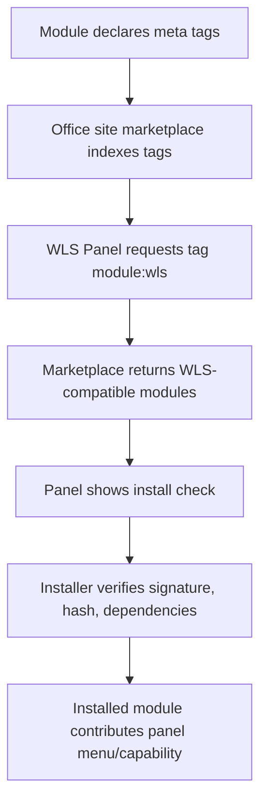
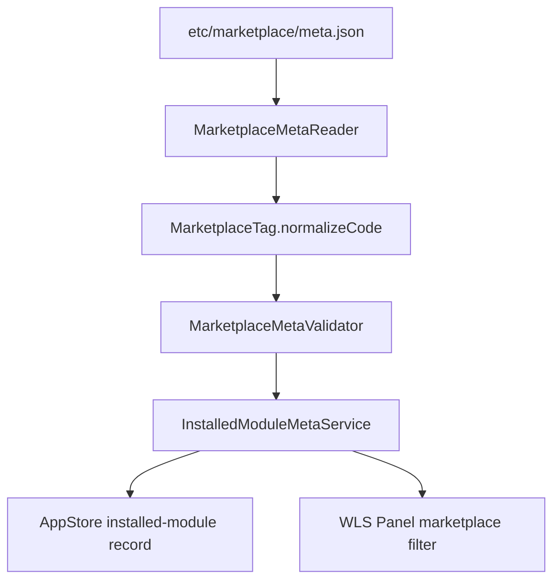
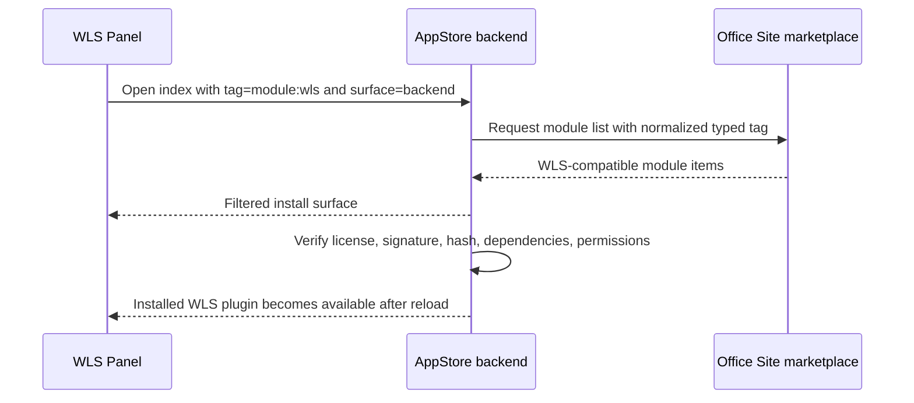
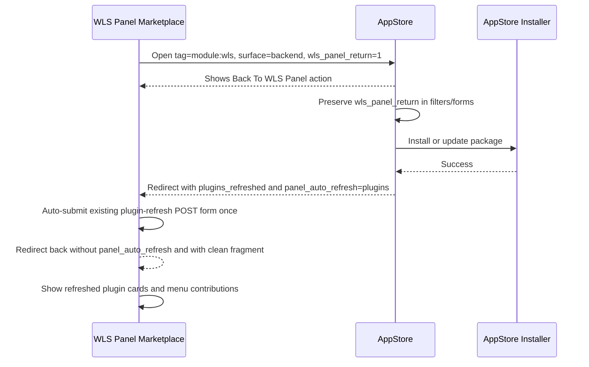
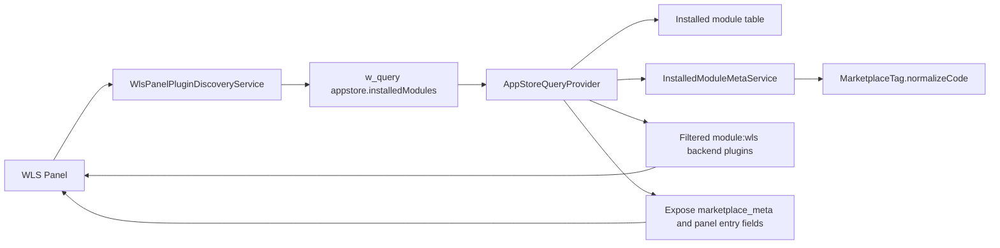
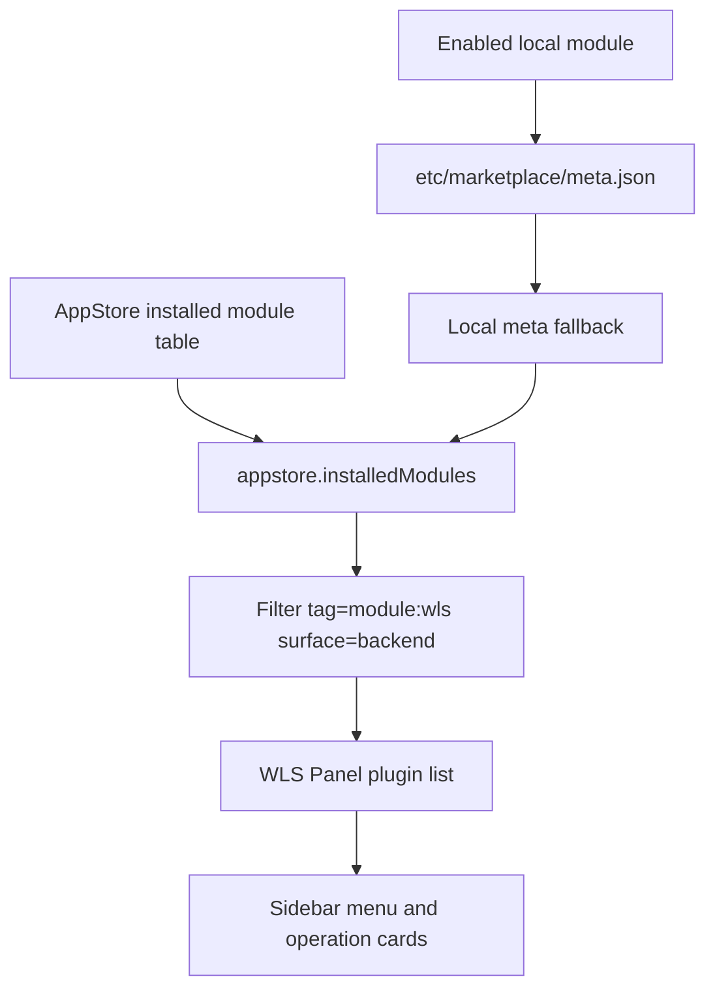
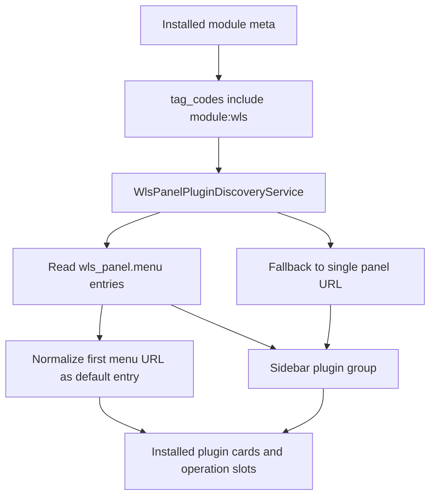
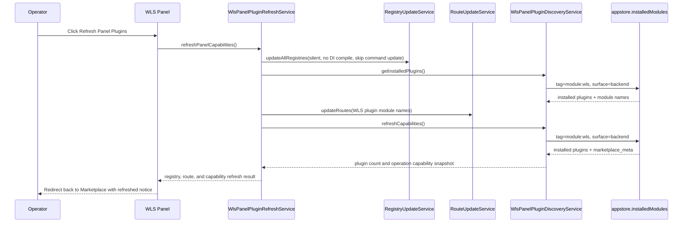

# WLS Plugin Tag Logic

## Decision

Use module meta tags. Do not introduce a separate WLS inheritance contract for discovery.

Tags support a typed format:

```text
type:value
```

Examples:

```text
module:wls
custom:wls-file-manager
category:server-tools
feature:tag-deploy
system:false
```

The source of truth stays in module marketplace meta:

```text
etc/marketplace/meta.json
```

Strict AppStore package install requires structured tag entries with source-locale labels:

```json
{
  "code": "module:wls",
  "label": {
    "zh_Hans_CN": "WLS Panel"
  },
  "primary": true
}
```

## Why

The module system already supports module metadata. WLS only needs a stable way to identify marketplace modules that are intended to extend the WLS Panel.

This keeps WLS discovery simple:

1. Module declares `module:wls` in `etc/marketplace/meta.json`.
2. Marketplace indexes the tag code as-is.
3. WLS Panel asks the marketplace for `tag=module:wls`.
4. The panel installs the module through the normal AppStore verification path.
5. After install/reload, WLS reads the installed module meta and menu contribution.

## Marketplace Flow



The platform/Office Site source is maintained in the official site checkout:

```text
E:\WelineFramework\Framework-Official\App\weline\app\code\Weline\PlatformAppStore
```

The WLS Panel plan uses that source as the online marketplace contract and the
local `Weline_AppStore` module as the client-side install surface:

- Marketplace queries must accept exact typed tag codes such as `module:wls`.
- The platform API `POST /api/v1/platform/module/list` accepts `tag`, `tags`,
  and `tag_match`.
- `ModuleCatalogService::normalizeTypedTagFilter()` accepts plain typed strings,
  arrays, JSON arrays, and structured objects such as
  `{"type":"custom","value":"wls-file-manager"}`.
- `ModuleCatalogService::moduleHasTypedTags()` uses exact normalized matching;
  `module:wls-extra` must not match `module:wls`.
- Marketplace responses may return `tags`, flat `tags_resolved`, locale-grouped `tags_resolved`, or `marketplace_meta.tags`.
- The final runner `tools/marketplace-typed-tag-e2e.php --self-test=1`
  verifies all of those response shapes offline before any live AppStore token
  or network call is attempted.
- Final live AppStore verification should add `--require-negative-conclusive=1`
  so a `module:wls-extra` canary result is required; an empty negative query is
  not enough to prove exact matching.
- The App Store source manifest must contain both real WLS-positive package
  entries tagged `module:wls` and a real negative canary entry tagged
  `module:wls-extra` without `module:wls`. The readiness probe checks
  `official-apps/manifest.json` for those conditions before the live API E2E is
  accepted.
- The local AppStore normalizes all of those forms through `MarketplaceTag` before storing installed-module meta.
- The local AppStore marketplace card view also normalizes `tags`,
  `tags_resolved`, and `marketplace_meta.tags` before rendering badges and
  browser-side filters, so locale-grouped online responses still show
  `module:wls` plugin tags before installation.
- Browser-side tag filtering is exact token matching. For example,
  `module:wls-extra` must not match `module:wls`.
- The Office Site indexing task must preserve `:` and `-` in tag codes and index
  them as exact filter keys.

### Current Verification Gate

As of 2026-06-22, the official marketplace source-contract check has been
re-run in the actual official checkout:

```text
E:\WelineFramework\Framework-Official\App\weline
```

Verified files:

- `app\code\Weline\PlatformAppStore\Service\ModuleCatalogService.php`
- `app\code\Weline\PlatformAppStore\Controller\Api\V1\Platform\Module.php`
- `app\code\Weline\PlatformAppStore\test\Unit\Service\ModuleCatalogServiceTagFilterTest.php`

Verification commands:

```powershell
php -l app\code\Weline\PlatformAppStore\Service\ModuleCatalogService.php
php -l app\code\Weline\PlatformAppStore\Controller\Api\V1\Platform\Module.php
php vendor\phpunit\phpunit\phpunit app\code\Weline\PlatformAppStore\test\Unit\Service\ModuleCatalogServiceTagFilterTest.php
php E:\WelineFramework\DEV-workspace\app\code\Weline\Server\doc\wls-panel-plan\tools\marketplace-typed-tag-e2e.php --self-test=1
```

Result:

- PHP lint passed for the service and API controller.
- PHPUnit ran 3 tests / 6 assertions for typed tag normalization, exact
  matching, and `any` matching.
- The focused test confirms `module:wls-extra` does not match `module:wls`.
- The WLS Panel typed-tag runner self-test confirms string, JSON-string,
  structured `type/value`, locale-grouped `tags_resolved`,
  `marketplace_meta.tags`, `system:false`, and negative `module:wls-extra`
  response handling without token, network, WLS startup, or file writes.
- The runner self-test also confirms `--require-negative-conclusive=1` accepts
  a real negative canary and rejects an empty negative-query pass.
- The run emitted only the existing PHPUnit coverage-mode warning.
- No official repository files were edited during this verification pass.

## WLS Recognition Rules

| Tag | Meaning |
| --- | --- |
| `module:wls` | This module can be listed inside the WLS Panel marketplace. |
| `custom:wls-file-manager` | Module-specific WLS plugin identity. |
| `category:server-tools` | Marketplace grouping. |
| `feature:tag-deploy` | Capability filter. |
| `feature:file-manager` | File-manager capability filter. |
| `capability:files-read` | File read capability hint. |
| `capability:files-write` | Controlled file write capability hint. |
| `capability:files-policy` | Project-level file path policy capability hint. |
| `capability:files-delete-tree` | Bounded recursive directory delete capability hint. |
| `system:true` | Bundled/system module. |
| `system:false` | Not a system bundled module. |

## Client Parsing Rules



- `type:value` is normalized to lower case.
- Hyphenated values are preserved, so `custom:wls-file-manager` remains stable.
- Legacy tags such as `surface.backend` still work.
- `surface:backend` and `surface.backend` both produce surface `backend`.
- WLS does not need a new PHP interface just to be discoverable. The tag is the discoverability contract.

## Module Declaration Prototype

```json
{
  "schema_version": 1,
  "module_name": "Vendor_WlsFileManager",
  "i18n": {
    "source_locale": "zh_Hans_CN",
    "locales": {
      "zh_Hans_CN": {
        "display_name": "WLS File Manager",
        "description": "Adds file management capability to WLS Panel."
      }
    }
  },
  "tags": [
    {
      "code": "module:wls",
      "primary": true,
      "label": {
        "zh_Hans_CN": "WLS Panel"
      }
    },
    {
      "code": "custom:wls-file-manager",
      "label": {
        "zh_Hans_CN": "WLS File Manager"
      }
    },
    {
      "code": "category:server-tools",
      "label": {
        "zh_Hans_CN": "Server Tools"
      }
    },
    {
      "code": "system:false",
      "label": {
        "zh_Hans_CN": "Third-party Module"
      }
    }
  ],
  "surfaces": ["backend"]
}
```

## Client Behavior

1. The panel filters marketplace results by `module:wls`.
2. The panel can add extra filters such as `feature:php-config`.
3. The installer must still verify signature, declared dependencies, and module hash.
4. Installed plugins refresh the panel menu after module update/reload.

## WLS Panel Client Integration

The WLS Panel client does not call AppStore internal PHP services directly. Stage 1 uses URL-level integration so the panel remains independent while the AppStore keeps ownership of account binding, package authorization, download, signature, hash, dependency, permission, and install checks.

| Panel action | Target | Required query |
| --- | --- | --- |
| Online WLS plugins | `appstore/backend` | `tag=module:wls&surface=backend&wls_panel_return=1` |
| Installed WLS plugins | `appstore/backend/installed` | `tag=module:wls&surface=backend&wls_panel_return=1` |
| Candidate install flow | `appstore/backend` | `tag=module:wls&surface=backend&wls_panel_return=1&q=<plugin name>` |

`appstore/backend` is the canonical AppStore index route generated for
`Backend\Index::index()`. Action endpoints remain under
`appstore/backend/index/...`, for example `download`, `install`, and
`authorize-install`.

The AppStore index view treats online platform payloads as compatible when
they expose any of these tag surfaces:

```json
{
  "tags": [{"code": "module:wls"}],
  "tags_resolved": [{"code": "module:wls", "label": "WLS Panel"}],
  "tags_resolved": {
    "zh_Hans_CN": [{"code": "module:wls", "label": "WLS Panel"}],
    "en_US": [{"code": "module:wls", "label": "WLS Panel"}]
  },
  "marketplace_meta": {
    "tags": [{"type": "module", "value": "wls"}]
  }
}
```

All four shapes are flattened to normalized codes by the client view before
badges, search text, and browser-side tag filters are calculated. This mirrors
the installed-module normalization path without making WLS depend on AppStore
implementation classes.



## WLS Panel Return Context

The AppStore install engine stays shared, but WLS Panel-origin traffic must feel
like it belongs to the independent server panel rather than the ordinary project
backend. WLS Panel therefore adds `wls_panel_return=1` to online, installed, and
candidate install links.

AppStore preserves this context through GET filters, authorization forms,
download/install POST forms, installed-module filters, update forms, and check
update actions. When an install or update succeeds with `wls_panel_return=1`,
AppStore redirects back to:

```text
server/backend/wls-panel/marketplace?panel_notice=plugins_refreshed&panel_auto_refresh=plugins#installed-plugins
```

The returned WLS Panel page does not refresh registries from a GET request.
Instead, the standalone shell detects `panel_auto_refresh=plugins` and submits
the existing `plugin-refresh` POST form once. That POST returns to the
Marketplace without `panel_auto_refresh`, so reload loops are avoided while
`Weline_Server` stays decoupled from AppStore installer classes.
WLS Panel appends fragments after the final backend URL is built and redirects
through the response object directly, so the final browser URL remains clean:
`...?panel_notice=plugins_refreshed#installed-plugins`.



## Installed Plugin Discovery Contract

WLS consumes installed plugin state through the generic query contract, not through AppStore PHP classes:

```php
w_query('appstore', 'installedModules', [
    'tag' => 'module:wls',
    'surface' => 'backend',
]);
```

AppStore owns the provider implementation and returns normalized fields:

| Field | Meaning |
| --- | --- |
| `module_name` | Installed module code, for example `Vendor_WlsFileManager`. |
| `display_name` | Localized marketplace display name. |
| `description` | Localized marketplace description. |
| `tag_codes` | Normalized typed tags, including `module:wls`. |
| `surface_codes` | Normalized surfaces, such as `backend`. |
| `custom_tag_code` | First `custom:*` tag, useful as a plugin identity hint. |
| `marketplace_meta` | Raw persisted marketplace meta snapshot. Unknown meta fields are preserved for module-specific capability data. |
| `capabilities` | The `marketplace_meta.capabilities` payload, when declared by the module. |
| `wls_panel_url` / `panel_url` / `backend_url` / `capability_url` | Optional plugin entry URL fields used by WLS to open the contributed panel page. |
| `panel_entry` / `backend_entry` / `wls_panel` | Optional structured entry objects. WLS reads `url`, `href`, `backend_url`, `route`, or `backend_route` from these objects. |



This keeps the dependency direction clean:

- `Weline_AppStore` exposes a stable query capability.
- `Weline_Server` consumes the query result only.
- WLS plugin modules only need typed meta tags; no WLS-specific PHP interface is required for discovery.

Local bundled modules use the same rule. If an enabled local module has
`etc/marketplace/meta.json` but no AppStore install-table row, the AppStore
query provider may expose it as a local installed plugin with `install_id = 0`
and `license_status = local`. This makes bundled WLS capabilities visible in
the same panel discovery path as online marketplace installs.



## WLS Panel Menu Contribution Contract

Installed WLS plugins can extend the standalone panel navigation through module
marketplace meta. The discovery rule is intentionally tag-based:

1. The module declares `module:wls`.
2. The module optionally declares a more specific typed tag such as
   `custom:wls-file-manager` or `feature:php-config`.
3. The module declares one or more panel entries in `wls_panel.menu[]`.
4. WLS Panel refreshes installed plugin discovery and renders the entries in a
   separate sidebar group plus a dashboard contribution section.

Recommended meta shape:

```json
{
  "schema_version": 1,
  "module_name": "Vendor_WlsFileManager",
  "tags": [
    {
      "code": "module:wls",
      "primary": true,
      "label": {
        "zh_Hans_CN": "WLS Panel"
      }
    },
    {
      "code": "custom:wls-file-manager",
      "label": {
        "zh_Hans_CN": "WLS File Manager"
      }
    }
  ],
  "surfaces": ["backend"],
  "wls_panel": {
    "menu": [
      {
        "key": "file-manager",
        "label": {
          "zh_Hans_CN": "文件管理",
          "en_US": "File Manager"
        },
        "description": {
          "zh_Hans_CN": "管理 WLS 项目路径内的文件。",
          "en_US": "Manage files inside WLS project paths."
        },
        "backend_route": "weline_filemanager/backend/wls-file-manager",
        "group": "tools",
        "order": 30
      }
    ]
  }
}
```

Compatibility fallback:

```json
{
  "wls_panel_url": "weline_filemanager/backend/wls-file-manager"
}
```

When `wls_panel.menu[]` is present, WLS also treats the first valid menu item as
the plugin default panel entry. This keeps installed-plugin cards and operation
capability cards usable even when a plugin only declares menu contributions.
When `wls_panel.menu[]` is absent, WLS may expose one default plugin entry from
`wls_panel_url`, `panel_url`, `backend_url`, `capability_url`, `panel_entry`,
`backend_entry`, or `wls_panel`. Unsafe URL schemes such as `javascript:`,
`data:`, and `vbscript:` are ignored.

Menu entries may put `url`, `href`, `route`, or `backend_route` directly on
each `wls_panel.menu[]` item. WLS normalizes unsafe schemes away before the
template turns relative backend routes into admin URLs.



## Operation Capability Matching

The WLS Panel now has fixed operation slots for the server-panel features that
should be provided by optional plugins. These slots are not new module
protocols. They are exact typed-tag matches on the installed plugin metadata
returned by AppStore.

| Panel slot | Required custom tag | Feature tag | Default install query |
| --- | --- | --- | --- |
| PHP Profiles | `custom:wls-php-manager` | `feature:php-config` | `WLS PHP Manager` |
| Database Profiles | `custom:wls-database-manager` | `feature:database-profile` | `WLS Database Manager` |
| File Manager | `custom:wls-file-manager` | `feature:file-manager` | `WLS File Manager` |
| Deploy Releases | `custom:wls-deploy` | `feature:tag-deploy` | `WLS Deploy` |

Resolution flow:

1. WLS calls `w_query('appstore', 'installedModules', ['tag' => 'module:wls', 'surface' => 'backend'])`.
2. AppStore returns localized module labels, normalized tags/surfaces, raw
   `marketplace_meta`, `capabilities`, and optional panel entry fields from the
   installed-module meta snapshot.
3. WLS normalizes installed-plugin tag sources from `tag_codes`, `tags`,
   `tags_resolved`, `custom_tag_code`, and `marketplace_meta.tags`.
4. Each operation slot checks for its `custom:*` tag.
5. If present, the slot is shown as installed. If the plugin exposes a
   `wls_panel_url`, `panel_url`, `backend_url`, `capability_url`, an equivalent
   panel entry URL, or at least one valid `wls_panel.menu[]` item, WLS opens the
   contributed page and appends safe project context for project-card actions.
6. If missing, the slot links to AppStore with
   `tag=module:wls&surface=backend&q=<default install query>`.

This gives WLS a simple typed-tag capability system while keeping AppStore as
the install and verification owner.

Panel refresh is a native WLS Panel action:



Implemented behavior:

1. `WlsPanel::postPluginRefresh()` delegates to
   `WlsPanelPluginRefreshService` so the Controller stays a request boundary.
2. The refresh service reloads the module list, discovers installed
   `module:wls` plugins, refreshes Framework registries incrementally for those
   plugin modules, then route-refreshes the same module list. If the
   incremental registry refresh fails it falls back to full registry refresh;
   an empty plugin list does not trigger all-module registry or route rebuilds.
3. `WlsPanelPluginDiscoveryService::refreshCapabilities()` runs after the
   registry/route refresh and remains the single source for normalized plugin
   cards, operation slots, and menu contributions.
4. AppStore install/update remains the owner of package validation, dependency
   checks, install records, and command index updates. WLS panel refresh is a
   post-install capability reload path, not a package installer.

## Project Operation Deep Links

Managed project cards do not define a second plugin contract. They call the
same operation slots by key:

| Project action | Operation key | Fallback install query |
| --- | --- | --- |
| PHP Config | `php-profile` | `WLS PHP Manager` |
| Database Config | `database-profile` | `WLS Database Manager` |
| Files | `file-manager` | `WLS File Manager` |
| Deploy | `deploy` | `WLS Deploy` |

URL behavior:

1. If the matching slot is installed and exposes a WLS panel URL, the project
   action opens that URL with safe context parameters:
   `operation`, `project_id`, `domain`, and `project_type`.
2. If the slot is missing or the plugin has not exposed a URL, the action opens
   AppStore with the WLS filter and slot-specific install query.
3. Raw `project_path` is not sent through query strings. A file-manager plugin
   should resolve authorized paths from the WLS project registry by
   `project_id` or `domain`.
