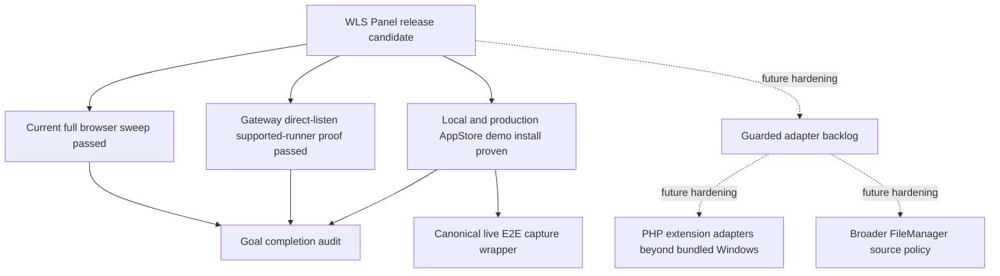

# WLS Panel Completion Audit And Next Gates

Date: 2026-06-22

This file is the current requirement-by-requirement audit for the WLS Panel
goal. It does not mark the goal complete. It separates proven behavior from
work that is implemented but still needs broader evidence, environment-specific
validation, or future guarded adapters.

## Completion Rule

The WLS Panel goal can be treated as complete only when every row below is
`Proven` with current evidence. `Partial` means the direction is correct but the
final requirement is not fully proven. `Environment gate` means implementation
or local evidence exists, but the final proof requires an external capability
such as official marketplace credentials or a prepared production target.
`95-final-acceptance-runbook.md` is the executable sequence for turning this
matrix into a final completion decision. `96-requirement-traceability.md`
preserves the full discussion-to-requirement mapping and locks the marketplace
environment rule: local development uses `https://app.weline.test:9523`, while
deployed/production checks use deployment information that records
`appstore_platform_url=https://app.aiweline.com` and
`appstore_platform_url_source=production_default`, then resolves to
`https://app.aiweline.com`. The machine-readable guard
`tools/wls-panel-completion-audit.php --fail-on-incomplete=1` must fail while
any row in either the completion matrix or the requirement traceability matrix
remains non-`Proven`; it becomes the final release gate after all evidence is
refreshed. Its compact `summary` exposes stable machine-readable
`completion_total`, `completion_proven_count`, `traceability_total`,
`traceability_proven_count`, `open_rows_total`, and
`first_incomplete_requirement` fields for CI, operator status panels, and
release scripts. `tools/local-appstore-readiness-probe.php` is the read-only local
App Store preflight for the remaining marketplace gate, and
`tools/validate-deploy-appstore-endpoint-policy.php` is the read-only deploy
artifact gate that keeps production checks on `app.aiweline.com`; its
`--self-test=1` mode proves production must record the exact platform root
`appstore_platform_url=https://app.aiweline.com` and source
`appstore_platform_url_source=production_default` through
`production_records_exact_app_aiweline_platform_url`, local current metadata
must record the exact platform root through
`local_records_exact_app_weline_platform_url`, and the checker rejects empty
production URLs, local App Store, `www.*`, API endpoint paths inside
`appstore_platform_url`, and local deploy-mode drift without token, network,
WLS, or write side effects.
2026-06-28 marketplace evidence refresh: the canonical AppStore typed-tag live
E2E gate now passes for both environments. Local capture wrote
`var\wls-panel-plan\local-appstore-live-e2e.json` from
`https://app.weline.test:9523/api/v1/platform/module/list` with endpoint source
`arg:endpoint`. Production capture wrote
`var\wls-panel-plan\production-appstore-live-e2e.json` from
`https://app.aiweline.com/api/v1/platform/module/list` with endpoint source
`deploy-current:var\deploy\current.json`. The combined final evidence gate
returned `ok=true` and `ready=true`; both captures reported 5 `module:wls`
plugins, exactly `Weline_WlsDemoPlugin` for
`module:wls + custom:wls-panel-plugin`, exactly `Weline_WlsTagCanary` for the
negative `module:wls-extra` canary, and no secret values in evidence.
The local readiness probe also locks the marketplace checkout identity before
any live AppStore E2E can run: `app_checkout_is_framework_official_app`,
`app_checkout_has_platform_appstore_module`, and
`app_checkout_has_appstore_module` must prove the checkout is
`E:\WelineFramework\Framework-Official\App\weline` with both PlatformAppStore
and AppStore modules. The same probe checks the App checkout `app/etc/env.php`
WLS endpoint through `app_env_wls_endpoint_matches_deploy_current` and
`app_env_wls_endpoint_matches_probe_endpoint`. If either identity or endpoint
rule fails, `next_actions` contains `select_local_appstore_checkout` or
`fix_local_deploy_current_marketplace_metadata`, and the live typed-tag call
remains blocked.
`tools/validate-appstore-endpoint-source-contract.php` is the matching
read-only source gate: it proves `DeployOrchestratorService` writes the
deployment marketplace fields, `AppStorePlatformUrlResolver` reads production
`var/deploy/current.json` before fallback defaults, and `AccountBindService`
plus WLS Panel consume that resolver instead of hard-coded official website
hosts. It also proves the WLS Panel fallback path itself stays aligned through
`panel_has_locked_fallback_defaults`,
`panel_fallback_local_mode_is_explicit_only`, and
`panel_fallback_reads_deployed_production_current`, so a disabled or
mid-upgrade AppStore module cannot push the standalone panel back to stale local
configuration, `www.*` hosts, or a production proof that was not recorded in
deployment metadata.
The source gate now also requires
`deploy_rejects_official_website_marketplace_sources`,
`resolver_rejects_official_website_marketplace_sources`, and
`panel_fallback_rejects_official_website_marketplace_sources`, so known
official `www.*` website hosts are rejected at the Deploy writer, AppStore
resolver, and WLS Panel fallback layers before they can become marketplace API
roots.
The same source gate also covers `ModuleInstallerService`, AppStore backend
marketplace and installed-module controllers, and their templates. It requires
the AppStore endpoint/source strip, WLS Panel return button, return query
propagation, and post-install/update redirect back to the standalone WLS Panel
to stay intact. Its real `--self-test=1` mode mutates the contract and must
reject `www.aiweline.com`, a missing endpoint strip, a missing WLS return URL
or redirect, and installer code that bypasses `AppStorePlatformUrlResolver`.
`tools/local-appstore-typed-tag-live-gate.php` is the guarded local live gate
wrapper. Its default mode is preflight-only and makes no AppStore API request.
Its `--self-test=1` mode is in-memory only and must report
`local_live_gate_self_test_passed=true` through the aggregate final preflight;
that test proves the locked `https://app.weline.test:9523` root,
`manual_endpoint_rejected`, `local_insecure_disabled`, readiness blocking, and
conclusive negative-canary live args without reading tokens, starting WLS, or
calling the AppStore API. It runs the local readiness action plan, source
contract, local deploy policy, and local endpoint-only resolver first; only
`--allow-live=1` plus `ready_for_live=true` may execute the token-safe
typed-tag runner. The aggregate preflight also runs a premature
`--allow-live=1 --report-only=1` probe and must report
`local_live_gate_premature_allow_blocked_no_live_call=true` while any readiness
blocker remains. The wrapper itself must report
`local_deploy_policy_exact_root=true`, and the aggregate preflight also
promotes the local deploy metadata shape into
`local_deploy_endpoint_policy_exact_root=true`.
`tools/production-appstore-typed-tag-live-gate.php` is the matching guarded
production live gate wrapper. Its default/report mode is also preflight-only
and makes no AppStore API request. Its `--self-test=1` mode is in-memory only
and must report `production_live_gate_self_test_passed=true` through the
aggregate final preflight; that test proves `manual_endpoint_rejected`,
`production_insecure_disabled`, token readiness blocking, conclusive
negative-canary live args, and deployed `current.json` forwarding without
reading tokens, contacting production, or writing evidence. It also proves
fixture deploy-current files are not accepted as production live execution
artifacts; `--allow-live=1` requires the current deployed workspace
`var/deploy/current.json`. It refuses manual
`--endpoint` input and insecure mode, requires `var/deploy/current.json` to record
`appstore_platform_url=https://app.aiweline.com` as the platform root plus
`appstore_platform_url_source=production_default`, resolves the production API
endpoint from that deployment artifact, checks token
readiness without printing token values, and only `--allow-live=1` plus
`ready_for_live=true` may run the live production typed-tag request. The
aggregate preflight also runs a
premature `--allow-live=1 --report-only=1` production probe and must report
`production_live_gate_premature_allow_blocked_no_live_call=true` until the
deployed artifact and production token are ready. The wrapper itself must
report `production_deploy_policy_exact_root=true`, and
the aggregate preflight also promotes the production deploy metadata shape into
`production_deploy_endpoint_policy_exact_root=true`.
The same readiness gate now checks the App Store official catalog source:
`official-apps/manifest.json` must expose at least one real `module:wls`
package entry and one strict `module:wls-extra` negative canary entry without
`module:wls` before the live API E2E can close the typed-tag gate. The expected
manifest shape is recorded in `93-official-appstore-manifest-contract.md` and
checked by `tools/validate-official-appstore-manifest-contract.php`. The same
tool can emit a read-only `manifest_template` with `--template=1`, using the
current DEV WLS plugin metadata as the catalog preparation source. The same
dry-run now reports a `source_plan` for `official-apps/modules/*`: real WLS
plugin sources are copied from DEV module directories, while
`Weline_WlsTagCanary` is generated as a non-installable canary source. It can
materialize only the official manifest target after explicit confirmation with
`--write=1 --confirm=WRITE_WLS_OFFICIAL_MANIFEST`, and it can materialize only
the official source catalog after explicit confirmation with
`--write-sources=1 --confirm-sources=WRITE_WLS_OFFICIAL_SOURCES`; dry-run
target mode reports `materialize.would_write=true` and
`source_plan.would_write=true` without touching the App checkout. The read-only
readiness probe also reports an `official_manifest_materialize` section with
the target, dry-run command, `authorized_write_command`,
`authorized_source_write_command`, `authorized_catalog_write_command`, and
confirmation phrases so operators do not hand-build the App checkout catalog
path.
The readiness probe also emits `next_actions`, mapping each current blocker to
the ordered action, authorization requirement, safe-to-run status, working
directory, command, and side-effect boundary. The action plan must include the
post-sync App setup step `run_local_app_setup_after_sync` with
`php bin/w setup:upgrade --route --skip-env-check --skip-composer-dump` before
WLS startup. This keeps the remaining local AppStore typed-tag gate executable
without turning a probe into a sync, setup, WLS start, token write, or live API
call.
For repeated operator or CI checks, `--action-plan-only=1` keeps the same
read-only readiness exit code while also reporting the deployment-derived
endpoint, `app_env`, `local_deploy_current`, blockers, checks, and
`next_actions` rather than the full manifest/check payload. The readiness gate
must prove `app_env_deploy_mode_local=true` and
`local_deploy_current_matches_probe_endpoint=true`; if `env.php` is not
explicitly `deploy=dev/local`, or if the local deploy-current metadata is
missing, points to `www.*`, stores a full API path, or disagrees with the probe
endpoint, it must emit
`fix_local_deploy_current_marketplace_metadata` and block the live typed-tag
call.
`tools/wls-panel-final-preflight.php` is the read-only aggregate for this final
marketplace slice. It runs the completion audit, compact readiness action plan,
App sync drift report, deploy endpoint source contract, endpoint source-contract
self-test, deploy endpoint policy self-test, guarded local and production
live-gate wrappers, explicit local and
production deploy-current policy fixture checks, typed-tag self-test, official
manifest self-test, official manifest template dry-run for the App checkout
target, official source catalog plan, and local/production endpoint-only
resolvers. It reports
`ready_for_live_local_appstore_e2e`,
`endpoint_source_contract_self_test_passed`,
`endpoint_source_contract_self_test_case_count`,
`endpoint_source_contract_passed`,
`local_readiness_app_checkout_identity_ok`,
`local_readiness_app_env_deploy_mode_local`,
`local_readiness_app_env_wls_endpoint_locked`,
`local_readiness_deploy_current_locked`,
`local_live_gate_self_test_passed`,
`local_live_gate_guard_passed`,
`local_live_gate_no_live_call`,
`local_live_gate_premature_allow_blocked_no_live_call`,
`production_live_gate_self_test_passed`,
`production_live_gate_guard_passed`,
`production_live_gate_deploy_current_is_deployed_artifact`,
`production_live_gate_no_live_call`,
`production_live_gate_premature_allow_blocked_no_live_call`,
`official_manifest_self_test_passed`,
`authorization_pack_self_test_passed`,
`workorder_authorization_consistency_self_test_passed`,
`live_e2e_evidence_validator_self_test_passed`,
`live_e2e_capture_self_test_passed`,
`live_e2e_final_gate_self_test_passed`,
`official_manifest_template_dry_run_passed`, and
`official_manifest_template_catalog_contract_ok`,
`official_manifest_template_would_write`,
`official_manifest_source_plan_ready`, and
`official_manifest_source_plan_would_write`,
`local_deploy_endpoint_policy_passed`,
`local_deploy_endpoint_policy_exact_root`,
`production_deploy_endpoint_policy_passed`,
`production_deploy_endpoint_policy_exact_root`, `local_endpoint_locked`, and
`production_endpoint_locked`; it also reports
`blocked_preflight_no_evidence_files=true` by checking that blocked/preflight
runs have not created `var\wls-panel-plan\local-appstore-live-e2e.json`,
`var\wls-panel-plan\production-appstore-live-e2e.json`, or `var\leak.json`.
It fails by default until all pre-live-E2E conditions pass. `--report-only=1`
keeps the same report but exits zero for operator review.
The report mirrors `ready_for_live_local_appstore_e2e` and `goal_complete` into
`summary`, and exposes the local App checkout sync action chain as explicit
booleans under `checks` and `summary.readiness_action_authorized_sync`. CI and
operator scripts should read those fields instead of scraping command text.
It also exposes `summary.official_manifest_catalog_summary` so the dry-run can
prove the template contains five positive WLS plugins including
`Weline_WlsDemoPlugin`, the strict `Weline_WlsTagCanary` negative canary, and
six ready source-plan entries
before any manifest or source catalog write is authorized.
`tools/wls-panel-live-e2e-authorization-pack.php` is the read-only authorization
packet that operators review before any explicit App checkout sync, App
manifest/source write, WLS start, token export, or live AppStore API call. It
aggregates the readiness action plan, final preflight, sync-manifest drift,
local/production deploy endpoint policies, exact local/production marketplace
roots, official manifest catalog summary, deferred execution order, capture
wrapper self-test, live-gate self-test summary, and no-secret/no-live-call
checks. It must
support `--self-test=1`, and that self-test must report `passed=true` before
the full authorization packet is counted; its in-memory cases must include the
live-gate self-test summary requirement so both wrappers and case counts are
checked before review. The aggregate final preflight mirrors this as
`authorization_pack_self_test_passed=true`. The packet itself must
report `authorization_pack_ready_for_review=true`,
`local_endpoint_exact_root=true`, `production_endpoint_exact_root=true`,
`local_env_is_explicit_dev_or_local=true`, `sync_manifest_ok=true`,
`local_live_gate_self_test_passed=true`,
`production_live_gate_self_test_passed=true`,
`live_gate_self_test_case_counts_ok=true`,
`capture_self_test_passed=true`, `capture_path_traversal_guarded=true`,
`capture_consistency_contract_guarded=true`,
`blocked_preflight_no_evidence_files=true`,
`official_manifest_catalog_contract_ok=true`,
`official_manifest_catalog_source_plan_ok=true`,
`all_side_effect_steps_deferred=true`,
`only_live_step_runnable_when_ready=true`, and `no_secret_values=true`. While
the live gate is still blocked, it must keep
`current_state=blocked_before_live_run` and every execution step
`safe_to_run_now=false`; when the gate is ready, only
`run_live_typed_tag_e2e` may become runnable.
For human authorization review immediately before any scoped `鍒嗛」` sync,
`--include-drift-rows=1` keeps the packet read-only while exposing bounded
per-file App checkout drift rows under
`tool_results.sync_manifest.drift_rows`; default output remains compact for CI
and routine status checks.
The drift-row bound is explicit: the packet may include every current
allowed-path row only when the row count stays at or below the manifest total
and below the authorization packet's max row bound. This keeps the current
47-row DEV/App drift reviewable without making the packet unbounded.
The same review must expose
`tool_results.sync_manifest.drift_review_fingerprint`; the packet check
`drift_review_fingerprint_present=true` proves that compact and full review
outputs describe a stable allowed-path drift object, not just an aggregate row
count.
The same packet exposes
`tool_results.final_preflight.live_gate_self_tests` and
`tool_results.final_preflight.official_manifest_catalog_summary`, so reviewers
can see the local/production live-gate endpoint self-test status, six-case
minimum for each wrapper, six-entry WLS catalog template, five positive
`module:wls` plugins including `Weline_WlsDemoPlugin`, one strict negative
canary, and ready source-plan count
before any local App checkout sync or deployed marketplace live proof.
Add `--include-rollback-review=1` for the same human review when the App
checkout already contains unrelated work. It adds
`tool_results.sync_manifest.rollback_review.app_git_status`, including
allowed-sync rows, out-of-scope rows, and an `out_of_scope_fingerprint` that
must be compared before and after scoped `鍒嗛」`.
With `--fail-if-unsafe=1`, rollback review is a hard authorization-packet
condition, not a note-only section. The packet must report
`rollback_review_safe_when_requested=true`, `allowed_status_count=0`, a
non-empty `out_of_scope_fingerprint`, and a complete row split where
`total_status_count = allowed_status_count + out_of_scope_status_count`.
Any local App checkout status under the allowed sync paths makes the packet
unsafe until the operator clears it or explicitly re-runs the scoped sync
review from a clean App checkout.
CI or release scripts should use
`tools/wls-panel-live-e2e-authorization-pack.php --fail-if-unsafe=1` so an
unsafe authorization packet exits non-zero before any live AppStore action is
approved.
`tools/wls-panel-workorder-authorization-consistency.php` is the read-only
cross-check that turns the marketplace endpoint decision into deployment
information rather than operator memory. It runs the final preflight, final
workorder, and authorization packet, then requires the preflight local endpoint
to be `https://app.weline.test:9523/api/v1/platform/module/list`, the
preflight production endpoint to be
`https://app.aiweline.com/api/v1/platform/module/list`, the workorder and
authorization packet roots to stay on `https://app.weline.test:9523` for local
development and `https://app.aiweline.com` for deployed production, and the
same `drift_review_fingerprint` to appear in all three reports. Its
`--self-test=1` mode proves mismatched fingerprints, `www.aiweline.com`, missing
fingerprint checks, and leaked bearer values are rejected without reading
tokens, starting WLS, writing manifests, syncing the App checkout, or calling a
live AppStore API. The aggregate final preflight mirrors that as
`workorder_authorization_consistency_self_test_passed=true`, and the final
workorder includes
`workorder_authorization_must_match_preflight_and_authorization_pack_roots_and_fingerprint`
and
`capture_metadata_must_embed_workorder_authorization_consistency_contract` in
its `acceptance_contract`.
`tools/validate-appstore-live-e2e-evidence.php` is the read-only validator for
the JSON captured after a guarded local or production live E2E run. Its
`--self-test=1` mode must report `passed=true` and is mirrored by the aggregate
final preflight as `live_e2e_evidence_validator_self_test_passed=true`. The
validator accepts either raw `marketplace-typed-tag-e2e.php` output or guarded
wrapper `live_evidence`, and it rejects evidence unless the
deployment-derived endpoint and `endpoint_source=deploy-current:*` match the
requested environment:
`https://app.weline.test:9523/api/v1/platform/module/list` for `--expect=local`
or `https://app.aiweline.com/api/v1/platform/module/list` for
`--expect=production`. It also requires `single_tag_module_wls`,
`structured_tags_all_match`, conclusive
`negative_exact_match_module_wls-extra`, `require_negative_conclusive`, and
`no_secret_values`. When evidence is emitted by the capture wrapper rather
than the raw runner, it must also require `capture_metadata_present`, matching
`capture_metadata_source_gate`, matching environment, exact endpoint, matching
`capture_metadata.endpoint_source`, inside-var evidence flag, a UTC capture
timestamp, and `capture_metadata.evidence_output_path` matching the actual
`--evidence` file path. Capture-wrapper evidence must also carry
`capture_metadata.workorder_authorization_consistency` with `passed=true`,
matching drift fingerprints, locked local
`https://app.weline.test:9523` root and module-list endpoint, locked production
`https://app.aiweline.com` root and module-list endpoint, and matching
preflight/workorder/authorization roots. Its self-test must include
`rejects_wrapper_missing_capture_metadata` and
`rejects_wrapper_non_deploy_current_endpoint_source`, plus output-path mismatch,
missing consistency metadata, `www.aiweline.com` consistency root, and missing
consistency fingerprint rejections.
`tools/wls-panel-live-e2e-capture.php` is the guarded capture wrapper for the
same evidence. Its `--self-test=1` mode must report `passed=true` and the
aggregate final preflight mirrors this as
`live_e2e_capture_self_test_passed=true`. Default `--environment=local` and
`--environment=production` runs are preflight-only and write nothing. With
`--allow-live=1`, the wrapper first runs
`wls-panel-workorder-authorization-consistency.php` and blocks before the live
gate unless the preflight, workorder, and authorization packet agree on local
`https://app.weline.test:9523`, production `https://app.aiweline.com`, and the
same drift review fingerprint. Only after that consistency gate passes does
the wrapper run the matching guarded live gate, writes
sanitized evidence only under
`var\wls-panel-plan\local-appstore-live-e2e.json` or
`var\wls-panel-plan\production-appstore-live-e2e.json` after
`live_executed=true`, adds `capture_metadata` with schema, capture tool,
environment, source gate, endpoint, inside-var status, normalized evidence
output path, UTC timestamp, and
`workorder_authorization_consistency`, then invokes
`validate-appstore-live-e2e-evidence.php --evidence=...`, then invokes
`wls-panel-live-evidence-final-gate.php` against the written file. The final
live proof must report `captured_valid`, `evidence_written=true`,
`final_gate_passed_when_written=true`, and a non-null
`tool_results.final_evidence_gate.ready=true`.
The wrapper must segment-normalize any custom `--evidence-output` before the
inside-var check. Its self-test must include
`path_traversal_outside_var_rejected`, `captured_payload_has_metadata`,
`local_final_gate_uses_local_evidence_arg`, and
`production_final_gate_uses_production_evidence_arg`,
`live_capture_requires_consistency_gate_pass`, and
`live_capture_rejects_consistency_gate_drift_mismatch`, and
a path such as
`var\wls-panel-plan\..\leak.json` must report
`evidence_output_inside_var=false` instead of being treated as an allowed
`var\wls-panel-plan` evidence target.
`tools/wls-panel-live-evidence-final-gate.php` is the read-only final evidence
gate for the captured JSON after the guarded live run. It deliberately requires
capture-wrapper evidence and rejects raw runner JSON for final acceptance, so
the last proof must come from `wls-panel-live-e2e-capture.php` with
`capture_metadata`. The gate supports `--environment=local`,
`--environment=production`, and `--environment=both`; local evidence must
resolve to `https://app.weline.test:9523/api/v1/platform/module/list`, while
production evidence must resolve to
`https://app.aiweline.com/api/v1/platform/module/list` from deployed
`var/deploy/current.json`. Its `--self-test=1` mode must report `passed=true`
and the aggregate final preflight mirrors this as
`live_e2e_final_gate_self_test_passed=true`; its in-memory cases must include
`rejects_raw_runner_payload_for_final_gate` and
`rejects_missing_capture_metadata`. It must also require the validator's
`capture_metadata_output_path_present` and
`capture_metadata_output_path_matches_file` checks so copied wrapper evidence
cannot be accepted for a different evidence file; self-test coverage must
include `rejects_missing_validator_output_path_match`. The tool's report must
keep the side effect statement `read-only final evidence gate` because it reads
evidence and invokes the validator only; it must not contact AppStore, read
tokens, start WLS, or write files.
`tools/validate-local-appstore-sync-manifest.php --with-drift=1` is the
read-only companion for the same gate: it hashes only the allowed sync paths
and reports whether each path is already synchronized, different, or missing in
the App checkout before any `鍒嗛」` operation is authorized. After the authorized
sync runs, the same checker must be rerun with `--fail-on-drift=1`; any
remaining allowed-path difference becomes a non-zero gate before App setup,
WLS startup, or the live typed-tag API E2E can be accepted.
For CI and deployment logs, `--drift-summary-only=1` can be combined with either
drift command to omit per-file rows while preserving the same counts, gate
result, `review_fingerprint`, and `rows_omitted` evidence. Operators should
compare that `review_fingerprint` with the full
`tool_results.sync_manifest.drift_review_fingerprint` in the authorization
packet immediately before approving scoped `鍒嗛」`.
`--rollback-review=1` adds the read-only App checkout `git status` snapshot and
out-of-scope fingerprint; it is a comparison aid and must not be treated as
permission to sync before the user explicitly says `鍒嗛」`.
`--self-test=1` is the in-memory companion for this checker and is now included
in final preflight as `sync_manifest_self_test_passed=true`; it proves
rollback-review status parsing, rename target normalization, out-of-scope
fingerprinting, stable/changing drift fingerprints, `git status --short` path
prefix preservation, forbidden-prefix detection, and broad-include rejection
without reading the App checkout.
The local readiness action plan mirrors the same flow on
`authorized_app_checkout_sync` through `preflight_self_test_command`,
`preflight_command`, `pre_authorization_review_command`,
`rollback_review_command`, and `post_sync_gate_command`, so the next operator
step is machine-readable before any `鍒嗛」` action is authorized.

## Requirement Matrix

| Requirement | Current status | Authoritative evidence | Remaining gate |
| --- | --- | --- | --- |
| Framework backend keeps WLS as an authorized entry while WLS Panel looks independent. | Proven | `00-INDEX.md` Stage 1; `75-stage-1-panel-shell-e2e-evidence.md`; `77-current-integrated-verification-evidence.md`; old `panel-marketplace` compatibility proof; `WLS-PANEL-FINAL-REG-001`. | Current release-candidate browser sweep passed; re-run only if more panel code lands before release. |
| Light/dark theme switching and responsive layout across panel and plugins. | Proven | Stage 1 shell hardening, `WLS-PANEL-REG-004`, `WLS-PANEL-REG-005`, `WLS-PANEL-FINAL-REG-001`, `WLS-PANEL-PLUGIN-UI-002`, current screenshots for dashboard, marketplace, security, PHP, DB, FileManager, and Deploy. | Current release-candidate desktop/mobile light/dark sweep passed; re-run only after new UI changes. |
| Parent panel manages local and child WLS projects and can open project admin / child panel / scoped plugin pages. | Proven for current registry and scoped links | Project registry, Project Config Center, readiness summary, and no-`project_path` leak checks in `30-atomic-task-plan.md` and `77-current-integrated-verification-evidence.md`. | Broader multi-project UX polish remains optional unless new project-management workflows are added. |
| Gateway mode can manage multi-site proxy rules and reload/apply routes. | Proven for passthrough / Gateway role apply | `WLS-GATEWAY-008`, `WLS-GATEWAY-009`, `WLS-GATEWAY-011`; live Gateway role apply, dual-target browser form proofs, and `WLS-PANEL-FINAL-REG-001` Gateway Settings smoke. | Re-run only after gateway runtime code changes. |
| Direct-listen mode remains preferred when supported, while passthrough remains available. | Proven | UI/config/startup mapping exists; Windows feasibility probe correctly blocks direct topology when `SO_REUSEPORT` is missing; task `2026-06-22-0729-wls-direct-listen-supported-runner-proof` proves positive Linux runner support with two direct workers on shared port `10045`, dispatcher comparison on `10046`, balanced request distribution, high-concurrency direct `360.89 QPS` versus dispatcher `290.96 QPS`, and full cleanup. | Future work is production benchmark tuning or business-route throughput, not basic direct-listen feasibility. |
| PHP configuration can be opened and managed from the WLS Panel. | Proven for profiles, php.ini apply, and bundled Windows extension adapter | `WLS-OPS-001`, `WLS-PHP-EXT-ADAPTER-001`, PHP Manager menu contribution, project Profile, php.ini drift/apply/rollback, guarded Windows bundled extension apply/remove probes, browser and i18n evidence. | Platform adapters beyond bundled Windows PHP remain future guarded work. |
| Database configuration can be opened and managed from the WLS Panel. | Proven for profiles, lifecycle, backup, restore, rollback, health, slave management, guarded SQL Apply execution, and guarded MySQL/MariaDB migration import | `WLS-OPS-002`, DB lifecycle MySQL/PostgreSQL harnesses, backup/restore execution harnesses, restore rollback guard/browser proof, Project Health active probe browser success, slave create/remove proof, `WLS-DB-SQL-APPLY-001`, and `WLS-DB-MIGRATION-EXEC-001` guard/browser/MariaDB proof. | Project-health remediation/deeper probes and PostgreSQL reset modes beyond public schema remain separate guarded adapters. PostgreSQL migration execution remains intentionally preflight-only until a future adapter is designed. |
| Security rules and attack protection logs are native panel functions. | Proven | Native Security page, visual rule editor, project scope, attack-log filters, project policy overrides, policy audit filters, read-after-write stability entries in `30-atomic-task-plan.md`, and `WLS-PANEL-FINAL-REG-001`. | Current release-candidate browser regression passed; re-run only after new Security UI changes. |
| WLS marketplace installs WLS-specific plugins through typed meta tags. | Proven for demo install and canonical local/production live typed-tag capture | `20-plugin-tag-logic.md`, `93-official-appstore-manifest-contract.md`, `WLS-TAG-001` through `WLS-TAG-007`; local AppStore client parsing, installed-module discovery, official `PlatformAppStore` unit contract; local App Store project identity proof for `E:\WelineFramework\Framework-Official\App` / `https://app.weline.test:9523/`; Deploy writes `deploy_mode_source`, `appstore_environment`, `appstore_platform_url`, and `appstore_platform_url_source` into `var/deploy/current.json`; webhook health exposes those fields; `AppStorePlatformUrlResolver` keeps local development on explicit `deploy=dev/local` env/config and production on deployed `var/deploy/current.json`; `78-appstore-demo-plugin-install-evidence.md` records the real `Weline_WlsDemoPlugin` local and true-production install proof plus the 2026-06-28 canonical captures; local live evidence `var\wls-panel-plan\local-appstore-live-e2e.json` used `https://app.weline.test:9523/api/v1/platform/module/list` with source `arg:endpoint`; production live evidence `var\wls-panel-plan\production-appstore-live-e2e.json` used `https://app.aiweline.com/api/v1/platform/module/list` with source `deploy-current:var\deploy\current.json`; `tools/wls-panel-live-evidence-final-gate.php --environment=both` returned `ready=true`; both environments returned 5 `module:wls` plugins, exactly `Weline_WlsDemoPlugin` for `module:wls + custom:wls-panel-plugin`, exactly `Weline_WlsTagCanary` for the conclusive `module:wls-extra` negative canary, and no secret values. | Marketplace typed-tag slice is closed. Re-run the capture/final-gate commands only if AppStore endpoint resolution, typed-tag filtering, official WLS catalog metadata, or demo plugin package/install behavior changes. |
| Plugin install/update refreshes the standalone panel without returning to the ordinary backend. | Proven for current local AppStore flow | `WLS-TAG-004`, `WLS-TAG-005`, plugin refresh result summary, return-context and auto-refresh entries. | Re-run final browser flow after the local Official App package journey is token/route ready. |
| File management is a WLS Panel plugin capability. | Proven for bounded controlled roots and staged source policies | `WLS-OPS-003`, `WLS-FILE-EDIT-001`, `WLS-FILE-SOURCE-002`, `WLS-FILE-SOURCE-003`, path-policy, audit, queue archive/trash, safe editor evidence. | Broader multi-root, multi-directory, or source-write queue policy requires separate flags, phrases, worker validation, and browser evidence before enabling. |
| Deploy is a WLS Panel capability with webhook/tag driven release support. | Proven for controlled project Profile, webhook tag harness, manual release gate, rollback harness, release-path UI, and current RC Deploy shell | Stage 5 in `00-INDEX.md`; Deploy release path browser smoke in `77-current-integrated-verification-evidence.md`; controlled webhook POST and rollback harness entries; `WLS-PANEL-FINAL-REG-001`. | Production-environment deploy credentials and real release targets remain outside this local UI plan. |
| WLS Panel can load new panel capabilities after module changes. | Proven for current plugin refresh path | `WLS-TAG-004`, `WLS-TAG-005`, `WLS-PANEL-PLUGIN-UI-002`; route and registry refresh result summary; current template-level proof that installed-plugin cards consume the normalized `panel_entry_url` emitted from the first valid `wls_panel.menu[]` item. | Final plugin-install/update browser journey with a local Official App package once route/auth data is ready; production package journey is a separate launch gate. |
| Integrated panel remains stable and visually acceptable under plugin-heavy load. | Proven for current 512M panel baseline | `WLS-PANEL-REG-004`, `WLS-PANEL-REG-005`, `WLS-PANEL-FINAL-REG-001`, `WLS-PANEL-MEM-001` through `WLS-PANEL-MEM-004`, `WLS-PANEL-SOAK-002`, `WLS-PANEL-OBS-001`. | Current release-candidate route/theme sweep passed. Continue observing long-soak worker replacement, but current classified replacements are not a UI viability failure. |

## Current Host Gate Refresh

Refresh date: 2026-06-22.

- Direct-listen remains unavailable on the current Windows host. The refreshed
  local probe reports `PHP_OS_FAMILY=Windows`, `PHP_VERSION=8.4.16`, and
  `SO_REUSEPORT=no`, so the panel must keep blocking direct restart attempts
  there. Positive evidence is now available from the provisioned Docker Linux
  proof runner in task
  `2026-06-22-0729-wls-direct-listen-supported-runner-proof`: PHP 8.4.22
  reports `SO_REUSEPORT=true`, WLS `server:doctor` reports
  `supports_reuse_port=true`, direct shared-port routing and dispatcher
  comparison both pass, and cleanup is recorded.
- Marketplace environment scope is corrected and the deploy artifact now
  records the selected marketplace. The current development marketplace is the
  local App Store checkout `E:\WelineFramework\Framework-Official\App` served
  at `https://app.weline.test:9523/`; `Framework-Official\Official` is the
  separate official website project on `https://www.weline.test:9518/`. The
  current host still has `app.weline.test:9523` not listening. The App checkout
  was moved away from the unavailable local PostgreSQL role to sqlite for this
  local proof, and `setup:upgrade --route --skip-composer-dump` now succeeds.
  DEV core now fixes sqlite composite-primary-key table creation so inherited
  local-description tables no longer emit a second inline
  `AUTOINCREMENT` primary key; a temporary sqlite probe verified the generated
  table has `PRIMARY KEY ("id", "local_code")` without `AUTOINCREMENT`.
  The remaining local API gate is to synchronize that DEV core fix to the App
  checkout through the approved "鍒嗛」" workflow, rerun App setup with
  `--skip-env-check --skip-composer-dump`, start WLS on `9523`, and run the
  generated App Store route with a local auth token/account. The scoped
  execution manifest is `92-local-appstore-sync-manifest.md`; it limits this
  gate to the App checkout, preserves unrelated Admin return-url changes, and
  records the post-sync App WLS/API evidence requirements. Its companion
  `tools/validate-local-appstore-sync-manifest.php` self-check now verifies
  the App-only target, exact include list, forbidden paths, and the
  `app.weline.test:9523` / `app.aiweline.com` endpoint split before the sync
  dry-run is allowed. Its `--with-drift=1` mode additionally reports the
  current DEV/App hash drift for every allowed path without writing the App
  checkout, `--rollback-review=1` records the App checkout status and
  out-of-scope fingerprint for before/after comparison, and its post-sync
  `--fail-on-drift=1` mode turns residual drift into a failing gate. The earlier
  `www.aiweline.com` probes are retained only as superseded history:
  `www.aiweline.com` is not the WLS Panel marketplace endpoint for this plan.
  Deployed tests and runtime AppStore clients now read
  `appstore_platform_url` from `var/deploy/current.json` when that artifact is
  marked `appstore_environment=production`; non-local or missing explicit
  deploy mode writes `https://app.aiweline.com` with `deploy_mode_source`.
  The WLS Panel marketplace and AppStore backend marketplace now visibly render
  the selected endpoint and resolver source. The current browser proof shows
  both pages selecting local `https://app.weline.test:9523` from
  `config:appstore.platform_url`; the production branch was verified by an
  isolated resolver probe against the deploy artifact shape. A follow-up
  resolver guard now also proves that explicit `dev` mode keeps local
  `WELINE_APPSTORE_PLATFORM_URL`, while non-local mode ignores that leftover
  local env value and returns `https://app.aiweline.com`; a production
  `var/deploy/current.json` still wins with source
  `deploy:var/deploy/current.json`. The deploy endpoint policy checker now
  separately validates local and production current.json fixtures without a
  network call and fails production artifacts that leave the platform URL
  empty, resolve to local App Store, or use `www.*` hosts.
  A later read-only recheck confirmed the App checkout is
  `E:\WelineFramework\Framework-Official\App\weline` on branch `dev` at
  `f130551de`; its env is already `deploy=dev`, sqlite, and
  `app.weline.test:9523`, but port `9523` is still not listening and the App
  checkout still lacks DEV's sqlite composite-primary-key
  `AUTO_INCREMENT` guard. The tracked read-only readiness probe now captures
  this state as machine-readable blockers: missing App sqlite guard, closed
  `app.weline.test:9523`, and missing shell bearer-token env.
- GitNexus CLI access and index freshness are restored for this shell when the
  command runs through a minimal PATH and the direct Node entrypoint. The
  previous `Not a git repository` result came from the Node child process being
  unable to resolve `git`, not from a missing repository or missing `.gitnexus`
  store. Current proof: pure index recovery completed successfully on
  2026-06-22 11:16:36 local time, `status` reports indexed/current commit
  `7eb6dd6`, and `impact WlsPanelProjectConfigCenterService -r dev-workspace
  -d upstream --depth 1` returns LOW risk with one direct upstream import:
  `app/code/Weline/Server/Controller/Backend/WlsPanel.php`.

## Current Gate Graph

The detailed final acceptance sequence is maintained in
`95-final-acceptance-runbook.md`. The graph below is the current high-level
gate view.

## Parallel Work Packets

These packets can be assigned concurrently as long as each uses unique WLS
instance names and non-9501 ports, writes evidence back into this plan
directory, and records cleanup.

| Packet | Lane | Scope | Acceptance |
| --- | --- | --- | --- |
| WLS-GW-PERF-001 | WLS runtime | Completed supported-runner direct-listen proof in Docker Linux PHP 8.4.22; compared request distribution and throughput with dispatcher/passthrough. | Passed: `supports_reuse_port=true`, direct workers share public port `10045`, dispatcher uses public port `10046` plus workers `27608/27609`, zero-failure health probes, balanced worker distribution, high-concurrency direct `360.89 QPS` versus dispatcher `290.96 QPS`, and cleanup closed ports `10045/10046`. |
| WLS-MARKETPLACE-E2E-001 | AppStore / marketplace | Completed for the current local and production marketplace split. Local development target is `E:\WelineFramework\Framework-Official\App` / `https://app.weline.test:9523`, not `www.weline.test:9518`; deployed production target is `https://app.aiweline.com`, not `www.aiweline.com`. The token-safe runner and guarded capture wrappers passed syntax/self-tests, local capture returned `captured_valid` from `https://app.weline.test:9523/api/v1/platform/module/list`, production capture returned `captured_valid` from `https://app.aiweline.com/api/v1/platform/module/list`, and `wls-panel-live-evidence-final-gate.php --environment=both` returned `ready=true`. | Passed: local and production evidence files are under `var\wls-panel-plan`, production source is deployed `var\deploy\current.json`, typed tags are exact, the `module:wls-extra` canary is conclusive, and no token/secret values are stored in evidence. Re-run only if marketplace endpoint resolution, tag filtering, official catalog metadata, or package install behavior changes. |
| WLS-MARKETPLACE-DEPLOY-SOURCE-LOCK | AppStore / marketplace | Production marketplace testing is accepted only when deployed `var/deploy/current.json` records both `appstore_platform_url=https://app.aiweline.com` and `appstore_platform_url_source=production_default`. | Runtime defaults, manual endpoints, `www.*` hosts, and deployed metadata without the accepted source are not production proof, even if the resolved URL string equals `https://app.aiweline.com`. |
| WLS-MARKETPLACE-ENDPOINT-OBS-001 | AppStore / marketplace | Completed endpoint observability slice for the marketplace environment split. | Passed: WLS Panel and AppStore backend marketplace render the resolved endpoint/source; local `deploy=dev` resolves to `https://app.weline.test:9523` from `config:appstore.platform_url`; production deploy artifact probe resolves to `https://app.aiweline.com` from `deploy:var/deploy/current.json`; Chrome CDP smoke passed desktop `1440` and phone `390` for both pages with no login fallback, fatal text, target-page console errors, or horizontal overflow; WLS cleanup closed port `10052`. |
| WLS-MARKETPLACE-ENDPOINT-GUARD-002 | AppStore / marketplace | Closed the residual local-config risk in `AppStorePlatformUrlResolver`: explicit `deploy=dev/local` may use `WELINE_APPSTORE_PLATFORM_URL` / `appstore.platform_url` and defaults to `https://app.weline.test:9523`; non-local paths read production `var/deploy/current.json`, or use the last-resort `https://app.aiweline.com` fallback only when no deploy artifact exists, without reading stale local env/config values. | Passed: PHP lint; dedicated resolver regression test `3 tests, 9 assertions`; full AppStore unit folder `41 tests, 125 assertions`; isolated resolver probe returned local env URL for `dev`, production fallback for `prod` with leftover local env and missing deploy artifact, and `deploy:var/deploy/current.json` for production current metadata. |
| WLS-PHP-EXT-ADAPTER-001 | PHP ops | Completed first guarded adapter for bundled Windows PHP extensions. | Passed: allowlisted existing-DLL plan, `RUN_PHP_EXTENSION_ACTION`, managed php.ini block backup/apply/remove probe, sanitized audit path, post-verification, rollback guidance, desktop/mobile light/dark browser proof, disabled core-remove state, and WLS cleanup. Future scope is non-Windows/package-manager adapters. |
| WLS-DB-MIGRATION-EXEC-001 | DB ops | Completed guarded MySQL/MariaDB migration import after the existing migration preflight. | Passed: `ready_to_migration_execute`, `CHECK_DB_MIGRATION`, `RUN_DB_MIGRATION`, preflight replay, pre-migration backup, MySQL client import, sanitized audit, panel form, i18n, marketplace typed capability, 20-assertion guard probe, disposable MariaDB 11.4 execution proof with restored `alpha,beta` rows, desktop/mobile light/dark in-app Browser proof, fixture cleanup, WLS cleanup, port `10042` closed, and Docker container/network cleanup. |
| WLS-DB-SQL-APPLY-001 | DB ops | Completed guarded SQL Apply slice for reviewed `.sql` / `.sql.gz` artifacts. | Passed: `ready_to_sql_apply` plan gate, `RUN_DB_SQL_APPLY`, additive statement allowlist, destructive keyword blocks, pre-apply backup execution path in service, verification/audit implementation, typed marketplace capability, desktop/mobile light/dark browser proof, disposable MariaDB 11.4 execution proof with 3 additive statements, pre-apply backup metadata, row readback `alpha`, sanitized `backup_executed` / `sql_apply_executed` audit events, fixture cleanup, WLS cleanup, and Docker container/network cleanup. The browser proof does not submit SQL Apply against a production database. |
| WLS-DB-ROLLBACK-001 | DB ops | Completed explicit restore rollback automation where a safe pre-restore backup exists. | Passed: audit-backed rollback target validation, replayed restore gate, PostgreSQL reset confirmation guard, sanitized audit failure events, desktop/mobile light/dark browser proof, fixture cleanup, and WLS cleanup. |
| WLS-FILE-SOURCE-POLICY-004 | File manager | Deferred hardening, not a current completion gate: the release-candidate FileManager scope is already proven for bounded controlled roots and staged source policies. Broader multi-root, multi-directory, upload/delete/purge/overwrite, or source-write queue operations stay intentionally disabled. | If this future breadth is explicitly pulled into scope, it must use a new flag, confirmation phrase, worker revalidation, source-root safety proof, and browser evidence instead of broadening existing gates. |
| WLS-GITNEXUS-RECOVER-001 | Engineering guardrail | Restore a usable GitNexus impact-analysis path for this checkout before the next production symbol edit packet. | Restored through the minimal-PATH direct Node CLI path and a pure index rebuild: `status` is up-to-date at commit `7eb6dd6`, and `impact WlsPanelProjectConfigCenterService -r dev-workspace -d upstream --depth 1` returns LOW risk with one direct upstream import. |
| WLS-PANEL-FINAL-REG-001 | QA / UI | Completed current release-candidate WLS Panel browser sweep after the enabled local packets landed. | Passed on `ai-test-wls-panel-rc-10044`: route precheck reached auth gates, Chrome CDP covered Dashboard, Gateway Settings, Marketplace, Security, PHP, DB, FileManager, and Deploy at desktop `1440` and phone `390` in light/dark themes; result JSON reported `passed=true`, `consoleIssueCount=0`, no login fallback, no fatal text, no horizontal overflow, fitting controls, screenshot evidence, WLS cleanup, stopped status, and no LISTEN on port `10044`. |

## Non-Completion Notes

- The goal is not complete while any row remains `Partial` or `Environment
  gate`.
- `tools/wls-panel-completion-audit.php` may still report broader completion
  matrix or requirement traceability rows as incomplete, but the canonical
  local and production live-evidence files are now produced and accepted. The
  concrete local and true-production demo plugin install slice and the strict
  final capture-wrapper marketplace provenance are both proven.
- The direct-listen requirement is now proven on a supported Linux runner; the
  current Windows host still correctly reports no `SO_REUSEPORT`, so direct
  restart remains capability-gated there.
- The Official App marketplace source contract, credential-safe runner,
  concrete `Weline_WlsDemoPlugin` local plus true-production install proof,
  and canonical capture wrapper final evidence gates are recorded in
  `78-appstore-demo-plugin-install-evidence.md`.
- `tools/wls-panel-final-workorder.php` is the compact operator entry before
  any side-effectful final-marketplace step. It is read-only, runs the aggregate
  preflight, reports the current blocked/ready state, preserves the local
  `app.weline.test:9523` versus deployed `app.aiweline.com` split, lists
  forbidden `www.*` marketplace roots, exposes the local/production capture
  commands plus final-gate commands, and now exports a machine-readable
  `deferred_action_plan` with `readiness_action_count`,
  `readiness_action_plan_contract_ok`, `deferred_action_plan_all_blocked`,
  `sync_manifest_drift_review_fingerprint_present`,
  `source_summary.drift_review_fingerprint`,
  `authorized_app_checkout_sync`, `run_local_app_setup_after_sync`,
  `prepare_official_manifest`, `set_local_marketplace_bearer_token`, and
  `run_live_typed_tag_e2e`. Those action rows remain blocked until their
  preconditions clear, so the workorder does not sync, start WLS, write
  manifests, read token values, or call the live AppStore API.
- `tools/validate-final-workorder-deferred-actions.php` is the independent
  validator for that handoff. It is read-only, runs the final workorder, and
  requires `required_actions_ordered=true`,
  `blocked_state_all_actions_not_runnable=true` while blocked,
  `ready_state_only_live_action_runnable=true` when ready,
  `acceptance_contract_has_required_invariants=true`,
  `sync_requires_user_authorization=true`,
  `manifest_requires_confirmed_writes=true`,
  `token_requires_secret_placeholder=true`,
  `start_targets_app_weline_9523=true`, and
  `live_uses_guarded_local_gate=true`. It also validates the final workorder
  `operator_sequence`: local capture and local final-gate steps must exist,
  local capture must use the capture wrapper, must write
  `var\wls-panel-plan\local-appstore-live-e2e.json`, and must list the
  reviewed App checkout sync/setup, official manifest/source catalog,
  `app.weline.test:9523` listener, and out-of-repository bearer-token
  prerequisites before it can become a valid handoff. Production capture must
  stay non-runnable before launch, must call
  `wls-panel-live-e2e-capture.php --environment=production`, must pass
  `--deploy-current=var\deploy\current.json`, must write
  `var\wls-panel-plan\production-appstore-live-e2e.json`, and must list the
  deployed `appstore_platform_url=https://app.aiweline.com`,
  deployed `appstore_platform_url_source=production_default`,
  deployed `endpoint_source` / `capture_metadata.endpoint_source`,
  production-token, and live `app.aiweline.com` API requirements. The
  production final-gate step must call
  `wls-panel-live-evidence-final-gate.php --environment=production`. The same
  validator also requires the `acceptance_contract` to preserve final
  live-evidence invariants for `captured_valid=true`, final evidence gate
  readiness, production deploy-current endpoint source, deployed
  `var\deploy\current.json` source metadata, conclusive `module:wls-extra`
  negative canary behavior, drift fingerprint comparison before/after scoped
  App checkout sync, capture metadata embedding of the
  workorder/authorization consistency contract, and no-secret evidence. Its
  `--self-test=1` mode is in-memory and rejects missing required actions,
  secret leakage, `www.aiweline.com` as a production marketplace root, missing
  acceptance invariants, missing drift fingerprints, missing authorization
  packet review commands, local capture without reviewed prerequisites, missing
  production capture, and production capture without deployment metadata. The
  aggregate final preflight mirrors this as
  `deferred_actions_validator_self_test_passed=true`.
- `tools/wls-panel-goal-completion-gate.php` is the strict final gate before
  the thread goal can be marked complete. It is read-only and requires
  `completion_audit_complete=true`, `completion_matrix_all_proven=true`,
  `traceability_matrix_all_proven=true`,
  `final_preflight_goal_complete=true`, `local_final_gate_ready=true`, and
  `production_final_gate_ready=true`, plus `inside_var=true` from both local
  and production final evidence gates. Its `--self-test=1` mode proves it
  accepts only complete goal evidence and rejects incomplete audits, missing
  local evidence, missing production evidence, endpoint-policy drift, and final
  evidence that did not stay inside `var/wls-panel-plan/`. The
  aggregate final preflight mirrors this as
  `goal_completion_gate_self_test_passed=true`.
- The current local release-candidate browser sweep is closed by
  `WLS-PANEL-FINAL-REG-001`; it should be rerun only if more panel code lands
  before release or after the local marketplace package journey becomes
  testable.
- The current marketplace hard completion gate after this refresh is closed:
  local and production evidence were produced through
  `tools/wls-panel-live-e2e-capture.php`, each file validated with
  `tools/validate-appstore-live-e2e-evidence.php`, and
  `tools/wls-panel-live-evidence-final-gate.php --environment=both` returned
  `ready=true`. The remaining full-goal decision belongs to
  `tools/wls-panel-goal-completion-gate.php`.
- Endpoint selection, visibility, authenticated local/production App Store API
  responses, package behavior, exact typed-tag filtering, and conclusive
  `module:wls-extra` canary behavior are now proven for this marketplace slice.
  Deployment endpoint policy remains guarded by
  `tools/validate-deploy-appstore-endpoint-policy.php` and its in-memory
  positive/negative self-test suite.
- Production live evidence must also prove its endpoint source came from the
  deployed `var/deploy/current.json`. The live evidence validator now rejects
  production wrapper evidence sourced from
  `tools/deploy-current-production-default.json`, runtime defaults, manual
  endpoints, or any other non-deployed deploy-current fixture even when the
  resolved URL is `https://app.aiweline.com` and deployed metadata records
  `appstore_platform_url_source=production_default`. The final evidence gate, final
  workorder self-test, and deferred-action validator now preserve the same
  deployed-source invariant, so the rule cannot be lost at handoff time.
- The App checkout and production AppStore now provide the
  `module:wls-extra` canary used by the typed-tag negative proof. The
  2026-06-28 local and production captures executed the live API runner after
  readiness checks passed.
- Older final-workorder and authorization-packet outputs that report
  `blocked_before_live_run`, `blocked_before_local_live_capture`, or
  `ready_for_live_local_appstore_e2e=false` are superseded for the marketplace
  typed-tag slice by the 2026-06-28 canonical capture files and the combined
  final evidence gate. Re-run those read-only workorder tools only when a fresh
  operator handoff is needed.
- The full read-only authorization packet with
  `--include-drift-rows=1 --include-rollback-review=1 --fail-if-unsafe=1`
  now reports `authorization_pack_ready_for_review=true`,
  `drift_rows_bounded_when_requested=true`, `drift_row_count=47`,
  `drift_total=47`, and `drift_row_bound=60`, so the current scoped drift can
  be reviewed before an authorized sync without hiding rows or marking the
  packet unsafe solely because it has more than 40 rows.
- The same authorization packet must also report
  `rollback_review_safe_when_requested=true`, `allowed_status_count=0`, and a
  non-empty `out_of_scope_fingerprint`. That makes unrelated App checkout rows
  visible for before/after comparison while rejecting any packet where the App
  checkout already has local status in the allowed sync paths.
- The current App checkout has unrelated Admin return-url local changes; the
  later `鍒嗛」` sync must preserve them and limit its include paths to the WLS
  marketplace endpoint docs/code, Deploy endpoint payload code/docs, sqlite
  composite-primary-key core fix, and WLS Panel Plan evidence.
- The approved sync must not run until a user message contains the passphrase
  `鍒嗛」`. When authorized, follow `92-local-appstore-sync-manifest.md`: run
  `tools/validate-local-appstore-sync-manifest.php` first, then run
  the App-only dry-run first with `-Sites @('E:\WelineFramework\Framework-Official\App')`,
  keep `-IncludePaths` limited to the WLS marketplace endpoint docs/code,
  Deploy endpoint payload code/docs, the sqlite composite-primary-key core fix,
  and WLS Panel Plan evidence files, then rerun without `-DryRun` only if the
  scope is clean. After sync, run App setup with
  `--skip-env-check --skip-composer-dump`, start `app.weline.test:9523`, verify
  it with `curl.exe -k -I --resolve`, then run the token-safe typed-tag runner
  against `https://app.weline.test:9523/api/v1/platform/module/list`.
- The previous resumed `www.aiweline.com` blocker is superseded by the corrected
  environment split. It must not block local WLS Panel completion. Production
  marketplace E2E belongs to the later `app.aiweline.com` launch gate.
- New production function/class/method edits should use the restored GitNexus
  CLI path and run focused impact checks against the refreshed `7eb6dd6` index
  before each packet.
- Several powerful admin operations intentionally remain behind future guarded
  adapters beyond the proven local slices. They should not be enabled by
  weakening existing dry-run gates.
